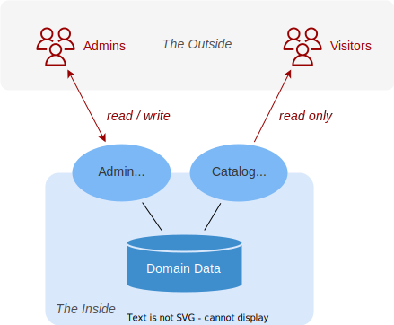

# The Bookshop Sample
A Step-by-Step Walkthrough {.subtitle}

Follow along as we build a simple bookshop application step-by-step, to gain hands-on experience with the most common tasks as an application developer, core concepts and best practices of CAP. {.abstract}

[[toc]]

<style>
  .optional::before { content: 'Optional:'; color: #999; margin-right: 0.5em }
  span.small { font-size: 90%; }
</style>


## Jumpstarting Projects

With the [initial setup](./index#initial-setup) for CAP in place, start a project using [`cds init`](./#cds-init), which creates a project folder with standard structure as shown below.

```shell
cds init cap/bookshop
```
```zsh
cap/bookshop/
├─ app/
├─ srv/
├─ db/
└─ readme.md
```

::: details Optionally clone the ready-made sample ...
::: code-group
```sh [Node.js]
git clone https://github.com/capire/bookshop
```
```sh [Java]
git clone https://github.com/sap-samples/cloud-cap-samples-java bookshop
```
:::

Open the created project folder in [_Visual Studio Code_](https://code.visualstudio.com/):

```sh
code cap/bookshop
```

Run [`cds watch`](./#cds-watch) in an [*integrated terminal*](https://code.visualstudio.com/docs/terminal/basics), to watch out for content to come:

::: code-group 
```sh [Node.js]
cds watch
```
```sh [Java]
mvn cds watch
```
:::

```sh [Node.js]
  No models found in db/,srv/,app/,app/*
  Waiting for some to arrive..
```

So, let's feed it with content in the sections below...


## Domain Models

We capture the core concepts of our domain in domain models, which are essentially entity-relationship models, focused on the relevant data entities of your domain.

### Entity-Relationship Models

For our _bookshop_ example, we'll define entities for _Books_, _Authors_, and _Genres_ as depicted in the following entity-relationship diagram:

 {style="margin-top:-2em"}

We can capture that in a rudimentary way using CDS as follows (create a file named _schema.cds_ under folder _./db_ and add this content):

::: code-group
```cds [db/schema.cds]
entity Authors {
  name   : String;
  books  : Association to many Books;
}
entity Books {
  title  : String;
  author : Association to Authors;
  genre  : Association to Genres;
}
entity Genres {
  name   : String;
  parent : Association to Genres;
}
```
:::

> [!tip] Domain models are essentially entity-relationship models
> - [_Entities_](../cds/cdl#entities) represent the core concepts of your domain.
> - [_Associations_](../cds/cdl#associations) express relationships between them.


### Complete Domain Model

Let's enhance the rudimentary model above with some essentials, such as key elements, additional fields, and required on conditions for to-many associations. Here's the complete domain model for our bookshop application:

::: code-group
```cds [db/schema.cds]
using { Currency, managed, sap } from '@sap/cds/common';
namespace sap.capire.bookshop;

entity Books : managed {
  key ID : Integer;
  title  : localized String;
  descr  : localized String;
  author : Association to Authors;
  genre  : Association to Genres;
  stock  : Integer;
  price  : Decimal;
  currency : Currency;
}

entity Authors : managed {
  key ID : Integer;
  name   : String;
  books  : Association to many Books on books.author = $self;
}

entity Genres : sap.common.CodeList {
  key ID : Integer;
  parent : Association to Genres;
}
```
:::

###### Focus on Domain
> [!tip] Primary Focus on Domain
> Strive to keep your domain models simple, concise and comprehensible, focused on the core concepts of your domain, i.e., [_“Keep it simple, stupid!”_](https://en.wikipedia.org/wiki/kiss_principle). Factor out secondary concerns into separate sources, which _extend_ and _annotate_ the core models.\
> See also: [_Separation of Concerns_](#separation-of-concerns).

[Learn more about _Domain Modeling_.](../guides/domain/index){ .learn-more}
[Learn more about _CDS_.](../cds/){ .learn-more}


### Compile to CSN, ... {.optional}

While not required, we can optionally test-compile models individually to check for validity and produce different outputs. For example, run this command in a terminal, which dumps the parsed CDS model as CSN object to stdout:

```shell
cds compile db/schema.cds
cds compile db/schema.cds --to json
cds compile db/schema.cds --to yaml
cds compile db/schema.cds --to sql
```


> [!tip] CDS models can be represented in different formats:
> - [**CDL** (_Contextual Definition Language_)](../cds/cdl) is the human-friendly textual notation.
> - [**CSN** (_Core Schema Notation_)](../cds/csn) is the machine-readable object notation,
> - which can be serialized to JSON or YAML,
> - or translated to other languages, such as SQL DDL or OData EDMX.


## Databases

As soon as we saved the domain model, `cds watch` reacted with additional output as shown below, which indicates that the model has been compiled, and an in-memory database has been deployed automatically:

::: code-group
```sh [Node.js]
[cds] - connect to db > sqlite { url: ':memory:' }
/> successfully deployed to in-memory database.
```
```sh [Java]
[...] Registered service PersistenceService$Default
```
:::


###### Inner Loop
> [!tip] Inner-Loop Development
> SQLite isn't meant for productive use, but rather for development only.
> It drastically speeds up turn-around times in local inner-loop development.
> Essentially it acts as a mock stand-in for the target databases we'll use in production, that is, SAP HANA.


### Compile to SQL {.optional}

To see what happens under the hood, we can optionally use `cds compile -2 sql`
to test-compile our models to SQL, which would yield output as shown below:

```shell
cds compile db/schema.cds --to sql
```

<span class="small">

```sql
CREATE TABLE sap_capire_bookshop_Books (
  ID INTEGER NOT NULL PRIMARY KEY,
  title NVARCHAR(255),
  descr NVARCHAR(2000),
  stock INTEGER,
  price DECIMAL(9, 2),
  author_ID INTEGER,
  genre_ID NVARCHAR(36),
  currency_code NVARCHAR(3),
  ...
);
CREATE TABLE sap_capire_bookshop_Authors (...);
CREATE TABLE sap_capire_bookshop_Genres (...);
```

</span>


### Add Initial Data

With the database deployed automatically, we can now add some initial data to it.
Do so by placing a few CSV files in _db/data_ like this:

```zsh
db/data/
├── sap.capire.bookshop-Authors.csv
├── sap.capire.bookshop-Books.csv
└── sap.capire.bookshop-Genres.csv
```

::: code-group
```csvc [ -Books.csv ]
ID  , title             , author_ID , genre_ID , stock
201 , Wuthering Heights ,       101 ,       11 ,    12
207 , Jane Eyre         ,       107 ,       11 ,    11
251 , The Raven         ,       150 ,       16 ,   333
252 , Eleonora          ,       150 ,       15 ,   555
271 , Catweazle         ,       170 ,       13 ,    22
```
```csvc [ -Authors.csv ]
ID  , name
101 , Emily Brontë
107 , Charlotte Brontë
150 , Edgar Allan Poe
170 , Richard Carpenter
```
```csvc [ -Genres.csv ]
ID , name
11 , Drama
13 , Fantasy
15 , Romance
16 , Mystery
```
:::

::: details `cds add data` can help you with the file and record generation
```shell
cds add data
cds add data --records 10
```
[Learn more in the _CLI reference_.](../tools/cds-cli#data){.learn-more}
:::


After you've added these files, `cds watch` restarts the server with new output, telling us that the .csv files have been detected, and filled into the database:

```log
[cds] - connect to db > sqlite { url: ':memory:' }
 > init from db/data/sap.capire.bookshop-Authors.csv
 > init from db/data/sap.capire.bookshop-Books.csv
 > init from db/data/sap.capire.bookshop-Genres.csv
/> successfully deployed to in-memory database.
```


### Querying Data
###### Using cds repl

We can query the database using CDS Query Language (CQL), for example, in CAP's built-in REPL. Start it in a terminal as follows:

```shell
cds repl ./
```

::: info
CAP Java has no equivalent of the `cds repl` command.
:::

::: details About _cds repl_ ...

The `cds repl` command boots up a minimal CAP environment in an interactive shell that allows us to enter and execute CAP JavaScript commands, with results printed to the console. It's a great way to explore and interact with our models, services, and data in an ad-hoc way.

The acronym _REPL_ stands for [_Read-Eval-Print Loop_](https://en.wikipedia.org/wiki/Read–eval–print_loop), which was first coined by LISP in the late 1950s like that: `(loop (print (eval (read))))`
:::

This bootstraps the CAP application within _cds repl_, and opens an interactive prompt, where we can enter and run CQL statements like this:

```js
await SELECT `ID, title, genre.name as genre` .from `Books`
```
... which would yield results like these:

<span class="small">

```yaml
[
  { ID: 201, title: 'Wuthering Heights', genre: 'Drama' },
  { ID: 207, title: 'Jane Eyre', genre: 'Drama' },
  { ID: 251, title: 'The Raven', genre: 'Mystery' },
  { ID: 252, title: 'Eleonora', genre: 'Romance' },
  { ID: 271, title: 'Catweazle', genre: 'Fantasy' }
]
```

</span>

We'll see [more of querying](#querying) later on when we have services in place...


## Services

Note that `cds watch` is still waiting for more content, as indicated with this message:

```shell
No service definitions found in loaded models.
Waiting for some to arrive...
```

So, let's go on feeding it with service definitions ...


### Use Case-Specific Services

We add two files in folder _./srv_ with respective content as follows:

::: code-group
```cds [srv/admin-service.cds]
using { sap.capire.bookshop as my } from '../db/schema';
service AdminService @(odata:'/admin') {
  entity Authors as projection on my.Authors;
  entity Books as projection on my.Books;
  entity Genres as projection on my.Genres;
}
```
:::
::: code-group
```cds [srv/cat-service.cds]
using { sap.capire.bookshop as my } from '../db/schema';
service CatalogService @(odata:'/browse') {
  @readonly entity Books as projection on my.Books {
    *, // all fields with the following denormalizations:
    author.name as author,
    genre.name as genre,
  } excluding { createdBy, modifiedBy };
}
```
:::

The two services reflect different use cases, and corresponding user personas, as depicted in the illustration below.



 - **_AdminService_** is for *administrators to **maintain*** master data.
   It exposes all entities as-is from the domain model, allowing full CRUD access to all data.

 - **_CatalogService_** is for *visitors to **browse*** and order books.
   It serves denormalized read-only views on `Books`, with flattened fields for `author` and `genre`, to simplify browsing. Entities `Authors` and `Genres` are not exposed, nor internal admin details `createdBy` and `modifiedBy`.


###### Services as Interfaces
###### Services as Facades
>  [!tip] Services as Interfaces and Facades
> Services constitute the **interfaces** of an application to consumers in the outside world, such as UIs or other services. They can be published as respective APIs. At the same time, they act as **facades** which handle all inbound requests, and restrict access to an application’s inner domain data.

###### Use Case-Oriented Services
> [!tip] Use Case-Oriented Services
> Always design services with respective consumers – and in case of UIs
> respective end user personas – in mind.
> Services can use **_denormalized views_** on underlying data, to expose only
> subsets of information relevant to the respective use case.

[Learn more about **Defining Services**.](../guides/services/providing-services){.learn-more}


### Served Out-of-the-Box

This time `cds watch` reacted with additional output as shown below, which shows that the two service definitions have been compiled, and generic service providers got constructed and mounted to the listed HTTP endpoints.

```shell
[cds] - serving AdminService {
  at: [ '/admin' ],
  decl: 'srv/admin-service.cds:3'
}
[cds] - serving CatalogService {
  at: [ '/browse' ],
  decl: 'srv/cat-service.cds:3'
}
[cds] - server listening on { url: 'http://localhost:4004' }
[cds] - [ terminate with ^C ]
```

#### Send Requests from Browser
We can access these endpoints through these OData URLs opened in a browser:

- _[/browse/Books?$select=ID,title,genre](http://localhost:4004/browse/Books?$select=ID,title,genre)_
- _[/admin/Authors?$select=ID,name&$expand=books($select=ID,title)](http://localhost:4004/admin/Authors?$select=ID,name&$expand=books($select=ID,title))_


#### Send Requests from REST Client

Alternatively, we can use the [REST Client](https://marketplace.visualstudio.com/items?itemName=humao.rest-client), which we [installed with VS Code](./index#visual-studio-code). For example, copy the following into a file _`test/requests.http`_ and send requests from there:

::: code-group
```http [test/requests.http]
### CatalogService.read Books
GET http://localhost:4004/browse/Books?
&$select=ID,title,author
&$filter=contains(author,'Bro')

### AdminService.read Authors
GET http://localhost:4004/admin/Authors?
&$select=ID,name
&$expand=books($select=ID,title)
Authorization: Basic alice:
```
:::

::: details `cds add http` can help you with the file creation:
```shell
cds add http
```
[Learn more in the _CLI reference_.](../tools/cds-cli#http){.learn-more}
:::

> [!tip] Served automatically by generic providers
> Simple service definitions in CDS are all we need to serve full-fledged OData services. Behind the scenes, built-in generic providers handle all the heavy lifting for us, such as parsing OData requests, and translating them into appropriate SQL queries executed against a primary database, and returning results as OData responses.

[Learn more about **Generic Providers**.](../guides/services/providing-services){.learn-more}


### Compile to EDMX {.optional}

We can optionally also compile service definitions explicitly, for example
to [OData EDMX metadata documents](https://docs.oasis-open.org/odata/odata/v4.0/odata-v4.0-part3-csdl.html):

```shell
cds compile srv/cat-service.cds --to edmx
```

Essentially, this invokes what happened automatically behind the scenes in the previous steps. While we don't really need such explicit compile steps, you can do this to test correctness on the model level, for example.


## Querying

Now that we have a deployed SQLite database, filled with some initial data, as well as services to serve requests from the outside, we can send queries to them, based on [CDS Query Language (CQL)](../cds/cql) and the OData protocol.


### Querying Primary Database

In the _Databases_ section above, we already saw how to [run queries in `cds repl`](#querying-data), so let's revisit that here in more detail.

Start `cds repl`, and bootstrap the app from the current project within:

```shell
cds repl ./
```

Run the following query via [`cds.ql`](../node.js/cds-ql), which would yield the results shown below:

```js
await SELECT `ID, title, genre.name as genre` .from `Books`
```
<span class="small">

```yaml
[
  { ID: 201, title: 'Wuthering Heights', genre: 'Drama' },
  { ID: 207, title: 'Jane Eyre', genre: 'Drama' },
  { ID: 251, title: 'The Raven', genre: 'Mystery' },
  { ID: 252, title: 'Eleonora', genre: 'Romance' },
  { ID: 271, title: 'Catweazle', genre: 'Fantasy' }
]
```

</span>

We can also run deeply nested queries along to-many associations or compositions, for example, to get authors along with their written books like this:

```js
await SELECT.from `Authors {
  ID, name, books {
    ID, title, genre.name as genre
  }
}`
```

<span class="small">

```yaml
[
  { ID: 101, name: 'Emily Brontë', books: [
    { ID: 201, title: 'Wuthering Heights', genre: 'Drama' }
  ]},
  { ID: 107, name: 'Charlotte Brontë', books: [
    { ID: 207, title: 'Jane Eyre', genre: 'Drama' }
  ]},
  { ID: 150, name: 'Edgar Allan Poe', books: [
    { ID: 251, title: 'The Raven', genre: 'Mystery' },
    { ID: 252, title: 'Eleonora', genre: 'Romance' }
  ]},
  { ID: 170, name: 'Richard Carpenter', books: [
    { ID: 271, title: 'Catweazle', genre: 'Fantasy' }
  ]}
]
```

</span>

> [!tip] CDS Query Language (CQL)
> [CQL](../cds/cql) is a high-level query language, similar to SQL, but adapted to CDS  concepts, in particular associations, by [path expressions](../cds/cql#path-expressions) and [nested projections](../cds/cql#postfix-projections). It can be used in different CAP runtimes and services to capture and execute queries in a conceptual way, largely agnostic to the underlying database.


### Querying App Services

We can send CQL queries to CAP services in very similar ways as we did before against the database. Still in the REPL, we can access the defined services using `cds.connect`:

```js
const CatalogService = await cds.connect.to ('CatalogService')
const AdminService   = await cds.connect.to ('AdminService')
```

And send queries to them like this (which would yield the same results as before):

```js
await CatalogService .read `ID, title, genre` .from `Books`
await AdminService .read `Authors {
  ID, name, books {
    ID, title, genre.name as genre
  }
}`
```


###### Pushed down to DB 1
> [!tip] Pushed down to Database
> CAP services push down queries to the primary database whenever possible, to leverage its full power and performance for data-intensive operations. They basically just delegate all queries to the database services as shown below.\
> See also: [_Pushed down to Database_](#pushed-down-to-db-2) in the _Constraints_ section.


::: details Details: How queries are delegated to database ...
Assumed we got an inbound query like that:
```js
let query = SELECT `ID, title` .from `Books`
```
When we run it against a service like this:
```js
const CatalogService = await cds.connect.to ('CatalogService')
await CatalogService.run (query)
```
It is delegated to the primary database like so:
```js
const db = await cds.connect.to ('db') // the primary database
await db.run (query)
```
:::

> [!tip] CAP Services support Querying
> In essence, all CAP services support querying out-of-the-box, by uniform APIs, centered on method `srv.run(query)`. Actually, as shown above, database clients in CAP are CAP services themselves, which can be consumed and queried in the very same way, using the same APIs.


### CAP-level Integration

We can also send such OData requests programmatically, for example, doing the very same in `cds repl` [as before](#querying-app-services) for local services, just now with the CAP server and the REPL started _in two separate terminals_:

1. Start the bookshop server in terminal 1:
    ```shell
    cds watch
    ```
2. Start the REPL in terminal 2:
    ```shell
    cds repl
    ```

3. Within the REPL, run this to load remote service bindings:

    ```js [within cds repl]
    await cds.service.bindings
    ```
    ::: details About _cds.service.bindings_ ...
    The `cds.service.bindings` command fetches the service bindings from a running CAP server instance in another process, and makes them available in the current process, e.g., within `cds repl`.
    ```js
    [cds] - using bindings from: { registry: '~/.cds-services.json' }
    Bindings {
      provides: {
        AdminService: {
          endpoints: { odata: '/admin'  },
          server: 5472
        },
        CatalogService: {
          endpoints: { odata: '/browse' },
          server: 5472
        }
      },
      servers: {
        '5472': {
          root: '~/cap/samples/bookshop',
          url: 'http://localhost:4004'
        }
      }
    }
    ```
    :::

With that in place, we can connect to the remote services, and send queries to them [in the very same way as before](#querying-app-services), and _as if they were local_:

  ```js
  const CatalogService = await cds.connect.to ('CatalogService')
  const AdminService   = await cds.connect.to ('AdminService')
  ```
  ```js
  await CatalogService .read `ID, title, genre` .from `Books`
  await AdminService .read `Authors {
    ID, name, books {
      ID, title, genre.name as genre
    }
  }`
  ```


###### CAP-level Service Integration
###### Calesi
> [!tip] CAP-level Service Integration (<i>'Calesi'</i>)
> CAP services can be consumed from other CAP applications, using the same uniform, and protocol-agnostic APIs as for local services – that is, **_as if they were local_**. This is accomplished by the service instances returned by `cds.connect` being remote proxies, which automatically translate all requests into protocol-specific ones, sent to remote services. Thereby taking care of all connectivity, remote communication, marshalling of data, as well as generic resilience.


## Serving UIs


### Generic *index.html*

Unless replaced by a custom `index.html` in the `app/` folder, CAP serves a generic welcome page at the root of the server.
Open _<http://localhost:4004>_ in your browser and see the generated _index.html_ page:

{style="width:450px; box-shadow: 1px 1px 5px #888888"}

Explore the listed endpoints and links to see the OData services in action.
The _Fiori preview_ links work with generic Fiori backends, that give you a glimpse of Fiori UIs.


### SAP Fiori UIs

CAP provides out-of-the-box support for SAP Fiori UIs, for example, with respect to SAP Fiori annotations and advanced features such as search, value helps and SAP Fiori Draft.


[Learn more about **Serving Fiori UIs**.](../guides/uis/fiori){.learn-more}


### Vue.js UIs
###### Vuejs UIs

Besides Fiori UIs, CAP services can be consumed from any UI frontends using standard AJAX requests.
For example, you can [find a simple Vue.js app in the GitHub repo](https://github.com/capire/bookshop/tree/main/app/vue), which demonstrates browsing and ordering books using OData requests to the `CatalogService` API we defined above.

{style="margin:0"}


## Custom Logic

While the generic providers serve most CRUD requests out of the box, you can add content to deal with the specific domain logic of your application, which often involves input validation, as well as more complex business logic.

- Use [declarative constraints](#declarative-constraints) for most input validation cases, which are enforced by generic runtimes automatically.

- Add [custom event handlers in Node.js](#custom-handlers-in-node-js) or [in Java](#custom-handlers-in-java) to CAP services for more complex programmatic logic, such as modifying response data, or handling [custom actions](#custom-actions).

> [!note] Choosing between Node.js and Java
> The latter is the first time in this guide where you need to choose between Node.js and Java as your CAP runtime.
> You can pick either of them, depending on your team's skillset and other boundary conditions, and add respective configuration using `cds add nodejs` or `cds add java` explained below.

### Declarative Constraints

Custom logic frequently deals with input validation. We can accomplish that by annotating entities that need input validation with [`@assert`](../guides/services/constraints) annotations, which get enforced by generic runtimes automatically. We do so in a separate `.cds` file next to the one containing the respective service definition:

::: code-group

```cds [srv/admin-constraints.cds]
using { AdminService } from './admin-service.cds';
annotate AdminService.Books with {

  title @mandatory;

  author @assert: (case
    when not exists author then 'Specified Author does not exist'
  end);

  genre @mandatory @assert: (case
    when not exists genre then 'Specified Genre does not exist'
  end);

  price @assert.range: [1,111]; // 1 ... 111 inclusive
  stock @assert.range: [(0),_]; // positive numbers only
}
```

:::

###### Pushed down to DB 2
> [!tip] Pushed down to Database
> Instead of reading data from the database into the application for validation, the constraints are evaluated by single queries sent to the database. This way we reduce overhead, and leverage the full power and performance of the underlying database.

###### Separation of Concerns
> [!tip] Separation of Concerns
> As constraints are not the core concepts themselves, but rather rules to govern their valid use, we chose to place them in a separate file, instead of polluting the service definition they apply to. This way we factor out secondary concerns to keep base definitions clean, concise and comprehensible. \
> See also: [_Focus on Domain_](#focus-on-domain).


### Custom Handlers in Node.js

Prepare your project for custom coding in Node.js by adding the respective facet:
```shell
cds add nodejs
npm install
```

Put implementations for services into equally named _.js_ files placed next to a service definition's _.cds_ file, for example:

```zsh
├─ srv/
│ ├─ cat-service.cds # [!code focus]
│ └─ cat-service.js # [!code focus]
└─ ...
```

::: code-group
```js [srv/cat-service.js]
const cds = require('@sap/cds')
class CatalogService extends cds.ApplicationService { init() {

  // After READ handler on Books to add discount info
  this.after ('READ', 'Books', results => results.forEach (book => {
    if (book.stock > 111) book.title += ` -- 11% discount!`
  })

  return super.init()
}}
module.exports = { CatalogService }
```
```js [srv/cat-service.mjs]
import cds from '@sap/cds'
export class CatalogService extends cds.ApplicationService { init() {

  // After READ handler on Books to add discount info
  this.after ('READ', 'Books', results => results.forEach (book => {
    if (book.stock > 111) book.title += ` -- 11% discount!`
  })

  return super.init()
}}
```
:::


[You can use `cds add handler` to assist you creating such custom code.](../tools/cds-cli#handler){.learn-more}
[Learn more about service implementations in Node.js.](../node.js/core-services#implementing-services){.learn-more}


> [!tip] On / Before / After Hooks
> Event handlers can intercept any CRUD event, as well as custom Actions and Functions. They can be registered for different phases of request processing, such as: **_on_**,  that is _instead of_ the default processing, **_before_** the default processing, or **_after_** it.


### Custom Handlers in Java

Prepare your project for custom coding in Java by adding the respective facet, and use the [CAP Java variant of `cds watch`](../java/developing-applications/running#cds-watch) to start the server going forward:
```shell
cds add java
mvn install
```
```shell
mvn cds:watch
```

In CAP Java, service implementations go into subclasses of `EventHandler`, annotated with `@Component` and `@ServiceName`, and the respective event handlers are methods within these classes annotated with `@On`, `@Before`, or `@After`, depending on the desired interception phase:

::: code-group
```java [srv/src/main/java/sap/capire/bookshop/CatalogServiceHandler.java]
package sap.capire.bookshop;

import java.util.List;
import org.springframework.stereotype.Component;
import com.sap.cds.services.cds.CqnService;
import com.sap.cds.services.handler.EventHandler;
import com.sap.cds.services.handler.annotations.After;
import com.sap.cds.services.handler.annotations.ServiceName;
import cds.gen.catalogservice.Books;
import cds.gen.catalogservice.Books_;
import cds.gen.catalogservice.CatalogService_;

@Component // [!code focus]
@ServiceName(CatalogService_.CDS_NAME) // [!code focus]
public class CatalogServiceHandler implements EventHandler { // [!code focus]

  // After READ handler on Books to add discount info
  @After(event = CqnService.EVENT_READ, entity = Books_.CDS_NAME) // [!code focus]
  public void addDiscountIfApplicable (List<Books> books) { // [!code focus]
    for (Books book : books) { // [!code focus]
      if (book.getStock() != null && book.getStock() > 111) // [!code focus]
        book.setTitle (book.getTitle() + " -- 11% discount!"); // [!code focus]
    } // [!code focus]
  } // [!code focus]

}
```
:::

[Learn more about event handler classes in Java.](../java/event-handlers/index#handlerclasses){.learn-more}


### Custom Actions

Besides standard CRUD operations, CAP services can also define custom actions and functions in their service definitions. Let's extend our `CatalogService` [from above](#use-case-specific-services) with a custom action to submit book orders like that:

::: code-group
```cds [srv/cat-service.cds]
extend service CatalogService with {
  @requires: 'authenticated-user'
  action submitOrder ( book: Books:ID, quantity : Integer );
}
```
:::
While you **_can_** add custom handlers for standard CRUD events, you **_have to_** do so for custom actions defined in your service definitions, as they cannot be handled by generic providers. We do so like that:

::: code-group
```js [srv/cat-service.js]
  // Action handler for submitOrder
  this.on ('submitOrder', async req => {
    let { book:id, quantity } = req.data
    let affected = await UPDATE (Books,id)
      .with `stock = stock - ${quantity}`
      .where `stock >= ${quantity}`
    if (!affected) req.error `${quantity} exceeds stock for book #${id}`
  })
```
:::

We can test that by adding this to the [_`test/requests.http`_ file we created earlier](#send-requests-from-rest-client):

::: code-group
```http [test/requests.http]
### CatalogService.submitOrder()
POST http://localhost:4004/browse/submitOrder
Content-Type: application/json
Authorization: Basic bob:

{
  "book": 201,
  "quantity": 3
}
```
:::

Send that request repeatedly until stock is depleted and an according error returned.


## Summary

We have now built a simple bookshop application step-by-step, thereby following a subset of typical CAP development workflows as depicted in the illustration below.


Thereby we touched upon some best practices of CAP, such as:

::: tip [Inner-Loop Development](#inner-loop)
:::
::: tip [Focus on Domain](#focus-on-domain)
:::
::: tip [Separation of Concerns](#separation-of-concerns)
:::
::: tip [Use Case-Oriented Services](#use-case-oriented-services)
:::
::: tip [Served Out-of-the-Box](#served-out-of-the-box)
:::
::: tip [Pushdown to Database](#pushed-down-to-db-1)
:::

Learn more about these practices and guiding principles in the [_Core Concepts_](./concepts) guide following next, and the [_Key Features_](./features) guide thereafter. After that, go ahead and explore further on your own in the respective deep dive guides in the [_Develop_ section](../guides/).