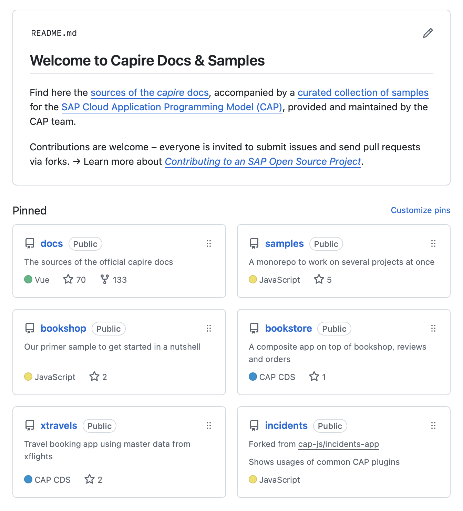
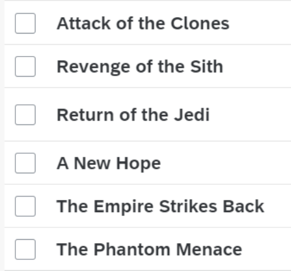

# Learning Sources
Capire, Samples, Tutorials, Podcasts, ... {.subtitle}

[[toc]]

## The _capire_ Documentation

This documentation — named _'capire'_, italian for understand — is the official documentation for CAP.
It's organized as follows:

<table>
   <thead>
      <tr> 
         <th>Section</th> <th>Description</th> 
      </tr>
   </thead>
   <tbody>
      <tr>
         <td><ul>
            <li><a href="./index"> Get&nbsp;Started </a> </li>
            <li> <a href="../guides/"> Develop </a> </li>
            <li> <a href="../guides/deploy/"> Deploy </a> </li>
         </ul></td>
         <td><ul>
            Guides that walk you through the most common tasks 
            in CAP-based development and deployment.
         </ul></td>
      </tr>
      <tr>
         <td><ul>
            <li><a href="../cds/index"> CDS </a> </li>
            <li> <a href="../node.js/index"> Node.js </a> </li>
            <li> <a href="../java/index"> Java </a> </li>
            <li> <a href="../tools/index"> Tools </a> </li>
         </ul></td>
         <td><ul>
            Reference documentation for these respective areas.
         </ul></td>
      </tr>
      <tr>
         <td><ul>
            <li><a href="../plugins/"> Plugins </a> </li>
            <li><a href="../releases/"> Releases </a> </li>
            <li><a href="../resources/">Resources</a></li>
         </ul></td>
         <td><ul>
            Curated list of plugins for CAP.  
            Release notes and release schedule.  
            About support channels, community, ...
         </ul></td>
      </tr>
   </tbody>
</table>

#### Callouts and Alerts

We use [GitHub-flavored alerts](https://vitepress.dev/guide/markdown#github-flavored-alerts) to highlight important information in our documentation. 
Here are the different types of alerts or callouts you may encounter:

> [!info]
> Useful information that users should know, less important than notes.

> [!note]
> Useful information that users should know even when skimming content.

> [!tip]
> Helpful advice for doing things better or more easily. 

> [!important]
> Key information users need to know to achieve their goal.

> [!warning]
> Urgent info that needs immediate attention to avoid problems.

> [!caution]
> Advises about risks or negative outcomes of certain actions.

> [!danger]
> Advises about risks or negative outcomes of certain actions.

## [The _capire_ Samples](https://github.com/capire)

The _capire_ samples at https://github.com/capire are the official and curated collection of samples for the SAP Cloud Application Programming Model, maintained by the CAP team.

[{style="width: 90%;"}](https://github.com/capire)

## Featured Samples

{style="float:right; margin: 0em 1em"}
### [Partner Reference App](https://github.com/SAP-samples/partner-reference-application)

The Partner Reference Application provides a “golden path” for SaaS providers on SAP Business Technology Platform (SAP BTP), featuring:

- centralized identity and access management,
- a common launchpad,
- cross-application front-end navigation,
- and secure back-channel integration.

You also find the bill of materials and a sizing example. This addresses the question "Which BTP resources do I need to subscribe to and in what quantities?" and serves as a basis for cost calculation.

{style="float:right; margin: 2.5em 2em 0; width: 30%"}
### [Star Wars App](https://github.com/SAP-samples/cloud-cap-hana-swapi)

SWAPI - the Star Wars API, a CAP-based adaptation of [swapi.dev](https://swapi.dev), a Python-based app that exposed data from the Star Wars movies. The many bi-directional, many-to-many relationships with the data provide a good basis for an SAP Cloud Application Programming Model and Fiori Draft UI sample. {.indent}

{style="float:right; margin: 2em 1em; width: 50%"}
### [BTP SuSaaS App](https://github.com/SAP-samples/btp-cap-multitenant-saas)

The Sustainable SaaS (SuSaaS) sample application has been built in a partner collaboration to help interested developers, partners, and customers in developing multitenant Software as a Service applications using CAP and deploying them to the SAP Business Technology Platform (SAP BTP).

## The *qmacro* Series

{style="float:right; width: 144px; margin: 0px 1em"}

SAP Developer Advocate [DJ Adams](https://qmacro.org) has compiled a vast number of learning resources around CAP, published under the umbrella of _qmacro_, which are most recommended to both beginners and advanced users of CAP:

### Videos

- [The Art and Science of CAP](https://www.youtube.com/playlist?list=PL6RpkC85SLQAe45xlhIfhTYB9G0mdRVjI) (with Daniel Hutzel)
- [Under the hood: CDS Expressions in CAP](https://www.youtube.com/playlist?list=PL6RpkC85SLQCEU8XcyqnA5wYEZGxMPm6B) (with Patrice Bender)
- [Back to basics: CAP Node.js](https://www.youtube.com/playlist?list=PL6RpkC85SLQBHPdfHQ0Ry2TMdsT-muECx)
- [Back to basics: Managed associations in CAP](https://www.youtube.com/playlist?list=PL6RpkC85SLQCSm1JSRzeBE-BlkygKRAAF)
- [Good to know: CAP Node.js](https://www.youtube.com/playlist?list=PL6RpkC85SLQDZ18v94otZSJJrpcNkPPV9)
- [Expert sessions: Getting started with CAP Node.js](https://www.youtube.com/playlist?list=PL6RpkC85SLQDxW_6INTtprrvZ3WiXT8u5)
- [How things work: CAP Node.js plugins](https://www.youtube.com/playlist?list=PL6RpkC85SLQDwzbi9eVuMStRlpVMBqidQ)
- [Hands-on SAP Dev general live stream series](https://www.youtube.com/playlist?list=PL6RpkC85SLQABOpzhd7WI-hMpy99PxUo0)

### Blog post series

- [The Art and Science of CAP](https://qmacro.org/blog/posts/2024/12/06/the-art-and-science-of-cap/)
- [Modules, modularity & reuse in CDS models](https://qmacro.org/blog/posts/2026/01/01/modules-modularity-and-reuse-in-cds-models/)
- [CAP Node.js Plugins](https://qmacro.org/blog/posts/2024/12/30/cap-node-js-plugins/)
- [All posts tagged with 'cap'](https://qmacro.org/tags/cap/)

### Selected individual articles

- [A deep dive into OData and CDS annotations](https://qmacro.org/blog/posts/2023/03/10/a-deep-dive-into-odata-and-cds-annotations/)
- [Five reasons to use CAP](https://qmacro.org/blog/posts/2024/11/07/five-reasons-to-use-cap/)
- [Flattening the hierarchy with mixins](https://qmacro.org/blog/posts/2024/11/08/flattening-the-hierarchy-with-mixins/)
- [A reCAP intro to the cds REPL](https://qmacro.org/blog/posts/2025/07/21/a-recap-intro-to-the-cds-repl/)
- [Using @capire modules from GitHub Packages](https://qmacro.org/blog/posts/2025/10/12/using-capire-modules-from-github-packages/)
- [Modelling contained-in relationships with compositions in CDS](https://qmacro.org/blog/posts/2025/10/14/modelling-contained-in-relationships-with-compositions-in-cds/)
- [A simple exploration of status transition flows in CAP](https://qmacro.org/blog/posts/2025/12/08/a-simple-exploration-of-status-transition-flows-in-cap/)

### Workshop exercise content

- [Service integration with SAP Cloud Application Programming Model](https://github.com/SAP-samples/cap-service-integration-codejam)
- [Stay cool, stay local: CAP local development workshop](https://github.com/SAP-samples/cap-local-development-workshop)
- [Hands-on with CAP CDS](https://github.com/SAP-samples/cap-cds-hands-on)

### Miscellaneous

- [The 'capref' collection – Axioms, Best Practices and Features](https://github.com/qmacro/capref/tree/main#readme)
- [Integrating an external API into a CAP service](https://youtu.be/T_rjax3VY2E)

## SAP Learning Sources

   - [SAP Learning Courses](https://learning.sap.com/courses?lsc_product=SAP+Cloud+Application+Programming+Model)
   - [SAP BTP Developers Guide](https://help.sap.com/docs/btp/btp-developers-guide/btp-developers-guide)
      - [Tutorials featured in there](https://help.sap.com/docs/btp/btp-developers-guide/tutorials-for-sap-cloud-application-programming-model)
   - [SAP Discovery Center Missions](https://discovery-center.cloud.sap/missionCatalog/?search=cap&product=32)

## Hands-Ons & CodeJams

- [TechEd 2023 Hands-On AD264 – Build Extensions with CAP](https://github.com/SAP-samples/teched2023-AD264/)
- [TechEd 2022 Hands-On AD264 – Verticalization, Customization, Composition](https://github.com/SAP-archive/teched2022-AD264)

## Blog Posts & Podcasts

- [Hybrid Testing and Alternative DBs](https://youtu.be/vqub4vJbZX8?si=j5ZkPR6vPb59iBBy)   by Thomas Jung
- [Consume External Services](https://youtu.be/rWQFbXFEr1M)   by Thomas Jung
- [Building a CAP app in 60 min](https://youtu.be/zoJ7umKZKB4)   by Martin Stenzig
- [Surviving and Thriving with the SAP Cloud Application Programming Model](https://community.sap.com/t5/tag/CAPTricks/tg-p/board-id/technology-blog-sap)    by Max Streifeneder (2023)
- [Multitenant SaaS applications on SAP BTP using CAP? Tried-and-True!](https://community.sap.com/t5/technology-blogs-by-sap/multitenant-saas-applications-on-sap-btp-using-cap-tried-and-true/ba-p/13541907)   by Martin Frick (2022)
