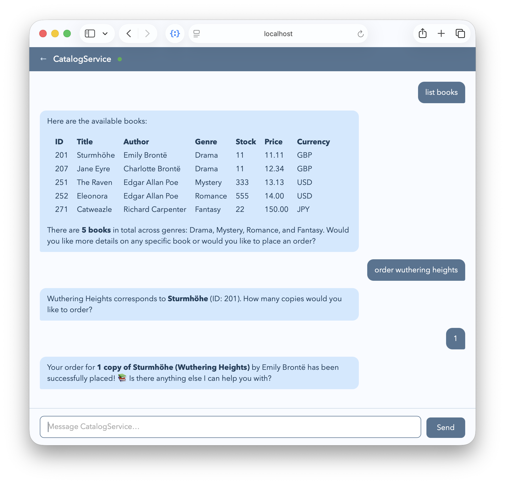

# CAP-level Agents

The [`@cap-js/agents`](https://github.com/cap-js/agents) plugin allows to easily create _**enterprise grade**_ agents based on given CAP services, and served via the [_A2A_ protocol](https://a2a-protocol.org). It uses state-of-the-art agent harness frameworks like [_LangChain_](https://www.langchain.com) and [_LangGraph_](https://www.langchain.com/langgraph), or the [_Pi_](https://pi.dev) internally.
{.abstract}

[[toc]]


## Add the Agents Plugin

Within your project root run this to add the [`@cap-js/agents`](https://github.com/cap-js/agents) plugin:

```bash
npm add @cap-js/agents
```

> [!note] Java variant coming soon.


## Declare `@agent` Services


### Using `@agent` Annotation

Simply add the `@agent` annotation to a service definition to create an agent. For example, clone the [_capire/bookshop_](https://github.com/capire/bookshop) sample, and add a new file `srv/cat-service-agent.cds` with the following content:

::: code-group
```cds [srv/cat-service-agent.cds]
using { CatalogService  } from './cat-service';
annotate CatalogService with @agent;
```
:::

::: details Optionally specify an alternative endpoint path ...
As usual with CAP protocol annotations, you can also choose a custom path under which the A2A endpoint should be served, instead of using the default path `/a2a/<service>`:
```cds
annotate CatalogService with @agent: '/cats-agent'
```
:::

> [!tip] More than Just Another Protocol
> With that, the plugin auto-generates [MCP tools](./cap-mcp) from the service's entities and actions, creates a [ReAct](https://arxiv.org/abs/2210.03629) loop, and serves it via [A2A protocol](https://a2a-protocol.org) — no code required.


### Using `@agent.hitl`

In AI land, HITL stands for _Human-in-the-Loop_ and describes a mechanism that allows human intervention in the agent's decision-making process. Annotate a CDS **action** with `@agent.hitl` to require human approval before the agent may execute it. For example, the `submitOrder` action in the `CatalogService` can be annotated like this:

::: code-group
```cds [srv/cat-service-agent.cds]
using { CatalogService  } from './cat-service';
annotate CatalogService with @agent;
annotate CatalogService.submitOrder with @agent.hitl; // [!code focus]
```
:::


When the agent decides to call the action, the task pauses and transitions to the A2A [`input-required`](https://a2a-protocol.org/latest/specification/#413-taskstate) state instead of running the action immediately.


### Optional: `AGENTS.md`

You can add an `AGENTS.md` file next to the service definition's `.cds` file to add detailed information about the agent's identity and behaviour. When present, it replaces the generic default agentification: instead of the auto-generated ReAct agent, the plugin auto-builds the agent from the directory at startup — no JavaScript handlers required.

For example, we do so in the [XTravels sample](./xtravels-sample.md):

```zsh
srv/travel-agent/
 ├── service.cds         # the service definition
 ├── service.js          # next to the service definition
 └── AGENTS.md           # next to the service definition
```

AGENTS.md defines who the agent is. The frontmatter populates the agent card; the body is the agent's system prompt:

::: code-group
```markdown [srv/travel-agent/AGENTS.md]
---
name: travel-agent
version: 1.0.0
description: >
  An agent to do travel planning, including choosing and booking hotels,
  event passes, and flights using distributed subagents and tools, then
  persists confirmed itineraries into the xtravels app.
---

# Travel Agent

## Identity

You are a friendly and knowledgeable travel planning assistant within the
XTravels application — the trips you persist show up in the app's Fiori UI.

## Guidelines

- Be proactive: when a user asks to plan a trip, start searching immediately.
  Ask clarifying questions only when necessary.

- Use reasonable defaults for missing details: pick an upcoming weekend,
  prefer mid-range budgets, suggest popular options.

- Call multiple tools or subagents in parallel when the request spans multiple
  domains (flights + hotels + events).

...
```
:::

> [!tip] Using <code>./srv/*</code> subfolders
> You can use subfolders like `./srv/travel-agent` as shown above for the [XTravels sample](./xtravels-sample.md).
> This helps keeping your service definitions and agent-related files organized, especially when working with multiple services and agents, and is supported by the <Config>`cds.folders.srvs: srv/*`</Config> config option added included with the `@cap-js/agents` plugin.


### Optional: `skills/*/SKILL.md`s

The `AGENTS.md` file defines the agent's identity and behaviour, while the `SKILL.md` file describes the workflow and provides examples for a specific skill.

```zsh
srv/travel-agent/
 ├── AGENTS.md           # next to the service definition
 ├── skills/
 │ ├── flight-booking/SKILL.md
 │ ├── itinerary/SKILL.md
 │ └── planning/SKILL.md
 ├── service.cds         # the service definition
 └── service.js          # next to the service definition
```


## Test-drive Locally

As usual, and following the Calesi principles of "convention over configuration", you can run your CAP server locally in development profile using `cds watch` including agents connected to available LLMs, with minimal additional setup.


### Run with `cds watch`

Start your server with `cds watch`, and note that the `@agent`-annotated service gets served with an additional endpoint for the A2A protocol:

```shell
cds watch
```
```shell
[cds] - serving CatalogService {
  at: [ ..., '/a2a/browse' ]
  ...
}
```


### Automatic Config

In development profile, the plugin uses the pre-configured <Config>`cds.requires.llm: auto`</Config> config option, which automatically fetches required/missing credentials from given local installations of [Claude Code](https://claude.ai) or [OpenCode](https://opencode.ai), if any.
This allows us to work with zero additional configuration.

You can see the effects of this in the server logs when starting your CAP application with `cds watch`:

```shell
[agents] - cds.connect.to 'llm' with: {
  kind: 'anthropic',
  model: 'claude-sonnet-4-6',
  credentials: {
    anthropicApiUrl: 'http://localhost:4711/anthropic/',
    apiKey: '***'
  }
}
```

Switch on `DEBUG` output with `cds watch` to see detailed logs for the agent and LLM interactions, including something as shown below:

```shell
DEBUG=agents cds watch
```
```shell
[agents] - Loaded config from ~/.claude/settings.json : {
  anthropicApiUrl: 'http://localhost:4711/anthropic/',
  model: 'claude-sonnet-4-6',
  apiKey: '***'
}
```

[Learn more about configuring LLMs below.](#configuration){.learn-more}


### Using Chat Preview <Alpha/>

For local development, the plugin serves a rudimentary experimental chat preview at http://localhost:4004/a2a/browse/preview/.





## Markdown-Based Agents

In addition you can further customize the agent by providing a Markdown-based agent definition, as described in the [Markdown-Based Agents](#markdown-based-agents) section.

### Markdown-Based Agents

To define an agent's identity, behaviour, and skills explicitly, add a sibling directory matching the slugified service name. When present, it replaces the default agentification: instead of the auto-generated ReAct agent, the plugin auto-builds the agent from the directory at startup — no JavaScript handler required.

```zsh
srv/
├─ travel-agent/.cds
└─ catalog-agent/                ← matches the slugified service name
   │.  AGENTS.md                  ← agent identity + behaviour
   └─ skills/
      └─ book-purchase/
         └─ SKILL.md             ← workflow + examples
```

`AGENTS.md` defines who the agent is. The frontmatter populates the agent card;
the body is the agent's system prompt:

```md
---
name: catalog-agent
version: "1.0.0"
description: >
  Bookshop assistant for placing book orders on behalf of the user.
---

# Catalog Agent

## Identity

You are the **Catalog Agent**, a helpful assistant for the capire bookshop.
...
```


## Configuration

### `cds.requires.llm`

The LLM used by an agent is configured via `cds.requires.llm`. You can provide a `kind` as with [any required service](https://cap.cloud.sap/docs/node.js/core-services#required-services).

::: code-group
```yaml [.cdsrc.yaml]
cds:
  requires:
    llm:
      kind: aicore
      model: anthropic--claude-4.6-sonnet
```
```jsonc [package.json]
"cds": {
  "requires": {
    "llm": {
      "kind": "aicore",
      "model": "anthropic--claude-4.6-sonnet"
    }
  }
}
```
:::


| Kind     | Description                                                           |
| -------- | --------------------------------------------------------------------- |
| `aicore` | The default for `production` and `hybrid`, connects to SAP AI Core    |
| `auto` | The default for `development`, using local Claude or OpenCode configuration |
| `mock`   | A pure mock for `development`, provides dummy responses when called |

See [SAP AI Core → Create a Service Instance](https://help.sap.com/docs/sap-ai-core/sap-ai-core-service-guide/create-service-instance) for how to create an instance.vite


> [!tip] Automatically Fetching Credentials
> In development profile, with the pre-configured `auto` kind, the plugin tries to fetch missing credentials from local installation of [Claude Code](https://claude.ai) or [OpenCode](https://opencode.ai).
> This allows you to work with local LLM instances without providing any additional config at all.


## Advanced

The following capabilities are experimental and documented separately. Their public surface may change.

- [Connectivity](./.docs/connectivity.md) — destination-based connectivity, `AICORE_SERVICE_KEY` / `ANTHROPIC_API_KEY`, and the `anthropic` kind
- [Configuration](./.docs/configuration.md) — using multiple models, global and per-service settings, file I/O, and push notifications
- [Quota Enforcement](./.docs/quota.md) — configurable rate limits and resource quotas
- [Audit Logging](./.docs/audit-logging.md) — immutable audit trail of agent decisions and tool usage
- [Data Privacy](./.docs/data-privacy.md) — deletion of message history
- [Telemetry](./.docs/telemetry.md) — OpenTelemetry metrics, tracing, and MLflow export
- [Content Filter](./.docs/content-filter.md) — SAP AI Core content filtering and prompt injection shielding
