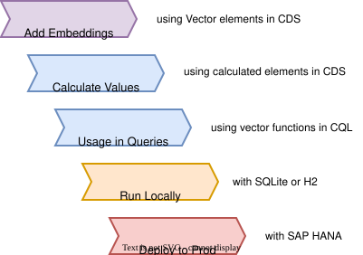

# Vector Embeddings

Use vector embeddings to convert unstructured content (text, images, and so on) into numeric vectors, which can then be compared to measure similarity. This enables semantic search, recommendations, and enhanced generative AI features in your CAP application.
{.abstract}

[[toc]]

## Introduction & Overview

Vector embeddings turn data like text, images, and audio into numeric vector values that capture semantic meaning.
They allow to represent unstructured content as numeric vectors, which can then be compared for similarity.

### What – Use Cases

Common use cases for vector embeddings include:

- [Semantic search](https://en.wikipedia.org/wiki/Semantic_search) across unstructured content
- [Recommendations](https://en.wikipedia.org/wiki/Recommender_system) based on similarity
- [Similarity search](https://en.wikipedia.org/wiki/Similarity_search) for finding similar records to a given one
- [Retrieval-Augmented Generation (RAG)](https://en.wikipedia.org/wiki/Retrieval-augmented_generation) fueling AIs with knowledge from your data
- [Content classification](https://en.wikipedia.org/wiki/Text_classification), for example tagging products by categories

### How – Key Steps

The key steps for using vector embeddings in your CAP application are illustrated in the graphic below, and walked through in the following sections.



> [!note] Focus on Databases
> We focus on embeddings stored and calculated within the database in this guide.
> You can also calculate embeddings externally and store them in the database if needed, for example using the [SAP Cloud SDK for AI](https://sap.github.io/ai-sdk/) to call SAP AI Core services for generating embeddings.


## Adding Embeddings

### Using `Vector` Elements

Use the built-in [Vector type](../../cds/types) to declare Vector elements in CDS.


```cds
extend Incidents with {
  embedding : Vector;
}
```

Use `Vector` without specifying a dimension to simplify changing the embedding model. If you specify a vector dimension, make sure it matches the embedding model (for example, 768 for *SAP_GXY.20250407*).


## Filling Embeddings

### Using Calculated Elements

You can use [calculated elements](../../cds/cdl#calculated-elements) in your CDS model to automatically generate embeddings based on other fields. This ensures that embeddings are always up-to-date with the source data.

For example, you can create a calculated element that generates an embedding from the `title` and `summary` fields of an `Incidents` entity.

```cds
extend Incidents with {
  embedding : Vector = vector_embedding(
    'Title: ' || title || ', Summary: ' || summary,
    'DOCUMENT', 'SAP_GXY.20250407'
  ) stored;
}
```

> [!tip] Up-to-date embeddings
Using `stored` calculated elements ensures that the embedding is persisted in the database, and recalculated whenever the source data changes through _CREATE_ or _UPDATE_ operations.

> [!warning] Embedding localized elements
A stored ([on-write](../../cds/cdl#on-write)) calculated element **cannot** reference [localized](../uis/localized-data) elements. Instead, embed the default language and use a **multilingual embedding model** so that queries in other languages still match.

### Using Batch Processing

While calculated elements automatically generate embeddings on-write, batch processing allows you to generate or update embeddings for recently updated records. For example, you could schedule a batch job to run during off-peak hours, ensuring that the system's performance is not impacted while updating embeddings for a large dataset.

For the updates you could run queries like that:

::: code-group
```SQL
UPDATE Incidents SET embedding = vector_embedding(
  'Title: ' || title || ', Summary: ' || summary,
  'DOCUMENT', 'SAP_GXY.20250407'
)
WHERE modifiedAt > ?;
```
```js [Node.js]
const lastModified = new Date(Date.now() - 24 * 60 * 60 * 1000); // 1 day ago
const { expr } = cds.ql
await UPDATE (Incidents) .with ({
  embedding: expr`vector_embedding(
    'Title: ' || title || ', Summary: ' || summary,
    'DOCUMENT', 'SAP_GXY.20250407'
  )`
}) .where`modifiedAt > ${lastModified}`;
```
```Java [Java]
srv.run(Update.entity(INCIDENTS).set(
  "embedding", CQL.vectorEmbedding(
    CQL.constant("Title: ").concat(CQL.get("title").concat(CQL.constant(", Summary: ").concat(CQL.get("summary")))),
    DOCUMENT, "SAP_GXY.20250407"
  )
).where(i -> i.modifiedAt().gt(Instant.now().minus(24, HOURS))));
```
:::

## Using Embeddings

Use vector functions documented below in CQL statements to perform similarity searches and other operations on embeddings. Their behavior is based on the implementations from SAP HANA. CAP supports these functions across all supported databases.

You can use these vector functions directly in your CQL queries. For CAP Java, see [Vector Functions](../../java/working-with-cql/query-api#vector-functions).


### Query for Similarity

In the following example, we use [`cosine_similarity`](#cosine_similarity) to find incidents with high relevance to a user question, so we can enhance the LLM prompt with factual context (grounding). To do this, we compute the [`vector_embedding`](#vector_embedding) of the user question, using the *SAP_GXY.20250407* embedding model from SAP HANA [NLP](https://help.sap.com/docs/hana-cloud-database/sap-hana-cloud-sap-hana-database-predictive-analysis-library/natural-language-processing-nlp).

::: code-group
```js [Node.js]
const question = 'Fetch incidents with solar inverters. How were they resolved?'
const incidents = await SELECT.from`Incidents`
  .where`cosine_similarity (embedding,
    vector_embedding (${question}, 'QUERY', 'SAP_GXY.20250407')
  ) > 0.75`
```
```Java [Java]
var question = "Fetch incidents with solar inverters. How were they resolved?";
var incidents = srv.run(Select.from(INCIDENTS)
  .where(i -> CQL.cosineSimilarity(i.embedding(),
    CQL.vectorEmbedding(question, TextType.QUERY, "SAP_GXY.20250407")
  ).gt(0.75)));
```
:::


### `cosine_similarity` {.method}

Computes the cosine of the angle between `vector1` and `vector2`, comparing the direction of the vectors. Both vectors must have the same dimension.

```tsx
function cosine_similarity (vector1, vector2) => Double in [-1,1]
```

In the context of embeddings, both vectors must be from the same embedding model configuration. With modern embedding models, the result is between 0 (no similarity) and 1 (semantic match).

[Learn more in the SAP HANA documentation](https://help.sap.com/docs/hana-cloud-database/sap-hana-cloud-sap-hana-database-sql-reference-guide/cosine-similarity-function-vector) {.learn-more}


### `l2distance` {.method}

Computes the Euclidean distance (L2 norm) between `vector1` and `vector2`. Both vectors must have the same dimension.

```tsx
function l2distance (vector1, vector2) => Double >= 0
```

In the context of embeddings, both vectors must be from the same embedding model configuration. The closer the result to 0, the higher the semantic similarity. Most modern embedding models produce L2-normalized vectors (length of 1.0), for which the `l2distance` is between 0 and 2.

[Learn more in the SAP HANA documentation](https://help.sap.com/docs/hana-cloud-database/sap-hana-cloud-sap-hana-database-sql-reference-guide/l2distance-function-vector) {.learn-more}

### `l2normalize` {.method}

Normalizes the length of `vector` to 1.0 while preserving the direction. This improves floating-point precision and upper-bounds the resulting `l2distance` to 2.0, preventing distance overflow during comparisons.

```tsx
function l2normalize (vector) => Vector
```

[Learn more in the SAP HANA documentation](https://help.sap.com/docs/hana-cloud-database/sap-hana-cloud-sap-hana-database-sql-reference-guide/l2normalize-function-vector) {.learn-more}


### `vector_embedding` {.method}

Creates a vector embedding of the given `text` using the `embedding_model`.

```tsx
function vector_embedding (text, text_type, embedding_model) => Vector
function vector_embedding (text, text_type, embedding_model, remote_source) => Vector
```

[Learn more in the SAP HANA documentation](https://help.sap.com/docs/hana-cloud-database/sap-hana-cloud-sap-hana-database-sql-reference-guide/vector-embedding-function-vector) {.learn-more}

[Learn more about Vector Embeddings in CAP Java](../../java/ai#vector-embeddings) {.learn-more}

> [!info] Emulated in SQLite and H2 <Beta/>
> On SQLite and H2 the `vector_embedding` function is emulated for local testing, with optional local [ONNX](https://onnx.ai) models for semantic embeddings. See [SQLite and H2](#with-sqlite-or-h2) for setup details. It is not supported on PostgreSQL.


## Test-drive Locally

As usual for CAP, you can run your application locally with SQLite or H2 for testing purposes in [inner-loop development](../integration/inner-loops.md). We went some extra miles to support that for local testing of vector embeddings as well.

### With SQLite or H2

On SQLite and H2, the `vector_embedding` function is emulated using lexical character-hash vectors by default. These capture surface (character-n-gram) overlap, not meaning. To compute semantic embeddings, use local [ONNX](https://onnx.ai) models.

In CAP Java, add a [LangChain4j](https://github.com/langchain4j/langchain4j/tree/main/embeddings) dependency with an ONNX model.

In CAP Node.js, the [`@cap-js/ai`](https://github.com/cap-js/ai) plugin makes the standard `sqlite` database generate semantic embeddings locally, without any external service. It requires `@sap/cds` `^10.1` and `@cap-js/sqlite` `^3.1`, and is experimental and intended for local development only. Install the plugin with its peer dependencies:

```sh
npm add -D \
  @cap-js/ai \
  @cap-js/sqlite \
  @huggingface/hub \
  @huggingface/tokenizers \
  onnxruntime-node
```

No configuration is needed — the plugin redirects the standard `sqlite` (and `sqlite:memory`) database and downloads a default embedding model on first start. Both the on-write calculated element from [Adding Embeddings](#adding-embeddings) and the query-time `vector_embedding` calls then run locally against that model. The same query runs unchanged on SAP HANA and SQLite: on SQLite the model-name argument to `vector_embedding` is ignored and the locally configured model is used. See the [`@cap-js/ai` README](https://github.com/cap-js/ai#local-vector-embeddings-with-sqlite-experimental) for version requirements, model selection, and configuration.


## SAP HANA

### Choose an Embedding Model

Latest now, you have to choose an embedding model that fits your use case and data (for example English or multilingual text). The model determines the number of dimensions of the resulting output vector. Check the documentation of the respective embedding model for details.

Use the [SAP Generative AI Hub](https://www.sap.com/products/artificial-intelligence/generative-ai-hub.html) for unified consumption of embedding models and LLMs across different vendors and open-source models. Check for available models on the [SAP AI Launchpad](https://help.sap.com/docs/ai-launchpad/sap-ai-launchpad-user-guide/models-and-scenarios-in-generative-ai-hub-fef463b24bff4f44a33e98bb1e4f3148#models).

In the example above we used *SAP_GXY.20250407*, which is one of the available embedding models from SAP HANA [NLP](https://help.sap.com/docs/hana-cloud-database/sap-hana-cloud-sap-hana-database-predictive-analysis-library/natural-language-processing-nlp).

> [!important] Config Pending
> We're working on a configuration option to make the embedding model selection more flexible.
> This would also allow you to refer to such configured model by alias names, or just use it as the default without specifying the model name explicitly in your code.

### HANA Vector Engine Support

- Native vector engine with built-in support
- Type mapping: `cds.Vector` → [REAL_VECTOR](https://help.sap.com/docs/hana-cloud-database/sap-hana-cloud-sap-hana-database-vector-engine-guide/real-vector-and-half-vector-data-types)
- `vector_embedding` uses embedding models from the [NLP](https://help.sap.com/docs/hana-cloud-database/sap-hana-cloud-sap-hana-database-predictive-analysis-library/natural-language-processing-nlp) extension or an [SAP AI Core](https://help.sap.com/docs/sap-ai-core/sap-ai-core-service-guide/what-is-sap-ai-core) remote source

[Learn more about HANA Vector Engine](https://help.sap.com/docs/hana-cloud-database/sap-hana-cloud-sap-hana-database-vector-engine-guide) {.learn-more}


## PostgreSQL

- Requires that the [pgvector extension](https://github.com/pgvector/pgvector) is installed on your PostgreSQL instance. Then create the extension in your database:
  ```sql
  CREATE EXTENSION IF NOT EXISTS vector;
  ```
- Vectors stored in native `vector` type
- CAP provides no built-in `vector_embedding` implementation. Compute embeddings in your application layer (see [`vector_embedding`](#vector_embedding)) or define your own `vector_embedding` database function.
- For Node.js, the `pgvector` npm package is required when reading vector columns from query results or when passing vector values as parameters from the client. It is not needed if vectors are generated entirely within the database using functions like `vector_embedding()`: `npm install pgvector`
