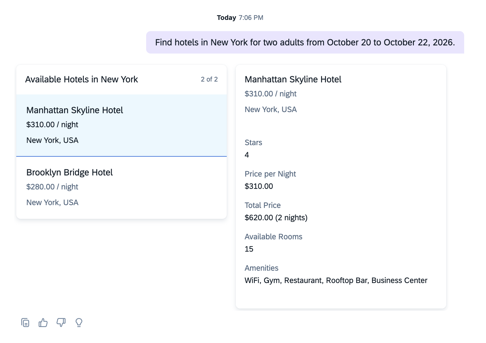

# Integrating XTravels with Joule

This guide connects the IAS-protected XTravels hotel agent to a Joule tenant using the Agent-to-Agent (A2A) protocol, an SAP BTP destination, and a Joule capability.
{.abstract}

[[toc]]

Follows the [**Bring Your Own Agent**](https://architecture.learning.sap.com/docs/ref-arch/7b6426) reference architecture{.learn-more}

## Start with XTravels

Clone the CAP XTravels sample and install its dependencies:

```zsh
git clone https://github.com/capire/xtravels
cd xtravels
npm install
```

The sample's [`HotelsService`](https://github.com/capire/xtravels/blob/main/srv/hotels/services.cds) is annotated with `@agent`, which exposes it through A2A.


::: tip Problems with `npm install`?
For installing the `@capire` packages, follow the sample's [GitHub Packages setup](https://github.com/capire/xtravels#using-github-packages).
:::

## Prerequisites

### Subscribe to Joule in BTP

In the **provider subaccount**…
1. Choose **Services** → **Instances and Subscriptions** → **Create**.
2. Select **Service: Joule Development** and **Plan: standard**.
3. Choose **Create** and wait until the subscription status is **Subscribed**.

### Register the IAS Tenant


In the **global account**…
1. Choose **System Landscape** → **Systems** → **Service Owner View**.
2. Choose **Add** → **Add via CLD Discovery** → **Next Step**.
3. Select **System Type: SAP Cloud Identity Services** and enter the **CLD Tenant ID**.
   > For an IAS URL like `https://xxx.accounts400.ondemand.com`, the tenant is `xxx`.
4. Choose **Next Step** → **Create**.

::: tip Skip this if the IAS tenant is already listed under *System Landscape* → *Systems*.
:::

### Create the Formation

In the **global account**…
1. Choose **System Landscape** → **Formations** → **Create Formation**.
2. Enter a **Formation Name**, select **Formation Type: Integrate with Joule Development**, and choose **Next Step**.
3. Under **Include Systems**, select the **Joule Dev** system and the **SAP Cloud Identity Services** system for XTravels.
4. Choose **Next Step** → **Create** and wait until the formation status is **Ready**.

### Install the Joule Studio CLI

Install the Joule Studio CLI and verify the installation:

```zsh
npm install -g @sap/joule-studio-cli
joule --version
```

Create the Joule CLI service key in the target Cloud Foundry space:

```zsh
cf login --sso

cf create-service-key joule-designer joule-agent-cli
cf service-key joule-designer joule-agent-cli
```

Create an X.509 key for the IAS service instance that protects XTravels:

```zsh
cf create-service-key xtravels-auth xtravels-a2a-x509 \
  -c '{"credential-type":"X509_GENERATED"}'
```

## Create the Joule Capability

Add Joule capabilities to your CAP project:

```zsh
cds add joule
```

::: details Files generated by `cds add joule`

The command creates this structure in the CAP project:

```zsh
joule/
├── da.sapdas.yaml
└── xtravels-agent/
    ├── capability.sapdas.yaml
    ├── capability_context.yaml
    ├── functions/
    │   └── call_agent.yaml
    └── scenarios/
        └── invoke_agent.yaml
```

In `da.sapdas.yaml`, reference the local capability:

```yaml
schema_version: 1.5.0-beta
name: xtravels_a2a
capabilities:
  - type: local
    name: xtravels_a2a
    folder: ./xtravels-agent

enable_native_agenticness: false

conversational_search:
  enabled: false
```

In `capability.sapdas.yaml`, map a system alias to the destination:

```yaml
schema_version: 3.27.0

metadata:
  namespace: com.sap.cap
  name: xtravels_a2a
  version: 1.0.0
  display_name: Xtravels Agent A2A Connector
  description: Connects the Xtravels Agent A2A agent to Joule.

system_aliases:
  XtravelsAgent:
    destination: XTRAVELS_A2A
```

Declare the A2A conversation identifiers in `capability_context.yaml`:

```yaml
variables:
  - name: contextId
  - name: taskId
```

In `functions/call_agent.yaml`, delegate the request to the remote agent and retain the A2A context for subsequent messages:

```yaml
parameters:
  - name: contextId
    optional: true
  - name: taskId
    optional: true

action_groups:
  - actions:
      - type: status-update
        message: <? "Invoking Xtravels Agent" ?>

      - type: agent-request
        agent_type: remote
        system_alias: XtravelsAgent
        body: >
          <? (contextId == null || contextId.isEmpty()) && (taskId == null || taskId.isEmpty())
             ? null
             : '{ "contextId": "' + contextId + '", "taskId": "' + taskId + '" }' ?>
        result_variable: result

      - type: set-variables
        variables:
          - name: contextId
            value: <? result.body.contextId ?>
          - name: taskId
            value: <? result.body.id ?>

      - type: message
        message:
          type: text
          content: "<? result.body.status.message.parts[0].text ?>"
          markdown: true

result:
  contextId: "<? contextId ?>"
  taskId: "<? taskId ?>"
```

Finally, map the context variables between the scenario and function in `scenarios/invoke_agent.yaml`. Make its description specific enough for Joule to select the agent for the intended requests:

```yaml
description: Delegate requests for Xtravels Agent to the remote CAP agent.

target:
  type: function
  name: call_agent
  parameters:
    - name: contextId
      value: $capability_context.contextId
    - name: taskId
      value: $capability_context.taskId

capability_context:
  - name: contextId
    value: $target_result.contextId
  - name: taskId
    value: $target_result.taskId
```

:::

## Create the Destination

1. Convert the IAS certificate and private key into a temporary PKCS#12 key store:

```zsh
destination_tmp=$(mktemp -d)
openssl pkcs12 -export \
  -in <(cf service-key xtravels-auth xtravels-a2a-x509 --json | jq -r .certificate) \
  -inkey <(cf service-key xtravels-auth xtravels-a2a-x509 --json | jq -r .key) \
  -out "$destination_tmp/ias-client.p12" \
  -name ias-client
```

2. In the **provider subaccount**, choose **Connectivity** → **Destinations** → **Create** → **From Scratch** → **Create**.
3. Enter these properties:

| Property | Value |
| --- | --- |
| Name | `XTRAVELS_A2A` |
| Type | `HTTP` |
| URL | The `url` from the agent card, for example `https://<app-route>/a2a/hotels` |
| Proxy Type | `Internet` |
| Authentication | `OAuth2ClientCredentials` |
| Client ID | Output of `cf service-key xtravels-auth xtravels-a2a-x509 --json | jq -r .clientid` |
| Use mTLS for token retrieval | Enabled |
| Token Service URL | `<ias-url>/oauth2/token` |
| Token Service URL Type | `Dedicated` |
| Use default client trust store | Enabled |

4. Upload `ias-client.p12` as the **Token Service Key Store Location** and enter its export password as the **Token Service Key Store Password**.
5. Choose **Create**, then delete the temporary key store with `rm "$destination_tmp/ias-client.p12" && rmdir "$destination_tmp"`.

::: danger Never commit the key store, certificates, or private keys.
:::

## Deploy

Log in with the `joule-agent-cli` service-key values and a fresh SSO passcode:

```zsh
joule login --sso-passcode --app-tid
```

Deploy XTravels and its Joule capability:

```zsh
cds up
```

::: details What `cds up` does

1. Selects [Cloud Foundry](../deploy/to-cf) or [Kyma](../deploy/to-kyma) from the project files, unless `--to` specifies the target.
2. Builds and deploys XTravels:
   - On Cloud Foundry, builds the MTA and runs `cf deploy`.
   - On Kyma, builds the production artifacts and container images, applies the Helm chart, and waits for the deployments.
3. Detects the generated `joule/da.sapdas.yaml` and reads its capability name.
4. Runs `joule deploy -c -n xtravels_a2a` from `joule` to compile and deploy the capability.

:::

## Launch and Verify

Launch the deployed assistant:

```sh
joule launch xtravels_a2a
```

Send a request that matches the scenario description, for example:

```text
Find hotels in New York for two adults
from October 20 to October 22, 2026.
```

Joule can now invoke the agent:



For productive use, repeat these steps with Joule Production.
