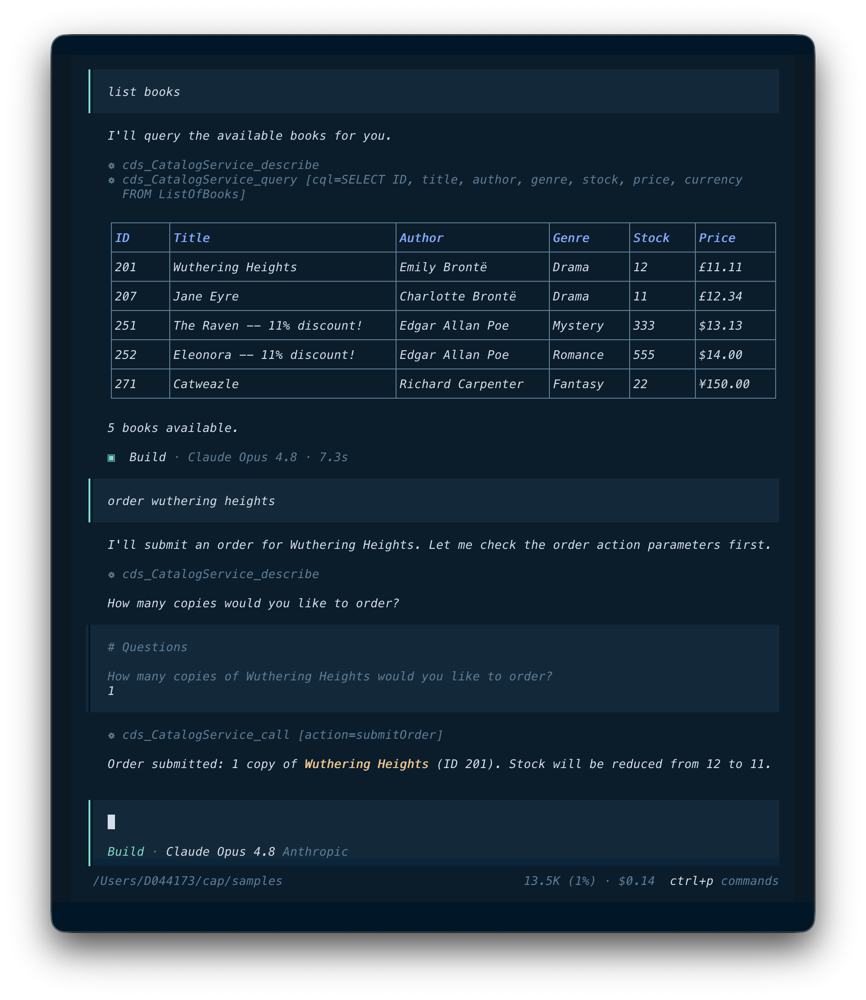
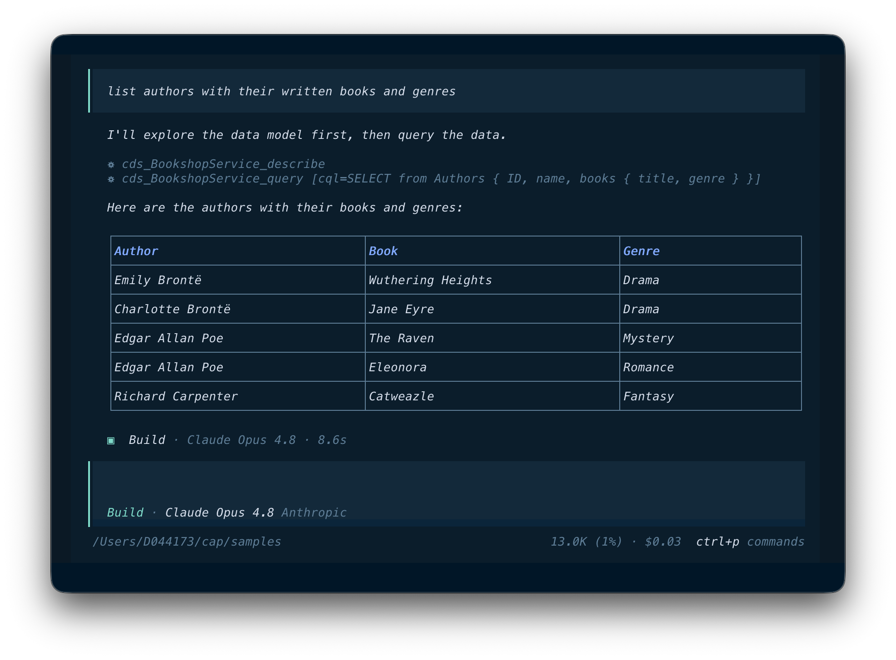
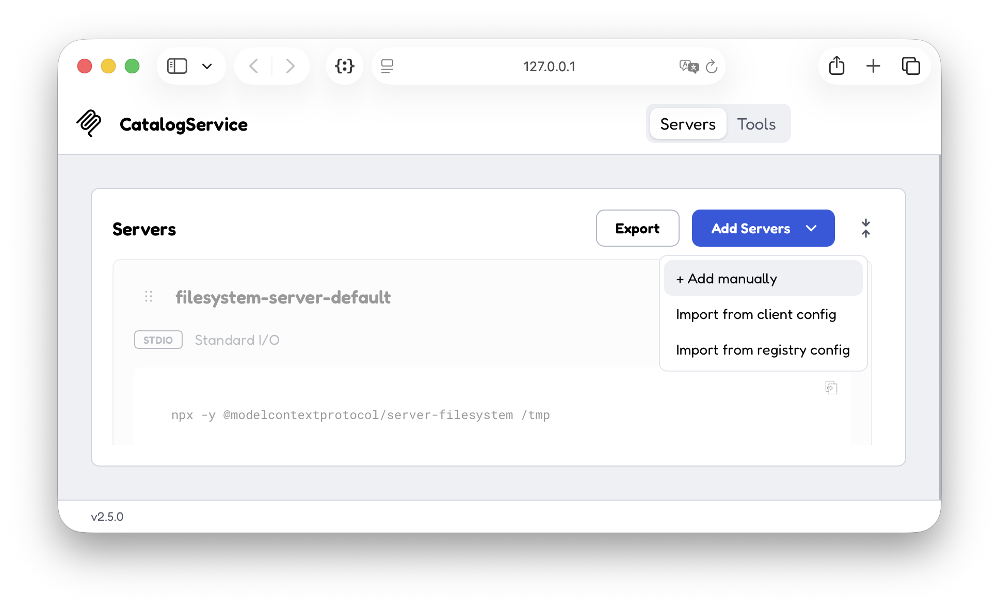
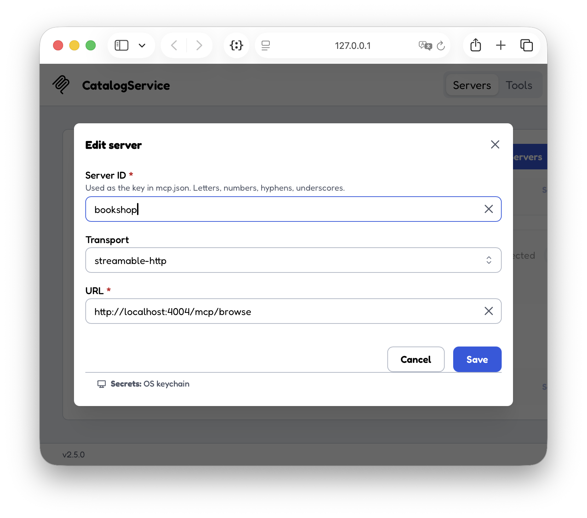

# Model Context Protocol Adapter

Simply annotate a CAP service with the [`@mcp`](#serving-mcp) annotation to expose it via [Model Context Protocol (MCP)](https://modelcontextprotocol.io/). With that it becomes accessible to AI agents and LLM-powered tools without additional implementation work.
{.abstract}

> [!caution] SAP API Policy Applies!
> The CAP MCP adapter is intended only for exposing _custom_ CAP application services. It is **_NOT_**{.red} an SAP-endorsed architecture or pathway for exposing, proxying, or providing agentic access to _SAP Application APIs_ as referred to in the [_SAP API Policy_](https://help.sap.com/doc/sap-api-policy), section 2.2.2. -> Read section [_SAP API Policy_](#sap-api-policy) below!


[[toc]]


> [!note]
>
> This guide is about the *MCP Adapter* – for example, as provided through the [*@cap-js/mcp*](https://github.com/cap-js/mcp) plugin – which powers domain-specific application use cases, for example, to respond to questions for CAP-based applications like *"List all overstocked books"*.
>
> In parallel, there's also the *MCP Server* plugin ([*@cap-js/mcp-server*](https://github.com/cap-js/mcp-server)), which serves a different purpose, though, that is: AI-assisted *development* of CAP projects.


## Add the MCP Plugin


### In CAP Node.js Projects

Within your project root run this to add the [`@cap-js/mcp`](https://github.com/cap-js/mcp) plugin:

```shell [Node.js]
npm add @cap-js/mcp
```
### In CAP Java Projects

Add the `cds-adapter-mcp` dependency to your `srv/pom.xml`:

::: code-group
```xml [srv/pom.xml]
<dependency>
  <groupId>com.sap.cds</groupId>
  <artifactId>cds-adapter-mcp</artifactId>
  <scope>runtime</scope>
</dependency>
```
:::


## Declare `@mcp` Services


### Using `@mcp` Annotation

Simply add the `@mcp` annotation to a service definition to expose it via MCP.  For example, add the following to `srv/cat-service.cds`:


::: code-group
```cds [srv/cat-service.cds]
// Serve via OData, HCQL and REST
annotate CatalogService with @odata @hcql @rest;
annotate CatalogService with @mcp; // [!code focus]
```
:::

You can also specify an alternative path under which the MCP endpoint should be served as usual with CAP protocol annotations:

```cds
annotate CatalogService with @mcp:'books'
```

> [!tip] Just Another Protocol
> From the perspective of a developer in a CAP-based project, `@mcp` is just another protocol for your services, similar to `@odata`, `@graphql`, `@rest`, or `@hcql`. The adapter takes care of the rest, with all the standard CAP features you know working out of the box also with MCP, including annotations like `@cds.query.limit`, etc.


### MCP-specific Services

Frequently, you might want to create services that are tailored specifically for MCP usage.
Instead of annotating an existing service with `@mcp` and exposing all its entities and actions, simply create a dedicated service specifically for MCP. For example, you could create a `BooksService` that only exposes a subset of the entities of the `AdminService` like that:

::: code-group
```cds [srv/books-service.cds]
using { AdminService } from './admin-service';

@mcp service BooksService {

  @readonly entity Authors as projection on AdminService.Authors;
  @readonly entity Books as projection on AdminService.Books {
    ID, title, stock, price,
    author,
    genre.name as genre,
    currency.name as currency,
  }

  @requires: 'authenticated-user'
  action submitOrder ( book: Books:ID, quantity: Integer );
 }
```
:::


> => See also: [_Use Case-Oriented Services_](../../get-started/bookshop#use-case-specific-services) in the getting started guide.


### Providing Descriptions

As LLMs rely heavily on context information to create high-quality output, the adapter evaluates existing doc comments and annotations to provide additional information about the service, entities, elements, actions, and parameters to the LLM. This information is included in the output of the [`describe`](#-describe-service) tool and can be used by agents to better understand the data model and available actions/functions. In particular, the following information is evaluated:

- [Doc comments](../../cds/cdl#doc-comments) -> most recommended
- `@title`
- `@description`

::: warning Configuration required for CAP Java
You must enable doc comments in the Java application and in the MTX sidecar.

::: code-group
```json [.cdsrc.json]
"cdsc": {
   "docs": true
}
```
```yaml [srv/application.yaml]
cds:
  model.includeDocComments: true
```
:::

For example, you can add doc comments to your entities and their elements like that:

```cds
/**
 * This is the author entity.
 * It contains information about book authors.
 */
annotate BookshopService.Authors with {
  /** The ID of the author. */
  ID;
  /** The name of the author. */
  name;
  /** The books written by the author. */
  books;
}
```

You can also provide service-specific instructions via annotation `@mcp.instructions`.

::: code-group
```cds [srv/books-service.cds]
using { AdminService } from './admin-service';
@mcp 
@mcp.instructions: 'Always ask a confirmation before ordering any books'  // [!code focus]
service BooksService {
  ...
}
```
:::

These instructions are sent to a client who connects with an MCP server.

## Test-drive Locally

As usual, and following the Calesi principles of "convention over configuration", you can run your CAP server locally and interact with it using the MCP protocol from common clients like OpenCode or Claude Code.


### Run with `cds watch`

Run your CAP server locally as usual using `cds watch`, and note that the `@mcp`-annotated service gets served at an additional endpoint for the MCP protocol:

::: code-group
```shell [Node.js]
cds watch
```
```shell [Java]
mvn cds:watch
```
:::

```shell
[cds] - serving CatalogService {
  at: [ ..., '/mcp/browse' ],
  ...
}
```


### Using OpenCode, or alike

Assumed you have [Claude Code](https://code.claude.com/docs/en/overview) or [Opencode](https://opencode.ai/) installed, start either one in a secondary terminal, for example:

```shell
opencode
```

::: details Installing Claude Code or OpenCode ...

Install [OpenCode](https://opencode.ai/), for example via npm:
```shell
npm install -global opencode-ai
```

Install [Claude Code](https://code.claude.com/docs/en/overview), for example via Homebrew:
```shell
brew install claude-code
```

Install [Claude Code for VSCode](https://marketplace.visualstudio.com/items?itemName=anthropic.claude-code):
```shell
code --install-extension anthropic.claude-code
```

:::


{.ignore-dark}


Go ahead and interact with your CAP services using natural language and conversational style via OpenCode, entering prompts like these:

```sh
list books
```
```sh
order wuthering heights
```

And answer the questions that OpenCode asks you back.

{.ignore-dark}


You can also run `opencode web` to open the OpenCode web interface, which provides a more user-friendly way to interact with your MCP servers, including features like tool inspection and query building. Here's a screenshot of a simple session:

{style="width:70%"}


### Autowired MCP Clients

When we initially started OpenCode above, it indicated in the bottom line of the interface that there's (at least) one MCP server connected.

{.ignore-dark}

Enter `/status` in the OpenCode interface to see details, which should display the status of the connected MCP servers like this:

{.ignore-dark}

> [!tip] Autowired during development
> Whenever you start your CAP application with `cds watch`, all served MCP endpoints are automatically registered with local MCP clients like [Claude Code](https://code.claude.com/docs) and [OpenCode](https://opencode.ai/), so you can just go ahead and run queries from them without any additional configuration. This makes it super easy to test and interact with your services via MCP during development.

::: details Click to expand the client-specific configuration files
::: code-group
```json [~/.claude.json]
{
  "mcpServers": {
    "cds:AdminService": {
      "type": "http",
      "url": "http://localhost:4004/mcp/admin",
      "headers": {
        "Authorization": "Basic YWxpY2U6"
      }
    },
    "cds:CatalogService": {
      "type": "http",
      "url": "http://localhost:4004/mcp/browse",
      "headers": {
        "Authorization": "Basic YWxpY2U6"
      }
    }
  },
}
```
```json [~/.config/opencode/opencode.json]
{
  "$schema": "https://opencode.ai/config.json",
  "mcp": {
    "cds:AdminService": {
      "type": "remote",
      "url": "http://localhost:4004/mcp/admin",
      "headers": {
        "Authorization": "Basic YWxpY2U6"
      },
      "enabled": true
    },
    "cds:CatalogService": {
      "type": "remote",
      "url": "http://localhost:4004/mcp/browse",
      "headers": {
        "Authorization": "Basic YWxpY2U6"
      },
      "enabled": true
    }
  }
}
```
:::


### Inspect Log Output

When you run queries, you can inspect the log output of your CAP server to see the incoming MCP requests and how they are processed. This can be helpful for debugging and understanding the interaction between the MCP client and your CAP services.

For example, for a `list books` prompt, you should see log output similar to this:

::: code-group
```js [Node.js]
[mcp] - CatalogService describe { entities: [ 'Books' ] }
[mcp] - CatalogService query {
  cql: 'SELECT ID, title, author, genre, stock, price, currency_code FROM Books'
}
```
```js [Java]
INFO MCP tool called: service='CatalogService', tool='query'
```
:::


## Served out of the box

The adapter creates an MCP server per CAP service, hence each CAP application can expose multiple MCP servers. By default, the adapter creates three generic tools, [`describe`](#-describe-service), [`query`](#-query-entity), and [`call`](#-call-action), for each MCP server, which can be used by LLMs and AI agents to interact with the service.

the following tools for each MCP server, which can be used by LLMs and AI agents to interact with the service.

> [!warning]
> Tools are meant to be used by LLMs and AI agents and do not constitute a stable API.
> They may change in the future based on the needs of LLMs and AI agents. For stable APIs, please use the existing CAP protocols like OData, REST, GraphQL, etc.

### • `describe` service {.tool}

This tool returns information about the entities and their elements exposed by the service. It also returns information about unbound actions and functions. If you do not provide a parameter, the tool describes all exposed entities, actions and functions. The optional parameter `entities` restricts the output to a single entity, the optional parameter `actions` restricts the output to a single action/function. The tool provides an enum that lists all available entities, actions and functions.

### • `query` entity {.tool}

This tool is used to read data from the service.
It expects a single parameter `cql`, which contains the query in [CQL](../../cds/cql) syntax to be executed.

> [!tip] CQL = SQL++ => well understood by LLMs
> As common LLMs, like Claude Sonnet, are trained for SQL very well, they are quick to understand and generate CQL queries for interacting with the service.

For example, given the `BookshopService` as [declared above](#mcp-specific-services) that exposes `Authors` with its to-many association to `Books` , we can ask OpenCode running Opus something like this:

```sh
list authors with their written books and genres
```

Which it would nicely translate into the following CQL query using nested postfix projection to expand the `books` association, as shown in the screenshot below:

```sql
SELECT from Authors {
  ID, name, books {
    title, genre
  }
}
```

{.ignore-dark}

### • `call` action {.tool}

This tool is used to call unbound actions or functions. The required parameter `action` is an enum that lists all unbound actions and functions exposed by the service. The parameters of the action or function to call can be provided via the optional parameter `parameters`, that must contain all required parameters of the action or function. The tool takes these parameters and calls the action or function on the service.

### Inspect the Tools

You can use the [MCP Inspector](https://modelcontextprotocol.io/docs/tools/inspector) to inspect the tools served from CAP services:

```bash
npx @modelcontextprotocol/inspector
```

The inspector should automatically open in your browser.

{.ignore-dark}

Register your `@mcp`-enabled CAP services to the inspector using the _Add Servers_ \> _+ Add manually_ menu option, and in the dialog that appears, follow these steps:

1. Enter a name for your server, e.g. _bookshop_.
1. Select _streamable-http_ as transport type.
3. Enter MCP endpoint into URL - for example, `http://localhost:4004/mcp/browse`.

A screenshot is shown below:

{.ignore-dark}

Then connect, and switch to the _Tools_ tab to the top of the inspector's window to inspect and try out the listed tools.


## Configuration

### Tool Name Prefixes

Some MCP clients or harnesses require unique tool names across all MCP servers. You can use the option <Config>cds.mcp.prefix</Config> to specify a prefix for the tool names. For example:

::: code-group
```yaml [.cdsrc.yaml]
cds:
  mcp:
    prefix: {service.name}-
```
```json [package.json]
{
  "cds": {
    "mcp": {
      "prefix": "{service.name}-"
    }
  }
}
```
:::

With this, the tool names generated by the MCP clients will be prefixed with the specified value, with the placeholder `{service.name}` being replaced by the actual service's fully qualified name – e.g., `CatalogService-describe`.


### Opting out of Autowiring

You can opt out of [autowired MCP clients](#autowired-mcp-clients) in development by setting the `cds.mcp.autowire` option to `false`, like so in your `package.json`:

::: code-group
```yaml [.cdsrc.yaml]
cds:
  mcp:
    autowire: false
```
```json [package.json]
{
  "cds": {
    "mcp": {
      "autowire": false
    }
  }
}
```
:::


### Mock Authentication

[Autowired MCP clients](#autowired-mcp-clients) automatically add `Authorization` headers for the mock user `alice` (Node.js) or `privileged` (Java). If your service requires something different, you can customize the credentials via the `cds.mcp.autowire` configuration:

::: code-group
```yaml [.cdsrc.yaml]
cds:
  mcp:
    autowire:
      user: admin
      password: admin
```
```json [package.json]
{
  "cds": {
    "mcp": {
      "autowire": {
        "user": "admin",
        "password": "admin"
      }
    }
  }
}
```
:::

## Current Limitations

### Authorization with XSUAA

> [!important]
> We are currently working on providing out-of-the-box support for authorization with XSUAA, with PKCE, but it is not fully implemented yet.


### Query and Actions Only

The MCP tools created by the adapter are currently focused on reading data and calling [**_unbound_** actions and functions](../../cds/cdl#actions) only. This means that you can use MCP to [`query`](#tool-query-entity) data from your CAP services, while any data changes need to be implemented via unbound actions for now.

For example, action `submitOrder` in the `CatalogService` ultimately creates an Order:

::: code-group
```cds [srv/catalog-service.cds]
service CatalogService {
  ...
  @requires: 'authenticated-user'
  action submitOrder ( book: Books:ID, quantity: Integer ); // [!code focus]
}
```
:::

Future versions of the adapter may add support for data changes using CREATE, UPDATE, and DELETE operations.


### Prompt Injection Attacks

> [!caution]
> The MCP adapter does not perform any input validation or output validation to prevent prompt injection attacks.
> Agents can potentially be manipulated by data returned from the service to execute unintended actions. For any deployment ensure you use infrastructure and practices that mitigate prompt injection risks and connect only to trusted MCP agents (e.g., Joule).


## SAP API Policy

> [!caution]
> The adapter itself does not provide any built-in governance features: there is no automatic rate limiting, no specific audit logging of agent actions, no approval workflows for sensitive operations, and no policy enforcement layer. Before using MCP in a productive environment, put appropriate controls for example by using MCP Gateway of SAP Integration Suite or integrate with SAP Agent Gateway (not GA yet).

> [!caution]
> The CAP MCP adapter must not be used as a gateway or proxy for SAP Application APIs. The adapter is not an SAP-endorsed architecture, data service, or service-specific pathway under section 2.2.2 of the [_SAP API Policy_](https://help.sap.com/docs/business-accelerator-hub/sap-business-accelerator-hub/sap-api-policy) and is not an endorsed mechanism for exposing, proxying, or providing agentic access to SAP Application APIs.
> Any use of SAP Application APIs must be in accordance with the [_SAP API Policy_](https://help.sap.com/docs/business-accelerator-hub/sap-business-accelerator-hub/sap-api-policy). For SAP-endorsed patterns on agentic access to SAP Application APIs, consult the [_SAP Architecture Center_](https://architecture.learning.sap.com/docs/ref-arch/98efa0) reference architectures.
