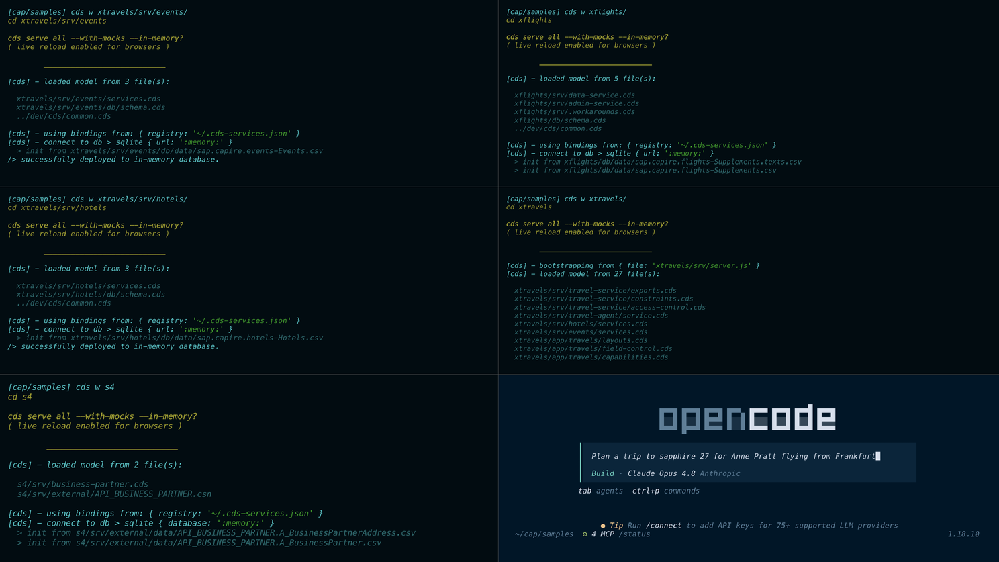

# The XTravels Sample for AI

The XTravels sample demonstrates how to integrate and use multiple MCP services and CAP-level agents in a cohesive travel booking scenario.
{.abstract}

[[toc]]


## Overview

The XTravels sample provides a more comprehensive example of how to work with several MCP services. It comprises the following CAP services:

- `EventsService`: to browse and book business or leisure events.
- `HotelsService`: to browse and book hotel accommodations.
- `FlightsService`: to browse airports, airlines and flights.
- `TravelsAgentService`: an MCP service for managing travel agent interactions.

## Workspace Setup

To set up the workspace for the XTravels sample, follow these steps:

1. Create a root directory to clone the samples into, e.g. `cap/samples`:

```shell
mkdir -p cap/samples
cd cap/samples
```

2. Clone the individual sample repositories:

```shell
git clone https://github.com/capire/xtravels
git clone https://github.com/capire/xflights
git clone https://github.com/capire/common
git clone https://github.com/capire/s4
```

3. Add a `package.json` file to define the workspaces:

```shell
echo '{"workspaces":["*","*/apis/*"]}' > package.json
```

4. Install the necessary dependencies:

```shell
npm install
```

This will install all the dependencies, with the cloned sample repositories linked locally.


## Run all-in-one

```shell
cds watch xtravels
```


## Use in OpenCode

```shell
opencode
```

Enter a prompt, such as:

```
Plan a trip to sapphire 27 for Anne Pratt flying from Frankfurt
```

You should see something like this:

{.ignore-dark}
{.ignore-dark}


## Run as separate services

If you like you can also start the individual services separately in different terminals as shown below – no code or config changes required for that, and also no change to the usage in AI chat clients.

Run each of the lines below in a separate terminal:

```shell
cds w xtravels/srv/events
cds w xtravels/srv/hotels
cds w s4
cds w xflights
cds w xtravels
opencode
```

{.ignore-dark}
