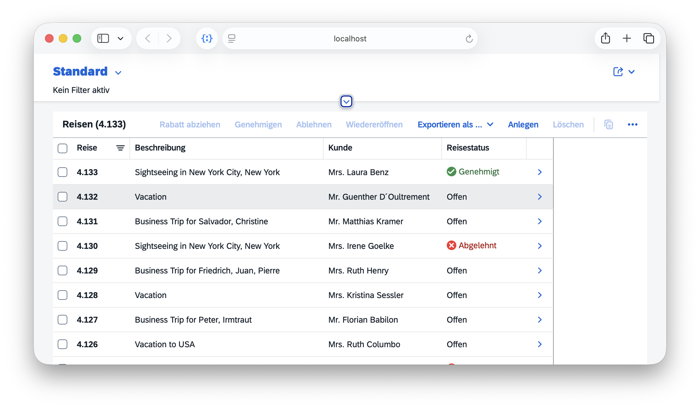
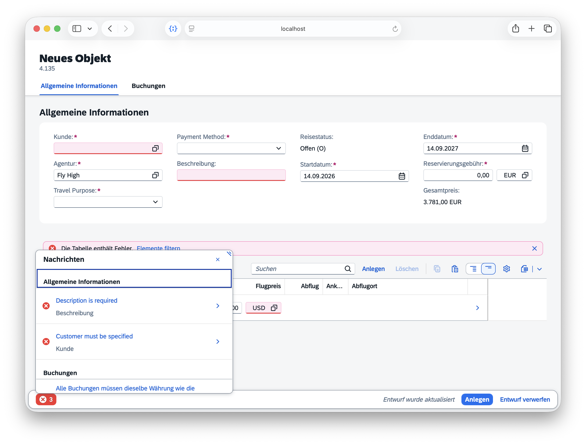
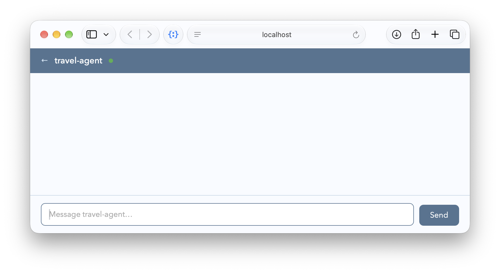
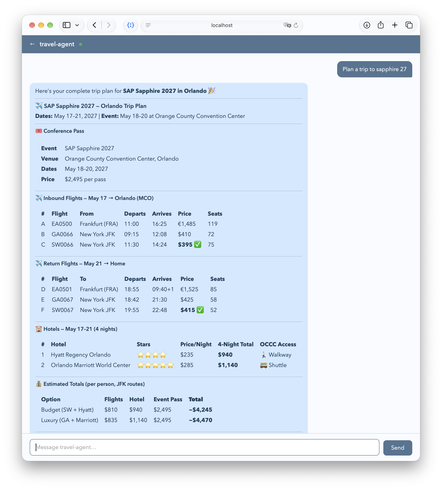
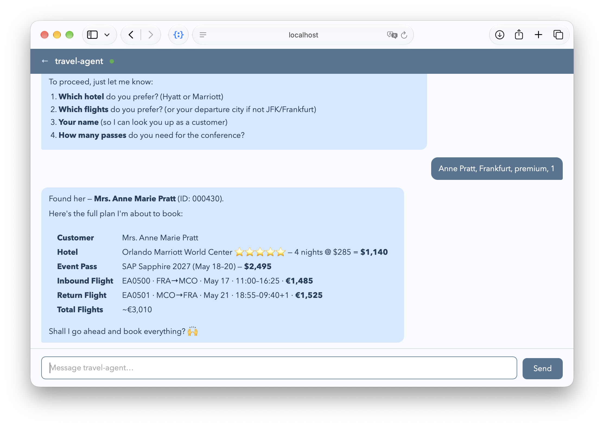
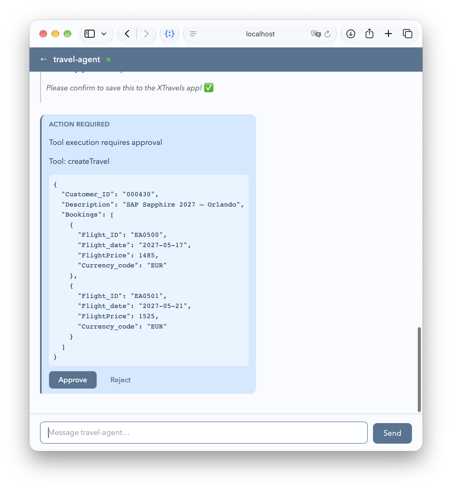

# The XTravels Sample for AI

The XTravels sample demonstrates how to integrate and use multiple MCP services and CAP-level agents in a cohesive travel booking scenario.
{.abstract}

[[toc]]


## Introduction

The XTravels sample provides a more comprehensive example of how to work with several MCP services and CAP-level agents. It includes these separate services:

- `EventsService`: to browse and book business or leisure events.
- `HotelsService`: to browse and book hotel accommodations.
- `FlightsService`: to browse airports, airlines and flights.
- `TravelsService`: to manage travel itineraries and requests.


### Classic UI-centric Approach

The classic approach as illustrated below, is used a static UI where the user interacts with the XTravels application, and the application in turn interacts directly with individual services for events, hotels, and flights, without any intelligent coordination between them.

![Classic XTravels architecture diagram showing a Travels App connected to three service boxes labeled Events, Hotels, and Flights. Text under Travels App lists create travel requests, via deeply integrated services, show travel requests, and approve or reject. Text next to Events says browse events and book event passes, next to Hotels says browse hotels and book rooms, and next to Flights says browse airports and flights and book seats. The layout is a clean technical diagram on a plain background with a structured and informative tone.](xtravels-classic.drawio.svg?raw)

### Agentic Approach

By using agents we can replace classic UIs to create travels, with deep integration across the various services – both for development teams that had to invest accordingly, as well as for end-users seeking an automated travel planning experience.


The _XTravels App_ in the illustration above reduces to a lightweight application with only simple mostly readonly UIs and minimal user interaction, while the agents handle the complex coordination and integration tasks behind the scenes. Also, all the formerly required deep integrations can be eliminated, with all the orchestration and decision-making now offloaded to the agents. At least, that's what we hope to achieve.


## Preliminaries

### Clone Repositories

To set up the workspace for the XTravels sample, follow these steps:

1. Create a root directory to clone the samples into, e.g. `cap/samples`:

```shell
mkdir -p cap/samples
cd cap/samples
```

2. Clone the individual sample repositories:

```shell
git clone https://github.com/capire/xtravels
git clone https://github.com/capire/xflights
git clone https://github.com/capire/common
git clone https://github.com/capire/s4
```

3. Add a `package.json` file to define the workspaces:

```shell
echo '{"workspaces":["*","*/apis/*"]}' > package.json
```

4. Install the necessary dependencies:

```shell
npm install
```

This will install all the dependencies, with the cloned sample repositories linked locally.


### Run all-in-one

Even though the sample consists of multiple services, which might ultimately be deployed and operated separately, you can run it all-in-one using `cds watch`, with all required services mocked out of the box, as indicated in the log output below:

```shell
cds watch xtravels
```
```zsh
[cds] - mocking sap.capire.events.EventsService { ... }
[cds] - mocking sap.capire.hotels.HotelsService { ...  }
[cds] - mocking sap.capire.flights.FlightsService { ... }
[cds] - mocking sap.capire.s4.business-partner { ... }
[cds] - serving TravelService { ... }
[cds] - server listening on { url: 'http://localhost:4005' }
```

### Using static UIs

We can open the travel application's Fiori UI from the index.html page served at _http://localhost:4005_ -> click on the [_/travels/webapp_](http://localhost:4005/travels/webapp/index.html) link on the top, to see the list of existing travel requests:



Click on the `Create` button (`Anlegen` in the screenshot above) to start a new travel plan using the Fiori UI, in which we need to correctly fill in the required details and correctly select flights.




We'll quickly note how hard it is to use that UI to manually fill in all the required details for a new travel plan. Even more hard work had to be spent by the developers before to design and implement that UI. And we didn't even integrate booking events and hotels into that sample so far.

This is exactly where the MCP services come into play, automating much of the planning and booking process, and hence saving us as developers having to implement all the intricate details manually.


## MCP Services

### MCP-enable given Services

Instead of implementing static UIs, we merely annotate the existing service definitions with [`@mcp`] to make them available for automated planning and booking from AI agents:

::: code-group
```cds [xtravels/srv/events/services.cds]
@mcp service EventsService { ... }
```
:::
::: code-group
```cds [xtravels/srv/hotels/services.cds]
@mcp service HotelsService { ... }
```
:::
::: code-group
```cds [xflights/srv/data-service.cds]
@mcp service FlightsService { ... }
```
:::

> [!tip] Just another protocol
> From CAP's perspective, MCP is just another protocol, and hence the `@mcp` annotation just another protocol annotation, similar to `@hcql`, `@odata`, `@rest` or `@graphql`.

### Add Tailored MCP Services

In case of the XTravels application we choose to not just [`@mcp`]-enable the existing [`TravelService`](https://github.com/capire/xtravels/tree/main/srv/travel-service/service.cds), as that is tailored for usage from Fiori clients, and therefore exposes a lot of entities, mostly for value helps. All these extra entities would not be required for MCP usages, but rather pollute context windows with add unnecessary complexity. Instead, we add a separate, streamlined MCP service as follows:

::: code-group
```cds [xtravels/srv/travel-agent/services.cds]
@mcp service TravelAgentService {

  @readonly entity Customers as projection on s4.Customers;

  action createTravel (
    Customer_ID : String(6) @mandatory,
    Description : String  @mandatory,
    Bookings : many {
      Flight_ID     : String;
      Flight_date   : Date;
      FlightPrice   : Decimal;
      Currency_code : String;
    }
  ) returns {
    ID        : Integer;
    BeginDate : Date;
    EndDate   : Date;
  };
}
```
:::

> [!tip] Prefer tailored services
> In case of question, always prefer using tailored, [use case-oriented services](../../get-started/bookshop.md#use-case-oriented-services). Especially for AI-driven planning and booking this is key to avoid polluting and eating up context windows when following the one-service-to-serve-all anti pattern.


### Test-drive with OpenCode

CAP puts a main focus on [fast inner-loop development](../integration/inner-loops) and iterative testing, making it easy to quickly see the effects of changes in your services. This also holds true for MCP-enabled services, which we can test locally using local installations of [OpenCode](https://opencode.ai/), [Claude Code](https://claude.ai/), or any other MCP client.

With the above changes, restart your CAP server in a terminal:

```shell
cds w xtravels
```

In a separate terminal, start OpenCode:

```shell
opencode
```

{.ignore-dark}

Enter a prompt, such as:

```
Plan a trip to Sapphire 27
```

You should see something like this:

{.ignore-dark}

- Answer questions the agent asks you back.
- When asked to provide a customer name, enter _Anne Pratt_.


{.ignore-dark}


## Custom Agents

In the previous sections, we have seen that the generic `build` agent in OpenCode can handle travel planning and booking tasks, just with MCP. That's because travel planning and booking is a well-known domain, and most LLMs have been trained to understand it effectively. That said, for more specialized domains or unique workflows, that would not be the case, but custom agents can fill the gap.

### 'Agentify' given Services

So, we start by turning some of our existing services into agents, using the [`@agent`] annotation, as shown below.

::: code-group
```cds [xtravels/srv/travel-agent/service.cds]
@agent:'/agent' service TravelAgentService { ... }
```
:::
::: code-group
```cds [xtravels/srv/events/services.cds]
@agent service EventsService { ... }
```
:::
::: code-group
```cds [xtravels/srv/hotels/services.cds]
@agent service HotelsService { ... }
```
:::

The `TravelAgentService` is our root agent that coordinates travel planning and booking across multiple destinations. It shall interact with the `EventsService` and `HotelsService` as subagents via A2A. In contrast to the latter, it shall keep using the `FlightsService` service via MCP, so we don't turn it into an agent.


> [!tip]
> Simply checkout the `aix` branch of the `xtravels` repository to get the complete implementation of the agents:
> ```shell
> cd xtravels
> git checkout aix
> cd -
> ```


### Add Custom Markdowns

In order to provide additional instructions and make move to a more deterministic behavior for the `TravelAgent`, we add an [`AGENTS.md`](cap-agents.md#optional-agentsmd) as well as [ `*/SKILL.md`](cap-agents.md#optional-skillmds) files for the individual subtasks.


```zsh
srv/travel-agent/
 ├── AGENTS.md           # next to the service definition
 ├── skills/
 │ ├── flight-booking/SKILL.md
 │ ├── itinerary-summary/SKILL.md
 │ ├── persist-itinerary/SKILL.md
 │ └── trip-planning/SKILL.md
 ├── service.cds         # the service definition
 └── service.js          # next to the service definition
```

Inspect these files in VS Code to understand how the instructions and guidelines are structured for the agents.


### Test-drive with Chat Client

Again, start the CAP server as an all-in-one instance, with mocked required services, and we would see in the log that the agent is connecting to the LLM, as shown below:

```shell
cds w xtravels
```
```zsh
[agents] - cds.connect.to 'llm' with: {
  kind: 'anthropic',
  model: 'claude-sonnet-4-6',
  credentials: {
    anthropicApiUrl: 'http://localhost:6655/anthropic/',
    apiKey: '***'
  }
}
```

::: tip
See [Automatic Config](cap-agents#automatic-config) in the CAP Agents documentation for details.
:::

But instead of using OpenCode as a generic client, we use the Chat Preview provided by the `cap-js/agent` plugin, which you can open from `Preview` links that are available in the _index.html_ for A2A agent endpoints – or simply open http://localhost:4005/agent/preview.

{style="width: 500px;"}



Now, enter the same prompts as you did before in OpenCode:

```
Plan a trip to Sapphire 27
```



And when the agent asks you for more details or clarifications, provide the necessary information – for example, the traveller's name, airport, and preferred hotel:



Finally, allow the agent to call the `createTravel` action – which is annotated with [`@agent.hitl`](cap-agents.md#using-agenthitl) – when prompted:




## Run Services Separately

To run the XTravels application with its services separately, you can start each service in its own terminal window. CAP's [late-cut microservices](../../get-started/features.md#late-cut-microservices) capabilities allows us to easily do so. Actually, with the need for tight integration gone, the services have no knowledge about or dependency on each other. We could also think of them as being developed and operated by independent teams, and only composed by the travel planning agent.

Run each of the lines below in a separate terminal, in the given order:

```shell
cds w xtravels/srv/events
```
```shell
cds w xtravels/srv/hotels
```
```shell
cds w xflights
```
```shell
cds w xtravels
```

In the log output of each [`@agent`]-ified service, that is for `events`, `hotels`, and `travels`, we see the `cds.connect to 'llm'` taking place:

```zsh
[agents] - cds.connect.to 'llm' with: {
  kind: 'anthropic',
  model: 'claude-sonnet-4-6',
  credentials: {
    anthropicApiUrl: 'http://localhost:6655/anthropic/',
    apiKey: '***'
  }
}
```

Then test-drive the XTravels application by interacting with the agents through [OpenCode](#test-drive-with-opencode) or the [Chat Preview](#test-drive-with-chat-client) as documented above, starting with the same prompt:

```
Plan a trip to sapphire 27
```


{.ignore-dark}


### Calling Remote MCP Services

Looking closer at the log output, we can see that as soon as the `TravelAgentService` starts in response to the initial user request, it immediately connects to the remote `FlightsService` service via MCP:

```zsh
[agents] - sap.capire.travels.TravelAgentService request {
  conversation: '-',
  method: 'message/stream',
  text: 'Plan a trip to sapphire 27'
}
[agents:mcp] - Connecting to MCP service sap.capire.flights.FlightsService {
  at: 'http://localhost:4006/mcp/flights'
}
```

Means that the `TravelAgentService` is auto-wired to the `FlightsService` through the MCP protocol, allowing it to request flight information as part of handling the user's travel planning request.

#### Processed by the remote FlightsService

In the log output of the `xflights` process, we can see the incoming MCP requests from the `TravelAgentService` being received and processed by the `FlightsService`:

```zsh
[mcp] - sap.capire.flights.FlightsService describe {
  entities: [ 'Flights', 'Airlines', 'Airports', 'Supplements' ],
  actions: [ 'ReserveSeats', 'ReleaseSeats' ]
}
[mcp] - sap.capire.flights.FlightsService describe {
  entities: [ 'Airports', 'Flights' ]
}
[mcp] - sap.capire.flights.FlightsService query {
  cql: "SELECT ID, name, city FROM Airports WHERE city = 'Orlando'"
}
[mcp] - sap.capire.flights.FlightsService query {
  cql: "SELECT ID, date, origin.city, destination.city, ... from Flights
  WHERE destination_ID = 'MCO' AND date = '2027-05-17' AND free_seats > 0"
}
...
```


### Delegation to Subagents

Immediately after connecting to the MCP service, we see that the `TravelAgentService` also connects to the `HotelsService` and `EventsService`, this time through the A2A protocol:

```zsh
[agents:a2a] - Connecting to subagent sap.capire.hotels.HotelsService {
  at: 'http://localhost:4008/a2a/hotels'
}
[agents:a2a] - Connecting to subagent sap.capire.events.EventsService {
  at: 'http://localhost:4007/a2a/events'
}
```

With that the root agent served by `TravelAgentService` is able to delegate individual subtasks to the `HotelsService` and `EventsService`. This happens through natural language requests sent via A2A, as we can see in the subsequent log outputs of the `travels` app:


```zsh
[agents:a2a] - Sending message to sap.capire.events.EventsService {
  messageId: '59e07fd2-2227-4522-824c-40cc8272dbc4'
}

Find SAP Sapphire 2027 and tell me the event dates, city, venue, and prices.
```


#### Processed in remote subagents

In the log output of the `events` process, we can see the incomming A2A message received by the `EventsService` and processed via service-local MCP queries:

```zsh
[agents] - sap.capire.events.EventsService request {
  conversation: '-',
  method: 'message/send',
  text: 'Find SAP Sapphire 2027 and tell me the event dates, city, venue, and prices.'
}

[mcp] - sap.capire.events.EventsService describe { entities: [ 'Events' ] }
[mcp] - sap.capire.events.EventsService query {
  cql: "SELECT from Events {
    ID, name, startDate, endDate, city, venue, price
  } WHERE name like '%Sapphire%' AND year(startDate) = 2027"
}
[agents] - sap.capire.events.EventsService completed {
  conversation: 'd5fdcec4',
  duration: '7.9s'
}
```

Similar for the booking subtask delegated to the `EventsService` later on, which the subagent processes by `call`-ing its local action `bookTicket`:

```zsh
[agents] - sap.capire.events.EventsService request {
  conversation: '-',
  method: 'message/send',
  text: `Book 1 attendee pass for SAP Sapphire 2027 in Orlando
    for guest "Mrs. Anne Marie Pratt".`
}
[mcp] - sap.capire.events.EventsService describe { entities: [ 'Events' ] }
[mcp] - sap.capire.events.EventsService query {
  cql: "SELECT ID, name, city, country, venue, ... FROM Events
  WHERE name like '%Sapphire%' AND city like '%Orlando%'"
}
[mcp] - sap.capire.events.EventsService - call bookTicket {
  eventId: '4505f22c-817c-4db1-841c-afa9351b93ca',
  guest: 'Mrs. Anne Marie Pratt',
  seats: 1
}
[agents] - sap.capire.events.EventsService completed {
  conversation: '790039b6',
  duration: '9.1s'
}
```

## Conclusion

In this guide, we have walked through the process of setting up and interacting with the XTravels agents using both OpenCode and the Chat Preview. We explored the structure of the service and skill files, tested the agents' capabilities, and demonstrated how to approve actions triggered by the agents. This setup allows for efficient local development and testing of agent-driven workflows in the XTravels application.


> [!tip] Done, q.e.d. ... sort of :)
> You have successfully tested the travel planning and booking workflow locally using OpenCode.
> And we've demonstrated that we can indeed save quite some development efforts, as well as improving end user experience significantly, by letting agents do the heavy lifting and automate things for us.


[`@agent`]: ./cap-agents.md#declare-agent-services
[`@mcp`]: ./cap-mcp.md#declare-mcp-services
