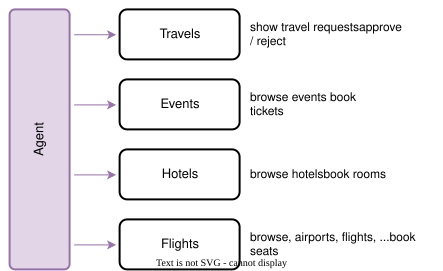

# The XTravels Sample for AI

The XTravels sample demonstrates how to integrate and use multiple MCP services and CAP-level agents in a cohesive travel booking scenario.
{.abstract}

[[toc]]


## Introduction

The XTravels sample provides a more comprehensive example of how to work with several MCP services and CAP-level agents. It includes these separate services:

- `EventsService`: to browse and book business or leisure events.
- `HotelsService`: to browse and book hotel accommodations.
- `FlightsService`: to browse airports, airlines and flights.
- `TravelsService`: to manage travel itineraries and requests.


### Classic UI-centric Approach

The classic approach as illustrated below, is used a static UI where the user interacts with the XTravels application, and the application in turn interacts directly with individual services for events, hotels, and flights, without any intelligent coordination between them.

![Classic XTravels architecture diagram showing a Travels App connected to three service boxes labeled Events, Hotels, and Flights. Text under Travels App lists create travel requests, via deeply integrated services, show travel requests, and approve or reject. Text next to Events says browse events and book event passes, next to Hotels says browse hotels and book rooms, and next to Flights says browse airports and flights and book seats. The layout is a clean technical diagram on a plain background with a structured and informative tone.](xtravels-classic.drawio.svg)

### Agentic Approach

By using agents we can replace the need to build classic UIs to create travels, with deep integration across the various services – both for development teams that had to invest accordingly and for end-users seeking an automated travel planning experience.



The _XTravels App_ in the illustration above reduces to a lightweight application with only simple mostly readonly UIs and minimal user interaction, while the agents handle the complex coordination and integration tasks behind the scenes. Also, all the formerly required deep integrations can be eliminated, with all the orchestration and decision-making now offloaded to the agents. At least, that's what we hope to achieve.


## Preliminaries

### Clone Repositories

To set up the workspace for the XTravels sample, follow these steps:

1. Create a root directory to clone the samples into, e.g. `cap/samples`:

```shell
mkdir -p cap/samples
cd cap/samples
```

2. Clone the individual sample repositories:

```shell
git clone https://github.com/capire/xtravels
git clone https://github.com/capire/xflights
git clone https://github.com/capire/common
git clone https://github.com/capire/s4
```

3. Add a `package.json` file to define the workspaces:

```shell
echo '{"workspaces":["*","*/apis/*"]}' > package.json
```

4. Install the necessary dependencies:

```shell
npm install
```

This will install all the dependencies, with the cloned sample repositories linked locally.


### Run all-in-one

Even though the sample consists of multiple services, which might ultimately be deployed and operated separately, you can run it all-in-one using `cds watch`, with all required services mocked out of the box, as indicated in the log output below:

```shell
cds watch xtravels
```
```zsh
[cds] - mocking sap.capire.events.EventsService { ... }
[cds] - mocking sap.capire.hotels.HotelsService { ...  }
[cds] - mocking sap.capire.flights.FlightsService { ... }
[cds] - mocking sap.capire.s4.business-partner { ... }
[cds] - serving TravelService { ... }
[cds] - server listening on { url: 'http://localhost:4005' }
```

### Using static UIs

We can open the travel application's Fiori UI from the index.html page served at _http://localhost:4005_ -> click on the [_/travels/webapp_](http://localhost:4005/travels/webapp/index.html) link on the top, to see the list of existing travel requests:


Click on the `Create` button (`Anlegen` in the screenshot above) to start a new travel plan using the Fiori UI, in which we need to correctly fill in the required details and correctly select flights.


We'll quickly note how hard it is to use that UI to manually fill in all the required details for a new travel plan. Even more hard work had to be spent by the developers before to design and implement that UI. And we didn't even integrate booking events and hotels into that sample so far.

This is exactly where the MCP services come into play, automating much of the planning and booking process, and hence saving us as developers having to implement all the intricate details manually.


## MCP Services

### MCP-enable given Services

Instead of implementing static UIs, we merely annotate the existing service definitions with [`@mcp`] to make them available for automated planning and booking from AI agents:

::: code-group
```cds [xtravels/srv/events/services.cds]
@mcp service EventsService { ... }
```
:::
::: code-group
```cds [xtravels/srv/hotels/services.cds]
@mcp service HotelsService { ... }
```
:::
::: code-group
```cds [xflights/srv/data-service.cds]
@mcp service FlightsService { ... }
```
:::

> [!tip] Just another protocol
> From CAP's perspective, MCP is just another protocol, and hence the `@mcp` annotation just another protocol annotation, similar to `@hcql`, `@odata`, `@rest` or `@graphql`.

### Add Tailored MCP Services

In case of the XTravels application we choose to not just [`@mcp`]-enable the existing [`TravelService`](https://github.com/capire/xtravels/tree/main/srv/travel-service/service.cds), as that is tailored for usage from Fiori clients, and therefore exposes a lot of entities, mostly for value helps. All these extra entities would not be required for MCP usages, but rather pollute context windows with add unnecessary complexity. Instead, we add a separate, streamlined MCP service as follows:

::: code-group
```cds [xtravels/srv/travel-agent/services.cds]
@mcp service TravelAgentService {

  @readonly entity Customers as projection on s4.Customers;

  action createTravel (
    Customer_ID : String(6) @mandatory,
    Description : String  @mandatory,
    Bookings : many {
      Flight_ID     : String;
      Flight_date   : Date;
      FlightPrice   : Decimal;
      Currency_code : String;
    }
  ) returns {
    ID        : Integer;
    BeginDate : Date;
    EndDate   : Date;
  };
}
```
:::

> [!tip] Prefer tailored services
> In case of question, always prefer using tailored, [use case-oriented services](../../get-started/bookshop.md#use-case-oriented-services). Especially for AI-driven planning and booking this is key to avoid polluting and eating up context windows when following the one-service-to-serve-all anti pattern.


### Test-drive Locally

CAP puts a main focus on [fast inner-loop development](../integration/inner-loops) and iterative testing, making it easy to quickly see the effects of changes in your services. This also holds true for MCP-enabled services, which we can test locally using local installations of [OpenCode](https://opencode.ai/), [Claude Code](https://claude.ai/), or any other MCP client.

With the above changes, restart your CAP server in a terminal:

```shell
cds w xtravels
```

In a separate terminal, start OpenCode:

```shell
opencode
```


Enter a prompt, such as:

```
Plan a trip to Sapphire 27
```

You should see something like this:

{.ignore-dark}

- Answer questions the agent asks you back.
- When asked to provide a customer name, enter _Anne Pratt_.


{.ignore-dark}


> [!tip] Done, q.e.d. ... sort of :)
> You have successfully tested the travel planning and booking workflow locally using OpenCode.
> And we've demonstrated that we can indeed save quite some development efforts, as well as improving end user experience significantly, by letting agents do the heavy lifting and automate things for us.


## Custom Agents

### 'Agentify' given Services

### Add Custom Markdowns

### Test-drive Locally


## Run Separately

If you like you can also start the individual services separately in different terminals as shown below – no code or config changes required for that, and also no change to the usage in AI chat clients.

Run each of the lines below in a separate terminal:

```shell
cds w xtravels/srv/events
cds w xtravels/srv/hotels
cds w s4
cds w xflights
cds w xtravels
opencode
```

{.ignore-dark}


[`@agent`]: ./cap-agents.md#declare-agent-services
[`@mcp`]: ./cap-mcp.md#declare-mcp-services
