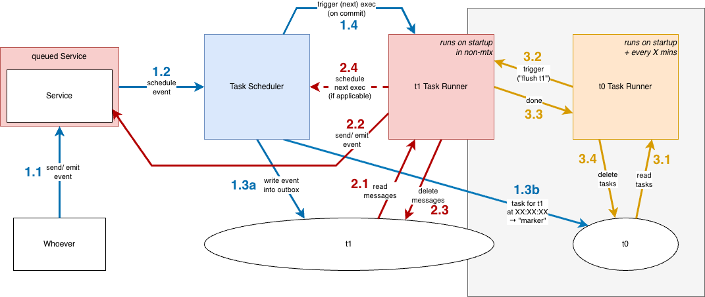

## Overview

## Approach

The approach features three independent flows/loops that work as follows:

### 1. Scheduling

_Anybody_ sends/emits a request/event (hereafter simply _event_) to a service (1.1).
Because this service is _queued_, the event is intercepted and _scheduled_ for execution.
Via the additional API `srv.schedule()`, it is possible to supply `task`, `after`, and `every` arguments to make the task a _named task_ (see below) and to add delays and/or recurrence.

The _scheduling_ described above is done by passing the event to the _task scheduler_ (1.2).
The task scheduler has three responsibilities:
1. Write the _message_ (following the outbox convention) to the tenant database (_t1_), in the same transaction if applicable, for atomicity (1.3a)
2. Write a _marker_ (see below) to the mtx database (_t0_) that captures that there is "something to do" for tenant _t1_ (1.3b)
3. Register an _on-commit_ listener that triggers execution of the scheduled task (1.4)

Note: The task scheduler only `UPSERT`s messages and markers.

### 2. Processing

The _tenant task runner_ reads a configurable _chunk_ of messages from the database (2.1) and emits the respective event to the respective (_unqueued_) service (2.2).

Each event is processed _individually_ and _in parallel_, each in its own transaction.
This must be taken into account when configuring the (default) chunk size.

Events are also executed _exactly once_.
Two mechanisms ensure this:
1. _Application-level locking_: _Processable messages_ (see below) are `SELECT`ed `FOR UPDATE` and marked as _processing_.
    - Alternatively, processable messages are `SELECT`ed `FOR UPDATE` and the lock is held for the entire duration (`legacyLocking: true`).
      For migration reasons, this is still the default in cds^9, but the default will change in cds^10.
2. Messages are deleted within the same transaction in which they are processed.
    - This is not possible with the legacy locking approach, because the reading transaction holds the lock on the message throughout.

After successful processing, the message is deleted from the database (2.3).
For recurring tasks, the next execution is then scheduled via the task scheduler (2.4).

After failed processing, the message's next attempt is scheduled via the task scheduler (2.4).
That is, the message is updated by incrementing `attempts`, setting `lastError` and `lastAttemptTimestamp`, and clearing `status`.
Scheduling the next attempt via the task scheduler is important to ensure that a respective marker is `UPSERT`ed.

Notes:
- The task processor only `READ`s and `DELETE`s messages.
- In non-mtx scenarios, the task runner starts on app startup.

### 3. Startup and Recovery

The _mtx task runner_ reads a configurable _chunk_ of markers from the database (3.1) and emits the respective _flush_ event to the respective _tenant task runner_ (3.2).
A flush event resolves when all _processable messages_ have been processed (3.3).
Afterwards, all _previous markers_ (see Marker Deduplication) are deleted (3.4).

Notes:
- It does not matter whether messages were processed successfully or not, because the next attempt is scheduled via the task scheduler, which writes a new marker.
- The mtx task runner runs on startup (only markers for "hot tenants" exist at that point) and every X minutes thereafter.
- In the future, mtx will also use the runtime's event queues implementation, so `t0` may contain markers as well as messages.

## Markers

_Markers_ contain no business data — only information about which queue of which tenant needs to be flushed at what point in time.

### (Tenant-specific) Offset

Because markers serve as a recovery/backup mechanism, their _timestamp_ differs from the _timestamp_ of the queued event.
Instead, a configurable _offset_ is added.

To reduce the number of markers, they are placed on a configurable _grid_: the timestamp is determined by adding the offset to the original timestamp and then _ceiling_ the result to the next grid point.

However, this can cause bursts of activity because task processing for multiple tenants becomes synchronized.
To avoid this, an additional _tenant-specific offset_ is added to the ceiled timestamp.
Because this offset requires no coordination, the tenant identifier (`zone id`/`app_tid`) is used as the seed of a random number generator; its first output, multiplied by the grid interval, becomes the tenant-specific offset.

### Deduplication

During marker selection for processing, there may be multiple "flush t1" markers with different timestamps.
However, a flush always includes all processable messages, so only a single flush is needed.
Therefore, a `SELECT DISTINCT` is used to skip logical duplicates, and after the flush, all markers with a timestamp ≤ the selected marker's timestamp are deleted.

## Named Tasks

_Named tasks_ (or _singleton tasks_) are scheduled events that:
1. Must exist only once
2. Have a non-null `task` property that allows them to be identified and addressed

### Concurrency Issue

There is a concurrency issue when scheduling named tasks.
Database transactions are _read-committed_ by default (on HANA and Postgres), meaning they only see committed data.
If two parallel transactions (which is common during bootstrapping) both try to schedule the same named task _for the first time_, they will not detect a conflict when `UPSERT`ing that task.

Preventing all but the first commit would require a deferred check.
Because of the `appid` column for shared HDI containers, this would need to be a `UNIQUE INDEX` (which supports a `WHERE` clause).
Such a unique index cannot currently be created via cds.

The alternatives are:
1. Acquire a table lock (which would require executing database-specific plain SQL, at least in Node.js), or
2. Rely on the primary key constraint of the outbox table by hashing `task` + `appid` into a deterministic `UUID` (or `String(36)`)

## Messages

### Processable Messages

A message is _processable_ if:
1. Message timestamp + retry offset (= attempts × some exponential factor) < current time
2. Attempts < max attempts
3. Status ≠ `processing` OR the processing status has timed out

### Schema Enhancements

To efficiently manage markers (see Marker Deduplication), some fields currently encoded in `msg` — namely `tenant`, `queue`, and `event` — should be promoted to the top level (cf. https://github.tools.sap/cap/cds/pull/6170).

### Migration Issue

As with the introduction of application-level locking in cds^9, there is also a migration issue with the schema enhancement.
Old task runners may select messages written by new task schedulers, in which `tenant`, `queue`, and `event` are no longer encoded in `msg`.
(Because such old task runners are always _tenant task runners_, `tenant` is not relevant here.)
As a mitigation, `queue` and `event` must continue to be encoded in `msg` until cds^11.

## TODOs

1. The chunk size should be dynamic, based on the number of available connections.
2. The `t0` pool min should be 1 to make `UPSERT`ing a marker faster.
3. Should the message schema include a version property to avoid migration issues in the future (i.e., older runners selecting messages written by newer schedulers)?
4. Scheduled task runner runs (step 1.4) should probably be combined at some granularity.
5. Should the task runner also run every X minutes in non-mtx scenarios?
