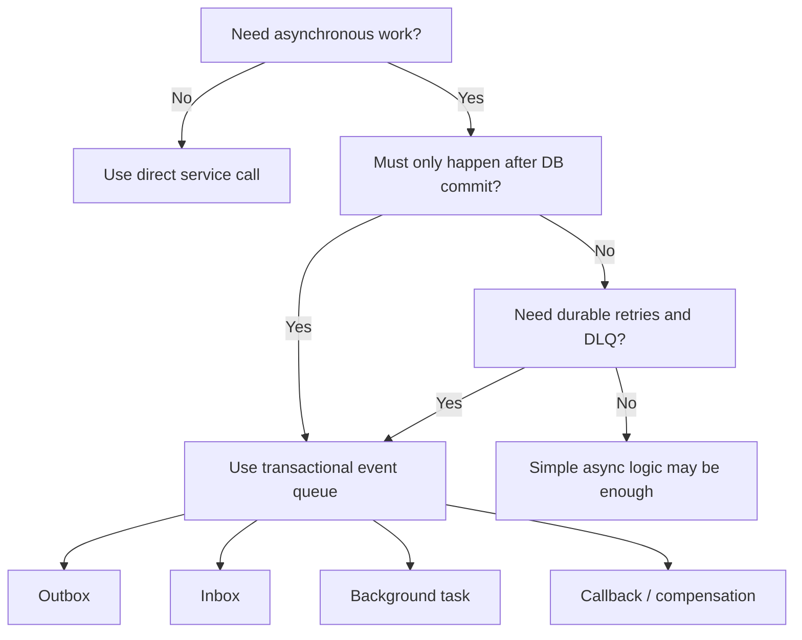
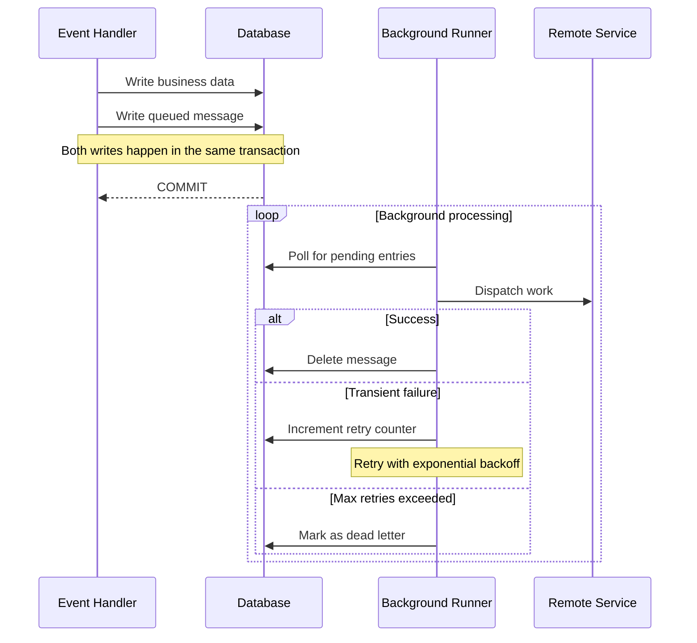
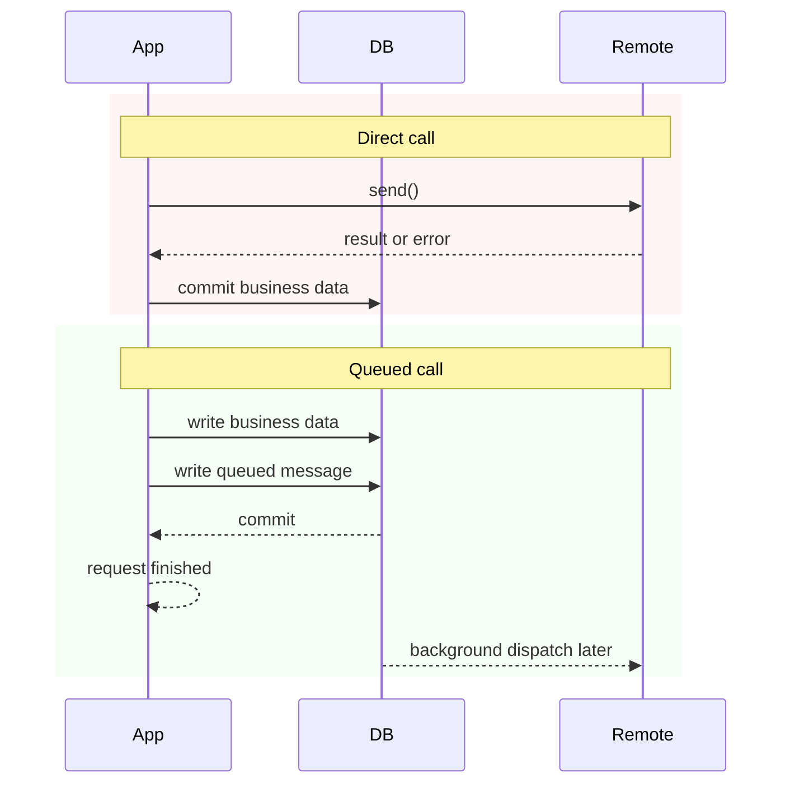
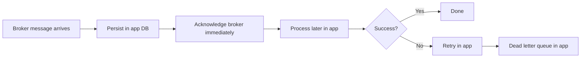
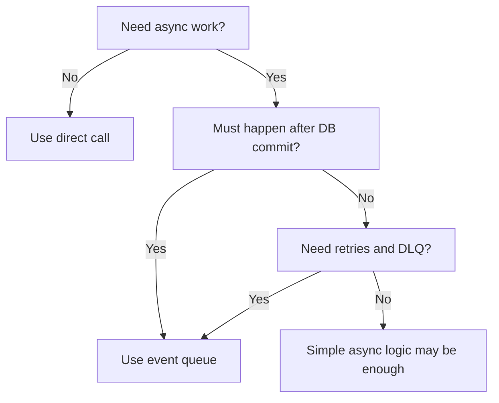
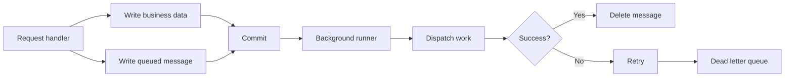
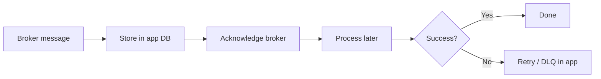

# Transactional Event Queues

Queue remote calls, inbound messages, and background tasks in the same transaction as your business data. CAP executes them later with retries, ordering, and dead letter handling.
{.subtitle}

{{ $frontmatter.synopsis }}
{.abstract}

> [!tip] Guiding Principles
>
> 1. **Transactional** — queued work is written in the same transaction as your business data
> 2. **Asynchronous** — a background runner dispatches it after commit, not during the request
> 3. **Resilient** — failed work is retried with exponential backoff; unrecoverable entries land in a dead letter queue
> 4. **Unified** — one mechanism covers outbox, inbox, background tasks, and callbacks

[[toc]]

## Before You Continue

This guide assumes familiarity with CAP services, transactions, and remote service connections.
For broker-based scenarios such as SAP Event Mesh or Kafka, basic messaging concepts are also helpful.

## Motivation

Distributed side effects are hard to get right.
Your application may commit local data, but a follow-up remote call can still fail because of network errors, service outages, or a process crash.

_Transactional Event Queues_ solve this by storing the follow-up work in the database as part of the same transaction as your business data.
After commit, a background runner executes that work asynchronously and retries failures until they succeed or become dead letters.

This pattern is often known as the _Transactional Outbox_, but CAP's event queues go beyond outbound messages.
They provide one mechanism for four use cases:

- **Outbox** — defer outbound calls to remote services until the transaction succeeds.
- **Inbox** — acknowledge inbound messages immediately and process them asynchronously.
- **Background Tasks** — schedule periodic or delayed tasks such as data replication.
- **Callbacks** — react to completed or failed tasks, enabling SAGA-like compensation patterns.

Transactional Event Queues are not just a broker integration feature.
They are CAP’s general mechanism for persisting asynchronous work in the database, whether that work is an outbound message, an inbound message to be processed later, or a background task scheduled by your application.

## When to Use Them

Use event queues when work must happen _after_ the current transaction commits, or when that work needs durable retries and dead letter handling.
If you need an immediate response from a remote system, use a normal synchronous service call instead.

| If you need to... | Use event queues? | Why |
|---|---|---|
| Call a remote service only after DB commit | Yes | Prevents external side effects for rolled-back transactions |
| Process inbound broker messages without blocking acknowledgment | Yes | Lets the app acknowledge early and process later |
| Schedule delayed or recurring background work | Yes | Uses the same persistence and retry mechanism |
| Need an immediate synchronous response from a remote call | No | Queued requests execute later and discard the direct return value |
| Run purely local logic inside the same request | Usually no | Direct execution is simpler when no asynchronous boundary is needed |



## Quick Start

Use a queued service when a side effect must only happen after the current transaction commits.

```js
const flights = await cds.connect.to('FlightService')
const queuedFlights = cds.queued(flights)

this.after('CREATE', 'Travels', async travel => {
  await queuedFlights.send('bookFlight', { travelId: travel.ID })
})
```

This stores the flight booking request in the database together with the travel creation.
CAP dispatches it later in the background.
If the transaction rolls back, no booking request is sent.

## How It Works { #concept }

The core principle is straightforward:

1. Instead of executing side effects directly, you write a message into a database table — **within the current transaction**.
2. Once the transaction commits, a background runner reads pending messages and dispatches them to the respective service.
3. If processing succeeds, the message is deleted.
4. If processing fails, the system retries with exponentially increasing delays.
5. After a configurable maximum number of attempts, the message is moved to the dead letter queue for manual intervention.



Because the queued message and your business data share the same database transaction, you get two core guarantees:

- **No phantom events** — if the transaction rolls back, no message is sent.
- **No lost events** — if the transaction commits, the queued work is persisted and processed eventually.

There is at most one active processor per service and tenant at a given time.
That is important for understanding ordering and duplicate prevention.

## Direct vs Queued Calls

A queued call changes _when_ work happens and _what the caller can expect back_.
That difference is easier to understand when seen side by side.



> [!warning] Queued calls are asynchronous
> A queued service persists the request and returns after the message is stored, not after the remote operation finishes.
> Any return value from `send()` or `run()` is therefore not available to the caller.

## End-to-End Example

The following example ties together queueing, callbacks, and local state updates.
It shows a common pattern: create local business data first, then trigger remote work asynchronously.

```js
const cds = require('@sap/cds')

module.exports = class TravelService extends cds.ApplicationService {
  async init() {
    const flights = await cds.connect.to('FlightService')
    const queuedFlights = cds.queued(flights)

    this.after('CREATE', 'Travels', async travel => {
      await queuedFlights.send('bookFlight', {
        travelId: travel.ID,
        customerId: travel.customer_ID
      })
    })

    flights.after('bookFlight/#succeeded', async (_, req) => {
      await UPDATE('Travels')
        .set({ status: 'Booked' })
        .where({ ID: req.data.travelId })
    })

    flights.after('bookFlight/#failed', async (err, req) => {
      await UPDATE('Travels')
        .set({ status: 'BookingFailed' })
        .where({ ID: req.data.travelId })
      req.warn(`Flight booking permanently failed: ${err.message}`)
    })

    await super.init()
  }
}
```

This example highlights an important design rule:
use callbacks or persisted status updates for outcomes, not direct return values.

## Use Cases

### Outbox { #outbox }

The outbox defers outbound calls to remote services until the main transaction succeeds.
This prevents sending requests to external systems when your transaction might still roll back.

**Example:** When creating a travel booking, you also need to notify an external flight service.
Without the outbox, the notification could be sent even if the booking transaction fails.

::: code-group
```js [Node.js]
const xflights = await cds.connect.to('xflights')
const qd_xflights = cds.queued(xflights)

this.after('CREATE', 'Travels', async (travel) => {
  // Persisted within the current transaction, sent after commit
  await qd_xflights.send('bookFlight', { travelId: travel.ID })
})
```
```java [Java]
@Autowired @Qualifier("MyCustomOutbox")
OutboxService outbox;

@Autowired @Qualifier(CqnService.DEFAULT_NAME)
CqnService remoteFlights;

@After(event = CqnService.EVENT_CREATE, entity = Travels_.CDS_NAME)
void notifyFlights(List<Travels> travels) {
  AsyncCqnService outboxedFlights = AsyncCqnService.of(remoteFlights, outbox);
  travels.forEach(t -> outboxedFlights.emit("bookFlight", Map.of("travelId", t.getId())));
}
```
:::

```js
// Anti-pattern: remote side effect happens before local commit is safe
this.after('CREATE', 'Travels', async travel => {
  await flights.send('bookFlight', { travelId: travel.ID })
})
```

If the surrounding transaction later fails, the external booking may already exist although the local travel record was rolled back.

Some services are outboxed automatically, including `cds.MessagingService` and `cds.AuditLogService`.
You don't need to call `cds.queued()` or configure anything extra for these — they use the persistent queue by default.

[Learn more about auto-outboxed services in Node.js.](../../node.js/queue#per-configuration){.learn-more}
[Learn more about the outbox in Java.](../../java/outbox){.learn-more}

### Inbox { #inbox }

The inbox mirrors the outbox pattern for inbound messages.
When a message arrives from a broker like SAP Event Mesh or Apache Kafka, the messaging service immediately persists it to the database, acknowledges it to the broker, and schedules its processing.

This brings two advantages:

- **Quick acknowledgment** — the message broker does not have to wait for your processing to complete. This reduces backpressure and prevents consumer group rebalancing under load.
- **Flatten the curve** — if a burst of messages arrives, they are queued in your database and processed at a controlled pace.



> [!note] Especially useful when brokers don't support redelivery
> Some message brokers, for example SAP Event Mesh, do not allow retriggering delivery or correcting message payloads.
> With the inbox, failures are handled inside your app via the [dead letter queue](#dead-letter-queue), where you have full control over retry and correction.

Enable the inbox in your configuration:

::: code-group
```json [Node.js — package.json]
{
  "cds": {
    "requires": {
      "messaging": {
        "inboxed": true
      }
    }
  }
}
```
```yaml [Java — application.yaml]
cds:
  messaging:
    services:
      - name: messaging-name
        inbox:
          enabled: true
```
:::

::: warning Inboxing changes who owns failure handling
With inboxing enabled, the broker considers the message delivered as soon as your app stores it.
If later processing fails, recovery no longer happens in the broker; it happens in your application's retry and dead letter queue flow.
:::

### Background Tasks { #background-tasks }

Event queues are not limited to messaging.
You can schedule arbitrary background tasks such as data replication, cache refresh, or garbage collection.

**Example:** Replicate data from a remote service every 10 minutes.

::: code-group
```js [Node.js]
const srv = await cds.connect.to('RemoteService')
await srv.schedule('replicate', { entity: 'Products' }).every('10 minutes')
```
:::

> [!note] Node.js only
> The `srv.schedule()` API is currently available in Node.js only.
> In Java, use a `@Scheduled` annotation in combination with a queued outbox service to achieve equivalent behavior.

The `schedule()` method is a convenience shortcut that internally queues the call using `cds.queued(srv)` and adds timing options:

```js
// Execute once, as soon as possible
await srv.schedule('cleanup', { olderThan: '30d' })

// Execute once, after a delay
await srv.schedule('cleanup', { olderThan: '30d' }).after('1h')

// Execute repeatedly
await srv.schedule('replicate', { entity: 'Products' }).every('10 minutes')
```

::: tip Real-world example: data federation
The [data federation guide](../integration/data-federation) uses `srv.schedule().every()` to implement polling-based replication, fetching incremental updates from remote services on a regular interval.
:::

### Callbacks (SAGA Patterns) { #callbacks }

In distributed transactions, you often need to react when an asynchronous step completes or fails.
Event queues support this with `#succeeded` and `#failed` callback events, enabling compensation logic similar to SAGA patterns.

**Example:** After successfully creating a flight booking via the outbox, replicate the full business object from the remote system.
If the booking fails, notify the user or trigger compensation logic.

::: code-group
```js [Node.js]
const flights = await cds.connect.to('FlightService')

// Called when the queued booking succeeds
flights.after('bookFlight/#succeeded', async (result, req) => {
  console.log('Flight booked successfully:', result)
  // Replicate booking details from remote
})

// Called when the queued booking fails after max retries
flights.after('bookFlight/#failed', async (error, req) => {
  console.log('Flight booking failed:', error)
  // Trigger compensation logic
})
```
:::

::: tip Register on specific events
Callback handlers must be registered for the specific `#succeeded` or `#failed` events.
The `*` wildcard handler is not called for these events.
:::

## How to Use { #how-to-use }

### Queueing a Service { #cds-queued }

Use `cds.queued(srv)` in Node.js to obtain a queued proxy of any non-database service.
All subsequent dispatches on this proxy are persisted to the event queue and processed asynchronously.

::: code-group
```js [Node.js]
const srv = await cds.connect.to('RemoteService')
const qsrv = cds.queued(srv)

// All operations are now queued
await qsrv.emit('someEvent', { key: 'value' })    // fire-and-forget
await qsrv.send('someRequest', { key: 'value' })  // request (result discarded)
await qsrv.run(SELECT.from('Products'))           // query (result discarded)
```
:::

::: tip `await` is still needed
Even though processing is asynchronous, you still need to `await` because the message is written to the database within the current transaction.
:::

In Java, use `AsyncCqnService.of(srv, outbox)` to wrap any CAP service with an outbox:

::: code-group
```java [Java]
OutboxService outbox = runtime.getServiceCatalog()
    .getService(OutboxService.class, "MyCustomOutbox");
CqnService remote = runtime.getServiceCatalog()
    .getService(CqnService.class, "RemoteService");

// Wrap with outbox handling
AsyncCqnService queued = AsyncCqnService.of(remote, outbox);
queued.emit("someEvent", Map.of("key", "value"));
```
:::

### Queueing by Configuration { #by-configuration }

You can queue any service through configuration without changing code.
That is useful when you want to switch a remote integration to durable asynchronous processing centrally.

::: code-group
```json [Node.js — package.json]
{
  "cds": {
    "requires": {
      "RemoteService": {
        "kind": "odata",
        "outboxed": true
      }
    }
  }
}
```
```yaml [Java — application.yaml]
cds:
  outbox:
    services:
      MyCustomOutbox:
        maxAttempts: 10
```
:::

### Auto-Outboxed Services { #auto-outboxed }

The following services are outboxed by default — you don't need any additional configuration:

| Service | Description |
|---------|-------------|
| `cds.MessagingService` | All messaging services such as Event Mesh and Kafka |
| `cds.AuditLogService` | Audit log events |

This ensures that messaging and audit log events are sent reliably and never lost because of transaction rollbacks.

[Learn more about auto-outboxed services in Node.js.](../../node.js/queue#per-configuration){.learn-more}
[Learn more about the outbox in Java.](../../java/outbox#persistent){.learn-more}

### Service API { #service-api }

When working with event queues, you interact with the standard CAP service APIs:

| API | Description |
|-----|-------------|
| `srv.emit(event, data)` | Emit a fire-and-forget event message |
| `srv.send(event, data)` | Send a request; for queued services the direct return value is discarded |
| `srv.run(query)` | Run a CQL query; for queued services the direct return value is discarded |
| `srv.schedule(event, data)` | Schedule a task with optional timing — Node.js only |

The `schedule()` method supports a fluent API:

```js
await srv.schedule('task', data)               // execute asap
await srv.schedule('task', data).after('1h')   // execute after one hour
await srv.schedule('task', data).every('1h')   // repeat every hour
```

### Unqueueing a Service

If a service is queued by configuration, you can get back the original synchronous service:

::: code-group
```js [Node.js]
const srv = cds.unqueued(qsrv)
```
```java [Java]
CqnService original = outbox.unboxed(outboxedService);
```
:::

## Guarantees

### Transactional Persistence { #no-phantom-events }

Because the queued message is written in the same database transaction as your business data, a rollback also removes the queued message.
No event is ever dispatched for a transaction that did not commit.

### Eventual Processing { #exactly-once }

The persistent queue guarantees transactional persistence and eventual processing.
For database-backed processing, CAP avoids duplicate execution under normal operation, but handlers should still be idempotent to tolerate rare crash windows or external side effects.

Database changes made during queued processing are committed only if the event is processed successfully.

### Ordering { #guaranteed-order }

In Node.js, messages are processed in the order they were submitted, per service and tenant.

In Java, the `DefaultOutboxOrdered` outbox processes entries in submission order.
The `DefaultOutboxUnordered` outbox may process entries in parallel across application instances.

::: code-group
```yaml [Java — Configuring Order]
cds:
  outbox:
    services:
      DefaultOutboxOrdered:
        ordered: true   # default
      DefaultOutboxUnordered:
        ordered: false  # default
```
:::

## Operational Behavior

### Error Handling { #errors }

When processing fails, the system retries the message with exponentially increasing delays.
After a configurable maximum number of attempts, the message is moved to the dead letter queue.

Some errors are identified as _unrecoverable_ — for example, when a topic is forbidden in SAP Event Mesh.
These messages are immediately moved to the dead letter queue without further retries.

To mark your own errors as unrecoverable in Node.js:

```js
const error = new Error('Invalid payload')
error.unrecoverable = true
throw error
```

In Java, suppress retries by catching the error and calling `context.setCompleted()`:

```java
@On(service = "<OutboxServiceName>", event = "myEvent")
void process(OutboxMessageEventContext context) {
  try {
    // processing logic
  } catch (Exception e) {
    if (isSemanticError(e)) {
      context.setCompleted(); // remove from queue, no retry
    } else {
      throw e; // retry
    }
  }
}
```

## Dead Letter Queue { #dead-letter-queue }

Messages that exceed the maximum retry count remain in the `cds.outbox.Messages` database table with their error information intact.
These entries form the _dead letter queue_ and require manual intervention — either to fix the underlying issue and retry, or to discard the message.

For troubleshooting, inspect `cds.outbox.Messages` and pay special attention to `status`, `attempts`, `lastError`, and `lastAttemptTimestamp`.

### The Data Model

Your database model is automatically extended with the following entity:

```cds
namespace cds.outbox;

entity Messages {
  key ID                  : UUID;
      timestamp           : Timestamp;
      target              : String;
      msg                 : LargeString;
      attempts            : Integer default 0;
      partition           : Integer default 0;
      lastError           : LargeString;
      lastAttemptTimestamp: Timestamp @cds.on.update: $now;
      status              : String(23);
}
```

### Managing Dead Letters

You can expose a CDS service to manage the dead letter queue with actions to revive or delete entries.

#### 1. Define the Service

::: code-group
```cds [srv/outbox-dead-letter-queue-service.cds]
using from '@sap/cds/srv/outbox';

@requires: 'internal-user'
service OutboxDeadLetterQueueService {

  @readonly
  entity DeadOutboxMessages as projection on cds.outbox.Messages
    actions {
      action revive();
      action delete();
    };

}
```
:::

::: warning Restrict access
The dead letter queue contains sensitive data.
Ensure the service is accessible only to internal users.
:::

#### 2. Filter for Dead Entries

As `maxAttempts` is configurable, its value cannot be added as a static filter to the projection, but must be applied programmatically.

::: code-group
```js [Node.js — srv/outbox-dead-letter-queue-service.js]
const cds = require('@sap/cds')

module.exports = class OutboxDeadLetterQueueService extends cds.ApplicationService {
  async init() {
    this.before('READ', 'DeadOutboxMessages', function (req) {
      const { maxAttempts } = cds.env.requires.outbox
      req.query.where('attempts >= ', maxAttempts)
    })
    await super.init()
  }
}
```
```java [Java — DeadOutboxMessagesHandler.java]
@Component
@ServiceName(OutboxDeadLetterQueueService_.CDS_NAME)
public class DeadOutboxMessagesHandler implements EventHandler {

  private final PersistenceService db;

  public DeadOutboxMessagesHandler(
      @Qualifier(PersistenceService.DEFAULT_NAME) PersistenceService db) {
    this.db = db;
  }

  @Before(entity = DeadOutboxMessages_.CDS_NAME)
  public void addDeadEntryFilter(CdsReadEventContext context) {
    Optional<Predicate> outboxFilters = createOutboxFilters(context.getCdsRuntime());
    outboxFilters.ifPresent(filter -> {
      CqnSelect modified = copy(context.getCqn(), new Modifier() {
        @Override
        public CqnPredicate where(Predicate where) {
          return filter.and(where);
        }
      });
      context.setCqn(modified);
    });
  }
}
```
:::

#### 3. Implement Bound Actions

Entries in the dead letter queue can be _revived_ by resetting the retry counter to zero, or _deleted_ permanently.

::: code-group
```js [Node.js — srv/outbox-dead-letter-queue-service.js]
this.on('revive', 'DeadOutboxMessages', async function (req) {
  await UPDATE(req.subject).set({ attempts: 0 })
})

this.on('delete', 'DeadOutboxMessages', async function (req) {
  await DELETE.from(req.subject)
})
```
```java [Java]
@On
public void reviveOutboxMessage(DeadOutboxMessagesReviveContext context) {
  CqnAnalyzer analyzer = CqnAnalyzer.create(context.getModel());
  Map<String, Object> key = analyzer.analyze(context.getCqn()).rootKeys();
  Messages msg = Messages.create((String) key.get(Messages.ID));
  msg.setAttempts(0);
  db.run(Update.entity(Messages_.class).entry(key).data(msg));
  context.setCompleted();
}

@On
public void deleteOutboxEntry(DeadOutboxMessagesDeleteContext context) {
  CqnAnalyzer analyzer = CqnAnalyzer.create(context.getModel());
  Map<String, Object> key = analyzer.analyze(context.getCqn()).rootKeys();
  db.run(Delete.from(Messages_.class).byId(key.get(Messages.ID)));
  context.setCompleted();
}
```
:::

[Learn more about the dead letter queue in Node.js.](../../node.js/queue#managing-the-dead-letter-queue){.learn-more}
[Learn more about the dead letter queue in Java.](../../java/outbox#outbox-dead-letter-queue){.learn-more}

## Deferred Principal Propagation { #principal-propagation }

When an event is processed asynchronously, the original HTTP request context is no longer available.
CAP handles this as follows:

- The **user ID** is stored with the queued message and re-created when the message is processed.
- **User roles and attributes** are _not_ stored. Asynchronous processing always runs in privileged mode.

This means queued handlers must not rely on request-time role checks.
If you need authorization in queued processing, encode the required information in the event payload itself or derive it from persisted business data.

## Configuration

### Persistent Queue (Default) { #persistent-queue }

The persistent queue is enabled by default.
Messages are stored in a database table within the current transaction.

::: code-group
```json [Node.js — package.json]
{
  "cds": {
    "requires": {
      "queue": {
        "kind": "persistent-queue",
        "maxAttempts": 20,
        "storeLastError": true,
        "timeout": "1h"
      }
    }
  }
}
```
```yaml [Java — application.yaml]
cds:
  outbox:
    services:
      DefaultOutboxOrdered:
        maxAttempts: 10
        ordered: true
      DefaultOutboxUnordered:
        maxAttempts: 10
        ordered: false
```
:::

Configuration options for Node.js:

| Option | Default | Description |
|--------|---------|-------------|
| `maxAttempts` | `20` | Maximum retries before moving to dead letter queue |
| `storeLastError` | `true` | Store error information of the last failed attempt |
| `timeout` | `"1h"` | Time after which a `processing` message is considered abandoned and can be reprocessed |

Configuration options for Java:

| Option | Default | Description |
|--------|---------|-------------|
| `maxAttempts` | `10` | Maximum retries before the entry is considered dead |
| `ordered` | `true` | Process entries in submission order |

### In-Memory Queue

For development and testing, you can use the in-memory queue.
Messages are held in memory and emitted after the transaction commits.

::: code-group
```json [Node.js — package.json]
{
  "cds": {
    "requires": {
      "queue": {
        "kind": "in-memory-queue"
      }
    }
  }
}
```
:::

::: warning No retry mechanism
With the in-memory queue, messages are lost if processing fails.
There is no retry mechanism and no dead letter queue.
:::

### Disabling the Queue

You can disable event queues globally:

```json
{
  "cds": {
    "requires": {
      "queue": false
    }
  }
}
```

Or disable queueing for a specific service:

```json
{
  "cds": {
    "requires": {
      "messaging": {
        "outboxed": false
      }
    }
  }
}
```

## Manual Processing { #flush }

After an application restart or crash, pending events in the database are not automatically picked up until a new outbox write occurs for the same service and tenant.
You can trigger reprocessing manually using the `flush()` method, for example from a startup hook or admin endpoint:

::: code-group
```js [Node.js]
const srv = await cds.connect.to('RemoteService')
await cds.queued(srv).flush()
```
:::

## Appendix: Simple Diagram Variants

### When to Use Event Queues



### Simpler Processing Flow



### Simpler Inbox Flow


