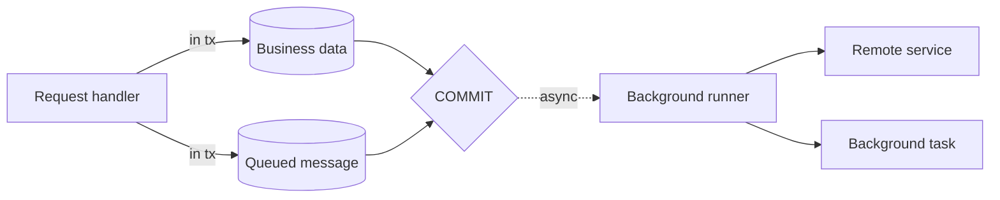
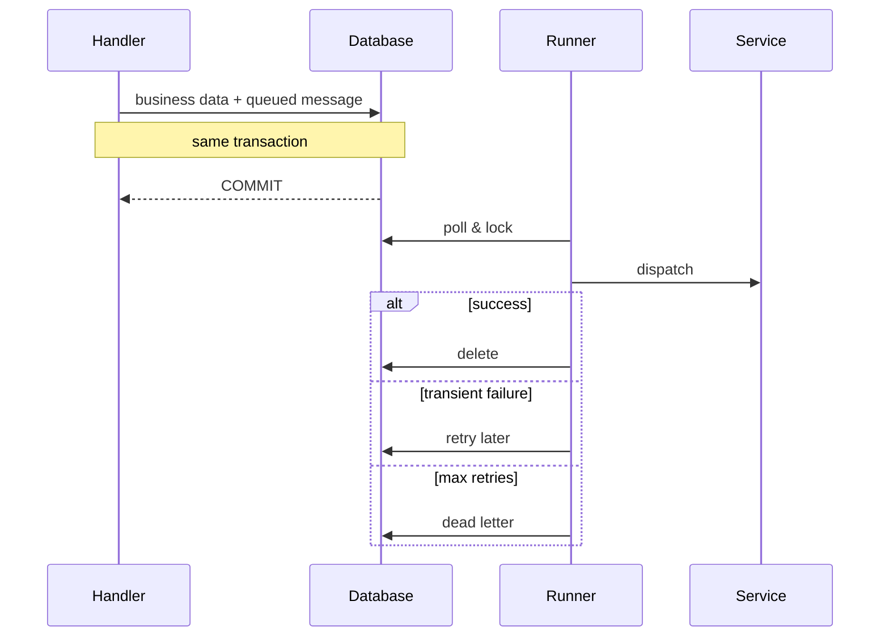

# Transactional Event Queues

{{ $frontmatter.synopsis }}
{.abstract}

> [!tip] Guiding Principles
>
> 1. **Transactional** — queued work is written in the same transaction as your business data.
> 2. **Asynchronous** — a background runner dispatches it after commit, not during the request.
> 3. **Resilient** — failed work is retried with exponential backoff; unrecoverable entries land in a dead letter queue.

[[toc]]


## Motivation

Distributed side effects are hard to get right.
An application may commit local data, but a follow-up remote call can still fail because of network errors, service outages, or a process crash.

_Transactional Event Queues_ solve this by storing the follow-up work in the database as part of the **same transaction** as your business data.
After commit, a background runner executes that work asynchronously and retries failures until they succeed or become dead letters.



This pattern is widely known as the _Transactional Outbox_, but CAP's event queues go beyond outbound messages. They cover four use cases:

- **Outbox** — defer outbound calls to remote services until the transaction succeeds.
- **Inbox** — acknowledge inbound messages immediately and process them asynchronously.
- **Background Tasks** — schedule periodic or delayed tasks such as data replication.
- **Callbacks** — react to completed or failed tasks, enabling SAGA-like compensation patterns.


## Quick Start

Use a queued service when a side effect must only happen after the current transaction commits.

```js
const xflights = await cds.connect.to('xflights')
const qd_xflights = cds.queued(xflights)

this.after('CREATE', 'Travels', async (_, req) => {
  await qd_xflights.send('bookFlight', { travelId: req.data.ID })
})
```

This stores the flight booking request in the database together with the travel creation.
CAP dispatches it later in the background. If the transaction rolls back, no booking request is sent.


## Use Cases

### Outbox

The outbox defers outbound calls to remote services until the main transaction succeeds.
This prevents sending requests to external systems when your transaction might still roll back.

**Example:** When creating a travel booking, you also want to notify an external flight service.
Without the outbox, the notification could be sent even if the booking transaction fails.

::: code-group
```js [Node.js]
const xflights = await cds.connect.to('xflights')
const qd_xflights = cds.queued(xflights)

this.after('CREATE', 'Travels', async (_, req) => {
  // Persisted within the current transaction, sent after commit
  await qd_xflights.send('bookFlight', { travelId: req.data.ID })
})
```
```java [Java]
@Autowired @Qualifier("XFlightsOutbox")
OutboxService outbox;

@Autowired @Qualifier(CqnService.DEFAULT_NAME)
CqnService xflights;

@After(event = CqnService.EVENT_CREATE, entity = Travels_.CDS_NAME)
void notifyXFlights(List<Travels> travels) {
  AsyncCqnService outboxedXFlights = AsyncCqnService.of(xflights, outbox);
  travels.forEach(t -> outboxedXFlights.emit("bookFlight", Map.of("travelId", t.getId())));
}
```
:::

```js
// Anti-pattern: remote side effect happens before local commit is safe
this.after('CREATE', 'Travels', async (_, req) => {
  await xflights.send('bookFlight', { travelId: req.data.ID })
})
```

If the surrounding transaction later fails, the external booking may already exist although the local travel record was rolled back.

[See the *XTravels* sample for a comparable scenario.](https://github.com/capire/xtravels){.learn-more}

Some services are outboxed automatically, including `cds.MessagingService` and `cds.AuditLogService`.
You don't need to call `cds.queued()` or configure anything extra for these — they use the persistent queue by default.

[Learn more about auto-outboxed services in Node.js.](../../node.js/queue#per-configuration){.learn-more}
[Learn more about the outbox in Java.](../../java/outbox){.learn-more}


### Inbox

The inbox mirrors the outbox pattern for inbound messages.
When a message arrives from a broker, the messaging service immediately persists it to the database, acknowledges it to the broker, and schedules its processing.

This brings two advantages:

- **Quick acknowledgment** — the broker doesn't have to wait for your processing to complete, which keeps consumer throughput high under load.
- **Flatten the curve** — if a burst of messages arrives, they are queued in your database and processed at a controlled pace.

> [!note] Especially useful when brokers don't support redelivery
> Some message brokers do not allow retriggering delivery or correcting message payloads.
> With the inbox, failures are handled inside your app via the [dead letter queue](#dead-letter-queue), where you have full control over retry and correction.

Enable the inbox in your configuration:

::: code-group
```json [Node.js — package.json]
{
  "cds": {
    "requires": {
      "messaging": {
        "inboxed": true
      }
    }
  }
}
```
```yaml [Java — application.yaml]
cds:
  messaging:
    services:
      - name: messaging-name
        inbox:
          enabled: true
```
:::

::: warning Inboxing changes who owns failure handling
With inboxing enabled, the broker considers the message delivered as soon as your app stores it.
If later processing fails, recovery no longer happens in the broker; it happens in your application's retry and dead letter queue flow.
:::


### Background Tasks

Event queues are not limited to messaging.
You can schedule arbitrary background tasks such as data replication, cache refresh, or garbage collection.

**Example:** Replicate airport master data from the xflights service every 10 minutes.

::: code-group
```js [Node.js]
const xflights = await cds.connect.to('xflights')
await xflights.schedule('replicate', { entity: 'Airports' }).every('10 minutes')
```
:::

> [!note] Node.js only
> The `srv.schedule()` API is currently available in Node.js only.
> In Java, use a `@Scheduled` annotation in combination with a queued outbox service to achieve equivalent behavior.

The `schedule()` method is a convenience shortcut for `cds.queued(srv).send(event, data)` with optional timing:

```js
// Execute once, as soon as possible
await xflights.schedule('cleanup', { olderThan: '30d' })

// Execute once, after a delay
await xflights.schedule('cleanup', { olderThan: '30d' }).after('1h')

// Execute repeatedly — supports time strings and cron expressions
await xflights.schedule('replicate', { entity: 'Airports' }).every('10 minutes')
await xflights.schedule('replicate', { entity: 'Airports' }).every('*/10 * * * *')
```

`.after()` accepts milliseconds (as a number) or a time string such as `'1s'`, `'10m'`, `'1h'`.
`.every()` accepts the same plus a five-field cron expression.

#### Singleton Tasks

Use `srv.schedule.task()` to schedule a *singleton task* — a task identified by name that exists only once:

```js
// Replace any existing 'replicate' task with a new schedule
await xflights.schedule.task('replicate', { entity: 'Airports' }).every('10 minutes')

// Remove the task
await xflights.unschedule.task('replicate')
```

The event name doubles as the task name. A subsequent call with the same name overwrites the previous schedule (tasks are upserted, not deduplicated). This is convenient for idempotent registration during application startup.

::: tip Real-world example: data federation
The [data federation guide](../integration/data-federation) uses `srv.schedule().every()` to implement polling-based replication, fetching incremental updates from remote services on a regular interval.
:::


### Callbacks (SAGA Patterns) <Beta />

In distributed transactions, you often need to react when an asynchronous step completes or fails.
Event queues support this with `#succeeded` and `#failed` callback events, enabling compensation logic similar to SAGA patterns.

**Example:** After successfully creating a flight booking via the outbox, replicate the full business object from the remote system.
If the booking fails, notify the user or trigger compensation logic.

::: code-group
```js [Node.js]
const xflights = await cds.connect.to('xflights')

// Called when the queued booking succeeds
xflights.after('bookFlight/#succeeded', async (result, req) => {
  console.log('Flight booked successfully:', result)
  // Replicate booking details from remote
})

// Called when the queued booking fails after max retries
xflights.after('bookFlight/#failed', async (error, req) => {
  console.log('Flight booking failed:', error)
  // Trigger compensation logic
})
```
:::

> [!note] Node.js only
> Callback events `#succeeded` and `#failed` are currently available in Node.js only.

::: tip Register on specific events
Callback handlers must be registered for the specific `#succeeded` or `#failed` events.
The `*` wildcard handler is not called for these events.
:::


## Guarantees

### Transactional Persistence

Because the queued message is written in the same database transaction as your business data, a rollback also removes the queued message.
No event is ever dispatched for a transaction that didn't commit.

### Eventual Processing

The persistent queue guarantees transactional persistence and eventual processing.
For database-backed processing, CAP avoids duplicate execution under normal operation, but handlers should still be idempotent to tolerate rare crash windows or external side effects.

Database changes made during queued processing are committed only if the event is processed successfully.


## End-to-End Example

The following example ties together queueing, callbacks, and local state updates.
It shows a common pattern: create local business data first, then trigger remote work asynchronously, then react to its outcome.

```js
const cds = require('@sap/cds')

module.exports = class TravelService extends cds.ApplicationService {
  async init() {
    const xflights = await cds.connect.to('xflights')
    const qd_xflights = cds.queued(xflights)

    this.after('CREATE', 'Travels', async (_, req) => {
      await qd_xflights.send('bookFlight', {
        travelId: req.data.ID,
        customerId: req.data.customer_ID
      })
    })

    xflights.after('bookFlight/#succeeded', async (_, req) => {
      await UPDATE('Travels')
        .set({ status: 'Booked' })
        .where({ ID: req.data.travelId })
    })

    xflights.after('bookFlight/#failed', async (err, req) => {
      await UPDATE('Travels')
        .set({ status: 'BookingFailed' })
        .where({ ID: req.data.travelId })
      req.warn(`Flight booking permanently failed: ${err.message}`)
    })

    await super.init()
  }
}
```

This example highlights an important design rule:
use callbacks or persisted status updates for outcomes, not direct return values.


## When to Use Event Queues

Use an event queue when work must happen *after* the current transaction commits, or when that work needs durable retries and a dead letter queue.
For an immediate, synchronous response from a remote system, use a normal service call.

### Direct vs Queued Calls

A queued call changes _when_ work happens and _what the caller can expect back_:

- A **direct** call returns the remote service's result (or error) and only then commits the local transaction.
- A **queued** call writes the message to the queue inside the local transaction and returns. The actual remote dispatch happens after commit, in the background.

> [!warning] Queued calls discard the direct return value
> A queued service persists the request and returns after the message is stored, not after the remote operation finishes.
> Any return value from `send()` or `run()` is therefore not available to the caller. To act on the outcome, register a [callback handler](#callbacks-saga-patterns) on `#succeeded` or `#failed`.


## How It Works

The core principle is straightforward:

1. Instead of executing side effects directly, you write a message into a database table — **within the current transaction**.
2. Once the transaction commits, a background runner reads pending messages and dispatches them to the respective service.
3. If processing succeeds, the message is deleted.
4. If processing fails, the system retries with exponentially increasing delays.
5. After a configurable maximum number of attempts, the message is moved to the dead letter queue for manual intervention.



Because the queued message and your business data share the same database transaction, you get two core guarantees:

- **No phantom events** — if the transaction rolls back, no message is sent.
- **No lost events** — if the transaction commits, the queued work is persisted and processed eventually.

### Single-Tenancy vs Multi-Tenancy

Event queues work in both single-tenant and multi-tenant deployments. In both cases, processing is triggered immediately after commit; markers are an optimization plus an extra layer of resilience.

[Learn more about multitenancy.](../multitenancy/){.learn-more}

#### Single-Tenancy

Messages are stored in a queue table that resides in the application database. A background runner starts when your application starts and processes messages continuously.

#### Multi-Tenancy

Each tenant has its own database. To avoid having a central runner periodically scan every tenant, the system writes a lightweight *marker* to a central (provider) database whenever messages are queued. On startup the central runner only triggers processing for tenants that actually have pending work, and rechecks periodically as a recovery layer in case a runner crashed before processing completed.

CAP spreads marker timestamps across tenants so that processing doesn't synchronize into bursts — you don't need to configure that.

::: details Architecture: scheduling, processing, recovery
Behind the scenes, event queues run three independent loops:

1. **Scheduling** — calling `srv.send()`, `srv.emit()`, or `srv.schedule()` on a queued service writes the message to the tenant's queue table within the current transaction. In multitenancy, a *marker* is also written to the provider database, recording that this tenant has pending work.
2. **Processing** — a tenant-local task runner reads a chunk of messages, dispatches each event in its own transaction, and deletes successful messages. Failed messages are rescheduled with exponentially increasing delay; after `maxAttempts` they become dead letters.
3. **Recovery** — a central runner periodically polls the provider markers and triggers processing for any tenant with pending work. This recovers from application restarts and tenants that became "cold" without losing messages.

*Markers* contain no business data — only the information that some queue of some tenant needs to be flushed at some point in time.
:::

### Locking and Migration

CAP uses **application-level locking** to coordinate processors across application instances. When a runner picks up a message, it sets the message's `status` to `processing`; other runners skip messages in that state. After processing, the row lock is released; the message is deleted (on success) or rescheduled (on failure) in the processing transaction.

::: warning Migrating across `@sap/cds` major versions
This guide describes the implementation in `@sap/cds` 10+. Older versions select messages differently:

- **`@sap/cds` 8** does **not** check the `status` column at all.
- **`@sap/cds` 9** checks `status` but holds a row-level lock for the duration of processing (`legacyLocking: true` is the default in cds 9).
- **`@sap/cds` 10** uses application-level locking via `status` and releases the row lock after selection.

A rolling upgrade from `@sap/cds` 8 directly to 10 can therefore lead to **double-processing of messages**, because cds 8 instances pick up messages that a cds 10 instance has already marked `processing`. Plan downtime, drain the queue before upgrading, or upgrade through cds 9 first.
:::

### The Data Model

The persistent queue stores its messages in this entity, automatically added to your database model:

::: details `cds.outbox.Messages`
```cds
namespace cds.outbox;

entity Messages {
  key ID                   : UUID;           // Unique message identifier
      timestamp            : Timestamp;      // When the message was queued
      target               : String;         // Target service/queue name
      msg                  : LargeString;    // Serialized event payload
      attempts             : Integer default 0;  // Number of processing attempts
      partition            : Integer default 0;
      lastError            : LargeString;    // Error from last failed attempt
      lastAttemptTimestamp : Timestamp;      // When last attempt occurred
      status               : String(23);     // Current processing status
      task                 : String(255);    // Task name for named/singleton tasks
      appid                : String(255);    // Application ID for shared HDI containers
}
```
:::


## How to Use

To get a side effect dispatched **after** your transaction commits — with the guarantees described above — you write to an event queue rather than calling the service directly. There are two ways to make a service write to an event queue: programmatically, by wrapping a service in `cds.queued()`, or declaratively, by enabling outboxing in configuration. Either way, the trigger from your code is the same — a normal `srv.send()` or `srv.schedule()` call.

### Programmatically

#### Triggering a Queued Event

Wrap a service in `cds.queued()` and dispatch normally. The call is persisted to the event queue inside your current transaction and processed asynchronously after commit.

::: code-group
```js [Node.js]
const xflights = await cds.connect.to('xflights')
const qd_xflights = cds.queued(xflights)

await qd_xflights.send('bookFlight', { travelId: 'T-42' })  // request (result discarded)
```
```java [Java]
OutboxService outbox = runtime.getServiceCatalog()
    .getService(OutboxService.class, "XFlightsOutbox");
CqnService xflights = runtime.getServiceCatalog()
    .getService(CqnService.class, "xflights");

AsyncCqnService queued = AsyncCqnService.of(xflights, outbox);
queued.emit("bookFlight", Map.of("travelId", "T-42"));
```
:::

::: tip `await` is still needed
Even though processing is asynchronous, you still need to `await` because the message is written to the database within the current transaction.
:::

To unwrap a queued service back to its synchronous original:

::: code-group
```js [Node.js]
const xflights = cds.unqueued(qd_xflights)
```
```java [Java]
CqnService xflights = outbox.unboxed(outboxedXFlights);
```
:::

##### Scheduling a Task

For delayed or recurring work, use the `schedule()` shortcut — equivalent to `cds.queued(srv).send(event, data)` plus optional timing. See [Background Tasks](#background-tasks).

| API | Description |
|-----|-------------|
| `srv.send(event, data)` | Trigger a queued event; for queued services the direct return value is discarded |
| `srv.schedule(event, data)` | Schedule a task with optional timing — Node.js only |
| `srv.schedule.task(event, data)` | Schedule a *singleton* task identified by name — Node.js only |
| `srv.unschedule.task(name)` | Remove a previously scheduled singleton task — Node.js only |

#### Acting on the Outcome

Because queued calls return after the *message is stored* — not after the remote operation completes — you can't use the return value of `send()` or `run()` to react to success or failure. Register a callback handler on `#succeeded` or `#failed` instead.

[Learn more about callbacks.](#callbacks-saga-patterns){.learn-more}

#### Manual Processing

In single-tenancy, the background runner starts on application startup and processes pending messages automatically. In multitenancy, the central runner periodically checks markers and triggers processing.

To trigger processing manually — for example, from a startup hook or admin endpoint:

::: code-group
```js [Node.js]
// Flush a specific queue
const xflights = await cds.connect.to('xflights')
await cds.flush(xflights.name)

// Flush all queues
await cds.flush()
```
:::

### By Configuration

#### Auto-Outboxed Services

The following services are outboxed by default — you don't need to wrap or configure them:

| Service | Description |
|---------|-------------|
| `cds.MessagingService` | All messaging services |
| `cds.AuditLogService` | Audit log events |

This ensures that messaging and audit log events are sent reliably and never lost because of transaction rollbacks.

[Learn more about auto-outboxed services in Node.js.](../../node.js/queue#per-configuration){.learn-more}
[Learn more about the outbox in Java.](../../java/outbox#persistent){.learn-more}

#### Outboxing a Remote Service

You can outbox any *outbound* service through configuration without changing code. That is useful when you want to switch a remote integration to durable asynchronous processing centrally — every call from your handlers is then queued automatically.

::: code-group
```json [Node.js — package.json]
{
  "cds": {
    "requires": {
      "xflights": {
        "kind": "odata",
        "outboxed": true
      }
    }
  }
}
```
```yaml [Java — application.yaml]
cds:
  outbox:
    services:
      XFlightsOutbox:
        maxAttempts: 10
```
:::

#### Configuring the Queue

The persistent queue is enabled by default. Messages are stored in a database table within the current transaction.

::: code-group
```json [Node.js — package.json]
{
  "cds": {
    "requires": {
      "scheduling": {},
      "queue": {
        "maxAttempts": 20,
        "chunkSize": 10
      }
    }
  }
}
```
```yaml [Java — application.yaml]
cds:
  outbox:
    services:
      DefaultOutboxOrdered:
        maxAttempts: 10
        ordered: true
      DefaultOutboxUnordered:
        maxAttempts: 10
        ordered: false
```
:::

::: details Queue and scheduling options for Node.js

`cds.requires.queue`:

| Option | Default | Description |
|--------|---------|-------------|
| `maxAttempts` | `20` | Maximum retries before a message becomes a dead letter |
| `chunkSize` | `10` | Number of messages to process per batch |
| `storeLastError` | `true` | Store error information of the last failed attempt |
| `timeout` | `"1h"` | Time after which a `processing` message is considered abandoned |

`cds.requires.scheduling` (multitenancy coordination):

| Option | Description |
|--------|-------------|
| `markerInterval` | Grid interval for markers; CAP picks a default that spreads tenant load across the interval |
| `flushInterval` | Cadence at which the central runner checks for tenants with pending work |

:::

::: details Configuration options for Java

| Option | Default | Description |
|--------|---------|-------------|
| `maxAttempts` | `10` | Maximum retries before the entry is considered dead |
| `ordered` | `true` | Process entries in submission order |

:::

#### Disabling the Queue

You can disable event queues globally:

```json
{
  "cds": {
    "requires": {
      "queue": false
    }
  }
}
```

Or disable queueing for a specific service:

```json
{
  "cds": {
    "requires": {
      "messaging": {
        "outboxed": false
      }
    }
  }
}
```


## Working with Event Queues

This section covers what you need to know to operate an event queue in production: how errors are retried, how to manage stuck messages, and how authorization carries over from the original request.

### Error Handling

When processing fails, the system retries the message with exponentially increasing delays.
After a configurable maximum number of attempts, the message is moved to the dead letter queue.

Some errors are identified as _unrecoverable_ — for example, when a topic is forbidden by the broker.
These messages are immediately moved to the dead letter queue without further retries.

::: details When is a message picked up next?
A pending message is *processable* when all three conditions hold:

1. Its scheduled timestamp plus the retry backoff (`attempts × <exponential factor>`) is in the past.
2. Its `attempts` count is less than `maxAttempts`.
3. Its `status` is not `processing`, or its `processing` status has timed out (`timeout`).

Messages that fail criterion 2 become dead letters. Messages that fail criterion 3 are skipped on this run and become eligible again once the lock times out (recovery from a crashed runner).
:::

To mark your own errors as unrecoverable in Node.js:

```js
const error = new Error('Invalid payload')
error.unrecoverable = true
throw error
```

In Java, suppress retries by catching the error and calling `context.setCompleted()`:

```java
@On(service = "<OutboxServiceName>", event = "myEvent")
void process(OutboxMessageEventContext context) {
  try {
    // processing logic
  } catch (Exception e) {
    if (isSemanticError(e)) {
      context.setCompleted(); // remove from queue, no retry
    } else {
      throw e; // retry
    }
  }
}
```

### Dead Letter Queue

Messages that exceed the maximum retry count remain in the `cds.outbox.Messages` database table with their error information intact.
These entries form the _dead letter queue_ and require manual intervention — either to fix the underlying issue and retry, or to discard the message.

For troubleshooting, inspect `cds.outbox.Messages` and pay special attention to `status`, `attempts`, `lastError`, and `lastAttemptTimestamp`.
See [*The Data Model*](#the-data-model) for the entity structure.

#### Managing Dead Letters

You can expose a CDS service to manage the dead letter queue with actions to revive or delete entries.

##### 1. Define the Service

::: code-group
```cds [srv/outbox-dead-letter-queue-service.cds]
using from '@sap/cds/srv/outbox';

@requires: 'internal-user'
service OutboxDeadLetterQueueService {

  @readonly
  entity DeadOutboxMessages as projection on cds.outbox.Messages
    actions {
      action revive();
      action delete();
    };

}
```
:::

::: warning Restrict access
The dead letter queue contains sensitive data.
Ensure the service is accessible only to internal users.
:::

##### 2. Filter for Dead Entries

As `maxAttempts` is configurable, its value cannot be added as a static filter to the projection, but must be applied programmatically.

::: code-group
```js [Node.js — srv/outbox-dead-letter-queue-service.js]
const cds = require('@sap/cds')

module.exports = class OutboxDeadLetterQueueService extends cds.ApplicationService {
  async init() {
    this.before('READ', 'DeadOutboxMessages', function (req) {
      const { maxAttempts } = cds.env.requires.outbox
      req.query.where('attempts >= ', maxAttempts)
    })
    await super.init()
  }
}
```
```java [Java — DeadOutboxMessagesHandler.java]
@Component
@ServiceName(OutboxDeadLetterQueueService_.CDS_NAME)
public class DeadOutboxMessagesHandler implements EventHandler {

  private final PersistenceService db;

  public DeadOutboxMessagesHandler(
      @Qualifier(PersistenceService.DEFAULT_NAME) PersistenceService db) {
    this.db = db;
  }

  @Before(entity = DeadOutboxMessages_.CDS_NAME)
  public void addDeadEntryFilter(CdsReadEventContext context) {
    Optional<Predicate> outboxFilters = createOutboxFilters(context.getCdsRuntime());
    outboxFilters.ifPresent(filter -> {
      CqnSelect modified = copy(context.getCqn(), new Modifier() {
        @Override
        public CqnPredicate where(Predicate where) {
          return filter.and(where);
        }
      });
      context.setCqn(modified);
    });
  }
}
```
:::

##### 3. Implement Bound Actions

Entries in the dead letter queue can be _revived_ by resetting the retry counter to zero, or _deleted_ permanently.

::: code-group
```js [Node.js — srv/outbox-dead-letter-queue-service.js]
this.on('revive', 'DeadOutboxMessages', async function (req) {
  await UPDATE(req.subject).set({ attempts: 0 })
})

this.on('delete', 'DeadOutboxMessages', async function (req) {
  await DELETE.from(req.subject)
})
```
```java [Java]
@On
public void reviveOutboxMessage(DeadOutboxMessagesReviveContext context) {
  CqnAnalyzer analyzer = CqnAnalyzer.create(context.getModel());
  Map<String, Object> key = analyzer.analyze(context.getCqn()).rootKeys();
  Messages msg = Messages.create((String) key.get(Messages.ID));
  msg.setAttempts(0);
  db.run(Update.entity(Messages_.class).entry(key).data(msg));
  context.setCompleted();
}

@On
public void deleteOutboxEntry(DeadOutboxMessagesDeleteContext context) {
  CqnAnalyzer analyzer = CqnAnalyzer.create(context.getModel());
  Map<String, Object> key = analyzer.analyze(context.getCqn()).rootKeys();
  db.run(Delete.from(Messages_.class).byId(key.get(Messages.ID)));
  context.setCompleted();
}
```
:::

[Learn more about the dead letter queue in Node.js.](../../node.js/queue#managing-the-dead-letter-queue){.learn-more}
[Learn more about the dead letter queue in Java.](../../java/outbox#outbox-dead-letter-queue){.learn-more}

### Deferred Principal Propagation

When an event is processed asynchronously, the original HTTP request context is no longer available.
CAP handles this as follows:

- The **user ID** is stored with the queued message and re-created when the message is processed.
- **User roles and attributes** are _not_ stored. Asynchronous processing always runs in privileged mode.

This means queued handlers must not rely on request-time role checks.
If you need authorization in queued processing, encode the required information in the event payload itself or derive it from persisted business data.


## Next Steps

For stack-specific APIs, configuration keys, and troubleshooting:

- [Event Queues in Node.js](../../node.js/queue) — `cds.queued`, `cds.unqueued`, `cds.flush`, `srv.schedule`, queue and scheduling configuration.
- [Transactional Outbox in Java](../../java/outbox) — `OutboxService`, `AsyncCqnService`, custom outboxes, observability via OpenTelemetry.

Most real-world event-queue use comes through messaging or remote services. From here you'll likely want to look at:

- [Messaging](messaging) — emitting and consuming events between CAP applications and via brokers; messaging services are auto-outboxed.
- [CAP-Level Service Integration](../integration/calesi) — consuming remote services as if they were local; outboxing them centrally with `outboxed: true`.
- [CAP-Level Data Federation](../integration/data-federation) — using `srv.schedule().every()` for polling-based replication from remote services.

