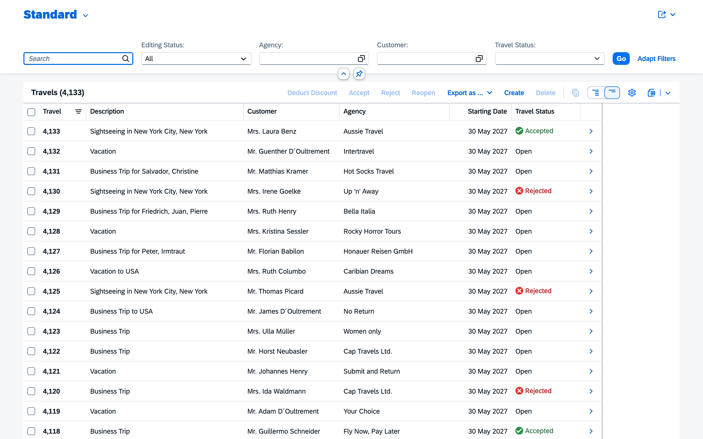
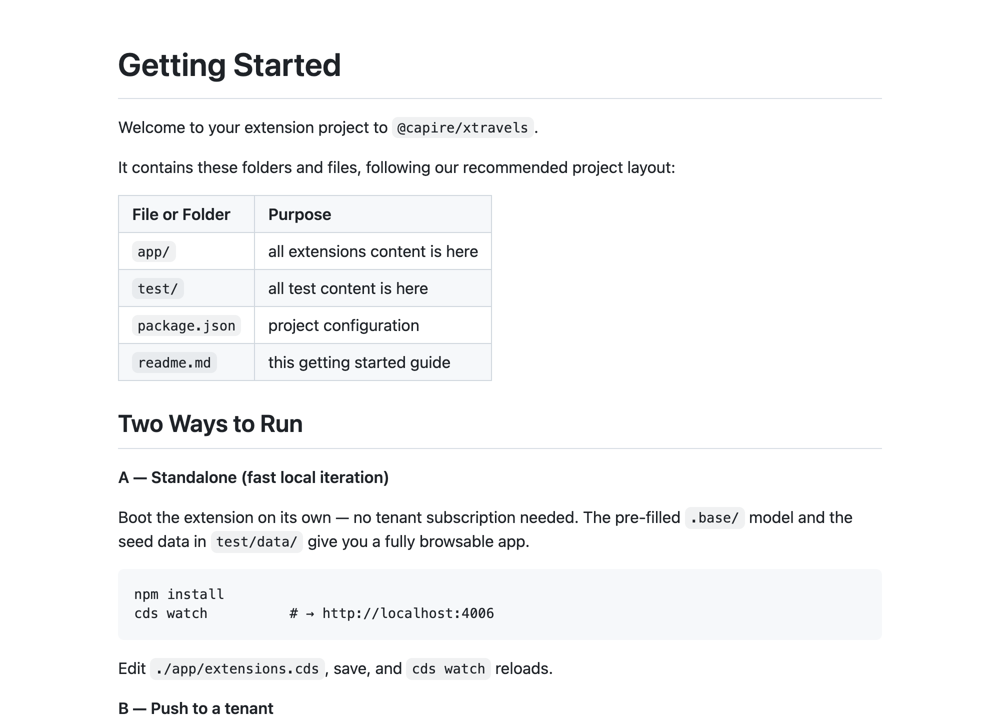
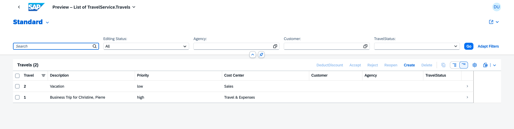
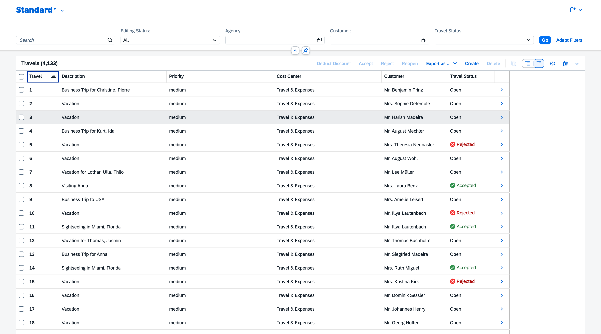

# Extending SaaS Applications

[[toc]]

## Introduction & Overview

Subscribers (customers) of SaaS solutions frequently need to tailor these to their specific needs, for example, by adding specific extension fields and entities. All CAP-based applications intrinsically support such **SaaS extensions** out of the box.

The overall process is depicted in the following figure:

![The graphic shows the three parts that are also discussed in this guide. Each part has it's steps. The first part is the one of the SaaS provider. As SaaS provider you need to deploy an extensible application and provide a guide that explains how to extend your application. In addition the SaaS provider should provide a project template for extension projects. The next part is for the SaaS customer. In this role you need to setup a tenant landscape for your extension, subscribe to the application you want to extend and authorize the extension developers. The last part is for the extension developer. As such, you start an extension project, develop and test your extension and then activate it.](assets/process_SAP_BTP.drawio.svg)

In this guide, you will learn the following:

- How to enable extensibility as a **SaaS provider**.
- How to develop SaaS extensions as a **SaaS customer**.
<!-- TODO: In the graphic the extension developer isn't the SaaS customer -->

## Prerequisites {#prerequisites}

Before we start, you'll need a **CAP-based [multitenant SaaS application](../multitenancy/)** that you can modify and deploy.

::: tip Jumpstart with XTravels
This guide uses the [XTravels](https://github.com/capire/xtravels) sample. Unlike a single-package app such as _bookshop_, XTravels is a **modular application** composed from several reuse packages — `@capire/xflights` (flights master data), `@capire/s4` (business partners), and `@capire/common` (shared currencies/regions). It is therefore set up as a local **npm workspace** so those cross-package dependencies resolve via symlinks:

```sh
mkdir -p cap/samples && cd cap/samples
echo '{"workspaces":["*","*/apis/*"]}' > package.json
git clone https://github.com/capire/xtravels
git clone https://github.com/capire/xflights
git clone https://github.com/capire/common
git clone https://github.com/capire/s4
npm install
```

The workspace globs also expose the `@capire/xflights-data` API (published from `xflights/apis/data-service`) to XTravels automatically. Verify the wiring with:

```sh
npm ls @capire/xflights-data
```

For the end-to-end walkthrough of this multi-repo setup — including how the reuse APIs are linked — see the [guide on inner-loop development](../integration/inner-loops).

Then enable multitenancy in the `xtravels` package:

```sh
cd xtravels
cds add multitenancy
```

Also, ensure you have the latest version of `@sap/cds-dk` installed globally:

```sh
npm update -g @sap/cds-dk
```

:::

## As a SaaS Provider { #prep-as-provider }

CAP provides intrinsic extensibility, which means all your entities and services are extensible by default.

Your SaaS app becomes the **base app** for extensions by your customers, and your data model the **base model**.

### 1. Enable Extensibility

Extensibility is enabled by running this command in your project root:

```sh
cds add extensibility
```

::: details Essentially, this automates the following steps…

1. It adds an `@sap/cds-mtxs` package dependency:

```sh
npm add @sap/cds-mtxs
```

2. It switches on <Config>cds.requires.extensibility: true</Config> in your _package.json_:

::: code-group

```json{13} [package.json]
{
  "name": "@capire/xtravels",
  "version": "1.0.1",
  "dependencies": {
    "@capire/common": "*",
    "@capire/s4": "*",
    "@capire/xflights-data": "*",
    "@sap/cds": "^10",
    "@sap/cds-mtxs": "^4"
  },
  "cds": {
    "requires": {
      "extensibility": true
    }
  }
}
```

:::

If `@sap/cds-mtxs` is newly added to your project install the dependencies:

```sh
npm i
```

### 2. Restrict Extension Points { #restrictions }

Normally, you'll want to restrict which services or entities your SaaS customers are allowed to extend and to what degree they may do so. Take a look at the following configuration:

::: code-group

```jsonc [mtx/sidecar/package.json]
{
  "cds": {
    "requires": {
      "cds.xt.ExtensibilityService": {
        "element-prefix": ["x_"],
        "extension-allowlist": [
          {
            "for": ["sap.capire.travels"],
            "kind": "entity",
            "new-fields": 2
          },
          {
            "for": ["TravelService"],
            "new-entities": 2
          }
        ]
      }
    }
  }
}
```

:::

This enforces the following restrictions:

- All new elements have to start with `x_` → to avoid naming conflicts.
- Only entities in namespace `sap.capire.travels` can be extended, with a maximum 2 new fields allowed.
- Only the `TravelService` can be extended, with a maximum of 2 new entities allowed.

::: warning Reuse-module entities can't be extended
The allowlist above is scoped to the app's **own** model on purpose: namespace `sap.capire.travels` (`Travels`, `Bookings`, `TravelAgencies`, and the code lists) and `TravelService`. Subscribers can extend only those.

XTravels is modular: `Flights` and `Supplements` come from `@capire/xflights` (namespace `sap.capire.xflights`), `Customers` from `@capire/s4` (namespace `sap.capire.s4`), and `TravelService` merely re-exposes them as read-only projections. Those reuse-module namespaces are **not** in the allowlist, so `Flights`, `Supplements`, and `Customers` **cannot** be extended.
:::

[Learn more about extension restrictions.](../multitenancy/mtxs#extension-restrictions){.learn-more}

### 3. Provide Template Projects {#templates}

To jumpstart your customers with extension projects, it's beneficial to provide a template project. Including this template with your application and making it available as a downloadable archive not only simplifies their work but also enhances their experience.

A good template **starts clean, runs immediately, and documents intent**: after cloning it, the extension developer's first two commands should be `npm install` and `cds watch` without the need to pull a base model or login to the tenant host.

#### Preferred Project Layout {#template-layout}

The template we build in the following steps has this structure:

```zsh
xtravels-ext/
├── app/
│   └── extensions.cds       # your extensions (fields, entities, annotations)
├── srv/
│   └── server.js            # optional: plumbing and initial logic for local test-drives
├── db/
│   └── data/                # (real) initial data that ships with the extension
│       └── x_travels.ext-x_CostCenters.csv
├── test/
│   └── data/                # seed data for local test-drives (dev only)
│       ├── sap.capire.travels-Travels.csv
│       ├── sap.common-Currencies.csv
│       └── …                # one CSV per seeded entity (see Add Test Data)
├── .base/                   # optional: pre-filled base model (replaces cds pull)
├── package.json             # extends "@capire/xtravels"
└── readme.md                # getting-started guide for extension developers
```

::: tip Keep it simple
Put all your model content into `./app`. `cds add extension` trims the scaffold to a model-only layout (no `./db` by default); add `./db/data` only to ship **configuration data** such as a code list (see [Add Data](#add-data)). Keep `./srv` only for the optional [reference logic](#reference-wiring) that makes local test-drives behave like the deployed app.
:::

#### Create an Extension Project (Template)

Extension projects are standard CAP projects extending the SaaS application. Create one for your SaaS app following these steps:

1. Create a new CAP project and add the extension facet — `xtravels-ext` in our walkthrough:

   ```sh
   cd ..
   cds init xtravels-ext --nodejs
   cd xtravels-ext
   cds add extension
   code . # open in VS Code
   ```

   `cds add extension` scaffolds the extension project structure: it adds `extends` and `workspaces: [ ".base" ]` to your _package.json_ and prepares the `.base/` folder that will hold the pulled base model.

2. `cds add extension` sets `extends` to a placeholder — point it at your SaaS app and add the two focused settings below to your _package.json_:

    ::: code-group

    ```json{3,6,9} [package.json]
    {
      "name": "xtravels-ext",
      "extends": "@capire/xtravels",
      "workspaces": [ ".base" ],
      "optionalDependencies": {
        "@cap-js/sqlite": "^3"
      },
      "cds": {
        "server": { "port": 4006 }
      }
    }
    ```

    :::

- `name` identifies the extension within a SaaS subscription; extension developers can choose the value freely.
- `extends` is the name by which the extension model will refer to the base model. `cds add extension` writes a placeholder here — change it to your SaaS app (`@capire/xtravels`). It must be a valid npm package name as it will be used by `cds pull` as a package name for the base model. It doesn't have to be a unique name, nor does it have to exist in a package registry like npmjs, as it will only be used locally.
- `workspaces` (added by `cds add extension`) is a list of folders including the one where the base model is stored. `cds pull` will keep this property in sync if needed.
- `@cap-js/sqlite` provides the in-memory database for local `cds watch`. It sits under `optionalDependencies` **on purpose**: it's still installed by `npm install`, so local test-drives get a real database — but because it isn't a regular `dependency` or `devDependency`, `cds build` doesn't treat the project as a runnable app and therefore keeps your local `test/data` **out of the pushed extension** (see [Add Test Data](#add-test-data)). Declaring it as a `devDependency` would bundle that dev-only data into `cds push` and deploy it to the tenant.
- `cds.server.port` fixes the local test-drive port to `4006`, so extension developers can just run `cds watch` without passing `--port`.

::: details Uniqueness of base-model name…

You use the `extends` property as the name of the base model in your extension project. Currently, it's not an issue if the base model name isn't unique. However, to prevent potential conflicts, we recommend using a unique name for the base model.

:::

#### Add Sample Content

Create a new file _app/extensions.cds_ and fill in this content:

<!-- TODO: "for new entities, if any" is confusing here -->
::: code-group

```cds [app/extensions.cds]
namespace x_travels.ext; // only applies to new entities defined below
using { TravelService, sap.capire.travels.Travels } from '@capire/xtravels';

extend Travels with {
  x_new_field : String;
}

// -------------------------------------------
// Fiori Annotations

annotate Travels:x_new_field with @title: 'New Field';
annotate TravelService.Travels with @UI.LineItem: [
  ... up to { Value: Description },
  { Value : x_new_field },
  ...
];
```

:::

The name of the _.cds_ file can be freely chosen. Yet, for the build system to work out of the box, it must be in either the `app`, `srv`, or `db` folder.

::: tip Separate concerns
You may want to consider [separating concerns](../domain/index#separation-of-concerns) by putting all Fiori annotations into a separate _./app/fiori.cds_.
:::

#### Add Test Data

To support [quick-turnaround tests of extensions](#test-locally) using `cds watch`, add some test data. In your template project, create a file _test/data/sap.capire.travels-Travels.csv_ like that:

::: code-group

```csv [test/data/sap.capire.travels-Travels.csv]
ID,Description,BeginDate,EndDate,BookingFee,Currency_code,Status_code,Agency_ID,Customer_ID
1,"Business Trip for Christine, Pierre",2026-08-04,2026-08-04,20,USD,O,070007,000608
2,Vacation,2026-08-04,2027-06-02,80,USD,O,070046,000093
```

:::

::: tip Ship a complete seed set
A bare `Travels` table isn't browsable on its own: its associations point at agencies, currencies, customers, and flights that aren't seeded, so the Fiori list shows blank cells. To make the template **browsable out of the box**, copy the base app's seed CSVs into your extension's `test/data/` folder. You're assembling this template from the base app's sources, so copy straight from the base app and its reuse packages:

- **The app's own data.** Copy every `sap.capire.travels-*.csv` from the base app's `db/data/` folder into your `test/data/`: `Travels`, `Bookings`, `Bookings.Supplements`, `TravelAgencies`, `TravelStatus`(+`.texts`), `TravelPurposes`, `PaymentMethods`, and `BookingStatus`(+`.texts`). These are a plain copy, no edits needed.
- **Reuse code lists** from `@capire/common/data/`: `sap.common-Currencies`(+`_texts`) and `sap.common-Countries`(+`_texts`), so currency symbols and country names resolve. Mostly a plain copy, but `Currencies` needs its extra columns trimmed (see the next section).
- **External & federated data**: flights (from `@capire/xflights-data`) and customers (from `@capire/s4`). These aren't stored in XTravels' own model but projected from external services, so their local table names and columns need a little care. See [Seed External & Federated Data](#seed-external).
:::

::: details Why `test/data/` and not `db/data/`?
Data under `test/data/` is loaded **only** during local `cds watch` — it stays scoped to development and is _not_ deployed when the extension is activated to a tenant. Put initial data that must ship to production under `db/data/` instead (see [Add Data](#add-data)).
:::

#### Seed External & Federated Data {#seed-external}

Not everything XTravels shows comes from its own tables. `Customers` and the `Flights`/`Supplements` behind each booking are **projections over external services**: SAP S/4HANA business partners (served by `@capire/s4`) and the flights microservice (`@capire/xflights`). In the deployed app, that data is **replicated** from those remote systems by the base app's server-side code. That code isn't part of the model, so `cds pull` doesn't deliver it, and a standalone `cds watch` starts with those tables **empty**, so the Fiori list shows blank _Customer_ and _Flight_ cells.

To make the template browsable, seed that data locally. Two things need to line up: the **target file name** and the **columns**.

**1. Derive the target name from the projection.** You don't write any of these declarations yourself; they already exist in the base app's model, and you only read them to find the right CSV file name. A federated entity is declared as a projection on an external service's entity. For customers, the base app's model contains:

```cds
@federated entity Customers as projection on API_BUSINESS_PARTNER.A_BusinessPartner { … }
```

Locally there's no remote and no replication, so the projection reads straight from the **source entity's own table**: `API_BUSINESS_PARTNER.A_BusinessPartner`. That fully-qualified name _is_ your CSV file name. CAP accepts either separator between namespace and entity, a dot or a dash. Each reuse module ships this data with its package, so copy the files verbatim from these locations into your `test/data/`:

| Copy from (in the reuse package) | Seeds |
| --- | --- |
| `@capire/s4/srv/external/data/API_BUSINESS_PARTNER.A_BusinessPartner.csv` | Customers |
| `@capire/xflights-data/data/sap.capire.flights.FlightsService.Flights.csv` | Flights |
| `@capire/xflights-data/data/…FlightsService.Airlines.csv` | Airlines (so the flattened `airline` name resolves) |
| `@capire/xflights-data/data/…FlightsService.Airports.csv` | Airports (so `origin`/`destination` resolve) |
| `@capire/xflights-data/data/…FlightsService.Supplements.csv` | Supplements |

::: tip Why flights data comes from `@capire/xflights-data`, not `@capire/xflights`
`@capire/xflights` is the flights **microservice**: in the deployed app XTravels calls it remotely and replicates its data, so the service owns that data, XTravels doesn't. There's nothing to copy from it. `@capire/xflights-data` is a separate pre-built **integration package** that bundles the same `FlightsService` definition together with sample master data (Airlines, Airports, Flights, Supplements). XTravels depends on `@capire/xflights-data` (not the live microservice), so a standalone `cds watch` runs against a **mock** of the service, and that package is where the seed CSVs live. The same split applies to any federated service: the running service is one thing, the sample-data package you seed from is another.
:::

**2. Match the columns to the pulled model.** The base model you pull is **minified** (`@cds.minify`) — external and reuse entities keep only the elements and code lists the exposed services actually reference. Anything unused is stripped, so the pulled model can be markedly leaner than the packages the base app builds on. If a source CSV carries columns the minified model dropped, deployment fails with `table … has no column named …`; if it targets an entity that was dropped entirely, you get `no such table`.

This matters here because XTravels builds on **`@capire/common`**, which _extends_ the stock `@sap/cds/common`: it adds `numcode`/`exponent`/`minor` to `Currencies`, a `Regions`/`Cities`/`Districts` hierarchy under `Countries`, and a whole `Languages` code list. None of that is reachable through XTravels' services, so minification drops it — the pulled model falls back to a plain `sap.common` shape. Two consequences for your seed data:

- **`Currencies` — trim the extra columns.** `@capire/common`'s `sap.common-Currencies.csv` ships `code;symbol;name;descr;numcode;minor;exponent`, but the pulled `sap.common.Currencies` keeps only `code`, `symbol`, `name`, `descr` (plus `minorUnit`). Drop the extra three:

  ```csv [test/data/sap.common-Currencies.csv]
  code;symbol;name;descr
  EUR;€;Euro;European Euro
  USD;$;US Dollar;United States Dollar
  ```

- **`Languages` and `Regions` — don't seed them at all.** They aren't in the pulled model, so there's no table to load into; copying `sap.common-Languages.csv` would fail with `no such table`.

The companion `sap.common-Currencies_texts`, `sap.common-Countries`, and `sap.common-Countries_texts` CSVs already match the pulled model — copy them as-is.

::: tip Find the target quickly
This lookup uses the pulled base model, so run [`cds pull`](#pull-base) first (or ship a pre-filled [`.base/`](#template-base)) if you haven't yet: that's what creates `.base/index.csn`. `cds pull` only writes the `.base/` folder and a few `package.json` entries; it never touches your `app/`, `test/data/`, or `db/data/`, so it won't overwrite the template you've built so far.

Not sure what an entity projects on, which columns survived minification, or whether an entity survived at all? Open the pulled `.base/index.csn` and look it up: its `projection`/`query` shows the source it reads from, and its `elements` are exactly the columns your CSV may contain. If the definition isn't there, minification dropped it and there's nothing to seed.
:::

#### Ship a Pre-Filled Base Model {#template-base}

Normally an extension developer has to run [`cds pull`](#pull-base) against a live tenant subscription before the project compiles, because `using … from '@capire/xtravels'` needs the base model. You can remove that first hurdle by shipping a **pre-filled `.base/`** with the template — a compiled snapshot of the base model, so `cds watch` works right after `npm install`.

- The base CSN must be structurally valid, and every service and entity your extensions reference must be present.
- You may trim it — dropping internal entities and unexposed projections keeps the template small.
- It's a snapshot: when the base model changes, developers re-run `cds pull` to refresh it.

::: tip
If you don't ship `.base/`, that's fine — developers just run [`cds pull`](#pull-base) once as the first step, as described in the SaaS-customer walkthrough below.
:::

#### Make It Browsable {#template-ui}

For model-only extensions, the [generic Fiori preview](#test-locally) is enough to see your new fields. If you want extension developers to work against the **real** application UI locally, copy the base app's Fiori Elements shell (`app/travels/webapp/`) into the template. `cds watch` then serves it at `http://localhost:4006/travels/webapp/index.html`. The UI annotations themselves already travel with the base model, so only the HTML/JS shell needs to be copied.

#### Add a Readme

Include additional documentation for the extension developer in a _README.md_ file inside the template project.
::: code-group

```md [README.md]
# Getting Started

Welcome to your extension project for `@capire/xtravels`.

It contains these folders and files, following our recommended project layout:

| File or Folder | Purpose                        |
|----------------|--------------------------------|
| `app/`         | all extensions content is here |
| `test/`        | all test content is here       |
| `package.json` | project configuration          |
| `readme.md`    | this getting started guide     |


## Two Ways to Run

**A — Standalone (fast local iteration)**

Boot the extension on its own. The pre-filled `.base/` model and the seed data in `test/data/` give you a fully browsable app.

    npm install
    cds watch          # → http://localhost:4006

Edit `./app/extensions.cds`, save, and `cds watch` reloads.

**B — Push to a tenant**

The round-trip you use once you're happy with the extension:

    cds pull           # refresh the base model from the SaaS app
    cds push           # activate the extension on your tenant


## Learn More

Learn more at https://cap.cloud.sap/docs/guides/extensibility/customization.
```

:::

### 4. Provide Reference Logic for Local Runs {#reference-wiring}

`cds pull` delivers the SaaS app's **model** — the compiled CSN with all services, entities, and annotations — but _not_ its **server-side handler code**. That code stays on the provider's side. For a model-only extension that's exactly right: you extend the model, you don't ship logic. But it has one consequence for _local_ test-drives.

When you run the extension standalone with `cds watch`, the app boots against the pulled model with **generic** CRUD handlers only. Anything the base app implemented in JavaScript is simply absent:

- **Primary keys aren't generated.** The base app assigns a new `Travel`'s `ID` in a `before CREATE` handler. Standalone, creating a record leaves the key empty and the insert fails.
- **Bound actions error.** The Travels list report shows actions like _Accept_, _Reject_, _Reopen_, and _Deduct Discount_ (`acceptTravel`, `rejectTravel`, `reopenTravel`, `deductDiscount` on `TravelService.Travels`). With no handler behind them, triggering one from the UI raises a runtime error.

::: tip This is a local-only concern
On a real tenant your extension runs _inside_ the deployed SaaS app, so all of this wiring is already there. You only need it to make **standalone `cds watch`** behave like the deployed app.
:::

Bridge the gap with a read-only `srv/server.js` that reproduces just enough of the base app's behavior. Place it **directly** under `srv/`, where it runs as a regular Node.js bootstrap module during `cds watch`. A model-only extension carries no code, so even though `cds push` packages this file into the extension archive, the tenant activates only the model — the file is never executed there. Mark it clearly as reference code:

::: code-group

```js [srv/server.js]
// ────────────────────────────────────────────────────────────────
// Reference logic for LOCAL runs only — NOT part of the extension.
// `cds pull` delivers the base *model*, not the base app's handlers.
// This reproduces just enough of them so a standalone `cds watch`
// behaves like the deployed app. On a model-only tenant this file is
// packaged but never executed — only the model is activated.
// ────────────────────────────────────────────────────────────────
const cds = require('@sap/cds')

cds.once('served', () => {
  const { TravelService } = cds.services
  if (!TravelService) return
  const { Travels } = TravelService.entities

  // The base app generates a sequential key before persisting.
  const nextTravelId = async () => {
    const [active, draft] = await Promise.all([
      SELECT.one`max(ID) as maxID`.from(Travels),
      SELECT.one`max(ID) as maxID`.from(Travels.drafts),
    ])
    return Math.max(active?.maxID ?? 0, draft?.maxID ?? 0) + 1
  }
  TravelService.before('CREATE', Travels, async req => { req.data.ID ??= await nextTravelId() })
  TravelService.before('NEW', Travels.drafts, async req => { req.data.ID ??= await nextTravelId() })

  // Bound UI actions have no handler in a model-only extension —
  // triggering one from the list report would error. Stub them so
  // the UI stays clickable during local test-drives.
  for (const action of ['deductDiscount', 'acceptTravel', 'rejectTravel', 'reopenTravel'])
    TravelService.on(action, Travels, req => req.data ?? {})
})

module.exports = cds.server
```

:::

That's all a model-only template needs: keys get generated, the list report's actions no longer break, and the app is fully browsable locally. When the base app changes its behavior, refresh this file by hand — it's a convenience copy, not something `cds pull` keeps in sync.

### 5. Provide Extension Guides {#guide}

You should provide documentation to guide your customers through the steps to add extensions. This guide should provide application-specific information along the lines of the walkthrough steps presented in this guide.

Here's a rough checklist what this guide should cover:

<!-- REVISIT: Why should these be part of the customer-built guide?? many of those steps are not app-specific -->
- [How to set up test tenants](#prepare-an-extension-tenant) for extension projects
- [How to assign requisite roles](#prepare-an-extension-tenant) to extension developers
- [How to start extension projects](#start-ext-project) from [provided templates](#templates)
- [How to find deployed app urls](#pull-base) of test and prod tenants
- [What can be extended?](#about-extension-models) → which services, entities, ...
- [With enclosed documentation](../../cds/cdl#doc-comments) to the models for these services and entities.

### 6. Deploy Application

Before deploying your SaaS application to the cloud, you can [test-drive it locally](../multitenancy/index#test-drive-locally).
Prepare this by going back to your app with `cd xtravels`.

With your application enabled and prepared for extensibility, you are ready to deploy the application as described in the  [Deployment Guide](../deploy/).

## As a SaaS Customer {#prep-as-operator}

The following sections provide step-by-step instructions on adding extensions.
All steps are based on our XTravels sample which can be [started locally for testing](../multitenancy/index#test-drive-locally).

::: details On BTP…

To extend a SaaS app deployed to BTP, you'll need to subscribe to it [through the BTP cockpit](../multitenancy/index#subscribe-via-btp-cockpit).

Refer to the [Deployment Guide](../deploy/to-cf) for more details on remote deployments.

Also, you have to replace local URLs used in `cds` commands later with the URL of the deployed App Router.
Use a passcode to authenticate and authorize you.
Refer to the section on [`cds login`](#cds-login) for a simplified workflow.

:::

### 1. Subscribe to SaaS App

It all starts with a customer subscribing to a SaaS application. In a productive application this is usually triggered by the platform to which the customer is logged on. The platform is using a technical user to call the application subscription API.
In your local setup, you can simulate this with a [mock user](../../node.js/authentication#mock-users) `yves`.

1. In a new terminal, subscribe as tenant `t1`:

    ```sh
    cds subscribe t1 --to http://localhost:4005 -u yves:
    ```

  Please note that the URL used for the subscription command is the sidecar URL, if a sidecar is used.
  Learn more about tenant subscriptions [via the MTX API for local testing](../multitenancy/mtxs#put-tenant).{.learn-more}

2. Verify that it worked by opening the [XTravels Fiori UI](http://localhost:4004/travels/webapp/index.html) in a **new private browser window** and log in as `carol`, which is assigned to tenant `t1`.

{.mute-dark}

### 2. Prepare an Extension Tenant {#prepare-an-extension-tenant}

In order to test-drive and validate the extension before activating to production, you'll first need to set up a test tenant. This is how you simulate it in your local setup:

1. Set up a **test tenant** `t1-ext`

    ```sh
    cds subscribe t1-ext --to http://localhost:4005 -u yves:
    ```

2. Assign **extension developers** for the test tenant.

    > As you're using mocked auth, simulate this step by adding the following to the SaaS app's _package.json_, assigning user `bob` as extension developer for tenant `t1-ext`:

  ::: code-group

  ```json [package.json]
  {
    "cds": {
      "requires": {
        "auth": {
          "users": {
            "bob": {
              "tenant": "t1-ext",
              "roles": ["cds.ExtensionDeveloper"]
            }
          }
        }
      }
    }
  }
  ```

  :::

### 3. Start an Extension Project {#start-ext-project}

Extension projects are standard CAP projects extending the subscribed application. SaaS providers usually provide **application-specific templates**, which extension developers can download and open in their editor.

You can therefore use the extension template created in your walkthrough [as SaaS provider](#templates).
Open the `xtravels-ext` folder in your editor. Here's how you do it using VS Code:

```sh
code ../xtravels-ext
```

{.ignore-dark}

### 4. Pull the Latest Base Model {#pull-base}

Next, you need to download the latest base model.

```sh
cds pull --from http://localhost:4005 -u bob:
```

> Run `cds help pull` to see all available options.

This downloads the base model as a package into an npm workspace folder `.base`. The actual folder name is taken from the `workspaces` configuration. It also prepares the extension _package.json_ to reference the base model, if the extension template does not already do so.

::: details See what `cds pull` does…

1. Gets the base-model name from the extension _package.json_, property `extends`.

   If the previous value is not a valid npm package name, it gets changed to `"base-model"`. In this case, existing source files may have to be manually adapted. `cds pull` will notify you in such cases.

2. It fetches the base model from the SaaS app.
3. It saves the base model in a subdirectory `.base` of the extension project.

   This includes file _.base/package.json_ describing the base model as an npm package, including a `"name"` property set to the base-model name.

4. In the extension _package.json_:

    - It configures `.base` as an npm workspace folder.
    - It sets the `extends` property to the base-model name.

:::

### 5. Install the Base Model

To make the downloaded base model ready for use in your extension project, install it as a package:

```sh
npm install
```

This will link the base model in the workspace folder to the subdirectory `node_modules/@capire/xtravels` (in this example).

### 6. Write the Extension {#write-extension }

Edit the file _app/extensions.cds_ and replace its content with the following:

::: code-group

```cds [app/extensions.cds]
namespace x_travels.ext; // for new entities like x_CostCenters below
using { TravelService, sap, sap.capire.travels.Travels } from '@capire/xtravels';

extend Travels with { // 2 new fields....
  x_priority   : String enum {high; medium; low} default 'medium';
  x_CostCenter : Association to x_CostCenters default 'TRAVEL';
}

entity x_CostCenters : sap.common.CodeList { // Value Help
  key code : String(10);
}


// -------------------------------------------
// Fiori Annotations

annotate Travels:x_priority with @title: 'Priority';
annotate x_CostCenters:name with @title: 'Cost Center';

annotate TravelService.Travels with @UI.LineItem: [
  ... up to { Value: Description },
  { Value: x_priority },
  { Value: x_CostCenter.name },
  ...
];
```

:::

[Learn more about what you can do in CDS extension models](#about-extension-models){.learn-more}

::: tip Both fields carry a default
`x_priority` defaults to `medium`, and `x_CostCenter` defaults to the `TRAVEL` code list entry. A `default` on an association sets its foreign key (`x_CostCenter_code`), so it behaves just like the scalar default on `x_priority`. When the extension is activated, these defaults are applied as `ADD COLUMN … DEFAULT …`, which also fills the column for every existing travel — so the tenant starts with sensible values instead of empty cells, and users only need to change the exceptions.
:::


<!-- REVISIT: do we need to say that? -->
::: tip
Make sure **no syntax errors** are shown in the [CDS editor](../../tools/cds-editors#vscode) before going on to the next steps.
:::

### 7. Test-Drive Locally {#test-locally}

To conduct an initial test of your extension, run it locally with `cds watch`:

```sh
cds watch
```

> This starts a local Node.js application server serving your extension along with the base model and supplied test data stored in an in-memory database.<br>
> It does not include any custom application logic though.

::: tip Serving on port 4006
The template's _package.json_ fixes the port via `cds.server.port: 4006` (see [Create an Extension Project](#templates)), so `cds watch` serves at `http://localhost:4006` without a `--port` flag. If your template omits that setting, pass `cds watch --port 4006` instead.
:::

#### Add Local Test Data

To improve local test drives, you can add _local_ test data for extensions.

Edit the template-provided file `test/data/sap.capire.travels-Travels.csv` and add data for the new fields as follows:

::: code-group

```csv [test/data/sap.capire.travels-Travels.csv]
ID,Description,BeginDate,EndDate,BookingFee,Currency_code,Status_code,Agency_ID,Customer_ID,x_priority,x_CostCenter_code
1,"Business Trip for Christine, Pierre",2026-08-04,2026-08-04,20,USD,O,070007,000608,high,TRAVEL
2,Vacation,2026-08-04,2027-06-02,80,USD,O,070046,000093,low,SALES
```

:::

Create a new file `db/data/x_travels.ext-x_CostCenters.csv` with this content:

::: code-group

```csv [db/data/x_travels.ext-x_CostCenters.csv]
code,name,descr
TRAVEL,"Travel & Expenses","Travel and expenses cost center"
SALES,"Sales","Sales department cost center"
OPS,"Operations","Operations cost center"
```

:::

::: tip `test/data/` vs `db/data/`
The `x_CostCenters` code list is your extension's own [_(real) initial data_](../databases/initial-data#initial-vs-test-data): the **value help** that labels the `TRAVEL`/`SALES`/`OPS` codes. It's configuration data users don't change through the app, so it belongs under `db/data/` — from where it both loads locally _and_ ships to the tenant with `cds push`. The Travels rows above go under `test/data/`, which loads **only** during local `cds watch` and never reaches the tenant. See [Add Data](#add-data) for why writeable data like `Travels` must stay local.
:::

#### Verify the Extension

Verify your extensions are applied correctly by opening the [Travels Fiori Preview](http://localhost:4006/$fiori-preview/TravelService/Travels#preview-app) in a **new private browser window**, log in as `bob`, and confirm that the _Priority_ and _Cost Center_ columns contain values, as in the following screenshot:

{.mute-dark}

> Note: the two rows shown come from your local `test/data/Travels`, and their _Cost Center_ labels resolve against the `x_CostCenters` code list.

The Travels rows stay in the local sandbox and are not processed during activation to the tenant; the `x_CostCenters` code list under `db/data/`, however, ships with the extension — see [Add Data](#add-data).

### 8. Push to Test Tenant {#push-extension }

Let's push your extension to the deployed application in your test tenant for final verification before pushing to production.

```sh
cds push --to http://localhost:4005 -u bob:
```

::: tip
`cds push` runs a `cds build` on your extension project automatically.
:::

::: details Prepacked extensions
To push a ready-to-use extension archive (.tar.gz or .tgz), run `cds push <archive or URL>`. The argument can be a local path to the archive or a URL to download it from.
Run `cds help push` to see all available options.
:::

> You pushed the extension with user `bob`, which in your local setup ensures they are sent to your test tenant `t1-ext`, not the production tenant `t1`.

::: details Building extensions

`cds build` compiles the extension model and validates the constraints defined by the SaaS application, for example, it checks if the entities are extendable.
It will fail in case of compilation or validation errors, which will in turn abort `cds push`.

_Warning_ messages related to the SaaS application base model are reclassified as _info_ messages. As a consequence they will not be shown by default.
Execute `cds build --log-level info` to display all messages, although they should not be of interest for the extension developer.

:::

#### Verify the Extension {#test-extension }

Verify your extensions are applied correctly by opening the [XTravels UI](http://localhost:4004/travels/webapp/index.html) in a **new private browser window**, log in as `bob`, and check that the new columns _Priority_ and _Cost Center_ are displayed as in the following screenshot. Your local Travels test data stayed on your machine, so every travel shows the model defaults: _Priority_ is `medium` and _Cost Center_ is _Travel & Expenses_. The labels come from the `x_CostCenters` code list you placed under `db/data/`, which shipped to the tenant with the push — see the [next step](#add-data) for what that means.

{.mute-dark}

### 9. Add Data {#add-data}

You already shipped data with your extension: the `x_CostCenters` code list under `db/data/`. That's why _Cost Center_ shows the label _Travel & Expenses_ rather than the raw code `TRAVEL` on the tenant — the code list traveled with the `cds push` and provides the **value help** that labels the codes and lets users re-classify travels.

Files under `db/data/` are your extension's [_(real) initial data_](../databases/initial-data#initial-vs-test-data): they load locally _and_ activate on the tenant. Restrict this to **configuration data** that users don't change through the app — such as a code list. Anything under `test/data/` (like your local `Travels` rows) stays on your machine and never reaches the tenant.

::: warning Ship only configuration data — never writeable data
It's tempting to also pre-fill the _Cost Center_ of individual travels by shipping a `db/data/sap.capire.travels-Travels.csv`. Don't do that for production. `Travels` is writeable transactional data, and on SAP HANA shipped CSVs [are deployed as `.hdbtabledata`, exclusively owned by the deployment and **overwritten on every redeployment**](../databases/hana#csv-data-gets-overridden) — which would reset whatever users entered. Only ship data that can't be changed through the app, such as code lists. To pre-populate a writeable column, use a model `default` (as `x_CostCenter` does) — it's applied once when the column is added and never overwrites later edits. Let users take it from there through the value help.
:::

[Learn more about adding data to extensions](#add-data-to-extensions) {.learn-more}

### 10. Activate the Extension {#push-to-prod}

Finally, after all tests, verifications and approvals are in place, you can push the extension to your production tenant:

```sh
cds push --to http://localhost:4005 -u carol:
```

> You pushed the extension with [mock user](../../node.js/authentication#mock-users) `carol`, which in your local setup ensures they are sent to your **production** tenant `t1`.

::: tip Simplify your workflow with `cds pull` and `cds push`

Particularly when extending deployed SaaS apps, refer to [`cds login`](#cds-login) to save project settings and authentication data for later reuse.

:::

# Appendices

<style scoped>
  h1#appendices { margin-top: 5em; border-top: .5px solid #666 }
  h1#appendices::before { content:"" }
</style>

## Configuring App Router {#app-router}

In a deployed multitenant SaaS application, you need to set up the App Router correctly. This setup lets the CDS command-line utilities connect to the MTX Sidecar without needing to authenticate again. If you haven't used both the `cds add multitenancy` and `cds add approuter` commands, it's likely that you'll need to tweak the App Router configuration. You can do this by adding a route to the MTX Sidecar.

```json [app/router/xs-app.json]
{
  "routes": [
    {
      "source": "^/-/cds/.*",
      "destination": "mtx-api",
      "authenticationType": "none"
    }
  ]
}
```

This ensures that the App Router doesn't try to authenticate requests to MTX Sidecar, which would fail. Instead, the Sidecar authenticates requests itself.

## About Extension Models

This section explains in detail about the possibilities that the _CDS_ languages provides for extension models.

All names are subject to [extension restrictions defined by the SaaS app](../multitenancy/mtxs#extensibility-config).

### Extending the Data Model

Following [the extend directive](../../cds/cdl#extend) it is pretty straightforward to extend the application with the following new artifacts:

- Extend existing entities with new (simple) fields.
- Create new entities.
- Extend existing entities with new associations.
- Add compositions to existing or new entities.
- Supply new or existing fields with default values, range checks, or value list (enum) checks.
- Define a mandatory check on new or existing fields.
- Define new unique constraints on new or existing entities.

```cds
using { sap.capire.travels } from '@capire/xtravels';
using {
  cuid, managed, Country, sap.common.CodeList
} from '@sap/cds/common';

namespace x_travels.ext;

// extend existing entity
extend travels.Travels with {
  x_Approver    : Association to one x_Approvers;
  x_CostCenter  : Association to one x_CostCenters;
  x_priority    : String @assert.range enum {high; medium; low} default 'medium';
  x_Notes       : Composition of many x_Notes on x_Notes.parent = $self;
}
// new entity - as association target
entity x_Approvers : cuid, managed {
  email         : String;
  firstName     : String;
  lastName      : String;
  department    : String;
  level         : String   @assert.range enum {junior; senior; executive} default 'senior';
  approvalLimit : Decimal  @assert.range: [ 0.0, 100000.0 ] default 5000.0;
  PostalAddresses : Composition of many x_ApproverPostalAddresses on PostalAddresses.Approver = $self;
}

// new unique constraint (secondary index)
annotate x_Approvers with @assert.unique: { email: [ email ] } {
  email @mandatory;  // mandatory check
}

// new entity - as composition target
entity x_ApproverPostalAddresses : cuid, managed {
  Approver     : Association to one x_Approvers;
  description  : String;
  street       : String;
  town         : String;
  country      : Country;
}

// new entity - as code list
entity x_CostCenters: CodeList {
  key code : String(10);
}

// new entity - as composition target
entity x_Notes : cuid, managed {
  parent      : Association to one travels.Travels;
  number      : Integer;
  noteLine    : String;
}
```

::: tip
This example provides annotations for business logic handled automatically by CAP as documented in [_Providing Services_](../services/constraints).
:::
Learn more about the [basic syntax of the `annotate` directive](../../cds/cdl#annotate) {.learn-more}

### Extending the Service Model

In `TravelService`, the new entities `x_ApproverPostalAddresses` and `x_Notes` are automatically included since they are targets of the corresponding _compositions_.

The new entities `x_Approvers` and `x_CostCenters` are [autoexposed](../services/providing-services#auto-exposed-entities) in a read-only way. Only `x_CostCenters` is a [CodeList](../../cds/common#aspect-codelist). If you want to change how they are exposed, expose them explicitly:

```cds
using { TravelService } from '@capire/xtravels';

extend service TravelService with {
  entity x_Approvers   as projection on x_travels.ext.x_Approvers;
  entity x_CostCenters as projection on x_travels.ext.x_CostCenters;
}
```

### Extending UI Annotations

The following snippet demonstrates which UI annotations you need to expose your extensions to the SAP Fiori elements UI.

Add UI annotations for the completely new entities `x_Approvers, x_ApproverPostalAddresses, x_CostCenters, x_Notes`:

```cds
using { TravelService } from '@capire/xtravels';

// new entity -- draft enabled
annotate TravelService.x_Approvers with @odata.draft.enabled;

// new entity -- titles
annotate TravelService.x_Approvers with {
  ID            @(
    UI.Hidden,
    Common : {Text : email}
  );
  firstName     @title : 'First Name';
  lastName      @title : 'Last Name';
  email         @title : 'Email';
  department    @title : 'Department';
  level         @title : 'Level';
  approvalLimit @title : 'Approval Limit';
}

// new entity -- titles
annotate TravelService.x_ApproverPostalAddresses with {
  ID          @(
    UI.Hidden,
    Common : {Text : description}
  );
  description @title : 'Description';
  street      @title : 'Street';
  town        @title : 'Town';
  country     @title : 'Country';
}

// new entity -- titles
annotate x_CostCenters : code with @(
  title : 'Cost Center Code',
  Common: { Text: name, TextArrangement: #TextOnly }
);


// new entity in service -- UI
annotate TravelService.x_Approvers with @(UI : {
  HeaderInfo       : {
    TypeName       : 'Approver',
    TypeNamePlural : 'Approvers',
    Title          : { Value : email}
  },
  LineItem         : [
    {Value : firstName},
    {Value : lastName},
    {Value : email},
    {Value : level},
    {Value : approvalLimit}
  ],
  Facets           : [
  {$Type: 'UI.ReferenceFacet', Label: 'Main', Target : '@UI.FieldGroup#Main'},
  {$Type: 'UI.ReferenceFacet', Label: 'Approver Postal Addresses', Target: 'PostalAddresses/@UI.LineItem'}
],
  FieldGroup #Main : {Data : [
    {Value : firstName},
    {Value : lastName},
    {Value : email},
    {Value : level},
    {Value : approvalLimit}
  ]}
});

// new entity -- UI
annotate TravelService.x_ApproverPostalAddresses with @(UI : {
  HeaderInfo       : {
    TypeName       : 'ApproverPostalAddress',
    TypeNamePlural : 'ApproverPostalAddresses',
    Title          : { Value : description }
  },
  LineItem         : [
    {Value : description},
    {Value : street},
    {Value : town},
    {Value : country_code}
  ],
  Facets           : [
    {$Type: 'UI.ReferenceFacet', Label: 'Main', Target : '@UI.FieldGroup#Main'}
  ],
  FieldGroup #Main : {Data : [
    {Value : description},
    {Value : street},
    {Value : town},
    {Value : country_code}
  ]}
}) {};

// new entity -- UI
annotate TravelService.x_CostCenters with @(
  UI: {
    HeaderInfo: {
      TypeName       : 'Cost Center',
      TypeNamePlural : 'Cost Centers',
      Title          : { Value : code }
    },
    LineItem: [
      {Value: code},
      {Value: name},
      {Value: descr}
    ],
    Facets: [
      {$Type: 'UI.ReferenceFacet', Label: 'Main', Target: '@UI.FieldGroup#Main'}
    ],
    FieldGroup#Main: {
      Data: [
        {Value: code},
        {Value: name},
        {Value: descr}
      ]
    }
  }
) {};

// new entity -- UI
annotate TravelService.x_Notes with @(
  UI: {
    HeaderInfo: {
      TypeName       : 'Note',
      TypeNamePlural : 'Notes',
      Title          : { Value : number }
    },
    LineItem: [
      {Value: number},
      {Value: noteLine}
    ],
    Facets: [
      {$Type: 'UI.ReferenceFacet', Label: 'Main', Target: '@UI.FieldGroup#Main'}
    ],
    FieldGroup#Main: {
      Data: [
          {Value: number},
          {Value: noteLine}
      ]
    }
  }
) {};
```

#### Extending Array Values

Extend the existing UI annotation of the existing `Travels` entity with new extension fields and new facets using the special [syntax for array-valued annotations](../../cds/cdl#extend-array-annotations).

```cds
// extend existing entity Travels with new extension fields and new composition
annotate TravelService.Travels with @(
  UI: {
    LineItem: [
      ... up to { Value: Description },                     // head
      {Value: x_Approver_ID,      Label:'Approver'},        //> extension field
      {Value: x_CostCenter.code,  Label:'Cost Center'},     //> extension field
      {Value: x_priority,         Label:'Priority'},        //> extension field
      ...,                                                  // rest
    ],
    Facets: [...,
      {$Type: 'UI.ReferenceFacet', Label: 'Notes', Target: 'x_Notes/@UI.LineItem'} // new composition
    ],
    FieldGroup#Details: {
      Data: [...,
        {Value: x_Approver_ID,      Label:'Approver'},        // extension field
        {Value: x_CostCenter.code,  Label:'Cost Center'},     // extension field
        {Value: x_priority,         Label:'Priority'}         // extension field
      ]
    }
  }
);

```

The advantage of this syntax is that you do not have to replicate the complete array content of the existing UI annotation, you only have to add the delta.

#### Semantic IDs

Finally, exchange the display ID (which is by default a GUID) of the new `x_Approvers` entity with a human readable text which in your case is given by the unique property `email`.

```cds
// new field in existing service -- exchange ID with text
annotate TravelService.Travels:x_Approver with @(
  Common: {
    //show email, not id for Approver in the context of Travels
    Text: x_Approver.email  , TextArrangement: #TextOnly,
    ValueList: {
      Label: 'Approvers',
      CollectionPath: 'x_Approvers',
      Parameters: [
        { $Type: 'Common.ValueListParameterInOut',
          LocalDataProperty: x_Approver_ID,
          ValueListProperty: 'ID'
        },
        { $Type: 'Common.ValueListParameterDisplayOnly',
          ValueListProperty: 'email'
        }
      ]
    }
  }
);
```

### Localizable Texts

To externalize translatable texts, use the same approach as for standard applications, that is, create a _i18n/i18n.properties_ file:

::: code-group

```properties [i18n/i18n.properties]
CostCenter_name_col = Cost Center
Travels_priority_col = Priority
...
```

:::

Then replace texts with the corresponding `{i18n>...}` keys from the properties file.
Make sure to run `cds build` again.

Properties files must be placed in the `i18n` folder.  If an entry with the same key exists in the SaaS application, the translation of the extension has preference.

> This feature is available with `@sap/cds` 6.3.0 or higher.

[Learn more about localization](../uis/i18n){.learn-more}

## Simplify Your Workflow With `cds login` {#cds-login}

As a SaaS extension developer, you have the option to log in to the SaaS app and thus authenticate only once.
This allows you to re-run `cds pull` and `cds push` against the app without repeating the same options over and over again – and you can avoid generating a passcode every time.

Achieve this by running `cds login` once. This command fetches tokens using OAuth2 from XSUAA and saves them for later use. For convenience, further settings for the current project are also stored, so you don't have to provide them again (such as the app URL and tenant subdomain).

### Where Tokens Are Stored

Tokens are saved in the desktop keyring by default
(libsecret on Linux, Keychain Access on macOS, or Credential Vault on Windows).

Using the keyring is more secure because, depending on the platform, you can lock and unlock it, and data saved by `cds login` may be inaccessible to other applications you run.

> For details, refer to the documentation of the keyring implementation used on your development machine.

`cds login` therefore uses the keyring by default. To enable this, you need to install an additional Node.js module, [_keytar_](https://www.npmjs.com/package/keytar):

```sh
npm i -g keytar
```

If you decide against using the keyring, you can request `cds login` to write to a plain-text file by appending `--plain`.

::: tip Switching to and from plain-text
Once usage of the `--plain` option changes for a given SaaS app, `cds login` migrates pre-existing authentication data from the previous storage to the new storage.
:::

::: warning Handle secrets with caution
Local storage of authentication data incurs a security risk: a potential malicious, local process might be able to perform actions you're authorized for, with the SaaS app, as your tenant.
:::

> In SAP Business Application Studio, plain-text storage is enforced when using `cds login`, since no desktop keyring is available. The plain-text file resides in encrypted storage.

### How to Login

If you work with Cloud Foundry (CF) and you have got the `cf` client installed, you can call `cds login` with just a passcode. The command runs the `cf` client to determine suitable apps from the org and space that you're logged in to. This allows you to interactively choose the login target from a list of apps and their respective URLs.

To log in to the SaaS app in this way, first change to the folder you want to use for your extension project. Then run the following command (the one-time passcode will be prompted interactively if omitted):

```sh
cds login [-p <passcode>]
```

:::details Advanced options

If you need to call `cds login` automatically without user interaction, you may use the [Client Credentials](https://www.oauth.com/oauth2-servers/access-tokens/client-credentials/) grant, which does not require a passcode.

You can then omit the `-p <passcode>` option but will instead have to provide the Client ID and a specific form of client secret to authenticate.

Obtain these two from the `VCAP_SERVICES` environment variable in your deployed MTX server (`@sap/cds-mtxs`). In the JSON value, navigate to `xsuaa[0].credentials`.

- If you find a `key` property (Private Key of the Client Certificate), XSUAA is configured to use X.509 (mTLS). Use this Private Key by specifying `cds login … -m <clientid>[:key]`.

- Otherwise, find the Client Secret in the `clientsecret` property and use `cds login … -c <clientid>[:<clientsecret>]` in an analogous way.

**Note:** The `key` and `clientsecret` properties are secrets that should not be stored in an unsafe location in productive scenarios!

[Learn more about environment variables / `VCAP_Services`.](../../node.js/cds-connect#bindings-in-cloud-platforms){.learn-more}

If you leave out the respective secret (enclosed in square brackets above), you will be prompted to enter it interactively.
This can be used to feed the secret from the environment to `cds login` via standard input, like so:

```sh
echo $MY_KEY | cds login … -m <clientid>
```

:::

For a synopsis of all options, run `cds help login`.

:::details Login without CF CLI

If you don't work with CF CLI, additionally provide the application URL and the subdomain as these can't be determined automatically:

```sh
cds login [<auth-options>] -s <subdomain> <app-url>
```

The `<app-url>` is the URL that you get in your subscriber account when you subscribe to an application. You find the `<subdomain>` in the overview page of your subaccount in the SAP BTP Cockpit:


:::

::: tip Multiple targets
Should you later want to extend other SaaS applications, you can log in to them as well, and it won't affect your other logins.
Logins are independent of each other, and `cds pull` etc. will be authenticated based on the requested target.
:::

### Simplified Workflow

Once you've logged in to the SaaS app, you can omit the passcode, the app URL, and the tenant subdomain, so in your development cycle you can run:

```sh
cds pull
# develop your extension
cds push
# develop your extension
cds push
# …
```

::: tip Override saved values with options
For example, run `cds push -s <otherSubdomain> -p <otherPasscode>` to activate your extension in another subdomain.
This usage of `cds push` may be considered a kind of cross-client transport mechanism.
:::

### Refreshing Tokens

Tokens have a certain lifespan, after which they lose validity. To save you the hassle, `cds login` also stores the refresh token sent by XSUAA alongside the token (depending on configuration) and uses it to automatically renew the token after it has expired. By default, refresh tokens expire much later than the token itself, allowing you to work without re-entering passcodes for multiple successive days.

### Cleaning Up

To remove locally saved authentication data and optionally, the project settings, run `cds logout` inside your extension project folder.

Append `--delete-settings` to include saved project settings for the current project folder as well.

`cds help logout` is available for more details.

::: tip Re-authenticate when your role-collection assignments have changed
Run `cds logout` followed by `cds login` in order to fetch a token with the new scopes.
:::

### Debugging

In case something unexpected happens, set the variable `DEBUG=cli` in your shell environment before re-running the corresponding command.

::: code-group

```sh [macOS/Linux]
export DEBUG="cli"
```

```cmd [Windows]
set DEBUG=cli
```

```powershell [Powershell]
Set-Variable -Name "DEBUG" -Value "cli"
```

:::

## Add Data to Extensions

As described in [Add Data](#add-data), you ship [_(real) initial data_](../databases/initial-data#initial-vs-test-data) for your extension by placing `.csv` files under `db/data/`. Restrict this to **configuration data** that users don't change through the app — such as the `x_CostCenters` code list. Anything under `test/data/` stays local and is never activated on the tenant.

Be aware that initial data behaves differently per database, which is why writeable business data doesn't belong here:

- **SQLite (local `cds watch`):** CSV files are loaded with an `UPSERT`, so a file that lists only the primary key plus your _new_ columns updates just those columns of the matching rows. That's a convenience for local test data.
- **SAP HANA (production):** CSV files are deployed as [`.hdbtabledata`](https://help.sap.com/docs/hana-cloud-database/sap-hana-cloud-sap-hana-database-deployment-infrastructure-hdi-reference/table-data-hdbtabledata). The deployment takes [exclusive ownership of that data and overwrites it on every redeployment](../databases/hana#csv-data-gets-overridden), and you must provide the **full** set of columns and rows — partial-column updates like the SQLite case don't apply.

::: danger Don't ship data for writeable entities to production
Because SAP HANA overwrites owned CSV data on each redeployment, shipping initial data for a writeable entity like `Travels` would wipe out whatever users entered. Ship code lists and other non-editable configuration only; let users maintain everything else through the app.
:::

<span id="afterAddingData" />
