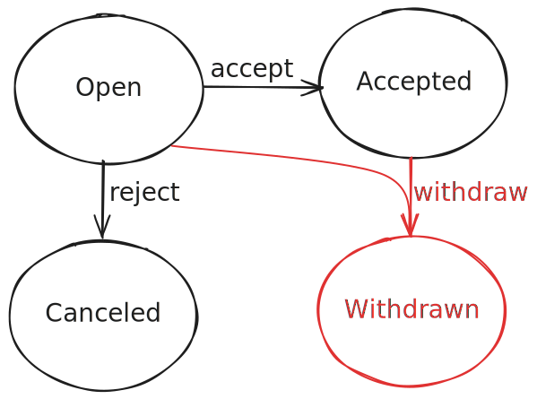

# Status-Transition Flows <Beta />

[...]

## Extending Flows

[...]

### Example Use Case

Consider a requirement where customers can withdraw from travel — for example, due to sickness — but only up to 24 hours before travel begins. This requires custom validation logic.

The status transition diagram below shows the new state and transitions:


First, add the `Withdrawn` status and the `withdrawTravel` action to the model:

```cds
// db/schema.cds
entity TravelStatus : sap.common.CodeList {
  key code : String(1) enum {
    Open      = 'O';
    Accepted  = 'A';
    Canceled  = 'X';
    Withdrawn = 'W';  // [!code highlight]
  }
}

// srv/travel-service.cds
service TravelService {

  // Define entity and actions
  entity Travels as projection on db.Travels
  actions {
    action acceptTravel();
    action rejectTravel();
    action withdrawTravel();  // [!code highlight]
    action deductDiscount( percent: Percentage not null ) returns Travels;
  };

  // Define flow through actions
  annotate Travels with @flow.status: Status actions {
    acceptTravel    @from: #Open  @to: #Accepted;
    rejectTravel    @from: #Open  @to: #Canceled;
    withdrawTravel  @from: [#Open, #Accepted];     // [!code highlight]
    deductDiscount  @from: #Open;
  };

}
```

Note that `withdrawTravel` has no `@to` annotation; you implement the transition in a custom handler.


### In Java

Here is a custom Java implementation that enforces the 24-hour rule:

```java
@Component
@ServiceName(TravelService_.CDS_NAME)
public class WithdrawTravelHandler implements EventHandler {

  private final PersistenceService persistenceService;

  public WithdrawTravelHandler(PersistenceService persistenceService) {
    this.persistenceService = persistenceService;
  }

  @Before(entity = Travel_.CDS_NAME)
  public void check24HoursBeforeTravel(final TravelWithdrawTravelContext context, CqnStructuredTypeRef travelRef) {
    Travel travel = ((ApplicationService) context.getService()).run(
        Select.from(travelRef).columns(Travel_.BEGIN_DATE)).first(Travel.class)
      .orElseThrow(() -> new ServiceException(ErrorStatuses.BAD_REQUEST, "TRAVEL_NOT_FOUND"));

    if (travel.beginDate().isBefore(LocalDate.now().minusDays(1))) {
      context.getMessages().error("Travel can only be withdrawn up to 24 hours before travel begins.");
    }
  }

  @On(entity = Travel_.CDS_NAME)
  public void onWithdrawTravel(final TravelWithdrawTravelContext context, CqnStructuredTypeRef travelRef) {
    boolean isDraftTarget =DraftUtils.isDraftTarget(
      travelRef,
      context.getModel().findEntity(travelRef.targetSegment().id()).get(),
      context.getModel());
    boolean isDraftEnabled = DraftUtils.isDraftEnabled(context.getTarget());
    var travel = Travel.create();
    travel.travelStatusCode(TravelStatusCode.WITHDRAWN);
    if (isDraftTarget) {
      ((DraftService) context.getService()).patchDraft(Update.entity(travelRef).data(travel));
    } else {
      AnalysisResult analysis = CqnAnalyzer.create(context.getModel()).analyze(travelRef);
      Map<String, Object> keys = analysis.targetKeyValues();
      if (isDraftEnabled) {
        keys.remove(Drafts.IS_ACTIVE_ENTITY);
      }
      persistenceService.run(Update.entity(context.getTarget()).matching(keys).data(travel));
    }
    context.setCompleted();
  }

}
```

The custom `before` handler reads the travel's `BeginDate` and validates that withdrawal occurs within the allowed timeframe. The custom `on` handler updates the travel status to `Withdrawn` and marks the action as completed.

<!--
The custom `On` handler implements the transition by updating the travel status to `Withdrawn`.
It checks whether the entity is a draft or a non-draft entity and applies the appropriate update logic.
For draft entities, it uses the `patchDraft` method to update the draft data, while for non-draft entities, it uses the `PersistenceService` to persist the changes.
Finally, it marks the action as completed.
-->

The custom `on` handler updates the travel status to `Withdrawn` and marks the action as completed.

::: warning TODO: we should actually do the following!
-> `withdrawTravel` should only have an additional before check.
:::

While you could use the `@to` annotation with the default handler, omitting it signals that you implemented custom transition logic.


### In Node.js

TODO
