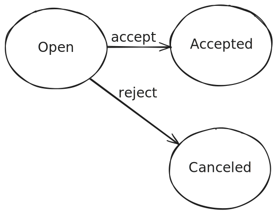
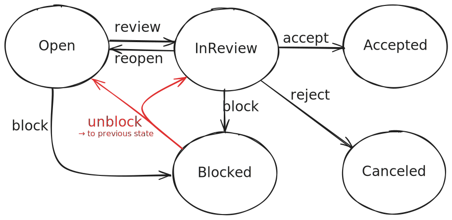

# Status-Transition Flows <Beta />

The flow feature makes it easy to define and manage state transitions in your CDS models.
It ensures transitions are explicitly modeled, validated, and executed in a controlled and reliable way.
In case of more complex requirements, you can extend the flows with custom event handlers.

[[toc]]


## Enabling Flows

Status-transition flows are part of the CAP Node.js core (`@sap/cds`).
Hence, there are no steps required to enable the feature.

To get started with the flow feature in CAP Java, simply add the [cds-feature-flow](https://central.sonatype.com/artifact/com.sap.cds/cds-feature-flow) dependency to your `srv/pom.xml` file:

```xml
<dependency>
  <groupId>com.sap.cds</groupId>
  <artifactId>cds-feature-flow</artifactId>
  <scope>runtime</scope>
</dependency>
```


## Modeling Flows

The following shows the simplest way to model a flow.
The example is taken from [@capire/xtravels](https://github.com/capire/xtravels).
The annotations in the service model are enough to model the flow so it can be used.



The following is an extract of the relevant parts of the domain model:

::: details `db/schema.cds`
```cds [db/schema.cds]
// db/schema.cds
namespace sap.capire.travels;

entity Travels : managed {
  // [...]
  Status       : Association to TravelStatus default 'O';
  // [...]
}

entity TravelStatus : sap.common.CodeList {
  key code : String(1) enum {
    Open     = 'O';
    Accepted = 'A';
    Canceled = 'X';
  }
}
```
:::

```cds [srv/travel-service.cds]
// srv/travel-service.cds
service TravelService {

  // Define entity and actions
  entity Travels as projection on db.Travels
  actions {
    action acceptTravel();
    action rejectTravel();
    action deductDiscount( percent: Percentage not null ) returns Travels;
  };

  // Define flow through actions (+ status check for "deductDiscount")
  annotate Travels with @flow.status: Status actions {  // [!code highlight]
    acceptTravel    @from: #Open  @to: #Accepted;       // [!code highlight]
    rejectTravel    @from: #Open  @to: #Canceled;       // [!code highlight]
    deductDiscount  @from: #Open;                       // [!code highlight]
  };                                                    // [!code highlight]

}
```

No action handler implementation is needed for simple transitions, as the flow feature's default action handler takes care of the logic.
It validates that the entry state is `Open` and then transitions the status to `Accepted` or `Canceled` respectively.
For more complex logic, custom handlers may still be required, as explained later.


### Ingredients

Flows are made up of a _status element_ and a set of _flow actions_ that define the transitions between different states. 

#### `@flow.status`

To model a flow, one of the entity fields needs to be annotated with `@flow.status`. This field must be one of the following:

- A String enum consisting of keys and values
- A String enum with only symbols
- A Codelist entity with the key `code` if localization is needed (`code` must be one of the two above)

::: tip The status field should be `@readonly` and have a default value.
We recommend to always use `@flow.status` in combination with `@readonly`.
This ensures that the status element is immutable from the client side, giving the service provider full control over all state transitions.
As no initial state can be provided on `CREATE`, there should be a default value.
:::

If you annotate `@flow.status: <element name>` on entity level (as in the example above), the annotation get's propagated to the respective element and the element is also annotated with `@readonly`.

Notes:
- This annotation is mandatory.
- The annotated element must be either an enum or an association to a code list.
- Only one status element per entity is supported.
- Draft-enabled entities are supported.
- `null` is **not** a valid state. Model your empty state explicitly.

::: warning Only simple projections are supported.
In other words, the entity must be _writable_.
Further, renaming the status element is currently not supported.
:::

After declaring a `@flow.status`, use the following annotations on bound actions to model the transitions of the flow:

#### `@from`

- Defines valid entry states for the action
- Validates whether the entity is in a valid entry state before executing the action (the current state of the entity must be included in the states defined here)
- Can be a single value or an array of values (each element must be a value from the status enum)
- UI annotations to allow/disallow buttons and to refresh the page are automatically generated

#### `@to`

- Defines the desired target state of the entity after executing the action
- Changes the state of the entity to the value defined in this annotation after executing the action
- Must be a single value from the status enum

Both annotations are optional, but at least one is required to mark an action as a flow action. You can use either one or both, depending on the desired behavior. If you use both, you don't need to implement any handlers for the actions, as all generic handlers are registered automatically.


### Generic Handlers

No handler implementations are required for the actions, as the generic handlers are registered automatically.

#### `before`

From the `@from` annotation, a handler is registered that performs the check described above.
The default `before` handler will validate that your entity instance is in a valid entry state, meaning the current state of the entity must match one of the states specified in the `@from` annotation.
If the entity is not in a valid state, the request fails with a suitable error.
A validation error will return a `409` HTTP Status Code.

#### `on`

An empty handler is registered if none is provided.
That is, The default `On` handler will complete the action for void return types.
This ensures the request passes through the generic handler stack.

#### `after`

From the `@to` annotation, a handler is registered that changes the state of the entity to the desired target state.
The default `after` handler will process the transition by automatically updating the status element of the entity to the target state defined in the `@to` annotation.
For example, if the current state is `Open` and the target state is `Accepted`, the `after` handler will update the status to `Accepted` after the action is executed.
This ensures that the state transition is consistently applied without requiring custom logic.

::: tip Generic handlers are not executed for drafts.
For example, calling `acceptTravel()` on a `Travels` entity that is currently being _edited_ has no effect.
:::


### `$flow.previous`

The following shows how to use the target state `$flow.previous`.
We need to expand on the simple example above by introducing a `Blocked` state with two possible previous states (the existing `Open` and the new `InReview`), as well as an action `unblockTravel` that will restore the respective state in the current workflow.
That is, if the `Blocked` state was transitioned to from `Open`, the action `unblockTravel` will transition back to `Open`.
The same applies for `InReview`.



```cds [srv/travel-service.cds]
// srv/travel-service.cds
service TravelService {

  // Define entity and actions
  entity Travels as projection on db.Travels
  actions {
    action reviewTravel();
    action reopenTravel();
    action blockTravel();
    action unblockTravel();
    action acceptTravel();
    action rejectTravel();
    action deductDiscount( percent: Percentage not null ) returns Travels;
  };

  // Define flow incl. "unblockTravel" that transitions to the previous state
  annotate Travels with @flow.status: Status actions {
    reviewTravel    @from: #Open               @to: #InReview;       // [!code highlight]
    reopenTravel    @from: #InReview           @to: #Open;           // [!code highlight]
    blockTravel     @from: [#Open, #InReview]  @to: #Blocked;        // [!code highlight]
    unblockTravel   @from: #Blocked            @to: $flow.previous;  // [!code highlight]
    acceptTravel    @from: #InReview           @to: #Accepted;
    rejectTravel    @from: #InReview           @to: #Canceled;
    deductDiscount  @from: #Open;
  };

}
```

To transition to the previous state, each entity with a flow that includes at least one transition to `$flow.previous` is automatically augmented with the necessary data structure to record the transitions.
Specifically, the entities are appended with the aspect `sap.common.FlowHistory`.

::: tip Transitions are excluded from projections.
The `transitions_` composition that is automatically appended to the base entity, is also automatically excluded from all projections.
:::


## Extending Flows

The flow annotations can be used for all basic flows that should be modelled, when there is the need for more complex cases, they can be implemented with custom event handlers.

Let's look at some use-cases for extending flows with custom event handlers:
- If the entry state validation depends on additional conditions, you could implement the logic in a custom `before` handler. 
- If the action's return type is anything other than `void`, you must implement a custom `on` handler.
- If you have multiple target states depending on certain conditions, you must implement a custom `on` handler, and you must **not** use the `@flow.to` annotation.
- If you want to run logic like contacting an external system on a state transition, consider implementing a custom `on` handler for the respective action.


### Example Use Case

Let's introduce a new requirement to see an action that will require a custom event handler to be implemented.
The new requirement is that a customer withdraws from travelling, for example due to sickness.
Withdrawing from travelling is only allowed for up to 24 hours before the travel begins.

The status transition diagram below visualizes the new state and transitions:


In order to implement this scenario, first Add the travel status `Withdrawn` and add the action `withdrawTravel` to the model.

```cds
// db/schema.cds
entity TravelStatus : sap.common.CodeList {
  key code : String(1) enum {
    Open      = 'O';
    Accepted  = 'A';
    Canceled  = 'X';
    Withdrawn = 'W';  // [!code highlight]
  }
}

// srv/travel-service.cds
service TravelService {

  // Define entity and actions
  entity Travels as projection on db.Travels
  actions {
    action acceptTravel();
    action rejectTravel();
    action withdrawTravel();  // [!code highlight]
    action deductDiscount( percent: Percentage not null ) returns Travels;
  };

  // Define flow through actions
  annotate Travels with @flow.status: Status actions {
    acceptTravel    @from: #Open  @to: #Accepted;
    rejectTravel    @from: #Open  @to: #Canceled;
    withdrawTravel  @from: [#Open, #Accepted];     // [!code highlight]
    deductDiscount  @from: #Open;
  };

}
```

Note that the `withdrawTravel` action doesn't have the `@to` annotation, because we will implement the transition in a custom handler.


### In Java

Here's a custom implemetation for transition to 'Withdrawn' in Java:

```java
@Component
@ServiceName(TravelService_.CDS_NAME)
public class WithdrawTravelHandler implements EventHandler {

  private final PersistenceService persistenceService;

  public WithdrawTravelHandler(PersistenceService persistenceService) {
    this.persistenceService = persistenceService;
  }

  @Before(entity = Travel_.CDS_NAME)
  public void check24HoursBeforeTravel(final TravelWithdrawTravelContext context, CqnStructuredTypeRef travelRef) {
    Travel travel = ((ApplicationService) context.getService()).run(
        Select.from(travelRef).columns(Travel_.BEGIN_DATE)).first(Travel.class)
      .orElseThrow(() -> new ServiceException(ErrorStatuses.BAD_REQUEST, "TRAVEL_NOT_FOUND"));

    if (travel.beginDate().isBefore(LocalDate.now().minusDays(1))) {
      context.getMessages().error("Travel can only be withdrawn up to 24 hours before travel begins.");
    }
  }

  @On(entity = Travel_.CDS_NAME)
  public void onWithdrawTravel(final TravelWithdrawTravelContext context, CqnStructuredTypeRef travelRef) {
    boolean isDraftTarget =DraftUtils.isDraftTarget(
      travelRef,
      context.getModel().findEntity(travelRef.targetSegment().id()).get(),
      context.getModel());
    boolean isDraftEnabled = DraftUtils.isDraftEnabled(context.getTarget());
    var travel = Travel.create();
    travel.travelStatusCode(TravelStatusCode.WITHDRAWN);
    if (isDraftTarget) {
      ((DraftService) context.getService()).patchDraft(Update.entity(travelRef).data(travel));
    } else {
      AnalysisResult analysis = CqnAnalyzer.create(context.getModel()).analyze(travelRef);
      Map<String, Object> keys = analysis.targetKeyValues();
      if (isDraftEnabled) {
        keys.remove(Drafts.IS_ACTIVE_ENTITY);
      }
      persistenceService.run(Update.entity(context.getTarget()).matching(keys).data(travel));
    }
    context.setCompleted();
  }

}
```

The custom `Before` handler retrieves the `BeginDate` of the travel entity from the database and validates whether it is within the allowed time frame, ensuring that the travel can only be withdrawn up to 24 hours before the current date.

<!--
The custom `On` handler implements the transition by updating the travel status to `Withdrawn`.
It checks whether the entity is a draft or a non-draft entity and applies the appropriate update logic.
For draft entities, it uses the `patchDraft` method to update the draft data, while for non-draft entities, it uses the `PersistenceService` to persist the changes.
Finally, it marks the action as completed.
-->

The custom `On` handler implements the transition by updating the travel status to `Withdrawn` and marks the action as completed.

::: warning TODO: we should actually do the following!
-> `withdrawTravel` should only have an additional before check.
:::

Technically, we could have used the `@to` annotation and the default flow handler for the transition instead of implementing it here. However, in this case, omitting the annotation explicitly signals to developers that custom logic is implemented for the transition, ensuring they understand the intent behind the omission.


### In Node.js

TODO
