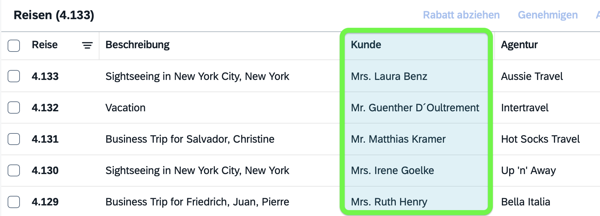
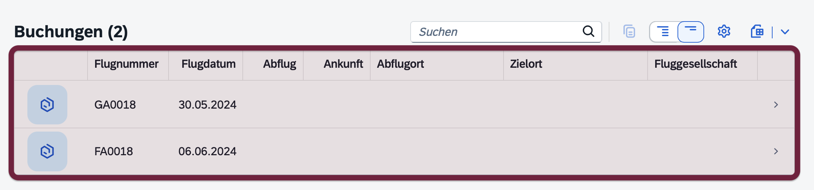

# CAP-Level Service Integration
The *'Calesi'* Pattern {.subtitle}

Integrating remote services - from other applications, third-party services, or platform services - is a fundamental aspect of cloud application development. CAP provides an easy and platform-agnostic way to do so: Remote services represented as CAP services, which you can consume _as if they were local_, while the CAP runtimes manage the communication and resilience details under the hood. Not the least, CAP mocks remote services automatically for local inner-loop development and testing.
{.abstract}


> [!tip] The <i>'Calesi'</i> Pattern – Guiding Principles
>
> 1. Remote services are proxied by CAP services, ... → *everything's a CAP service*
> 2. consumed in protocol-agnostic ways → *... as if they were local*
> 3. mocked out of the box → *inner-loop development*
> 4. with varying implementations → *evolution w/o disruption*
> 5. extensible through event handlers → *intrinsic extensibility*
>
> => Application developers stay at CAP level -> *Focused on Domain*


[toc]:./
[[toc]]


## As if they were local

Service integration is much about consuming remote services from other applications, third-party services, or platform services. CAP greatly simplifies this by allowing to call remote services _as if they were local_. Let's see how this works:

1. Clone the bookshop sample, and start the server in a terminal:

   ```shell
   git clone https://github.com/capire/bookshop
   cds watch bookshop
   ```

2. Start *cds repl* in a second terminal and run this code:

   ```shell
   cds repl
   ```
   ```js :line-numbers
   cats = await cds.connect.to ('http://localhost:4004/hcql/admin')
   await cats.read `Authors { 
     ID, name, books { 
       ID, title, genre.name as genre
     }
   }`
   ```

::: details Requires Cloud SDK libs ...

In case you get respective error messages ensure you've installed the following Cloud SDK packages in your project:

```shell
npm add @sap-cloud-sdk/connectivity
npm add @sap-cloud-sdk/http-client
npm add @sap-cloud-sdk/resilience
```

:::

The graphic below illustrates what happened here:


Remote CAP services can be consumed using the same high-level, uniform APIs as for local services – i.e., **_as if they were local_**. `cds.connect` automatically constructs remote proxies, which translate all local requests into protocol-specific ones, sent to remote services. Thereby also taking care of all connectivity, remote communication, principal propagation, as well as generic resilience.

> [!note] Model Free
>
> Note that in the exercise above, the consumer side didn't even have any information about the service provider, except for the URL endpoint and protocols served, which it got from the service binding. In particular no API/service definitions at all – neither in *CDS*, *OData*, nor *OpenAPI*. 

The remainder of this guide goes beyond such simple scenarios 
and covers all the aspects of CAP-level service integration in detail.


## The XTravels Sample

In this guide we'll use the _XTravels_ sample application as our running example. It's a modernized adaptation of the renowned [ABAP Flight reference sample](https://help.sap.com/docs/abap-cloud/abap-rap/abap-flight-reference-scenario), reimplemented using CAP and split into two microservices:

- The [*@capire/xflights*](https://github.com/capire/xflights) service provides flight-related master data, such as *Flights*, *Airports*, *Airlines*, and *Supplements* (like extra luggage, meals, etc.). It exposes this data via a CAP service API.

- The [*@capire/xtravels*](https://github.com/capire/xtravels) application allows travel agents to plan travels on behalf of travellers, including bookings of flights. The application obtains *Customer* data from a SAP S/4HANA system, while it consumes *Flights*, *Airports*, and *Airlines* from *@capire/xflights*, as indicated by the green and blue areas in the screenshot below. 


The resulting entity-relationship model looks like that:


From a service integration perspective, this sample mainly shows a data federation scenario, where the application consumes data from different upstream systems (XFlights and S/4HANA) – most frequently in a readonly fashion – to display it together with the application's local data. 

## Workflow Overview

The graphic below shows the flow of essential steps for service integration, which the following sections walk you through in detail:

![Workflow diagram showing five numbered steps of CAP-level service integration. Service Provider box on left contains step 1 Service Definition in blue and Domain Models in gray. Packaged API box in center shows step 2 Service Interface in light gray. Service Consumer box on right displays step 4 Consumption Views in light blue and step 5 Own Models in blue. Arrows connect the components left to right. Below, numbered list describes: 1 Expose Service Interfaces as usual, 2 Export APIs using cds export and npm publish, 3 Import APIs using cds import or npm add, 4 Add Consumption Views defining what to consume, 5 Use with own models as if they were local.
](assets/overview.drawio.svg)


#### Getting Started...

Let's dive into the details of CAP-level service integration, using the XTravels sample as our running example. Clone both repositories as follows to follow along:

```sh
mkdir -p cap/samples
cd cap/samples
git clone https://github.com/capire/xflights
git clone https://github.com/capire/xtravels
```


## Providing APIs

In case of CAP service providers, as for [*@capire/xflights*](https://github.com/capire/xflights) in our [sample scenario](#the-xtravels-sample), you define [CAP services](../services/index) for all inbound interfaces, which includes (private) interfaces to your application's UIs, as well as public APIs to any other remote consumers. 


### Defining Service APIs

Open the _cap/samples/xflights_ folder in Visual Studio Code, and have a look at the service definition in `srv/data-service.cds` in there:

::: code-group
```cds :line-numbers [cap/samples/xflights/srv/data-service.cds]
using sap.capire.flights as x from '../db/schema';
@odata @hcql service sap.capire.flights.data {
  @readonly entity Flights as projection on x.Flights {flights.*,*};
  @readonly entity Airlines as projection on x.Airlines;
  @readonly entity Airports as projection on x.Airports;  
}
```
:::

This declares a CAP service named `sap.capire.flights.data`, served over _OData_ and _HCQL_ protocols, which exposes _Flights_, _Airlines_, and _Airports_ as readonly projections on underlying domain model entities, with _Flights_ as a denormalized view.


#### Using Denormalized Views

Let's have a closer look at the denormalized view for _Flights_, which basically flattens the association to `FlightConnection`. The projection `{flights.*,*}` shown in line 3 above, is a simplified version of the following actual definition found in `srv/data-service.cds`:

```cds :line-numbers=3 [cap/samples/xflights/srv/data-service.cds]
@readonly entity Flights as projection on x.Flights {flights.*,*}; // [!code --]
@readonly entity Flights as projection on x.Flights {
  *,                          // all fields from Flights
  flight.{*} excluding {ID},  // all fields from FlightConnection
  key flight.ID,              // with flight ID preserved as key 
  key date,                   // with date preserved as key
} excluding { flight };       // which we flattened above
```

Reason for this more complicated definition is that we need to preserve the primary keys elements  `flight.ID` and `date`, as OData disallows entities without keys.

> [!tip] Use Case-Oriented Services
> Denormalized views are a common means to tailor provided APIs in a use case-oriented way. While normalization is required _within_ _XFlights_ to avoid redundancies, we flatten it here, to make life easier for external consumers. \
> => See also: [_Use Case-Oriented Services_](../../get-started/bookshop#use-case-specific-services) in the getting started guide.
>


### Exporting APIs

Use `cds export` to generate APIs for given [service definitions](#defining-service-apis). For example, run that within the _cap/samples/xflights_ folder for the service definition we saw earlier, which would print some output as shown below:

```shell
cds export srv/data-service.cds 
```
```log
Exporting APIs to apis/data-service ...

  > apis/data-service/services.csn
  > apis/data-service/index.cds
  > apis/data-service/package.json

/done.
```

By default, output goes to an `./apis/<service>` subfolder, where `<service>` is the `.cds` file basename. Use the `--to` option to specify a different output folder. 

#### Exported Service Definitions

The key ingredient of the generated output is the `services.csn` file, which contains a cleansed, ***interface-only*** part  of your service definition. It includes the _inferred elements signature_ of served entities but removes all projections to underlying entities and their dependencies. 

To get an idea of the effect, run `cds export` in dry-run mode like this:

```shell
cds export srv/data-service.cds --dry 
```
```zsh
 Kept: 6

   • sap.capire.flights.data
   • sap.capire.flights.data.Flights
   • sap.capire.flights.data.Airlines
   • sap.capire.flights.data.Airports
   • sap.capire.flights.data.Supplements
   • sap.capire.flights.data.SupplementTypes

 Skipped: 31

   - sap.capire.flights.Flights
   - sap.capire.flights.FlightConnections
   - sap.capire.flights.Airlines
   - sap.capire.flights.Airports
   - sap.capire.flights.Supplements
   - sap.capire.flights.SupplementTypes
   - Language
   - Currency
   - Country
   - Timezone
   - sap.common
   - sap.common.Locale
   - sap.common.Languages
   - sap.common.Countries
   - sap.common.Currencies
   - sap.common.Timezones
   - sap.common.CodeList
   - sap.common.TextsAspect
   - sap.common.FlowHistory
   - cuid
   - managed
   - temporal
   - User
   - sap.capire.flights.Supplements.texts
   - sap.capire.flights.SupplementTypes.texts
   - sap.common.Languages.texts
   - sap.common.Countries.texts
   - sap.common.Currencies.texts
   - sap.common.Timezones.texts
   - sap.capire.flights.data.Supplements.texts
   - sap.capire.flights.data.SupplementTypes.texts

 Total: 37
```

::: details Compare to original service definition...

We can also compare the above to the respective output for the complete provided service like that:

```shell
cds export srv/data-service.cds --dry > x.log
cds minify srv/data-service.cds --dry > m.log
code --diff *.log
```
This opens a diff view in VSCode, which would display these differences:
```zsh
Kept: 26 # [!code --]
Kept: 6 # [!code ++]

   • sap.capire.flights.data
   • sap.capire.flights.data.Flights
   •• sap.capire.flights.data.Airlines
   •• sap.capire.flights.data.Airports
   • sap.capire.flights.data.Supplements
   •• sap.capire.flights.data.SupplementTypes
   •• sap.capire.flights.Flights # [!code --]
   ••• sap.capire.flights.FlightConnections # [!code --]
   •••• sap.capire.flights.Airlines # [!code --]
   ••••• sap.common.Currencies # [!code --]
   •••••• sap.common.Currencies.texts # [!code --]
   ••••••• sap.common.Locale # [!code --]
   ••••••• sap.common.TextsAspect # [!code --]
   •••••• sap.common.CodeList # [!code --]
   ••••• Currency # [!code --]
   ••••• cuid # [!code --]
   •••• sap.capire.flights.Airports # [!code --]
   ••••• sap.common.Countries # [!code --]
   •••••• sap.common.Countries.texts # [!code --]
   ••••• Country # [!code --]
   •• sap.capire.flights.Supplements # [!code --]
   ••• sap.capire.flights.SupplementTypes # [!code --]
   •••• sap.capire.flights.SupplementTypes.texts # [!code --]
   ••• sap.capire.flights.Supplements.texts # [!code --]
   ••• sap.capire.flights.data.SupplementTypes.texts # [!code --]
   •• sap.capire.flights.data.Supplements.texts # [!code --]

Skipped: 11 # [!code --]
Skipped: 31 # [!code ++]
...
```

:::

In addition to the generated `services.csn` file, an `index.cds` file was added, which you can modify as needed. It won't be overridden on subsequent runs of `cds export`.


### Packaged APIs 

The third generated file is `package.json`:

::: code-group

```json [apis/data-service/package.json]
{
  "name": "@capire/xflights-data-service",
  "version": "0.1.3"
}
```

```json [=> modified]
{
  "name": "@capire/xflights-data-service", // [!code --]
  "name": "@capire/xflights-data", // [!code ++]
  "version": "0.1.3"
}
```

:::

You can modify this file. `cds export` won't overwrite your changes. In our xflights/xtravels sample, we changed the package name to `@capire/xflights-data`.

> [!tip] Yet Another CAP Package (YACAP)
> The generated output is a complete CAP package. You can add additional files to the *./apis* subfolder: models in *.cds* files, data in *.csv* files, I18n bundles, or even *.js* or *.java* files with custom logic for consumers. 


#### Adding Initial Data and I18n Bundles

You can use these `cds export` options to add I18n bundles and initial data, which generates files next to the `.csn` file:

```shell
cds export srv/data-service.cds --texts
```

```log
  > apis/data-service/_i18n/i18n.properties
  > apis/data-service/_i18n/i18n_de.properties
  > apis/data-service/_i18n/i18n_fr.properties
```
```shell
cds export srv/data-service.cds --data
```

```log
  > apis/data-service/data/sap.capire.flights.data.Flights.csv
  > apis/data-service/data/sap.capire.flights.data.Airlines.csv
  > apis/data-service/data/sap.capire.flights.data.Airports.csv
  > apis/data-service/data/sap.capire.flights.data.Supplements.csv
```

The `.csv` data comes from the source application's initial data, filtered and transformed for the exposed entities, including denormalizations and calculated fields. The application actually reads it via an instance of that service.


#### Plug & Play Config

Use the `--plugin` option to turn the package into a CAP plugin and benefit from CAP's plug & play configuration features in consuming apps:

```shell
cds export srv/data-service.cds --plugin
```

This would add this to the generated output:

::: code-group
```js [apis/data-service/cds-plugin.js]
// just a tag file for plug & play
```
:::
::: code-group
```json [apis/data-service/package.json]
{
  "name": "@capire/xflights-data",
  "version": "0.1.13",
  "cds": { // [!code focus]
    "requires": { // [!code focus]
      "sap.capire.flights.data": true // [!code focus]
    } // [!code focus]
  } // [!code focus]
}
```
:::


### Publishing APIs

The output of `cds export` is a valid _npm_ or _Maven_ package, which can be published to any npm-compatible registry, such as the public [*npmjs.com*](https://www.npmjs.com/) registry, or private registries like [*GitHub Packages*](https://docs.github.com/en/packages/working-with-a-github-packages-registry/working-with-the-npm-registry), [*Azure Artifacts*](https://learn.microsoft.com/en-us/azure/devops/artifacts/npm/npm-overview?view=azure-devops), or [*JFrog Artifactory*](https://jfrog.com/confluence/display/JFROG/NPM+Registry). For example:

```shell
npm publish ./apis/data-service
```

::: details Using GitHub Packages ...

Within the [_capire_](https://github.com/capire) org, we're publishing to [GitHub Packages](https://docs.github.com/packages), which requires you to `npm login` once like that, prior to publishing:
  ```sh
  npm login --scope=@capire --registry=https://npm.pkg.github.com
  ```
As password you're using a Personal Access Token (classic) with `read:packages` scope (for retrieving and installing a package). Read more about that in the [_GitHub Packages_](https://docs.github.com/en/packages/working-with-a-github-packages-registry/working-with-the-npm-registry#authenticating-to-github-packages) docs.
:::

::: details Not using npm registries ...

Instead of publishing to npm registries we can also share packages any other way. For example we could create an archive that we upload to some marketplace like [*SAP Business Accelerator Hub*](https://api.sap.com), or team-internal ones. 

For Node.js we'd use `npm pack` to create installable archives, which would print some output with the last line telling us the filename of the created archive:

```shell
npm pack ./apis/data-service
```

```zsh [=> output]
npm notice ...
npm notice 4.9kB services.csn
npm notice 410B index.cds
npm notice 61B package.json
npm notice ...
capire-xflights-data-0.1.13.tgz
```

> [!warning]
>
> Not using package registries like *npm* or *Maven* also means you'll loose all their support for semver-based dependency management. 

:::


> [!tip] Best Practice: Using Proven Standards
> CAP leverages standard and widely adopted package management tools and practices, such as _npm_ or _Maven_, for sharing and distributing reuse packages. This allows you to use established and battle-tested workflows and tools for versioning, publishing, consuming, and upgrading packages. At the same time it allows us to not reinvent those wheels, and focus on what matters most: allowing you to focus on domain, and be as productive as possible.


## Importing APIs 

On the consumer side, like [*@capire/xtravels*](https://github.com/capire/xtravels) in our [sample scenario](#the-xtravels-sample), we import packaged APIs as provided before using `npm add`, or other APIs from non-CAP sources using `cds import` as outlined below.


### From Packaged APIs

Packaged APIs provided by CAP service providers are imported to consuming applications like that:

```shell
npm add @capire/xflights-data
```

This makes the exported models with all accompanying artifacts available in the target project's `node_modules` folder. In addition, it adds a respective package dependency to the consuming application's *package.json* like this:

::: code-group
```json [package.json]
{...
  "dependencies": { ...
    "@capire/xflights-data": "0.1.12"
  }
}
```
:::

This allows us to update imported APIs later on using standard commands like `npm update`.


### From OData EDMX

You can also `cds import` APIs from other sources, such as OData APIs for customer data from SAP S/4 HANA systems:

1. Get an [_OData EDMX_](https://api.sap.com/api/API_BUSINESS_PARTNER/overview) source, e.g., from [*SAP Business Accelerator Hub*](https://api.sap.com):

   ::: details Detailed steps through SAP Business Accelerator Hub ...
      - Open https://api.sap.com in your browser
      - Navigate to
      \> [_SAP S/4HANA Cloud Public Edition_](https://api.sap.com/products/SAPS4HANACloud) 
         \> [_APIs_](https://api.sap.com/products/SAPS4HANACloud/apis)
         \> [_OData V2_](https://api.sap.com/products/SAPS4HANACloud/apis/ODATA)
      - Find and open [_Business Partner (A2X)_](https://api.sap.com/api/API_BUSINESS_PARTNER/overview) 
      - Switch to the *API Specification* subtab.
      - Click the download icon next to *OData EDMX* to download the `.edmx`  file.
   :::

2. Import that to the current project:

```shell
cds import ~/Downloads/API_BUSINESS_PARTNER.edmx
```
This copies the specified *.edmx* file into the `srv/external/` subfolder of your project, and generates a `.csn` file with the same basename next to it:

```zsh
srv/external
├── API_BUSINESS_PARTNER.csn
└── API_BUSINESS_PARTNER.edmx
```

> Run `cds import` with option `--as cds` to generate a human-readable `.cds` file instead of `.csn`. 

Further, it adds a [service binding](#service-bindings) stub to your _package.json_, which we'll learn about later.


> [!tip] Import from other APIs
> You can use `cds import` in the same way as for OData to import SAP data products, [_OpenAPI_](../protocols/openapi) definitions, [_AsyncAPI_](../protocols/asyncapi) definitions, or from [_ABAP RFC_](../../plugins/#abap-rfc). For example:
> ```shell
> cds import --data-product ...
> cds import --odata ...
> cds import --openapi ...
> cds import --asyncapi ...
> cds import --rfc ...
> ```
> [Learn more about `cds import` in the tools guides.](../../tools/apis/cds-import){.learn-more} 


### Via Reuse Packages

Instead of importing the same APIs repeatedly in each project, you can import them once and share them as reusable packages. These packages use the same techniques as `cds export` and provide the same plug & play convenience. 

For the _XTravels_ sample, we did so with the [`@capire/s4`](https://github.com/capire/s4) sample package, which we created as follows. 


1. We started a new CAP project – get the outcome from Github to follow along:

   ```shell
   git clone https://github.com/capire/s4.git
   code s4
   ```

 2. We imported the [OData API](https://api.sap.com/api/API_BUSINESS_PARTNER/overview) as [outlined above](#from-odata-edmx).

    ```shell
    cds import ~/Downloads/API_BUSINESS_PARTNER.edmx
    ```

2. Edited the `cds import`-generated `package.json` to look like that:
   ::: code-group
   ```json :line-numbers [package.json]
   {
      "name": "@capire/s4",
      "version": "1.0.0",
      "cds": {
         "requires": {
            "S4BusinessPartnerService": {
               "service": "API_BUSINESS_PARTNER",
               "kind": "odata-v2"
            }
         }
      }
   }
   ```
   :::

3. Added the following files to expose the imported API in a CAP-idiomatic way:

   ::: code-group
   ```js [cds-plugin.js]
   // just a tag file for plug & play configuration in consuming apps
   ```
   :::

   ::: code-group
   ```cds :line-numbers [srv/business-partners.cds]
   using from './srv/external/API_BUSINESS_PARTNER';
   annotate API_BUSINESS_PARTNER with @cds.external:2; 
   ```
   :::

   ::: code-group
   ```cds :line-numbers [index.cds]
   // Entry point to allow imports like: using from '@capire/s4';
   using from './srv/business-partners';
   ```
   :::

4. Added some initial data using `cds add data`.
   ```shell
   cds add data -o ./srv/external/data -f A_BusinessPartner
   ```

5. Finally published the package to [_Github Packages_](https://github.com/features/packages).
   ```shell
   npm publish
   ```

In the consuming project [*@capire/xtravels*](https://github.com/capire/xtravels) we then simply added this package in the same way as we added the `@capire/xflights-data` package before:

```shell
npm add @capire/s4
```

> [!tip] Pre-built Integration Packages
> In effect, pre-built integration packages apply the same best practice techniques as the `cds export` command does when generating [Packaged APIs](#packaged-apis). Such packages can be reused in any CAP project by a simple `npm add` command, thereby avoiding the need to re-import raw API definitions in each consuming project from scratch. Last but not least, they allow central version management based _npm_ and _Maven_.


## Consuming APIs 

With imported APIs, you can now use them in your own models. For example, the XTravels application combines customer data from SAP S/4HANA with travels and flight bookings from xflights in a [mashup](#mashed-up-models). With the integrated models, you can already run the application, as CAP [mocks integrations automatically](#mocked-out-of-the-box). For real integration, you'll need [custom code](#required-custom-code), which we'll cover later. 

### Consumption Views

Imported APIs often contain more entities and elements than you need. So as a next step we first create *Consumption Views* to capture what you actually want to use, focusing on entities and elements you need close access to. 

Create two new files `apis/capire/xflights.cds` and `apis/capire/s4.cds`: 

::: code-group
```cds :line-numbers [apis/capire/xflights.cds]
using { sap.capire.flights.data as x } from '@capire/xflights-data';
namespace sap.capire.xflights;

@federated entity Flights as projection on x.Flights {
  ID, date, departure, arrival, modifiedAt,
  airline.icon     as icon,
  airline.name     as airline,
  origin.name      as origin,
  destination.name as destination,
}

@federated entity Supplements as projection on x.Supplements {
  ID, type, descr, price, currency, modifiedAt,
}
```
:::
::: code-group
```cds :line-numbers [apis/capire/s4.cds]
using { API_BUSINESS_PARTNER as S4 } from '@capire/s4';
namespace sap.capire.s4;

@federated entity Customers as projection on S4.A_BusinessPartner {
  BusinessPartner as ID,
  PersonFullName  as Name,
  LastChangeDate  as modifiedAt,
} where BusinessPartnerCategory == 1; // 1 = Person
```
:::

Noteworthy aspects here are:

- We map names to match our domain, for example by renaming the imported entity from `A_Business_Partner` to `Customers`, as well as choosing simpler names for the elements we want to use.

- For the `Flights` entity we also flatten data from associations directly into the `Flights` consumption view. This is another [denormalization](#using-denormalized-views) to make life easier for us in the xtravels app.

- The namespaces `sap.capire.s4` and `sap.capire.xflights` reflect the source systems but differ from the original namespaces to avoid name clashes.

- We annotate both views with `@federated` to trigger data federation, covered in the next chapters.


> [!tip] Always use Consumption Views
>
> Even though they are optional, it's a good practice to always define consumption views on top of imported APIs.  They declare what you need, enabling automated data federation. They also map imported definitions to your domain by renaming, flattening, or restructuring. 

> [!warning] Protocol-specific Limitations
>
> Depending on the service provider and protocols, limitations apply to consumption views. In particular, OData doesn't support denormalization like we used for the `Flights` view. This works here because xflights also serves the HCQL protocol (see the `@hcql` annotation in its [definition](#defining-service-apis)), which is CAP's native protocol. 


### Mashed up Models

With consumption views in place, you can now reference them from your models _as if they were local_, creating mashups of imported and local definitions. 

> [!tip] <i>AI Agents 'capire' CAP</i>
> We can use AI agents to help us analysing and understanding our models. Actually, the following sections are based on a response by *Claude Sonnet* to the question: *"Find and explain all references"*, with the entity definition for the `Flights` consumption view selected as context. 


#### Domain Model Mashups

  ::: code-group
  ```cds :line-numbers=1 [db/schema.cds]
  using { sap.capire.xflights as x } from '../apis/capire/xflights'; 
  ```
  :::
  ```cds :line-numbers=25 
  entity Bookings { // ...
    Flight : Association to x.Flights; 
  }
  ```
  ```cds :line-numbers=73
  extend x.Flights with columns {
    Bookings : Association to many Bookings on Bookings.Flight = $self
  }
  ```
- Line 26 –  Each _Booking_ references a _Flight_ from the external xflights service, which allows us to display flight details alongside bookings.

- Line 74 – Adds a backlink from _Flights_ to _Bookings_ for bidirectional traversal.

::: details Limitations of Remote Extensions
Extensions to remote entities, as shown above, are only possible for elements which would not require changes to the remote service's actual data. This is the case for _virtual_ elements and _calculated_ fields, as well as **_unmanaged_** associations, as all foreign keys are local. It's not possible for regular elements or _managed_ associations, though.
:::

#### Service Exposure

::: code-group
```cds :line-numbers=1 [srv/travel-service.cds]
using { sap.capire.xflights as x } from '../apis/capire/xflights';
```
:::
```cds :line-numbers=16 
@fiori service TravelService { ...
  @readonly entity Flights as projection on x.Flights; 
}
```

- Line 17 – Exposes the _Flights_ entity in the _TravelService_ for UI consumption. 
This is required as associations to non-exposed entities would be cut off, which would apply to the _Bookings_ -> _x.Flights_ association if we did not expose _x.Flights_.


#### Field Constraints

::: code-group
```cds :line-numbers=44 [srv/travel-constraints.cds]
annotate TravelService.Bookings with { ...
  Flight @mandatory { 
    date @assert: (case 
      when date not between $self.Travel.BeginDate and $self.Travel.EndDate 
      then 'ASSERT_BOOKING_IN_TRAVEL_PERIOD'
    end);
  };
}
```
:::

- Line 46 – Adds a constraint to the _Flight.date_ element to ensure that the flight date of a booked _Flight_ falls within the travel period of the associated _Travel_.


#### Fiori Annotations

On top of the mashed up models we can add Fiori annotations as usual to serve Fiori UIs – again: _as if they were local_. For example, following are excerpts of Fiori annotations referring to the `A_BusinessPartner` entity imported from S/4 (via the `Customers` consumption view, and the association to that from the local `Travels` entity).

::: code-group
```cds [app/common/labels.cds]
annotate s4.Customers with @title: '{i18n>Customer}' { ...
  ID @title: '{i18n>Customer}' @Common.Text: Name; 
}
```
:::
```cds
annotate our.Travels with { ...
  Customer @title: '{i18n>Customer}' @Common: { 
    Text: (Customer.Name), TextArrangement: #TextOnly 
  }; 
}
```

::: code-group
```cds [app/common/code-lists.cds]
annotate our.Travels { ...
  Customer @Common.ValueList: { CollectionPath: Customers, ... }
}
```
:::

::: code-group
```cds [app/travels/layouts.cds]
annotate TravelService.Travels with @UI: { ...
  SelectionFields: [ (Customer.ID), ...  ],
  LineItem: [ { Value: (Customer.ID), .... }, ...  ],
  FieldGroup #Tx: { Data: [ { Value: (Customer.ID) }, ...  ]}
}
```
:::
```cds
annotate TravelService.Bookings with @UI: { ...
  HeaderInfo: { Title: { Value: (Travel.Customer.Name) }, ...  },
  FieldGroup #GI: { Data: [ { Value: (Travel.Customer.ID) },  ... ]},
}
```

There are similar references to `Flights` entity from xflights in other parts of the Fiori annotations, which we omit here for brevity. 


### Mocked Out of the Box

With mashed up models, you can run applications in _'airplane mode'_ without upstream services running. CAP mocks imported services automatically _in-process_ with mock data in the same _in-memory_ database as your own data. 

Start the xtravels application locally using `cds watch` as usual, and note the output about the `sap.capire.flights.data` service, as well as the `S4BusinessPartnerService` being mocked automatically:

```shell
cds watch 
```
```zsh
[cds] - mocking sap.capire.flights.data {
  at: [ '/odata/v4/data', '/rest/data', '/hcql/data' ],
  decl: 'xflights/apis/data-service/services.csn:3'
}
```
```zsh
[cds] - mocking S4BusinessPartnerService {
  at: [ '/odata/v4/s4-business-partner' ],
  decl: 's4/external/API_BUSINESS_PARTNER.csn:7'
}
```

Open the Fiori UI in the browser. It displays data from both local and imported entities seamlessly (the green-highlighted data is mocked from `@capire/s4`).




#### Providing Mock Data 

There are different options to provide initial data, test data, and mock data:

- For `@capire/xflights-data`, we used `cds export --data` to add `.csv` files. 
- For `@capire/s4`, we manually added `.csv` files next to the `.cds` files. 
- You can also add `.csv` files in the consuming app's `db/data` or `test/data` folders.

In all cases, you place the `.csv` files next to the `.cds` files, and the system automatically detects and loads them into the in-memory database.  

For Java, make sure to add the `--with-mocks` option to the `cds deploy` command used to generate the `schema.sql` in `srv/pom.xml`. This ensures that tables for the mocked remote entities are created in the database.

[Learn more about *Adding Initial Data*](../databases/initial-data) {.learn-more}

> [!tip] Mocking for Inner-Loop Development
> A service definition is all we need to serve fully functional OData services. Hence, service APIs imported via `cds import` are automatically mocked by CAP runtimes during development. This allows us to develop and test integrated applications in fast inner loops, without the need to connect to real remote services.\
> See also: [_Inner-Loop Development_](#inner-loop-development) section further below.


### Required Custom Code

For real integration with external services, you need custom code. Let's test with `cds mock` running services in separate processes. Run these commands **in separate terminals**:

```shell
cds mock apis/capire/s4.cds
```
```shell
cds mock apis/capire/xflights.cds
```
```shell
cds watch
```

The xtravels app log shows it connects to the two services instead of mocking them:

```zsh
[cds] - connect to S4BusinessPartnerService > odata { 
  url: 'http://localhost:54476/odata/v4/s4-business-partner' 
}
```
```zsh
[cds] - connect to sap.capire.flights.data > hcql { 
  url: 'http://localhost:54475/hcql/data' 
}
```

CAP detected that these services run in different processes in our local environment, so it doesn't mock them in-process anymore. 

Open the Fiori UI again. The S/4 and xflights data is missing because we haven't implemented the custom integration code yet:




The log shows bulk requests – the Fiori client desperately trying to fetch the missing customer data. Scrolling the list would repeat this endlessly:

<span style="font-size:63%">

```js
[odata] - POST /odata/v4/travel/$batch
[odata] - > GET /Travels(ID=4133,IsActiveEntity=true) { '$select': 'Customer', '$expand': 'Customer($select=ID,Name)' }
[odata] - > GET /Travels(ID=4132,IsActiveEntity=true) { '$select': 'Customer', '$expand': 'Customer($select=ID,Name)' }
[odata] - > GET /Travels(ID=4131,IsActiveEntity=true) { '$select': 'Customer', '$expand': 'Customer($select=ID,Name)' }
[odata] - > GET /Travels(ID=4130,IsActiveEntity=true) { '$select': 'Customer', '$expand': 'Customer($select=ID,Name)' }
[odata] - > GET /Travels(ID=4129,IsActiveEntity=true) { '$select': 'Customer', '$expand': 'Customer($select=ID,Name)' }
[odata] - > GET /Travels(ID=4128,IsActiveEntity=true) { '$select': 'Customer', '$expand': 'Customer($select=ID,Name)' }
[odata] - > GET /Travels(ID=4127,IsActiveEntity=true) { '$select': 'Customer', '$expand': 'Customer($select=ID,Name)' }
[odata] - > GET /Travels(ID=4126,IsActiveEntity=true) { '$select': 'Customer', '$expand': 'Customer($select=ID,Name)' }
[odata] - > GET /Travels(ID=4125,IsActiveEntity=true) { '$select': 'Customer', '$expand': 'Customer($select=ID,Name)' }
[odata] - > GET /Travels(ID=4124,IsActiveEntity=true) { '$select': 'Customer', '$expand': 'Customer($select=ID,Name)' }
[odata] - > GET /Travels(ID=4123,IsActiveEntity=true) { '$select': 'Customer', '$expand': 'Customer($select=ID,Name)' }
[odata] - > GET /Travels(ID=4122,IsActiveEntity=true) { '$select': 'Customer', '$expand': 'Customer($select=ID,Name)' }
[odata] - > GET /Travels(ID=4121,IsActiveEntity=true) { '$select': 'Customer', '$expand': 'Customer($select=ID,Name)' }
[odata] - > GET /Travels(ID=4120,IsActiveEntity=true) { '$select': 'Customer', '$expand': 'Customer($select=ID,Name)' }
[odata] - > GET /Travels(ID=4119,IsActiveEntity=true) { '$select': 'Customer', '$expand': 'Customer($select=ID,Name)' }
[odata] - > GET /Travels(ID=4118,IsActiveEntity=true) { '$select': 'Customer', '$expand': 'Customer($select=ID,Name)' }
[odata] - > GET /Travels(ID=4117,IsActiveEntity=true) { '$select': 'Customer', '$expand': 'Customer($select=ID,Name)' }
[odata] - > GET /Travels(ID=4116,IsActiveEntity=true) { '$select': 'Customer', '$expand': 'Customer($select=ID,Name)' }
[odata] - > GET /Travels(ID=4115,IsActiveEntity=true) { '$select': 'Customer', '$expand': 'Customer($select=ID,Name)' }
[odata] - > GET /Travels(ID=4114,IsActiveEntity=true) { '$select': 'Customer', '$expand': 'Customer($select=ID,Name)' }
[odata] - > GET /Travels(ID=4113,IsActiveEntity=true) { '$select': 'Customer', '$expand': 'Customer($select=ID,Name)' }
[odata] - > GET /Travels(ID=4112,IsActiveEntity=true) { '$select': 'Customer', '$expand': 'Customer($select=ID,Name)' }
[odata] - > GET /Travels(ID=4111,IsActiveEntity=true) { '$select': 'Customer', '$expand': 'Customer($select=ID,Name)' }
[odata] - > GET /Travels(ID=4110,IsActiveEntity=true) { '$select': 'Customer', '$expand': 'Customer($select=ID,Name)' }
[odata] - > GET /Travels(ID=4109,IsActiveEntity=true) { '$select': 'Customer', '$expand': 'Customer($select=ID,Name)' }
[odata] - > GET /Travels(ID=4108,IsActiveEntity=true) { '$select': 'Customer', '$expand': 'Customer($select=ID,Name)' }
[odata] - > GET /Travels(ID=4107,IsActiveEntity=true) { '$select': 'Customer', '$expand': 'Customer($select=ID,Name)' }
[odata] - > GET /Travels(ID=4106,IsActiveEntity=true) { '$select': 'Customer', '$expand': 'Customer($select=ID,Name)' }
[odata] - > GET /Travels(ID=4105,IsActiveEntity=true) { '$select': 'Customer', '$expand': 'Customer($select=ID,Name)' }
[odata] - > GET /Travels(ID=4104,IsActiveEntity=true) { '$select': 'Customer', '$expand': 'Customer($select=ID,Name)' }
```
```zsh
(node:37548) MaxListenersExceededWarning: Possible EventEmitter memory leak detected. 
11 shutdown listeners added to [cds]. 
MaxListeners is 10. Use emitter.setMaxListeners() to increase limit
(Use `node --trace-warnings ...` to show where the warning was created)
```
</span>

Let's go on and fill this gap with required custom code...


### CAP-level Data Federation

Displaying external data in lists requires fast access. Live calls to remote services per row would cause poor performance, excessive server load, and resilience problems. Instead, ensure all required data is available locally for fast, reliable access via SQL JOINs.

The xtravels app uses a simple data replication solution that automatically replicates data for all [consumption views](#consumption-views) tagged with `@federated`:

```cds :line-numbers=4
@federated entity Customers as projection on S4.A_BusinessPartner { ... }
```

If a remote service is detected, CAP turns these entities into tables to serve as local persistence for replicated data (line 9 in the code below).

> [!tip] Stay Intentional -> <i>What, not how!</i> -> Minimal Assumptions
> 
> By tagging entities with `@federated`, you declare your intention - **_what_** you want - without assuming **_how_** to implement it. This lets CAP runtimes or your own solutions choose the best implementation for each environment, which may differ between development, testing, and production environments, allowing evolution without disruption.


Here's the complete code, placed in file `srv/data-federation.js`:

::: code-group
```js:line-numbers [srv/data-federation.js]
const PROD = process.env.NODE_ENV === 'production' /* eslint-disable no-console */
const cds = require ('@sap/cds')
const feed = []

// Collect all entities to be federated, and prepare replica tables
PROD || cds.on ('loaded', csn => {
  for (let e of cds.linked(csn).entities) {
    if (e['@federated']) {
      let srv = remote_srv4(e)
      if (is_remote(srv)) {
        e['@cds.persistence.table'] = true //> turn into table for replicas
        feed.push ({ entity: e.name, remote: srv })
      }
    }
  }
})
  
// Setup and schedule replications for all collected entities
PROD || cds.once ('served', () => Promise.all (feed.map (async each => {
  const srv = await cds.connect.to (each.remote)
  srv._once ??=! srv.on ('replicate', replicate)
  await srv.schedule ('replicate', each) .every ('3 seconds')
})))

// Event handler for replicating single entities
async function replicate (req) { 
  let { entity } = req.data, remote = this
  let { latest } = await SELECT.one `max(modifiedAt) as latest` .from (entity)
  let rows = await remote.run (
    SELECT.from (entity) .where `modifiedAt > ${latest}` 
  )
  if (rows.length) await UPSERT (rows) .into (entity); else return
  console.log ('Replicated', rows.length, 'entries', { for: entity, via: this.kind })
}

// Helpers to identify remote services, and check whether they are connected
const remote_srv4 = entity => entity.__proto__._service?.name
const is_remote = srv => cds.requires[srv]?.credentials?.url
```
:::

Let's have a closer look at this code, which handles these main tasks:

1. **Prepare Persistence** – When the model is `loaded`, before deploying it to the database, we collect all `@federated` entities to be replicated, check whether their respective services are remote, and if so, turn them into tables for local replicas (line 11).

2. **Setup Replication** – Later when all services are `served`, we connect to each remote one (line 20), register a handler for replication (line 21), and schedule it to be invoked every three seconds (line 22).

3. **Replicate Data** – Finally, the `replicate` handler implements a simple polling-based data federation strategy, based on `modifiedAt` timestamps (lines 28-32), with the actual call to remote happening on line 29. 

> [!tip] CAP-level Querying -> agnostic to databases & protocols
> We work with **database-agnostic** and **protocol-agnostic** [CQL queries](../../cds/cql) both for interacting with the local database as well as for querying remote services. In effect, we got a fully generic solution for replication, i.e., it works for **_any_** remote service that supports OData, or HCQL.


#### Test Drive

Let's see the outcome in action: to activate the above data federation code, edit `srv/server.js` file and uncomment the single line of code in there like this:

::: code-group
```js :line-numbers [srv/server.js]
process.env.NODE_ENV || require ('./data-federation')
```
:::

Restart the Xtravels app, and see these lines in the log output:

```zsh
Replicated 49 entries { for: 'sap.capire.xflights.Supplements', via: 'hcql' }
Replicated 44 entries { for: 'sap.capire.xflights.Flights', via: 'hcql' }
Replicated 727 entries { for: 'sap.capire.s4.Customers', via: 'odata' }
```

The S/4 Business Partner service in terminal 1 shows the incoming OData request(s):

```zsh
[odata] - GET /odata/v4/s4-business-partner/A_BusinessPartner {
  '$select': 'BusinessPartner,PersonFullName,LastChangeDate',
  '$filter': 'LastChangeDate gt 2024-12-31'
}
```

While the xflights service in terminal 2 shows its incoming HCQL requests like that:

```zsh
[hcql] - GET /hcql/data/ {
  SELECT: {
    from: { ref: [ 'sap.capire.flights.data.Flights' ] },
    columns: [
      { ref: [ 'ID' ], as: 'ID' },
      { ref: [ 'date' ], as: 'date' },
      { ref: [ 'departure' ], as: 'departure' },
      { ref: [ 'arrival' ], as: 'arrival' },
      { ref: [ 'free_seats' ], as: 'free_seats' },
      { ref: [ 'modifiedAt' ], as: 'modifiedAt' },
      { ref: [ 'airline', 'icon' ], as: 'icon' },
      { ref: [ 'airline', 'name' ], as: 'airline' },
      { ref: [ 'origin', 'name' ], as: 'origin' },
      { ref: [ 'destination', 'name' ], as: 'destination' }
    ],
    where: [
      { ref: [ 'modifiedAt' ] },
      '>',
      { val: '2026-01-28T17:38:28.929Z' }
    ]
  }
}
```

Finally, open the Fiori UI in the browser again, and see that customer data from S/4 as well as flight data from xflights is now displayed properly, thanks to the data federation implemented above.


### Delegating Requests

Value helps are common use cases where delegation of requests is needed, which we implemented like this in `srv/travel-service.js` for the `Customers` entity:

::: code-group
```js :line-numbers=24 [srv/travel-service.js]
const s4 = await cds.connect.to ('S4BusinessPartnerService')
this.on ('READ', Customers, req => s4.run (req.query))
```
:::

The event handler intercepts all `READ` requests to the `Customers` entity, and simply delegates the incoming query as-is to the connected S/4 service (line 26).

Noteworthy: The incoming request refers to: 

- the `TravelService.Customers` entity, which is a view on 
  - the `Customers` entity, which in turn is a consumption view on 
    - the remote `A_BusinessPartner` entity. 

The CAP runtime is aware of that and automatically translates the query into a query to the underlying entity, known to the remote service. Thereby, all select clauses, and where clauses, are fully preserved, translated, and delegated. 


### Requests to Remote

In addition to replication, there are also use cases where we need to send requests directly to the remote services. For example, when creating new bookings, we need to inform the external xflights service so it can reduce its records of free seats. This is accomplished by the following code in `srv/travel-service.js`:

::: code-group
```js :line-numbers=28 [srv/travel-service.js]
const xflights = await cds.connect.to ('sap.capire.flights.data') // [!code focus]
this.after ('SAVE', Travels, ({ Bookings=[] }) => Promise.all (
  Bookings.map (({ Flight_ID, Flight_date }) => {
    return xflights.BookingCreated (Flight_ID, Flight_date) // [!code focus]
  })
))
```
:::


## Service Bindings

Service bindings configure connectivity to remote services. They inject respective connection points that you configure in CAP through `cds.requires.<service-name>` configurations:

```tsx
cds.requires.<service-name> = { 
  kind?: 'odata' | 'odata-v2' | 'rest' | 'hcql' | 'graphql' ,
  model?: '<path-to-csn-or-cds>',
  credentials: {
    url?: '<service-endpoint-url>',
    username?: '<user-name>',
    password?: '<password>',
    token?: '<auth-token>',
  }
}
```


They are added to consuming applications' _package.json_ files, either manually or automatically when you use `cds import`, as we saw earlier.

### CAP Node.js

Service bindings have this general form:

```sh
cds.requires.<service-name> = { kind: '<protocol>' , ... }
```

::: code-group
```json [package.json]
{ ...
  "cds": {
    "requires": {
      "API_BUSINESS_PARTNER": {
        "kind": "odata-v2",
        "model": "srv/external/API_BUSINESS_PARTNER"
      }
    }
  }
}
```
:::

### CAP Java

You need to configure remote services in Spring Boot's _application.yaml_:
::: code-group

```yaml [srv/src/main/resources/application.yaml]
spring:
  config.activate.on-profile: cloud
cds:
  remote.services:
    API_BUSINESS_PARTNER:
      type: "odata-v2"
```

:::
To work with remote services, add the following dependency to your Maven project:

```xml
<dependency>
  <groupId>com.sap.cds</groupId>
  <artifactId>cds-feature-remote-odata</artifactId>
  <scope>runtime</scope>
</dependency>
```

[Learn about all `cds.remote.services` configuration possibilities.](../../java/developing-applications/properties){.learn-more}


### Local Binding Environment


### Cloud Foundry

### Kyma / K8s

### Destinations


## Inner-Loop Development

### Mocked Out of the Box

In same process ...

```shell
cds watch 
```

```zsh
...
[cds] - mocking sap.capire.flights.data {
  at: [ '/odata/v4/data', '/rest/data', '/hcql/data' ],
  decl: '@capire/xflights-data/services.csn:3'
}
...
```

Open UI → flights data displayed

> [!tip] Decoupled Inner-Loop Development
> CAP runtimes automatically mock imported service APIs during development, allowing us to develop and test integrated applications in fast inner loops, without the need to connect to real remote services. This decouples inner-loop development from external dependencies, speeding up development and increasing resilience.  


### Using `cds mock`

Run this in terminal 1:

```shell
cds mock db/xflights.cds
```

```zsh
...
[cds] - mocking sap.capire.flights.data {
  at: [ '/odata/v4/data', '/rest/data', '/hcql/data' ],
  decl: '@capire/xflights-data/services.csn:3'
}
...
```

Run this in terminal 2:

```shell
cds watch 
```

```zsh
[cds] - connect to sap.capire.flights.data > hcql { 
  url: 'http://localhost:56350/hcql/data' 
}
```

Open UI → flights data missing


### Test in `cds repl`


```shell
cds repl ./
```

```js
const xflights = await cds.connect.to ('sap.capire.flights.data')
await xflights.read `Flights {
   ID, date, departure, 
   origin.name as ![from], 
   destination.name as ![to]
}`
```

⇒ works equally well for both scenarios: the xflights API mocked locally, as well as running remotely


### Using Workspaces

Instead of repeating this workflow again and again:

- ( *develop* → *export* → *publish* ) → *npmjs.com* → ( *update* → *consume* )

... you can use the *npm workspaces* technique to work locally and speed things up as follows:

```shell 
mkdir -p cap/works; cd cap/works
git clone https://github.com/capire/xflights
git clone https://github.com/capire/xtravels
echo '{"workspaces":["xflights","xtravels"]}' > package.json
```

Add a link to the local `@capire/xflights-data` API package, enclosed with the cloned xflights sources:

```shell
npm add ./xflights/apis/data-service
```

Check the installation using `npm ls`, which would yield output as below, showing that `@capire/xtravel`'s dependency to `@capire/xflights-data` is nicely fulfilled by a local link to `./xflights/apis/data-service`:

```shell
npm ls @capire/xflights-data
```

```zsh
works@ ~/cap/works
├── @capire/xflights-data@0.1.11 -> ./xflights/apis/data-service
└─┬ @capire/xtravels@1.0.0 -> ./xtravels
  └── @capire/xflights-data@0.1.11 deduped -> ./xflights/apis/data-service
```

Start the xtravels application → and note the sources loaded from *./xflights/apis/data-service*, and the information further below about the `sap.capire.flights.data` service mocked automatically:

```shell
cds watch xtravels
```

```zsh
[cds] - loaded model from 20 file(s):

  xtravels/srv/travel-service.cds
  xtravels/db/schema.cds
  xtravels/db/xflights.cds
  xflights/apis/data-service/index.cds
  xflights/apis/data-service/services.csn
  ...
```

```zsh
[cds] - mocking sap.capire.flights.data {
  at: [ '/odata/v4/data', '/rest/data', '/hcql/data' ],
  decl: 'xflights/apis/data-service/services.csn:3',
}
```


### Using Proxy Packages

The usage of *npm workspaces* technique as described above streamlined our workflows as follows:

- Before: ( *develop* → *export* → *publish* ) → *npmjs.com* → ( *update* → *consume* )
- After: ( *develop* → *export* ) → ( *consume* )

We can even streamline this further by eliminating the export step as follows...

Create a new subfolder `xflights-api-shortcut` in which you add two files as follows:

```shell
mkdir xflights-api-shortcut
```

Add a `package.json` file in there with that content:

```json
{
  "name": "@capire/xflights-data",
  "dependencies": {
    "@capire/xflights": "*"
  }
}
```

And an `index.cds` file with that content:

```cds
using from '@capire/xflights/srv/data-service';
```

<details> <summary> Using the shell's "here document" technique </summary>

  You can also create those two files from the command line as follows:
  ```shell
  cat > xflights-api-shortcut/package.json << EOF
  {
    "name": "@capire/xflights-data",
    "dependencies": {
      "@capire/xflights": "*"
    }
  }
  EOF
  ```

  Take the same approach for the `index.cds` file:
  ```shell
  cat > xflights-api-shortcut/index.cds << EOF
  using from '@capire/xflights/srv/data-service';
  EOF
  ```

</details>
With that in place, change our API package dependency in the workspace root as follows:

```shell
npm add ./xflights-api-shortcut
```

Check the effect of that → note how `@capire/xflights-data` dependencies now link to `./xflights-api-shortcut`:

```shell
npm ls @capire/xflights-data
```

```zsh
works@ ~/cap/works
├── @capire/xflights-data@ -> ./xflights-api-shortcut
└─┬ @capire/xtravels@1.0.0 -> ./xtravels
  └── @capire/xflights-data@ deduped -> ./xflights-api-shortcut≤
```

Start the *xtravels* application → and note the sources loaded from *./xflights-api-shortcut*, and the information further below about the `sap.capire.flights.data` service now being _served_, not _mocked_ anymore:

```shell
cds watch xtravels
```

```zsh
[cds] - loaded model from 20 file(s):

  xtravels/srv/travel-service.cds
  xtravels/db/schema.cds
  xtravels/db/xflights.cds
  xflights-api-shortcut/index.cds
  xflights/srv/data-service.cds
  xflights/db/schema.cds  
  ...
```

```zsh
[cds] - serving sap.capire.flights.data {
  at: [ '/odata/v4/data', '/rest/data', '/hcql/data' ],
  decl: 'xflights/apis/data-service/services.csn:3',
}
```

Which means we've streamlined our workflows as follows:

- Before: ( *change* → *export* → *publish* ) → *npmjs.com* → ( *update* → *consume* )
- Step 1: ( *change* → *export* ) → ( *consume* )
- Step 2: ( *change* ) → ( *consume* )


## Intrinsic Extensibility 
