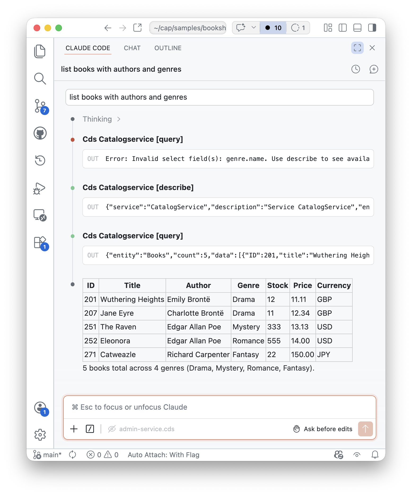
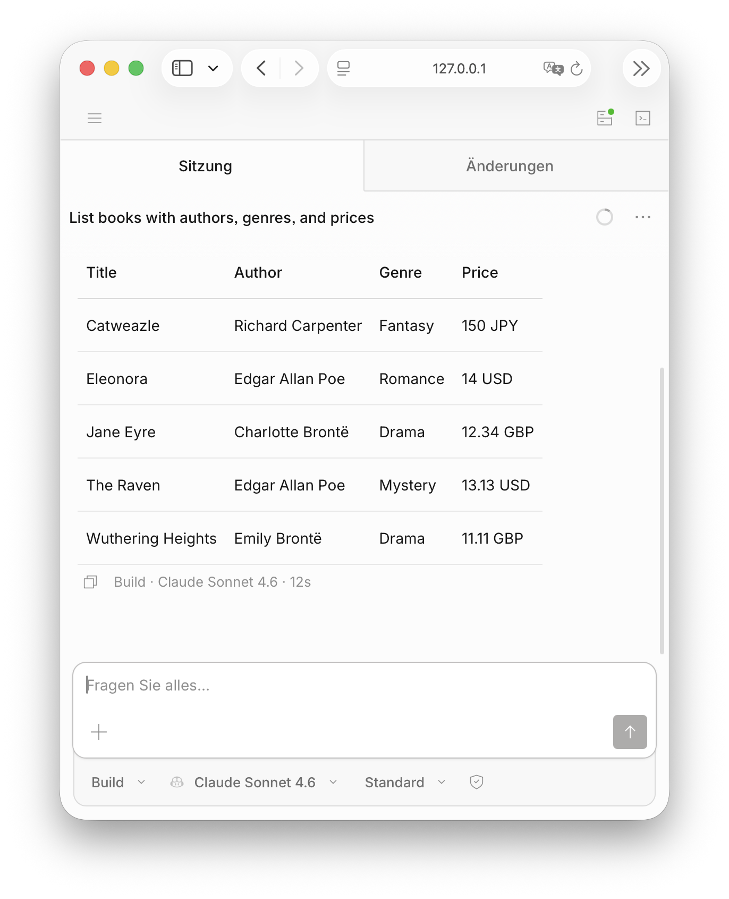

# MCP Protocol Adapter <Beta />


The [Model Context Protocol (MCP)](https://modelcontextprotocol.io/) is an open-source standard that enables direct integration between large language model (LLM) applications and external data sources. Any CAP service can be turned into an MCP server, allowing AI agents and LLM-powered tools to interact with the service without additional implementation work. All that is required is annotating it with [ `@mcp`](#serving-mcp). From CAP perspective MCP is just another protocol which we serve similar to _OData_, _GraphQL_, _REST_, or _HCQL_.

[[toc]]

> [!note]
>
> This guide is about the *MCP Adapter* – e.g. as provided through the [*@cap-js/mcp*](https://github.tools.sap/cap/mcp-adapter) plugin – which powers domain-specific application use cases, for example, to respond to questions for CAP-based applications like *"List all overstocked books"*.
>
> In parallel, there's also the *MCP Server* plugin ([*@cap-js/mcp-server*](https://github.com/cap-js/mcp-server)), which serves a different purpose, though, that is: AI-assisted *development* of CAP projects.


## Preliminaries

Following are one-time preparatory setup tasks. Basically, you need to ensure that you have access to LLM(s) to use with your MCP clients in local test-drives.


<div id="sap-internal"/>


### Get Sample

We use the [`@capire/bookshop`](https://github.com/capire/bookshop) as a running sample hereinafter. Clone it and open it in VSCode as follows:

::: code-group
```shell [Node.js]
git clone https://github.com/capire/bookshop
```
```shell [Java]
git clone https://github.com/SAP-samples/cloud-cap-samples-java bookshop
```
:::

```shell
code bookshop
```


## Adding MCP Plugins


### In CAP Node.js Projects

Within your project root run this to add the [`@cap-js/mcp`](https://github.tools.sap/cap/mcp-adapter) plugin:

```shell [Node.js]
npm add @cap-js/mcp
```
### In CAP Java Projects

Add this to the *srv/pom.xml*:

```xml [Java]
<dependencies>
  <dependency>
    <groupId>com.sap.cds</groupId>
    <artifactId>cds-adapter-mcp</artifactId>
    <version>${cds.services.version}</version>
  </dependency>
</dependencies>
```

Make sure internal artifactory is configured for Maven build as described in [*Java > Getting Started > Setting Up Local Development*](../../java/getting-started.md#local).


## Serving MCP

### Annotate services with `@mcp`

Simply add the `@mcp` annotation to an existing service to expose it via MCP.  For example, add the following to `srv/cat-service.cds`:


::: code-group
```cds [srv/cat-service.cds]
// Serve via OData, HCQL and REST
annotate CatalogService with @odata @hcql @rest;
annotate CatalogService with @mcp; // [!code focus]
```
:::


Start your server with `cds watch` or `mvn cds:watch` and note that the MCP server starts:

::: code-group
```shell [Node.js]
[cds] - serving CatalogService {
  at: [ ..., '/mcp/browse' ], # [!code ++]
  ...
}
```
```shell [Java]
INFO com.sap.cds.adapter.mcp.McpServlet : MCP Server initialized at endpoint '/mcp/browse' for service 'CatalogService'
```
:::

You can also specify an alternative path under which the MCP server should be served, e.g. like that:

```cds
annotate CatalogService with @mcp:'books'
```

> [!tip] Just Another Protocol
> From the perspective of a developer in a CAP-based project, `@mcp` is just another protocol for your services, similar to `@odata`, `@graphql`, `@rest`, or `@hcql`. The adapter takes care of the rest, with all the standard CAP features you know working out of the box also with MCP, including annotations like `@cds.query.limit`, etc.


### Using Specific MCP Services

In case you want to serve tailor the entities or elements served via MCP you can also create specific services for MCP and annotate only those with `@mcp`. For example, you could create a `BooksService` that only exposes a subset of the entities of the `AdminService` like that:

::: code-group
```cds [srv/books-service.cds]
using { AdminService } from './admin-service';
@mcp service BooksService {
  entity Authors as projection on AdminService.Authors {
    ID, name, books,
  }
  entity Books as projection on AdminService.Books {
    ID, title, stock, price,
    author,
    genre.name as genre,
    currency.name as currency,
  }
}
```
:::


> => See also: [_Use Case-Oriented Services_](../../get-started/bookshop#use-case-specific-services) in the getting started guide.


### Adding Context Information

As LLMs rely heavily on context information to create high-quality output, the adapter evaluates existing doc comments and annotations to provide additional information about the service, entities, elements, actions, and parameters to the LLM. This information is included in the output of the [`describe`](#tool-describe) tool and can be used by agents to better understand the data model and available actions/functions. In particular, the following information is evaluated:

- [Doc comments](../../cds/cdl#doc-comments) -> most recommended (Node.js only)
- `@title`
- `@description`

> [!note]
> Doc comments are only supported in Node.js. In Java, use `@title` and `@description` annotations instead.

For example, you can add doc comments to your entities and their elements like that:

```cds
/**
 * This is the author entity.
 * It contains information about book authors.
 */
entity Authors {
  /** The ID of the author. */
  ID : Integer;
  /** The name of the author. */
  name : String;
  /** The books written by the author. */
  books : Association to many Books;
}
```


## Test-drive Locally

With the above setup, your CAP services are exposed via MCP.
To consume them, you need an MCP client. For local testing, you can use tools like [Claude Code](https://code.claude.com/docs/en/overview) or [Opencode](https://opencode.ai/), which have built-in support for MCP and can be easily configured to connect to your local CAP server.

### Using Claude Code

1. Install [Claude Code](https://code.claude.com/docs/en/overview), for example via Homebrew:
    ```shell
    brew install claude-code
    ```

2. Configure it to use the Hyperspace proxy:
    ```sh
    hai configure claude-code
    ```

3. Optionally add [Claude Code for VSCode](https://marketplace.visualstudio.com/items?itemName=anthropic.claude-code):

    ```shell
    code --install-extension anthropic.claude-code
    ```

### Using OpenCode

1. Install [OpenCode](https://opencode.ai/), for example via npm:

    ```shell
    npm i -g opencode-ai
    ```

2. Configure it to use LLMs through the Hyperspace proxy, or an existing GitHub Copilot setup, by following the instructions in the [Hyperspace documentation](https://ai-docs.portal.hyperspace.tools.sap/llm-proxy/recipes/opencode/)


### Run your CAP server

With an MCP Client installed locally, (re-)run your CAP server in a terminal and keep it running to serve MCP requests.

::: code-group
```shell [Node.js]
cds watch
```
```shell [Java]
mvn cds:watch
```
:::

> [!tip] Using Autowired CAP Services
> Whenever you start your application, the MCP adapter automatically registers all MCP endpoints with local MCP clients, so you can just go ahead and run queries from your MCP client without any additional configuration. This makes it super easy to test and interact with your services via MCP during development.
Learn more about that in section [*Autowired MCP Clients*](#autowired-mcp-clients) below.


### Running Queries

With one of the above clients, you can now run queries against your local MCP server.

#### With Claude Code CLI:

```shell
claude "list books with authors and genres"
```
::: code-group
```zsh [=> Output]
⏺ cds:AdminService - query (MCP)(entity: "Books", select: ["ID","title","author.name","genre.name","stock","price"], limit: 20)
  ⎿  {
       "entity": "Books",
       "count": 5,
     … +43 lines (ctrl+o to expand)

┌─────┬───────────────────┬───────────────────┬─────────┬───────┬────────┐
│ ID  │       Title       │      Author       │  Genre  │ Stock │ Price  │
├─────┼───────────────────┼───────────────────┼─────────┼───────┼────────┤
│ 201 │ Wuthering Heights │ Emily Brontë      │ Drama   │ 12    │ 11.11  │
├─────┼───────────────────┼───────────────────┼─────────┼───────┼────────┤
│ 207 │ Jane Eyre         │ Charlotte Brontë  │ Drama   │ 11    │ 12.34  │
├─────┼───────────────────┼───────────────────┼─────────┼───────┼────────┤
│ 251 │ The Raven         │ Edgar Allan Poe   │ Mystery │ 333   │ 13.13  │
├─────┼───────────────────┼───────────────────┼─────────┼───────┼────────┤
│ 252 │ Eleonora          │ Edgar Allan Poe   │ Romance │ 555   │ 14.00  │
├─────┼───────────────────┼───────────────────┼─────────┼───────┼────────┤
│ 271 │ Catweazle         │ Richard Carpenter │ Fantasy │ 22    │ 150.00 │
└─────┴───────────────────┴───────────────────┴─────────┴───────┴────────┘

5 books total across 4 genres (Drama, Mystery, Romance, Fantasy) and 4 authors.
```
:::

Here's the same query ran in Claude Code for VSCode:

{style="width:70%"}


#### With Opencode CLI:

```shell
opencode run list books with authors and genres
```
::: code-group
```zsh [=> Output]
⚙ cds_AdminService_query {"entity":"Books","select":["ID","title","stock","price","author.name","genre.name"],"limit":20}

Here are the books with their authors and genres:

| ID  | Title             | Author            | Genre   | Stock | Price  |
|-----|-------------------|-------------------|---------|-------|--------|
| 201 | Wuthering Heights | Emily Brontë      | Drama   | 12    | 11.11  |
| 207 | Jane Eyre         | Charlotte Brontë  | Drama   | 11    | 12.34  |
| 251 | The Raven         | Edgar Allan Poe   | Mystery | 333   | 13.13  |
| 252 | Eleonora          | Edgar Allan Poe   | Romance | 555   | 14.00  |
| 271 | Catweazle         | Richard Carpenter | Fantasy | 22    | 150.00 |

5 books total. Edgar Allan Poe has two entries, and Drama is the most common genre.
```
:::


You can also run `opencode web` to open the OpenCode web interface, which provides a more user-friendly way to interact with your MCP servers, including features like tool inspection and query building. Here's a screenshot of a simple session:

{style="width:70%"}

### Inspect Log Output

When you run queries, you can inspect the log output of your CAP server to see the incoming MCP requests and how they are processed. This can be helpful for debugging and understanding the interaction between the MCP client and your CAP services.

For example, for the above query, you should see log output similar to this:

::: code-group
```js [Node.js]
[mcp] - query {
  service: 'AdminService',
  entity: 'Books',
  select: [
    { ref: [ 'ID' ] },
    { ref: [ 'title' ] },
    { ref: [ 'stock' ] },
    { ref: [ 'price' ] },
    { ref: [ 'author', 'name' ] },
    { ref: [ 'genre', 'name' ] }
  ]
}
```
```js [Java]
INFO com.sap.cds.adapter.mcp.McpServlet : Received MCP query request for entity 'Books' with select fields [ID, title, author.name, genre.name, stock, price] and limit 20
```
:::


## Under the Hood

### Autowired MCP Clients

Whenever you start your application, the MCP adapter automatically registers all MCP endpoints with local MCP clients – currently supported for [Claude Code](https://code.claude.com/docs) and [Opencode](https://opencode.ai/) - so you can just go ahead and run queries from your MCP client without any additional configuration. This makes it super easy to test and interact with your services via MCP during development.

During startup, the generated MCP servers and their URL are added to the client-specific configuration files like that:

::: code-group
```json [~/.claude.json]
{
  "mcpServers": {
    "cds:AdminService": {
      "type": "http",
      "url": "http://localhost:4004/mcp/admin",
      "headers": {
        "Authorization": "Basic YWxpY2U6"
      }
    },
    "cds:CatalogService": {
      "type": "http",
      "url": "http://localhost:4004/mcp/browse",
      "headers": {
        "Authorization": "Basic YWxpY2U6"
      }
    }
  },
}
```
```json [~/.config/opencode/opencode.json]
{
  "$schema": "https://opencode.ai/config.json",
  "mcp": {
    "cds:AdminService": {
      "type": "remote",
      "url": "http://localhost:4004/mcp/admin",
      "headers": {
        "Authorization": "Basic YWxpY2U6"
      },
      "enabled": true
    },
    "cds:CatalogService": {
      "type": "remote",
      "url": "http://localhost:4004/mcp/browse",
      "headers": {
        "Authorization": "Basic YWxpY2U6"
      },
      "enabled": true
    }
  }
}
```
:::

When the application stops, the added configuration is removed. This is only intended for local development.

> [!warning] For Development Only
> The autowiring is only enabled during development (i.e., when running `cds watch` or `mvn cds:watch`) and not meant for production use cases.

#### Mock Authentication

Note that the automatic client configuration adds `Authorization` headers for the mock user `alice` (Node.js) or `privileged` (Java). If your service requires something different, you can customize the credentials via the `cds.mcp.autowire` configuration:

```json [package.json]
{
  "cds": {
    "mcp": {
      "autowire": {
        "user": "admin",
        "password": "admin"
      }
    }
  }
}
```


#### Opting out of Autowiring

You can opt out of this by setting the `cds.mcp.autowire` option to `false`, like so in your `package.json`:

```json [package.json]
{
  "cds": {
    "mcp": {
      "autowire": false
    }
  }
}
```

Manually add the MCP server config to your client, for example with Claude Code CLI:

```shell
claude mcp add --transport http CatalogService http://localhost:4004/mcp/browse
```


### MCP served out of the box

The adapter creates an MCP server per CAP service, hence each CAP application can expose multiple MCP servers. By default, the adapter creates the following tools for each MCP server, which can be used by LLMs and AI agents to interact with the service.

> [!warning]
> Tools are meant to be used by LLMs and AI agents and do not constitute a stable API.
> They may change in the future based on the needs of LLMs and AI agents. For stable APIs, please use the existing CAP protocols like OData, REST, GraphQL, etc.

#### Tool: `describe`
This tool returns information about the entities and their elements exposed by the service. It also returns information about unbound actions and functions. If you do not provide a parameter, the tool describes all exposed entities, actions and functions. The optional parameter `entity` restricts the output to a single entity, the optional parameter `action` restricts the output to a single action/function. The tool provides an enum that lists all available entities, actions and functions.

#### Tool: `query`
This tool is used to read data from the service. The only required parameter is `entity`, an enum that lists all entities exposed by the service. This tool takes all provided parameters and translates them to a [CQN](../../cds/cqn) query, which the service runs via `service.run(query)`. The parameter descriptions explain how to use them.

Parameters of `query` requests:

| Parameter | Description                                                                                                  |
|-----------|--------------------------------------------------------------------------------------------------------------|
| select    | Array of [`expr`](../../cds/cqn#expr) objects or `strings` ; allows path expressions along associations. |
| entity    | The entity to query (enum values from `describe`)                                                            |
| where     | Array of [`xpr`](../../cds/cqn#where) objects used as predicates used for filtering                     |
| limit     | An integer limiting the results to return                                                                    |
| one       | Return a single record instead of an array. Implies `limit:1`; default: `false`                              |
| distinct  | Return only unique rows; default: `false` (Node.js only)                                                     |
| groupBy   | An array of [`ref`](../../cds/cqn#ref) objects or `strings` to group results.                           |
| orderBy   | List of objects to order the results (ref, sort, nulls)                                                      |


#### Tool: `call_action`

This tool is used to call unbound actions or functions. The required parameter `action` is an enum that lists all unbound actions and functions exposed by the service. The parameters of the action or function to call can be provided via the optional parameter `parameters`, that must contain all required parameters of the action or function. The tool takes these parameters and calls the action or function on the service.

### Inspect the Tools

You can start an [MCP Inspector](https://modelcontextprotocol.io/docs/tools/inspector) to inspect tools:

```bash
npx @modelcontextprotocol/inspector
```

The inspector should automatically open in your browser.

1. Select _Streamable HTTP_ as Transport Type.
2. Enter the URL of your service (e.g., `http://localhost:4004/mcp/browse`).
3. Select `Via Proxy` as connection type and select _Connect_.
4. Go to the _Tools_ tab and select _List Tools_.
5. To get data, select the _query_ tool.
6. Choose an entity.
7. Scroll down and select _Run Tool_.


## Current Limitations


### Query and Actions Only

The MCP tools created by the adapter are currently focused on reading data and calling [**_unbound_** actions and functions](../../cds/cdl#actions) only. This means that you can use MCP to [`query`](#tool-query) data from your CAP services, while any data changes need to be implemented via unbound actions for now.

For example, action `submitOrder` in the `CatalogService` ultimately creates an Order:

::: code-group
```cds [srv/catalog-service.cds]
service CatalogService {
  ...
  @requires: 'authenticated-user'
  action submitOrder ( book: Books:ID, quantity: Integer ); // [!code focus]
}
```
:::

Future versions of the adapter may add support for data changes using CREATE, UPDATE, and DELETE operations.


### Prompt Injection Attacks

> [!caution]
> The MCP adapter does not perform any input validation or output validation regarding prompt injections.
> Hence, for production use cases ensure you use infrastructure and practices that mitigate prompt injection risks and connect only to trusted MCP agents (e.g., Joule).
