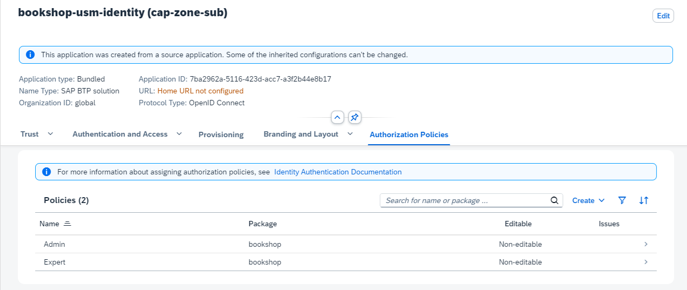

<script setup>
  import { h } from 'vue'
  const Y  =  () => h('span', { class: 'y',   title: 'Available' },      ['✓']   )
  const X  =  () => h('span', { class: 'x',   title: 'Available' },      ['✗']   )
  const Na =  () => h('span', { class: 'na',  title: 'Not available' },  ['n/a']   )
</script>
<style scoped>
  .y   { color: var(--green); font-weight:900; }
  .x   { color: var(--red);   font-weight:900; }
  /* .na  { font-weight:500; } */
</style>


# Users { #users }

A successfull authentication results in an CAP [user representation](#claims) reflecting the request user in an uniform way.
Referring to the key concepts, the abstraction serves to fully decouple authorization and business logic from pluggable authentication strategy.
It contains static information about the user such as name, ID and tenant. Moreover it contains additional claims such as roles or assigned attributes that are relevant for [authorization](./authorization).

Dynamic assignments of roles to users can be done by 
- [Authorization Management Service (AMS)](#ams-roles) in case of [IAS authentication](./authentication#ias-auth).
- [XS User Authentication and Authorization Service (XSUAA)](#xsuaa-roles) in case of [XSUAA authentication](./authentication#xsuaa-auth).

In addition, CAP users provide an API for [programmatic]( #developing-with-users ) processing and customization.

[[toc]]

## User Representation { #claims }

After _successful_ authentication, a CAP user is mainly represented by the following properties:

- **_Logon name_** identifying the user uniquly
- **_Tenant_** describes the tenant of the user (subscriber or provider) which implies the CDS model and business data container.
- **_Roles_** the user has been assigned by an user administrator (business [user roles](#roles)) or roles which are derived by the authentication level ([pseudo roles](#pseudo-roles)).
- **_Attributes_** the user has been assigned e.g. for instance-based authorization.

<div class="impl java">

The user information is reflected in the `UserInfo` object [attached to the request](#reflection).

</div>

<div class="impl node">

The user information is reflected in `req.user` and `req.tenant` [attached to the request](#reflection).

</div>


### User Types

CAP users can be classified in multiple dimensions:

**Business users vs. technical users:** 
- Business users represent identified end users who log in to interact with the system.
- Technical users operate on behalf of an entire tenant at a technical API level.

**Authenticated users vs. anonymous users**
- Authenticated users have successfully completed authentication by presenting a claim (e.g., a token).
- Anonymous users are unidentifiable, as they have not presented any claim for endpoints with optional authentication.

**Provider vs. subscriber tenant**
- The provider tenant includes all users of the application owner.
- A subscriber tenant includes all users of an application customer.


Typically, the provider tenant is not subscribed to a multi-tenant application and therefore has no business users.
In contrast, for a single-tenant application, there is no subscriber tenant, and the provider tenant includes all business users.

| MT Application    | Business users | Technical users
|-------------------|----------------|---
| Provider Tenant   |         -     | <Y/>
| Subscriber Tenant |         <Y/>      | <Y/> 

::: tip
Apart from anonymous users, all users have a unique tenant.
:::

The user types are designed to support various flows, such as:
- UI requests are executed on behalf of a business user interacting with the CAP backend service.
- During the processing of a business request, the backend utilizes platform services on behalf of the technical user of the subscriber tenant.
- An asynchronously received message processes data on behalf of the technical user of a subscriber tenant.
- A background task operates on behalf of the technical provider tenant."
- ...

Find more details about how to [switch the user context](#switching-users) during request processing.


### Roles { #roles}

As a basis for access control, you can design application specific CAP roles which are assigned to users at application runtime.
**A CAP role should reflect _how_ a user can interact with the application at an operational level**, rather than a fine-grained event at a purely technical level.

```cds
annotate Issues with @(restrict: [
    { grant: ['READ','WRITE'],
      to: 'ReportIssues',
      where: ($user = CreatedBy) },
    { grant: ['READ'],
      to: 'ReviewIssues' },
    { grant: ['READ', 'WRITE'], 
      to: 'ManageIssues' }
]);
```

For instance, the role `ReportIssues` allows to work with the `Issues` created by the own user, whereas a user with role `ReviewIssues` is only allowed to read `Issues` of any user.

CAP roles represent basic building blocks for authorization rules that are defined by the application developers who have in-depth domain knowledge.
Independently from that, user administrators combine CAP roles in higher-level policies and assign to business users in the platform's central authorization management solution.

::: tip
CDS-based authorization deliberately refrains from using technical concepts, such as _scopes_ in _OAuth_, in favor of user roles, which are closer to the technical domain of business applications.
:::

#### Pseudo Roles { #pseudo-roles}
 
It's frequently required to define access rules that aren't based on an application-specific user role, but rather on the _technical authentication level_ of the request. 
For instance, a service should be accessible only for technical users, with or without user propagation. 
Such roles are called pseudo roles as they aren't assigned by user administrators, but are added by the runtime automatically on succcessful authentication, reflecting the technical level:

| Pseudo Role                 | User Type | Technical Indicator | User Name
|-----------------------------|---------------------|---------------|---------------|
| `authenticated-user`        | <Na/>  | _successful authentication_ |  _derived from the token_ |
| `any`        | <Na/>      | <Na/>   | _derived from the token if available or `anonymous`_ |
| `system-user` | _technical_                   | _client credential flow_ | `system` |
| `internal-user` | _technical_        | _client credential flow with same identity instance_ | 

The pseudo-role `system-user` allows you to separate access by business users from _technical_ clients. 
Note that this role does not distinguish between any technical clients sending requests to the API.

Pseudo-role `internal-user` allows to define application endpoints that can be accessed exclusively by the own PaaS tenant on technical level. 
In contrast to `system-user`, the endpoints protected by this pseudo-role do not allow requests from any external technical clients. 
Hence is suitable for **technical intra-application communication**, see [Security > Application Zone](./overview#application-zone).

::: warning
All technical clients that have access to the application's XSUAA or IAS service instance can call your service endpoints as `internal-user`.
**Refrain from sharing this service instance with untrusted clients**, for instance by passing services keys or [SAP BTP Destination Service](https://help.sap.com/docs/connectivity/sap-btp-connectivity-cf/create-destinations-from-scratch) instances.
:::


### Model References

The resulting object representaiton of the user is attached to the current request context and has an impact on the request flow for instance with regards to
- [authorizations](./authorization#restrictions)
- [enriching business data](../guides/domain-modeling#managed-data) with user data
- setting [DB session variables](../guides/db-feature-comparison#session-variables)

In the CDS model, some of the user properties can be referenced in annotations or static views:

| User Property                 | CDS Model Reference | CDS Artifact       |
|-------------------------------|---------------------|--------------------|
| Name                          | `$user`             | annotations and static views |
| Attribute                     | `$user.<attribute>` | [@restrict](./authorization#user-attrs) |
| Role                          | `<role>`            | [@requires](./authorization#requires) and [@restrict.to](./authorization#restrict-annotation) |


## Role Assignment with AMS { #roles-assignment-ams }

CAP applications that use the [Identity Authentication Service (IAS)](https://help.sap.com/docs/identity-authentication) for authentication also leverage the [Authorization Management Service (AMS)](https://help.sap.com/docs/cloud-identity-services/authorization-management-service) to provide comprehensive authorization. Similar to IAS, AMS is part of the [SAP Cloud Identity Services (SCI)](https://help.sap.com/docs/cloud-identity-services).

Why is AMS required? Unlike tokens issued by XSUAA, IAS tokens only contain static user information and cannot directly provide CAP roles.
AMS acts as a central service to define access policies that include CAP roles and additional filter criteria for instance-based authorizations in CAP applications.
_Business users_, technically identified by the IAS ID token, can have AMS policies assigned by user administrators.

::: tip
Authorizations for technical users should not be adressed by AMS policies.
:::

The integration with AMS is provided as an easy-to-use plugin for CAP applications.
At the time of the request, the AMS policies assigned to the request user are evaluated by the CAP AMS plugin, and the CAP roles and filters are applied to the request context accordingly, as illustrated in the diagram:

{width="500px" }

The interaction between the CAP application and AMS (via plugin) is as follows:

1. IAS-Authentication is performed independently as a pre-step.
2. The plugin injects **user roles and filters** according to AMS policies assigned to the current request user.
3. CAP performs the authorization on the basis of the CDS authorization model and the injected user claims.


### Adding AMS

**AMS is transparent to CAP application code** and can be easily consumed via plugin dependency.

To enhance your project with AMS, you can make use of CDS CLI tooling:

```sh
cds add ams
```

This automatically adds required configuration for AMS, taking into account the concrete application context (tenant mode and runtime environment etc.).
If required, it also runs the new `cds add ias` command to configure the project for IAS authentication.

::: details See dependencies added

::: code-group
```xml [pom.xml]
<properties>
  <sap.cloud.security.ams.version>3.7.0</sap.cloud.security.ams.version> <!-- [!code ++] -->
</properties>
```

```xml [srv/pom.xml - dependencies]
<dependencies>
  <dependency>  <!-- [!code ++:10] -->
    <groupId>com.sap.cloud.security.ams.client</groupId>
    <artifactId>jakarta-ams</artifactId>
    <version>${sap.cloud.security.ams.version}</version>
  </dependency>
  <dependency>
    <groupId>com.sap.cloud.security.ams.client</groupId>
    <artifactId>cap-ams-support</artifactId>
    <version>${sap.cloud.security.ams.version}</version>
  </dependency>
</dependencies>
```

```xml [srv/pom.xml - plugins]
<plugins>
  <plugin>
    <groupId>com.sap.cds</groupId>
    <artifactId>cds-maven-plugin</artifactId>
    <executions>
      <execution>
        <id>cds.build</id>
        <goals>
          <goal>cds</goal>
        </goals>
        <configuration>
          <commands>
          [...]
            <command>build --for ams</command> <!-- [!code ++:1] -->
          </commands>
        </configuration>
    </execution>
    </plugin>
  <plugin>  <!-- [!code ++:19] -->
    <groupId>com.sap.cloud.security.ams.client</groupId>
    <artifactId>dcl-compiler-plugin</artifactId>
    <version>${sap.cloud.security.ams.version}</version>
    <executions>
      <execution>
        <id>compile</id>
        <goals>
          <goal>compile</goal>
        </goals>
        <configuration>
          <sourceDirectory>${project.basedir}/src/main/resources/ams</sourceDirectory>
          <dcn>true</dcn>
          <dcnParameter>pretty</dcnParameter>
          <compileTestToDcn>true</compileTestToDcn>
        </configuration>
      </execution>
    </executions>
  </plugin>
</plugins>
```

:::

These libraries integrate into the CAP framework to handle incoming requests. 
Based on the user's assigned [policies](#generate-policies), the user's roles are determined and written to the [UserInfo](./security#enforcement-api) object. 
The framework then authorizes the request as usual based on the user's roles.

::: details Node.js plugin `@sap/ams` added to the project

```json [package.json]
{
  "devDependencies": {
    "@sap/ams": "^3"
  }
}
```

:::

The `@sap/ams` plugin provides multiple build-time features:

- Validate `ams.attributes` annotations for type coherence against the AMS schema.
- Generate policies from the CDS model during the build using a [custom build task](../guides/deployment/custom-builds#custom-build-plugins).
- Generate a deployer application during the build to upload the Data Control Language (DCL) base policies.


Read more about AMS <span id="internallinks"/>


### Prepare CDS Model

On the level of application domain, you can declaratively introduce access rules in the CDS model, enabling higher-level interaction flows with the entire application domain:
 - a [CAP role for AMS](#roles-for-ams) can span multiple domain services and entities, providing a holistic perspective on _how a user interacts with the domain data_.
 - a [CAP attribute for AMS](#attributes-for-ams) is typically cross-sectional and hence is defined on a domain-global level.

The CDS model is fully decoupled from AMS policies which are defined on business level on top by external administrators.
Hence, the **rules in the CAP model act as basic building blocks for higher-level businness rules** and therefore should have appropriate granularity.


#### CAP Roles for AMS { #roles-for-ams }

You can define CAP roles in the CDS model as [described before](#roles).

::: tip
A CAP role describes a **conceptual role on technical domain level** defined by application developers.
In contrast, an AMS policy reflects a coarser-grained **business role on application level** defined by user administrators.
:::

For instance, you can enhance the bookshop sample by replacing the `admin` role with more fine-grained CAP roles:

```cds
service AdminService @(requires: ['ManageAuthors', 'ManageBooks']) {

  entity Books @(restrict: [
    { grant: ['READ'], to: 'ManageAuthors' },
    { grant: ['READ', 'WRITE'], to: 'ManageBooks' } ])
  as projection on my.Books;

  entity Authors @(restrict: [
    { grant: ['READ', 'WRITE'], to: 'ManageAuthors' },
    { grant: ['READ'], to: 'ManageBooks' } ])
  as projection on my.Authors;
}
```

Role `ManageBooks` allows an user to mange books _for the authors already in sale_, auch as offering new books.
In contrast, users with `ManageAuthors` are allowed to decide which authors' books should be offered, but they do not define the range of books.
Both CAP roles are ready to be used in higher-level [AMS policies](#policies).

::: tip
You can simply reuse existing CAP roles for AMS. There is no need to modify the CDS model.
:::

[Learn more about role-based authorizations in CAP](./authorization#restrictions){.learn-more}


#### CAP Attributes for AMS { #attributes-for-ams }

Attributes for AMS offer user administrators an additional layer of flexibility to partition domain entities into smaller, more manageable units for access control.
The domain attributes, which are exposed to user administrators for defining custom filter conditions, must be predefined by the application developer in the CDS model using the `@ams` annotation.

For example, the instances of entity `Books` can be classified by the associated genre. 
Hence, `genre.name` appears to be a suitable  AMS attribute value, exposed under the name `Genre`:

```cds
annotate AdminService.Books with @ams.attributes: {
  Genre: (genre.name)
};
```

In general, the `@ams` annotation operates on the entity level.
The value of the AMS attribute needs to point to a single-value property of the target entity (paths are supported).
It is highly recommended to make use of a compiler expression in order to ensure validity of the value reference.


::: tip
Choose attributes exposed to AMS carefully.
The attribute should have cross-sectional sematic in the domain.
:::

As such attributes are usually shared by multiple entities, it is convenient to add the `@ams`-annotation on level of a shared aspect as scetched here:

```cds
aspect withGenre @ams.attributes: { Genre: (genre.name) } {
    genre : Association to Genres;
}

entity Books : withGenre { ... }
```

The detailed syntax of `@ams` annotation provides an `attribute` property which might be helpful to decouple the external from the internal name:
```cds
annotate AdminService.Books with @ams.attributes.genre: {
  attribute: 'Genre', element: (genre.name)
};
```


### Prepare Policies { #policies }

CAP roles and attribute filters cannot be directly assigned to business users.
Instead, the application defines AMS base policies that include CAP roles and attributes, allowing user administrators to assign them to users or create custom policies based on them.

:::tip
AMS policies represent the business-level roles of end users interacting with the application.
Often, they reflect real-world jobs or functions.
:::

After the application is built, check the *srv/src/main/resources/ams* folder to see the generated AMS *schema* and a *basePolicies* DCL file in a package called *cap*:

::: code-group

``` [srv/src/main/resources]
└─ ams
   ├─ cap
   │  └─ basePolicies.dcl
   └─ schema.dcl
```

:::

The generated policies are a good starting point to add manual modifications.

The generated DCL-schema contains all AMS attributes exposed for filtering and does not need to be refined:

```yaml [/ams/schema.dcl]
SCHEMA {
 Genre : String
}
```

In contrast, the generated policies are usually subject to change.
For example, you can rename the policies to reflect appropriate job functions for the bookstore and adjust the referenced CAP roles as needed:

```yaml [/ams/cap/basePolicies.dcl]
POLICY StockManager {
  ASSIGN ROLE ManageBooks WHERE Genre IS NOT RESTRICTED;
}

POLICY ContentManager {
  ASSIGN ROLE ManageAuthors;
  ASSIGN ROLE ManageBooks;
}
```

In contrast to a `StockManager` who is responsible for the books offering, a `ContentManager` makes the author selection, in addition.
Optionally, CAP role `ManageBooks` for `StockManager` might be restricted to specific genres by applying filters prepared in customized policies.
As a `ContentManager` there is no genre-based restriction based on genres is prepared.


[Learn more about AMS policies](https://help.sap.com/docs/cloud-identity-services/cloud-identity-services/configuring-authorization-policies){.learn-more}


### Local Testing

Although the AMS policies are not yet [deployed to the Cloud service](#ams-deployment), you can assign (custom) policies to mock users and run local tests:

```yaml
cds:
  security:
    mock:
      users:
        content-manager: // [!code ++]
          policies: // [!code ++]
            - cap.ContentManager // [!code ++]
        stock-manager: // [!code ++]
          policies: // [!code ++]
            - cap.StockManager // [!code ++]
```

This is also very helpful in unit test scenarios.

:::tip
Don't forget to refer to fully qualified policy names including the package name (`cap` in this example).
:::

Now (re)start the application with

```sh
mvn spring-boot:run
```

and verify in the UI (`http://localhost:8080`) that the access rules apply as implied by the assigned policies:
- `content-manager` and `stock-manager` have full _read_ access to `Books` and `Authors` in the `AdminService`.
- `content-manager` can edit `Books` and `Authors`.
- `stock-manager` can only edit `Books`.


```sh
c.s.c.s.a.c.AmsRuntimeConfiguration      : Configured AmsUserInfoProvider
```

ogging:
    level:
        com.sap.cloud.security.ams: DEBUG
        com.sap.cloud.security.ams.dcl.capsupport: DEBUG

/cap
   - basePolicies.dcl
/generated
  - basePolicies.dcl
/local
  - testPolicies.dcl


### Cloud Deployment { #ams-deployment }

Policies are typically deployed to the AMS server whenever the application is deployed. Afterwards, those policies can be assigned to users in the Administration Console of the IAS tenant, for example, to grant a role to a user. Using the AMS plugins (`cds add ams`), the configuration of the deployment artifacts is done automatically.

::: details Prerequisites on SAP BTP

- [Get your SAP Cloud Identity Service tenant.](https://help.sap.com/docs/cloud-identity-services/cloud-identity-services/get-your-tenant)
- [Establish Trust](https://help.sap.com/docs/btp/sap-business-technology-platform/establish-trust-and-federation-between-uaa-and-identity-authentication) towards your SAP Cloud Identity Service tenant to use it as identity provider for applications in your subaccount.

:::

Follow the [Deploy to Cloud Foundry guide](../guides/deployment/to-cf), to prepare your project for deployment. Here's a shortcut:

```sh
cds add hana,approuter,mta,ams

```

After successful deployment, you need to [Assign Authorization Policies](https://help.sap.com/docs/cloud-identity-services/cloud-identity-services/assign-authorization-policies).


::: details Assign users to AMS policies



:::


<!-- [Learn more about using IAS and AMS with CAP Java.](/java/ams){.learn-more} -->
[Learn more about using IAS and AMS with CAP Node.js](https://github.com/SAP-samples/btp-developer-guide-cap/blob/main/documentation/xsuaa-to-ams/README.md){.learn-more}
Neue AMS CAP Doku https://sap.github.io/cloud-identity-developer-guide/CAP/Basics.html

https://sap.github.io/cloud-identity-developer-guide/CAP/cds-Plugin.html
https://sap.github.io/cloud-identity-developer-guide/Authorization/GettingStarted.html


## Role Assignment with XSUAA { #xsuaa-roles }

Information about roles and attributes can be made available to the UAA platform service. 
This information enables the respective JWT tokens to be constructed and sent with the requests for authenticated users. 
In particular, the following happens automatically behind-the-scenes upon build:


### Generate Security Descriptor 

Derive scopes, attributes, and role templates from the CDS model:

<div class="impl java">

```sh
cds add xsuaa
```

</div>

<div class="impl node">
```sh
cds add xsuaa --for production
```
</div>

This generates an _xs-security.json_ file:

::: code-group
```json [xs-security.json]
{
  "scopes": [
    { "name": "$XSAPPNAME.admin", "description": "admin" }
  ],
  "attributes": [
    { "name": "level", "description": "level", "valueType": "s" }
  ],
  "role-templates": [
    { "name": "admin", "scope-references": [ "$XSAPPNAME.admin" ], "description": "generated" }
  ]
}
```
:::

For every role name in the CDS model, one scope and one role template are generated with the exact name of the CDS role.

::: tip Re-generate on model changes
You can have such a file re-generated via
```sh
cds compile srv --to xsuaa > xs-security.json
```
:::

See [Application Security Descriptor Configuration Syntax](https://help.sap.com/docs/HANA_CLOUD_DATABASE/b9902c314aef4afb8f7a29bf8c5b37b3/6d3ed64092f748cbac691abc5fe52985.html) in the SAP HANA Platform documentation for the syntax of the _xs-security.json_ and advanced configuration options.

<!-- REVISIT: Not ideal cds compile --to xsuaa can generate invalid xs-security.json files -->
::: warning Avoid invalid characters in your models
Roles modeled in CDS may contain characters considered invalid by the XSUAA service.
:::

If you modify the _xs-security.json_ manually, make sure that the scope names in the file exactly match the role names in the CDS model, as these scope names will be checked at runtime.

### Publish Security Descriptor

If there's no _mta.yaml_ present, run this command:

```sh
cds add mta
```

::: details See what this does in the background…

1. It creates an _mta.yaml_ file with an `xsuaa` service.
2. The created service added to the `requires` section of your backend, and possibly other services requiring authentication.
::: code-group
```yaml [mta.yaml]
modules:
  - name: bookshop-srv
    requires:
      - bookshop-auth // [!code ++]
resources:
  name: bookshop-auth // [!code ++]
  type: org.cloudfoundry.managed-service // [!code ++]
  parameters: // [!code ++]
    service: xsuaa // [!code ++]
    service-plan: application // [!code ++]
    path: ./xs-security.json # include cds managed scopes and role templates // [!code ++]
    config: // [!code ++]
      xsappname: bookshop-${org}-${space} // [!code ++]
      tenant-mode: dedicated # 'shared' for multitenant deployments // [!code ++]
```
:::


Inline configuration in the _mta.yaml_ `config` block and the _xs-security.json_ file are merged. If there are conflicts, the [MTA security configuration](https://help.sap.com/docs/HANA_CLOUD_DATABASE/b9902c314aef4afb8f7a29bf8c5b37b3/6d3ed64092f748cbac691abc5fe52985.html) has priority.

[Learn more about **building and deploying MTA applications**.](/guides/deployment/){ .learn-more}

### Assign Roles in SAP BTP Cockpit

This is a manual step an administrator would do in SAP BTP Cockpit. See [Set Up the Roles for the Application](/node.js/authentication#auth-in-cockpit) for more details. 
If a user attribute isn't set for a user in the IdP of the SAP BTP Cockpit, this means that the user has no restriction for this attribute. 
For example, if a user has no value set for an attribute "Country", they're allowed to see data records for all countries.
In the _xs-security.json_, the `attribute` entity has a property `valueRequired` where the developer can specify whether unrestricted access is possible by not assigning a value to the attribute.


## Developing with CAP Users { #developing-with-users }


### Programmatic Reflection { #reflection  }

UserInfo

req.user
req.tenant

The service provider frameworks **automatically enforce** restrictions in generic handlers. They evaluate the annotations in the CDS models and, for example:

* Reject incoming requests if static restrictions aren't met.
* Add corresponding filters to queries for instance-based authorization, etc.

If generic enforcement doesn't fit your needs, you can override or adapt it with **programmatic enforcement** in custom handlers:

- [Authorization Enforcement in Node.js](/node.js/authentication#enforcement)
- [Enforcement API & Custom Handlers in Java](/java/security#enforcement-api)


### Modifying Users { #modifying-users }
  - UserProvider  


Depending on the configured [authentication](#prerequisite-authentication) strategy, CAP derives a *default set* of user claims containing the user's name, tenant and attributes:

| CAP User Property   | XSUAA JWT Property               | IAS JWT Property        |
|---------------------|----------------------------------|-------------------------|
| `$user`             | `user_name`                      | `sub`                   |
| `$user.tenant`      | `zid`                            | `zone_uuid`             |
| `$user.<attribute>` | `xs.user.attributes.<attribute>` | All non-meta attributes |

::: tip
CAP does not make any assumptions on the presented claims given in the token. String values are copied as they are.
:::

In most cases, CAP's default mapping will match your requirements, but CAP also allows you to customize the mapping according to specific needs. For instance, `user_name` in XSUAA tokens is generally not unique if several customer IdPs are connected to the underlying identity service.
Here a combination of `user_name` and `origin` mapped to `$user` might be a feasible solution that you implement in a custom adaptation. Similarly, attribute values can be normalized and prepared for [instance-based authorization](#instance-based-auth). Find details and examples how to programmatically redefine the user mapping here:

- [Set up Authentication in Node.js.](/node.js/authentication)
- [Custom Authentication in Java.](/java/security#custom-authentication)

::: warning Be very careful when redefining `$user`
The user name is frequently stored with business data (for example, `managed` aspect) and might introduce migration efforts. Also consider data protection and privacy regulations when storing user data.
:::


### Switching and Propagating Users { #switching-users }
	- request internal
	- tenant switch
	- privileged mode
	- original authentication claim
	- asynchronous -> implicit to technical user
  - technical -> buisiness not possible

### Tracing { #user-tracing }

<div class="impl java">

DEBUG level by default

logging.level.com.sap.cds.security.authentication: DEBUG

```sh
MockedUserInfoProvider: Resolved MockedUserInfo [id='mock/viewer-user', name='viewer-user', roles='[Viewer]', attributes='{Country=[GER, FR], tenant=[CrazyCars]}'
```

Never in production!
</div>

<div class="impl node">
TODO
</div>


## Ptifalls

- asynchronous business requests
- wrong granularity of CAP/AMS roles
- no cross-sectional attributes
- mixing business roles with technical
