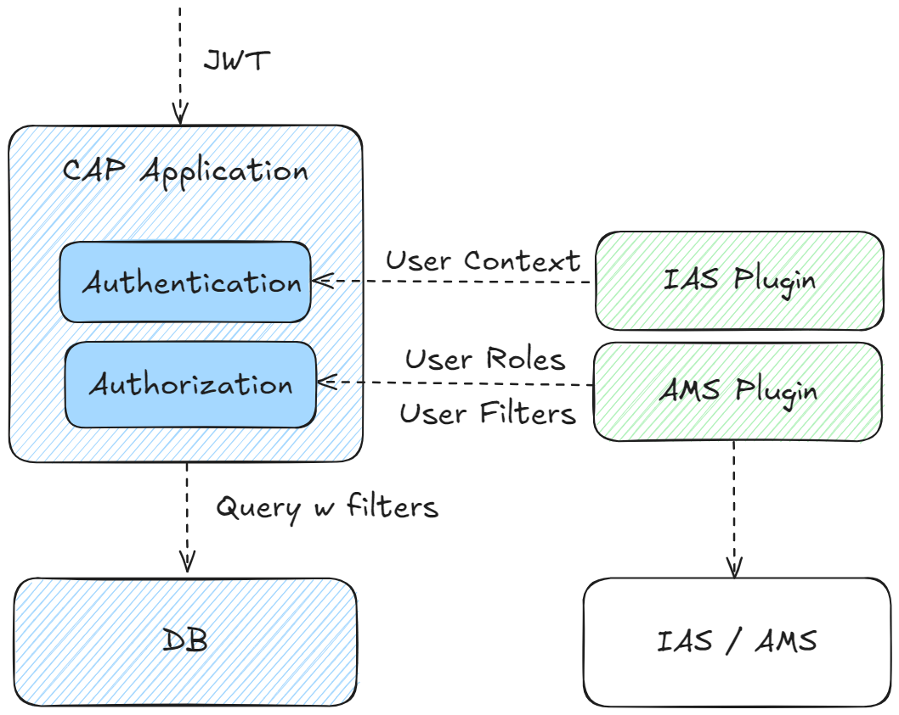
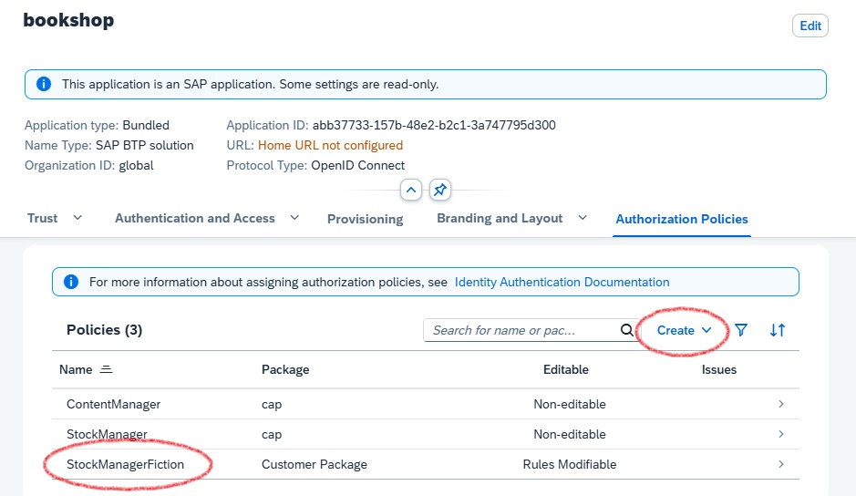
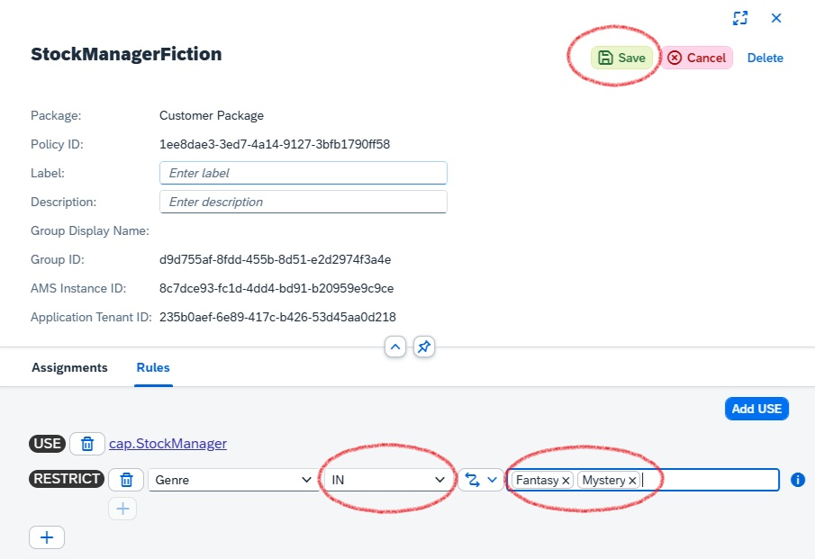
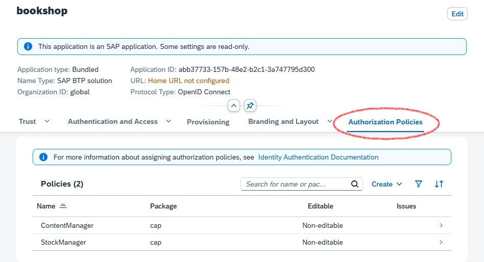
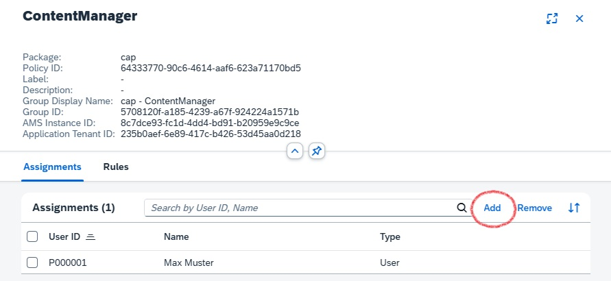
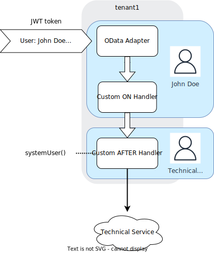
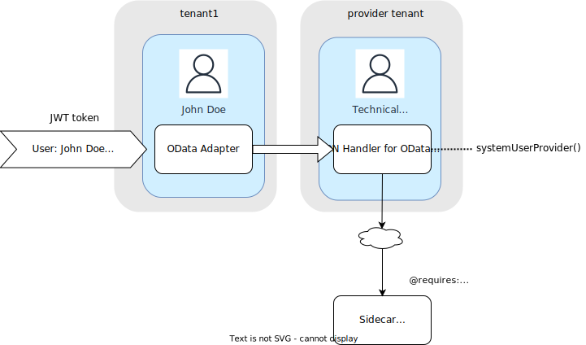
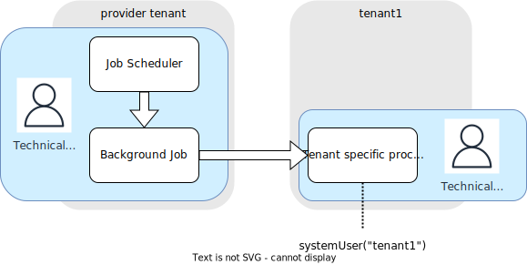

<script setup>
  import { h } from 'vue'
  const Y  =  () => h('span', { class: 'y',   title: 'Available' },      ['✓']   )
  const X  =  () => h('span', { class: 'x',   title: 'Available' },      ['✗']   )
  const Na =  () => h('span', { class: 'na',  title: 'Not available' },  ['n/a']   )
</script>
<style scoped>
  .y   { color: var(--green); font-weight:900; }
  .x   { color: var(--red);   font-weight:900; }
  /* .na  { font-weight:500; } */
</style>


# CAP Users { #cap-users }

<ImplVariantsHint />

This guide introduces to CAP user abstraction and role assignments.

[[toc]]

## CAP User Abstraction { #claims }

A successful authentication results in a CAP [user representation](#claims) reflecting the request user in a uniform way.
Referring to the [key concepts](./overview#key-concept-decoupled-coding), the abstraction serves to fully decouple authorization and business logic from pluggable authentication strategies.
It contains static information about the user such as name, ID and tenant. Additionally, it contains claims such as roles or assigned attributes that are relevant for [authorization](./authorization).

{width="650px" }

After _successful_ authentication, a **CAP user** is mainly represented by the following properties:

- **_Logon name_** identifying the user uniquely
- **_Tenant_** describes the tenant of the user (subscriber or provider) which implies the CDS model and business data container.
- **_Roles_** the user has been assigned by a user administrator (business [user roles](#roles)) or roles which are derived by the authentication level ([pseudo roles](#pseudo-roles)).
- **_Attributes_** the user has been assigned, for example, for instance-based authorization.

<div class="impl java">

The user information is reflected in the `UserInfo` object [attached to the request](#reflection).

</div>

<div class="impl node">

The user information is reflected in `req.user` and `req.tenant` [attached to the request](#reflection).

</div>


### User Types

CAP users can be classified in multiple dimensions:

**Business users vs. technical users:** 
- Business users represent identified end users who log in to interact with the system.
- Technical users operate on behalf of an entire tenant at a technical API level.

**Authenticated users vs. anonymous users**
- Authenticated users have successfully completed authentication by presenting valid credentials (e.g., a token).
- Anonymous users are unidentifiable in general, as they usually do not presented any credentials.

**Provider vs. subscriber tenant**
- The provider tenant includes all users of the application owner.
- A subscriber tenant includes all users of an application customer.


Typically, the provider tenant is not subscribed to a [multi-tenant application](../multitenancy/#multitenancy) and therefore has no business users.

| Multi-Tenant Application | Business users | Technical user
|---------------------------|----------------|----------------
| Provider Tenant           |       -        | <Y/>
| Subscriber Tenants        |      <Y/>      | <Y/> 

In contrast, for a single-tenant application, the provider tenant coincides with the only subscriber tenant and therefore contains all business users.

| Single-Tenant Application | Business users | Technical user
|---------------------------|----------------|----------------
| Provider (=subscriber) Tenant  |      <Y/>      | <Y/>


::: tip
Apart from anonymous users, all users have a unique tenant.
:::

The user types are designed to support various flows, such as:
- UI requests executed on behalf of a business user interacting with the CAP backend service.
- Backend processing that utilizes platform services on behalf of the technical user of the subscriber tenant.
- Asynchronously received messages that process data on behalf of the technical user of a subscriber tenant.
- Background tasks that operate on behalf of the technical provider tenant.
- etc.

Find more details about how to [switch the user context](#switching-users) during request processing.


### Roles { #roles}

As a basis for access control, you can design application specific CAP roles which are assigned to users at application runtime.
**A CAP role should reflect _how_ a user can interact with the application at an operational level**, rather than a fine-grained event at a purely technical level.

```cds
annotate Issues with @(restrict: [
    { grant: ['READ','WRITE'],
      to: 'ReportIssues',
      where: ($user = CreatedBy) },
    { grant: ['READ'],
      to: 'ReviewIssues' },
    { grant: ['READ', 'WRITE'], 
      to: 'ManageIssues' }
]);
```

For instance, the role `ReportIssues` allows to work with the `Issues` created by the own user, whereas a user with role `ReviewIssues` is only allowed to read `Issues` of any user.

CAP roles represent basic building blocks for authorization rules that are defined by the application developers who have in-depth domain knowledge.
Independently of that, user administrators combine CAP roles in higher-level policies and assign them to business users in the platform's central authorization management solution.

Dynamic assignments of roles to users can be done by 
- [AMS roles](#roles-assignment-ams) in case of [IAS authentication](./authentication#ias-auth).
- [XSUAA roles](#xsuaa-roles) in case of [XSUAA authentication](./authentication#xsuaa-auth).

::: tip
CDS-based authorization deliberately avoids technical concepts, such as _scopes_ in _OAuth_, in favor of user roles, which are closer to the business domain of applications.
:::

#### Pseudo Roles { #pseudo-roles}
 
It's frequently required to define access rules that aren't based on an application-specific user role, but rather on the _technical authentication level_ of the request. 
For instance, a service should be accessible only for technical users, with or without user propagation. 
Such roles are called pseudo roles as they aren't assigned by user administrators, but are added by the runtime automatically on successful authentication, reflecting the technical level:

| Pseudo Role                 | User Type | Technical Indicator | User Name
|-----------------------------|---------------------|---------------|---------------|
| `authenticated-user`        | <Na/>  | _successful authentication_ |  _derived from the token_ |
| `any`        | <Na/>      | <Na/>   | _derived from the token if available or `anonymous`_ |
| `system-user` | _technical_                   | _grant type client credential_ | `system` |
| `internal-user` | _technical_        | _grant type client credential and shared identity instance_ | `system-internal` |

The pseudo-role `system-user` allows you to separate access by business users from _technical_ clients. 
Note that this role does not distinguish between any technical clients sending requests to the API.

Pseudo-role `internal-user` allows to define application endpoints that can be accessed exclusively by the own PaaS tenant on technical level. 
In contrast to `system-user`, the endpoints protected by this pseudo-role do not allow requests from any external technical clients. 
Hence is suitable for **technical intra-application communication**, see [Security > Application Zone](./overview#application-zone).

::: warning
All technical clients that have access to the application's XSUAA or IAS service instance can call your service endpoints as `internal-user`.
**Refrain from sharing this service instance with untrusted clients**, for instance by passing services keys or [SAP BTP Destination Service](https://help.sap.com/docs/connectivity/sap-btp-connectivity-cf/create-destinations-from-scratch) instances.
:::


### Model References

The resulting object representation of the user is attached to the current request context and has an impact on the request flow for instance with regards to
- [authorizations](./authorization#restrictions)
- [enriching business data](../domain-modeling#managed-data) with user data
- setting [DB session variables](../db-feature-comparison#session-variables)

In the CDS model, some of the user properties can be referenced in annotations or static views:

| User Property                 | CDS Model Reference | CDS Artifact       |
|-------------------------------|---------------------|--------------------|
| Name                          | `$user`             | annotations and static views |
| Attribute                     | `$user.<attribute>` | [@restrict](./authorization#user-attrs) |
| Role                          | `<role>`            | [@requires](./authorization#requires) and [@restrict.to](./authorization#restrict-annotation) |


## Role Assignment with AMS { #roles-assignment-ams }

CAP applications that use the [Identity Authentication Service (IAS)](https://help.sap.com/docs/identity-authentication) for authentication also leverage the [Authorization Management Service (AMS)](https://help.sap.com/docs/cloud-identity-services/authorization-management-service) to provide comprehensive authorization. Similar to IAS, AMS is part of the [SAP Cloud Identity Services (SCI)](https://help.sap.com/docs/cloud-identity-services).

Why is AMS required? Unlike tokens issued by XSUAA, IAS tokens only contain static user information and cannot directly provide CAP roles.
AMS acts as a central service to define access policies that include CAP roles and additional filter criteria for instance-based authorizations in CAP applications.
_Business users_, technically identified by the IAS ID token, can have AMS policies assigned by user administrators.

::: tip
Authorizations for technical users can't be addressed by AMS policies yet.
:::

The integration with AMS is provided as an easy-to-use plugin for CAP applications.
At the time of the request, the AMS policies assigned to the request user are evaluated by the CAP AMS plugin, and the CAP roles and filters are applied to the request context accordingly, as illustrated in the diagram:

{width="500px" }

The interaction between the CAP application and AMS (via plugin) is as follows:

1. IAS-Authentication is performed independently as a pre-step.
2. The plugin injects **user roles and filters** according to AMS policies assigned to the current request user.
3. CAP performs the authorization on the basis of the CDS authorization model and the injected user claims.


### Adding AMS Support

**AMS is transparent to CAP application code** and can be easily consumed via plugin dependency.

To enhance your project with AMS, you can make use of CDS CLI tooling:

```sh
cds add ams
```

This automatically adds required configuration for AMS, taking into account the concrete application context (tenant mode and runtime environment etc.).
If required, it also runs the new `cds add ias` command to configure the project for IAS authentication.

::: details See dependencies added

::: code-group
```xml [pom.xml]
<properties>
  <sap.cloud.security.ams.version>3.7.0</sap.cloud.security.ams.version> <!-- [!code ++] -->
</properties>
```

```xml [srv/pom.xml - dependencies]
<dependencies>
  <dependency>  <!-- [!code ++:10] -->
    <groupId>com.sap.cloud.security.ams.client</groupId>
    <artifactId>jakarta-ams</artifactId>
    <version>${sap.cloud.security.ams.version}</version>
  </dependency>
  <dependency>
    <groupId>com.sap.cloud.security.ams.client</groupId>
    <artifactId>cap-ams-support</artifactId>
    <version>${sap.cloud.security.ams.version}</version>
  </dependency>
</dependencies>
```

```xml [srv/pom.xml - plugins]
<plugins>
  <plugin>
    <groupId>com.sap.cds</groupId>
    <artifactId>cds-maven-plugin</artifactId>
    <executions>
      <execution>
        <id>cds.build</id>
        <goals>
          <goal>cds</goal>
        </goals>
        <configuration>
          <commands>
          [...]
            <command>build --for ams</command> <!-- [!code ++:1] -->
          </commands>
        </configuration>
    </execution>
    </plugin>
  <plugin>  <!-- [!code ++:19] -->
    <groupId>com.sap.cloud.security.ams.client</groupId>
    <artifactId>dcl-compiler-plugin</artifactId>
    <version>${sap.cloud.security.ams.version}</version>
    <executions>
      <execution>
        <id>compile</id>
        <goals>
          <goal>compile</goal>
        </goals>
        <configuration>
          <sourceDirectory>${project.basedir}/src/main/resources/ams</sourceDirectory>
          <dcn>true</dcn>
          <dcnParameter>pretty</dcnParameter>
          <compileTestToDcn>true</compileTestToDcn>
        </configuration>
      </execution>
    </executions>
  </plugin>
</plugins>
```

:::

These libraries integrate into the CAP framework to handle incoming requests. 
Based on the user's assigned [policies](#policies), the user's roles are determined and written to the [UserInfo](#reflection) object. 
The framework then authorizes the request as usual based on the user's roles.

::: details Node.js plugin `@sap/ams` added to the project

```json [package.json]
{
  "devDependencies": {
    "@sap/ams": "^3"
  }
}
```

:::

The `@sap/ams` plugin provides multiple build-time features:

- Validate `ams.attributes` annotations for type coherence against the AMS schema.
- Generate policies from the CDS model during the build using a [custom build task](../deployment/custom-builds#custom-build-plugins).
- Generate a deployer application during the build to upload the Data Control Language (DCL) base policies.

::: tip
In general, AMS provides highly flexible APIs to define and enforce authorization rules at runtime suitable for native Cloud applications. 
**In the context of CAP projects, only a limited subset of these APIs is relevant and is offered in a streamlined way via the CAP integration plugins**.
:::


### Prepare CDS Model

On the level of application domain, you can declaratively introduce access rules in the CDS model, enabling higher-level interaction flows with the entire application domain:
 - a [CAP role for AMS](#roles-for-ams) can span multiple domain services and entities, providing a holistic perspective on _how a user interacts with the domain data_.
 - a [CAP attribute for AMS](#attributes-for-ams) is typically cross-sectional and hence is defined on a domain-global level.

The CDS model is fully decoupled from AMS policies which are defined on business level on top by external administrators.
Hence, the **rules in the CAP model act as basic building blocks for higher-level businness rules** and therefore should have appropriate granularity.


#### CAP Roles for AMS { #roles-for-ams }

You can define CAP roles in the CDS model as [described before](#roles).

::: tip
A CAP role describes a **conceptual role on technical domain level** defined by application developers.
In contrast, an AMS policy reflects a coarser-grained **business role on application level** defined by user administrators.
:::

For instance, you can enhance the bookshop sample by replacing the `admin` role with more fine-grained CAP roles:

```cds
service AdminService @(requires: ['ManageAuthors', 'ManageBooks']) {

  entity Books @(restrict: [
    { grant: ['READ'], to: 'ManageAuthors' },
    { grant: ['READ', 'WRITE'], to: 'ManageBooks' } ])
  as projection on my.Books;

  entity Authors @(restrict: [
    { grant: ['READ', 'WRITE'], to: 'ManageAuthors' },
    { grant: ['READ'], to: 'ManageBooks' } ])
  as projection on my.Authors;
}
```

Role `ManageBooks` allows a user to mange books _for the authors already in sale_, as well as offering new books.
In contrast, users with `ManageAuthors` are allowed to decide which authors' books should be offered, but they do not define the range of books.
Both CAP roles are ready to be used in higher-level [AMS policies](#policies).

::: tip
You can simply reuse existing CAP roles for AMS. There is no need to modify the CDS model.
:::

[Learn more about role-based authorizations in CAP](./authorization#restrictions){.learn-more}


#### CAP Attributes for AMS { #attributes-for-ams }

Attributes for AMS offer user administrators an additional layer of flexibility to partition domain entities into smaller, more manageable units for access control.
The domain attributes, which are exposed to user administrators for defining custom filter conditions, must be predefined by the application developer in the CDS model using the `@ams` annotation.

For example, the instances of entity `Books` can be classified by the associated genre. 
Hence, `genre.name` appears to be a suitable  AMS attribute value, exposed under the name `Genre`:

```cds
annotate AdminService.Books with @ams.attributes: {
  Genre: (genre.name)
};
```

In general, the `@ams` annotation operates on the entity level.
The value of the AMS attribute needs to point to a single-value property of the target entity (paths are supported).
You need to make use of a compiler expression in order to ensure validity of the value reference.


::: tip
Choose attributes exposed to AMS carefully.
The attribute should have cross-sectional semantics in the domain.
:::

As such attributes are usually shared by multiple entities, it is convenient to add the `@ams`-annotation at the level of a shared aspect as sketched here:

```cds
@ams.attributes: {
  Genre: (genre.name)
}
aspect withGenre {
    genre : Association to Genres;
}

entity Books : withGenre { ... }
```

The detailed syntax of `@ams` annotation provides an `attribute` property which might be helpful to decouple the external from the internal name:
```cds
annotate AdminService.Books with @ams.attributes.genre: {
  attribute: 'Genre', element: (genre.name)
};
```


### Prepare Base Policies { #policies }

CAP roles and attribute filters cannot be directly assigned to business users.
Instead, the application defines AMS base policies that include CAP roles and attributes, allowing user administrators to assign them to users or create custom policies based on them.

:::tip
AMS policies represent the business-level roles of end users interacting with the application.
Often, they reflect real-world jobs or functions.
:::

After the application is built, check the *srv/src/main/resources/ams* folder to see the generated AMS *schema* and a *basePolicies* DCL file in a package called *cap*:

::: code-group

``` [srv/src/main/resources]
└─ ams
   ├─ cap
   │  └─ basePolicies.dcl
   └─ schema.dcl
```

:::

[Learn more about policy generation](https://sap.github.io/cloud-identity-developer-guide/CAP/cds-Plugin.html#dcl-generation){.learn-more}


The generated policies are a good starting point to add manual modifications.

The generated DCL schema includes all AMS attributes exposed for filtering basically:

```yaml [/ams/schema.dcl]
SCHEMA {
  Genre : String
}
```

In the schema you may configure [value help](https://sap.github.io/cloud-identity-developer-guide/Authorization/ValueHelp.html) for the attributes in the [Cockpit UI for AMS](#ams-deployment).

The generated policies are usually subject to change.
For example, you can rename the policies to reflect appropriate job functions and adjust the referenced CAP roles according to your needs:

```yaml [/ams/cap/basePolicies.dcl]
POLICY StockManager {
  ASSIGN ROLE ManageBooks WHERE Genre IS NOT RESTRICTED;
}

POLICY ContentManager {
  ASSIGN ROLE ManageAuthors;
  ASSIGN ROLE ManageBooks;
}
```

In contrast to a `StockManager` who is responsible for the books offering, a `ContentManager` additionally makes the author selection.
Optionally, a `StockManager` with CAP role `ManageBooks` may be restricted to specific genres by applying filters prepared in [customized policies](#local-testing).
As a `ContentManager` there is no genre-based restriction based on genres is prepared.

There are several options for the attribute declarations that have an impact on the effect of filters:

| Attribute Statement | Description | Attribute Filter |
|:-----------------------:|:--------------------:|:---------------:|
| `WHERE Genre IS NOT RESTRICTED` | Offers `Genre` as filterable attribute in the scope of the role | Filter restriction could be provided in a custom policy, but no filter applied by default (potentially restricted)  |
| `WHERE Genre IS RESTRICTED` | Enforces `Genre` as filtered attribute in the scope for the role | Filter restriction must be provided in a custom policy and is applied (restricted) |
| - no defintion - | The role does not offer any attribute for filtering | No restriction filter is applied (unrestricted) |

::: tip
The attribute statement is in the scope of a dedicated CAP role and filters are applied on matching entites only.
:::

[Learn more about AMS policies](https://help.sap.com/docs/cloud-identity-services/cloud-identity-services/configuring-authorization-policies){.learn-more}


### Local Testing { #local-testing }

Although the AMS policies are not yet [deployed to the Cloud service](#ams-deployment), you can assign (base) policies to mock users and run locally:

```yaml
cds:
  security:
    mock:
      users:
        content-manager: // [!code ++]
          policies: // [!code ++]
            - cap.ContentManager // [!code ++]
        stock-manager: // [!code ++]
          policies: // [!code ++]
            - cap.StockManager // [!code ++]
```

:::tip
Don't forget to refer to fully qualified policy names including the package name (`cap` in this example).
:::

Now (re)start the application with

```sh
mvn spring-boot:run
```

and verify in the UI for `AdminService` (`http://localhost:8080/index.html#Books-manage`) that the the assigned policies imply the expected access rules:
- mock user `content-manager` has full access to `Books` and `Authors`.
- mock user `stock-manager` can _read_ `Books` and `Authors` and can _edit_ `Books` (but _not_ `Authors`).

For the test scenario, you can define custom policies in pre-defined package `local` which is ignored during [deployment of the policies](#ams-deployment) to the Cloud service and hence will no show up in production.

Let's add a custom policy `StockManagerFiction` which is based on base policy `cap.StockManager` restricting the assigned users to the genres `Mystery` and `Fantasy`:

```yaml [/ams/local/customPolicies.dcl]
POLICY StockManagerFiction {
    USE cap.StockManager RESTRICT Genre IN ('Mystery', 'Fantasy');
}
```

[Learn more about DCL operators](https://help.sap.com/docs/cloud-identity-services/cloud-identity-services/condition-operators){.learn-more}


::: tip
Don't miss to add the policy files in sub folders of `ams` reflecting the namespace properly: Policy `local.StockManagerFiction` is expected to be in a file within directory `/ams/local/`.
:::

```yaml
cds:
  security:
    mock:
      users:
        stock-manager-fiction: // [!code ++]
          policies: // [!code ++]
            - local.StockManagerFiction // [!code ++]
```

You can verify in the UI that mock user `stock-manager-fiction` is restricted to books of genres `Mystery` and `Fantasy`.

[Learn more about AMS attribute filters with CAP](https://sap.github.io/cloud-identity-developer-guide/CAP/InstanceBasedAuthorization.html#instance-based-authorization){.learn-more}


### Cloud Deployment { #ams-deployment }

If not done yet, prepare your project Cloud deployment [as eplained before](./authentication#ias-ready).

Policies can be automatically deployed to the AMS server during deployment of the application by means of AMS deployer script available in `@sap/ams`.

Enhancing the project with by `cds add ams` automatically adds task e.g. in the MTA for AMS policy deyployment.

::: details AMS policy deployer task in the MTA

::: code-group
```yaml [mta.yaml- deployer task]
- name: bookshop-ams-policies-deployer
   type: javascript.nodejs
   path: srv/src/gen/policies
   parameters:
     buildpack: nodejs_buildpack
     no-route: true
     no-start: true
     tasks:
       - name: deploy-dcl
         command: npm start
         memory: 512M
   requires:
     - name: bookshop-ias
       [...]
```


```json [srv/src/gen/policies/package.json - deyployer module]
{
  "name": "ams-dcl-content-deployer",
  "version": "3.0.0",
  "dependencies": {
    "@sap/ams": "^3"
  },
  [...]
  "scripts": {
    "start": "npx --package=@sap/ams deploy-dcl"
  }
}
```

:::


Note that the policy deployer task requires a path to a directory structure containing the `ams` root folder with the policies to be deployed.
By default, the path points to `srv/src/gen/policies` which is prepared automatically during build step with the appropriate policy-content copied from `srv/src/main/resources/ams`.
In addition, `@sap/ams` needs to be referenced to add the deployer logic.

::: tip
Several microservices sharing the same IAS instance need a common folder structure the deployer task operates on. 
It contains the common view of policies applied to all services.
:::

[Learn more about AMS deployer](https://sap.github.io/cloud-identity-developer-guide/Authorization/DeployDCL.html#ams-policies-deployer-app){.learn-more}

Now let's deploy and start the application with

```sh
cds up
```

You can now perform the following tasks in the Administrative Console for the IAS tenant (see prerequisites [here](./authentication#ias-admin)):
- Assign (base or custom) policies to IAS users
- Create custom policies

To create a custom policy with filter restrictions, follow these steps:
1. Select **Applications & Resources** > **Applications**. Pick the IAS application of your project from the list.
2. In **Authorization Policies** select **Create** > **Create Restriction**. Choose an appropriate policy name, e.g. `StockManagerFiction`.
3. Customize the filter conditions for the available AMS attributes
4. Confirm with **Save**

::: details Create custom AMS policy with filter condition





:::

[Learn more about how to create custom AMS policies](https://help.sap.com/docs/cloud-identity-services/cloud-identity-services/create-authorization-policy){.learn-more}


To assign a policy to an IAS user, follow these steps:
1. Select **Applications & Resources** > **Applications**. Pick the IAS application of your project from the list.
2. Switch to tab **Authorization Policies** and select the policy you want to assign
3. In **Assignments**, add the IAS user of the tenant to which the policy should be assigned (you can review the policy definition in **Rules**).

[Learn more about how to edit custom AMS policies](https://help.sap.com/docs/cloud-identity-services/cloud-identity-services/edit-authorization-policy){.learn-more}

::: details Assign AMS policy to an IAS user





:::


You can log on to the bookshop test application with the test user and check that only books of dedicated genres can be modified.

[Learn more about AMS policy assignment](https://help.sap.com/docs/cloud-identity-services/cloud-identity-services/assign-authorization-policies) {.learn-more}


### Tracing

You can verify a valid configfuration of the AMS plugin by the following log output:

```sh
c.s.c.s.a.c.AmsRuntimeConfiguration      : Configured AmsUserInfoProvider
```

In addition, for detailed analysis of issues, you can set AMS logger to `DEBUG` level: 

```yaml
logging:
    level:
        com.sap.cloud.security.ams: DEBUG
```

which gives you more information about the policy evaluation at request time:

```sh
c.s.c.s.a.l.PolicyEvaluationSlf4jLogger  : Policy evaluation result: {...,
"unknowns":"[$app.Genre]", "$dcl.policies":"[local.StockManagerFiction]",
 ...
"accessResult":"or( eq($app.Genre, "Mystery") eq($app.Genre, "Fantasy") )"}.
```

You can add general user information by applying [user tracing](#user-tracing).

::: tip
It might be useful to investiagte the injected filter conditions by activating the query-trace (logger `com.sap.cds.persistence.sql`).
:::


## Role Assignment with XSUAA { #xsuaa-roles }

Information about roles and attributes can be made available to the UAA platform service. 
This information enables the respective JWT tokens to be constructed and sent with the requests for authenticated users. 
In particular, the following happens automatically behind-the-scenes upon build:


### Generate Security Descriptor 

Derive scopes, attributes, and role templates from the CDS model:

<div class="impl java">

```sh
cds add xsuaa
```

</div>

<div class="impl node">
```sh
cds add xsuaa --for production
```
</div>

This generates an _xs-security.json_ file:

::: code-group
```json [xs-security.json]
{
  "scopes": [
    { "name": "$XSAPPNAME.admin", "description": "admin" }
  ],
  "attributes": [
    { "name": "level", "description": "level", "valueType": "s" }
  ],
  "role-templates": [
    { "name": "admin", "scope-references": [ "$XSAPPNAME.admin" ], "description": "generated" }
  ]
}
```
:::

For every role name in the CDS model, one scope and one role template are generated with the exact name of the CDS role.

::: tip Re-generate on model changes
You can have such a file re-generated via
```sh
cds compile srv --to xsuaa > xs-security.json
```
:::

See [Application Security Descriptor Configuration Syntax](https://help.sap.com/docs/HANA_CLOUD_DATABASE/b9902c314aef4afb8f7a29bf8c5b37b3/6d3ed64092f748cbac691abc5fe52985.html) in the SAP HANA Platform documentation for the syntax of the _xs-security.json_ and advanced configuration options.

<!-- REVISIT: Not ideal cds compile --to xsuaa can generate invalid xs-security.json files -->
::: warning Avoid invalid characters in your models
Roles modeled in CDS may contain characters considered invalid by the XSUAA service.
:::

If you modify the _xs-security.json_ manually, make sure that the scope names in the file exactly match the role names in the CDS model, as these scope names will be checked at runtime.

### Publish Security Descriptor

If there's no _mta.yaml_ present, run this command:

```sh
cds add mta
```

::: details See what this does in the background…

1. It creates an _mta.yaml_ file with an `xsuaa` service.
2. The created service added to the `requires` section of your backend, and possibly other services requiring authentication.
::: code-group
```yaml [mta.yaml]
modules:
  - name: bookshop-srv
    requires:
      - bookshop-auth // [!code ++]
resources:
  name: bookshop-auth // [!code ++]
  type: org.cloudfoundry.managed-service // [!code ++]
  parameters: // [!code ++]
    service: xsuaa // [!code ++]
    service-plan: application // [!code ++]
    path: ./xs-security.json # include cds managed scopes and role templates // [!code ++]
    config: // [!code ++]
      xsappname: bookshop-${org}-${space} // [!code ++]
      tenant-mode: dedicated # 'shared' for multitenant deployments // [!code ++]
```
:::


Inline configuration in the _mta.yaml_ `config` block and the _xs-security.json_ file are merged. If there are conflicts, the [MTA security configuration](https://help.sap.com/docs/HANA_CLOUD_DATABASE/b9902c314aef4afb8f7a29bf8c5b37b3/6d3ed64092f748cbac691abc5fe52985.html) has priority.

[Learn more about **building and deploying MTA applications**.](/guides/deployment/){ .learn-more}

### Assign Roles in SAP BTP Cockpit

This is a manual step an administrator would do in SAP BTP Cockpit. See [Set Up the Roles for the Application](/node.js/authentication#auth-in-cockpit) for more details. 
If a user attribute isn't set for a user in the IdP of the SAP BTP Cockpit, this means that the user has no restriction for this attribute. 
For example, if a user has no value set for an attribute "Country", they're allowed to see data records for all countries.
In the _xs-security.json_, the `attribute` entity has a property `valueRequired` where the developer can specify whether unrestricted access is possible by not assigning a value to the attribute.


## Developing with CAP Users { #developing-with-users }

CAP is not tied to any specific authentication method, nor to concrete user information such as that provided by IAS or XSUAA. 
Instead, an abstract [user representation](cap-users#claims) is attached to the request which can be used to influence request processing.
For example, both authorization enforcement and domain logic can depend on the current user properties.

::: tip
Avoid writing custom code based on the raw authentication info, as this undermines the decoupling between authentication strategy and your business logic.

**In most casese, there is no need to write custom code dependent on the CAP user - leverage CDS modelling whenever possible**.
:::

### Reflection { #reflection .java }

In CAP Java, The CAP user of a request is represented by a [UserInfo](https://www.javadoc.io/doc/com.sap.cds/cds-services-api/latest/com/sap/cds/services/request/UserInfo.html) object that can be retrieved from the [RequestContext](https://www.javadoc.io/doc/com.sap.cds/cds-services-api/latest/com/sap/cds/services/request/RequestContext.html) of a handler in different ways:

```java
@Before(entity = Books_.CDS_NAME)
public void beforeReadBooks(CdsReadEventContext context) {
  UserInfo userInfo = context.getUserInfo();
  String name = userInfo.getName();
  // [...]
}
```

or by Spring dependency injection within a handler bean:

```java
@Autowired
UserInfo userInfo;

@After(event = CqnService.EVENT_READ)
public void discountBooks(Stream<Books> books) {
  String name = userInfo.getName();
  // [...]
}
```

There is always an `UserInfo` attached to the current `RequestContext`, reflecting any type of [users](#user-types).
The `UserInfo` object is not modifyable, but during request processing, a new `RequestContext` can be spawned and may be accompanied by a [switch of the current user](#switching-users).


Depending on the configured [authentication](./authentication) strategy, CAP derives a *default set* of user claims containing the user's name, tenant, attributes and assigned roles:

| User Property | UserInfo Getter | XSUAA JWT Property               | IAS JWT Property        | `@restrict`-annotation
|---------------|---------------------|----------------------------------|-------------------------|--------------------|
| _Logon name_     | `getName()`    | `user_name`                      | `sub`                   | `$user`  |
| _Tenant_   | `getTenant()`  | `zid`                            | `zone_uuid`             | `$user.tenant` |
| _Attributes_ | `getAttributeValues(String attr)` | `xs.user.attributes.<attr>` | All non-meta attributes | `$user.<attr>` |
| _Roles_     | `getRoles()` and `hasRole(String role)` | `scopes`  | n/a - injected via AMS | String in `to`-clause |

::: tip
CAP does not make any assumptions on the presented claims given in the token. String values are copied as they are.
:::

In addition, there are getters to retrieve information about [pseudo-roles](#pseudo-roles):

| UserInfo method                               | Description                           | CAP Role  |
| :---------------------------------------------------- | :----------------------------------------------------- | -------------- |
| `isAuthenticated()` | True if the current user has been authenticated. | `authenticated-user` |
| `isSystemUser()` | Indicates whether the current user has pseudo-role `system-user`. | `system-user` |
| `isInternalUser()` |  Indicates whether the current user has pseudo-role `internal-user`. | `internal-user` |
| `isPrivileged()` |  Returns `true` if the current user runs in [privileged mode](#switching-to-privileged-user), i.e. is unrestricted. | n/a |


### Customizing Users { #customizing-users .java }

In most cases, CAP's default mapping to the CAP user will match your requirements, but CAP also allows you to customize the mapping according to specific needs. 

For instance, the logon name as injected by standard XSUAA integration might not be unique if several customer IdPs are connected to the underlying identity service.
Here a combination of `user_name` and `origin` mapped to `$user` might be a feasible solution that you can implement in a custom adaptation.

This is done by means of a custom [UserInfoProvider](https://www.javadoc.io/doc/com.sap.cds/cds-services-api/latest/com/sap/cds/services/runtime/UserInfoProvider.html) interface that can be implemented as Spring bean as demonstrated in [Registering Global Parameter Providers](../../java/event-handlers/request-contexts#global-providers):

::: details Sample implementation to override the user name

```java
@Component
@Order(1)
public class UniqeNameUserInfoProvider implements UserInfoProvider {

    private UserInfoProvider defaultProvider;

    @Override
    public UserInfo get() {
        ModifiableUserInfo userInfo = UserInfo.create();
        if (defaultProvider != null) {
            UserInfo prevUserInfo = defaultProvider.get();
            if (prevUserInfo != null) {
                userInfo = prevUserInfo.copy();
            }
        }
        if (userInfo != null) {
           XsuaaUserInfo xsuaaUserInfo = userInfo.as(XsuaaUserInfo.class);
           userInfo.setName(xsuaaUserInfo.getEmail() + "/" +
                            xsuaaUserInfo.getOrigin()); // adapt name
        }

        return userInfo;
    }

    @Override
    public void setPrevious(UserInfoProvider prev) {
        this.defaultProvider = prev;
    }
}
```

:::

In the example, the `UniqeNameUserInfoProvider` defines an overlay on the default XSUAA-based provider (`defaultProvider`) by leveraging chaining technique (`@Order(1)` ensures proper ordering).
`UserInfo.copy()` returns [`ModifiableUserInfo`](https://www.javadoc.io/doc/com.sap.cds/cds-services-api/latest/com/sap/cds/services/request/ModifiableUserInfo.html) interface which allows arbitrary modifications such as 
overriding the user's name by a combination of email and origin.

::: warning Be very careful when redefining `$user`
The user name is frequently stored with business data (for example, `managed` aspect) and might introduce migration efforts. 
Also consider data protection and privacy regulations when storing user data.
:::

There are multiple reasonable use cases in which user modification is a suitable approach:

- Injecting or mixing user roles by calling `modifiableUserInfo.addRole(String role)` (In fact this is the base for [AMS plugin](#roles-assignment-ams) injecting user specifc roles).
- Providing calculated attributes used for [instance-based authorization](./authorization#user-attrs) by invoking `modifiableUserInfo.setAttributeValues(String attribute, List<String> values)`.
- Constructing a request user based on forwarded (and trusted) header information, completely replacing default authentication.
- etc.

[See more examples for custom UserInfoProvider](https://pages.github.tools.sap/cap/docs/java/event-handlers/request-contexts#global-providers){.learn-more}


<div class="impl java">

### Switching Users { #switching-users  .java }
		
There are a few typical use cases in a (multitenant) application where switching the current user of the request is required.
For instance, the business request on behalf of a named subscriber user needs to reach out to a platform service on behalf of the underlying technical user of the subscriber.

These scenarios are identified by a combination of the user (*technical* or *named*) and the tenant (*provider* or *subscriber*):


In CAP Java, the user context can only be modified by explicitly opening an appropriate Request Context which ensures a well-defined scope for the changed settings.
Services might, for example, trigger HTTP requests to external services by deriving the target tenant from the current Request Context.

The `RequestContextRunner` API offers convenience methods that allow an easy transition from the current Request Context to a derived one according to the concrete scenario.

| Method               | Scenario                                                                                                                          |
|----------------------|--------------------------------------------------------------------------------------------------------------------------------------|
| `systemUser()`         | [Switches](#switching-to-technical-user) to the **technical user** and preserves the tenant from the current user.         |
| `systemUserProvider()` | [Switches](#switching-to-provider-tenant) to the **technical user of the provider account**.            |
| `systemUser(tenant)`   | [Switches](#switching-to-subscriber-tenant) to a **technical user targeting a given subscriber account**.        |
| `privilegedUser()`     | [Elevates](#switching-to-privileged-user) the current `UserInfo` to by-pass all authorization checks.     |
| `anonymousUser()`      | [Switches](#switching-to-anonymous-user) to an anonymous user.          |

Named user contexts are only created by the CAP Java framework as initial Request Context based on appropriate authentication information (for example, JWT token) attached to the incoming HTTP request.

:::tip Note
- It is not possible to switch from technical user to a named user.
- Asynchronous requests to CAP services are always on behalf of a technical user.
:::


#### Switching to Technical User {#switching-to-technical-user}

{width="330px"}

The incoming JWT token triggers the creation of an initial Request Context with a named user. 
Accesses to the database in the OData Adapter as well as the custom `On` handler are executed within <i>tenant1</i> and authorization checks are performed for user <i>JohnDoe</i>. 
An additionally defined `After` handler wants to call out to an external service using a technical user without propagating the named user <i>JohnDoe</i>.
To achieve this, it's required to call `requestContext()` on the current `CdsRuntime` and use the `systemUser()` method to remove the named user from the new Request Context:

```java
@After(entity = Books_.CDS_NAME)
public void afterHandler(EventContext context){
    runtime.requestContext().systemUser().run(reqContext -> {
        // call technical service
    });
}
```

#### Switching to Technical Provider Tenant {#switching-to-provider-tenant}

{width="500px"}

The application offers a bound action in a CDS entity. Within the action, the application communicates with a remote CAP service using an internal technical user from the provider account. 
The corresponding `on` handler of the action needs to create a new Request Context by calling `requestContext()`. 
Using the `systemUserProvider()` method, the existing user information is removed and the tenant is automatically set to the provider tenant. 
This allows the application to perform an HTTP call to the remote CAP service, which is secured using the pseudo-role `internal-user`.

```java
@On(entity = Books_.CDS_NAME)
public void onAction(AddToOrderContext context){
    runtime.requestContext().systemUserProvider().run(reqContext -> {
        // call remote CAP service
    });
}
```

#### Switching to a Specific Technical Tenant {#switching-to-subscriber-tenant}

{width="450px"}

The application is using a job scheduler that needs to regularly perform tasks on behalf of a certain tenant. 
By default, background executions (for example in a dedicated thread pool) aren't associated to any subscriber tenant and user. 
In this case, it's necessary to explicitly define a new Request Context based on the subscribed tenant by calling `systemUser(tenantId)`. 
This ensures that the Persistence Service performs the query for the specified tenant.

```java
runtime.requestContext().systemUser(tenant).run(reqContext -> {
    return persistenceService.run(Select.from(Books_.class))
        .listOf(Books.class);
});
```

::: warning Resource Bottlenecks in Tenant Looping
Avoid iterating through all subscriber tenants to perform tenant-specific tasks.
Instead, prefer a task-based approach which processes specific subscriber tenants selectively.
:::

#### Switching to Privileged User { #switching-to-privileged-user }

Application services invoked within custom handlers enforce an authorization on second-layer, which is the preferred behaviour to ensure security by default.
However, in certain situations, you might want to bypass additional authorization checks if the initial request authorization is deemed sufficient.

Such service calls can be executed on behalf of a privileged user, acting as a superuser without restrictions:
```java
cdsRuntime.requestContext().privilegedUser().run(privilegedContext -> {
  assert privilegedContext.getUserInfo().isPrivileged();
  // service calls in this scope pass generic authorization handler
});
```

::: warning
Call application services on behalf of the privileged user only in case the service call is fully independent from the business user's actual restrictions.
:::

#### Switching to Anonymous User { #switching-to-anonymous-user }

In rare situations you might want to call a public service without sharing information of the current request user. 
In this case, user propagation is explicitly prevented.

Such service calls can be executed on behalf of the anonymous user, acting as a public user without personal user claims:
```java
cdsRuntime.requestContext().anonymousUser().run(privilegedContext -> {
  // ... Service calls in this scope pass generic authorization handler

});
```


### User Propagation { .java }

#### Between Threads

Within the same Request Context, all CAP service calls share the same user information.
By default, the Request Context of the current thread is not shared with spawned threads and hence user information is lost.
If you want to avoid this, you can propagate the Request Context to spawned threads as described [here](https://pages.github.tools.sap/cap/docs/java/event-handlers/request-contexts#threading-requestcontext) and hence the same user context is applied.

#### Non-CAP Libraries { #user-token }

CAP plugins for IAS and XSUAA store the resolved user information in Spring's [`SecurityContext`](https://docs.spring.io/spring-security/reference/api/java/org/springframework/security/core/context/SecurityContext.html) which contains all relevant authentication information. Hence, library code can rely on standards to fetch the authentication information and restore the user information if needed.

In addition, the [authentication information](https://www.javadoc.io/doc/com.sap.cds/cds-services-api/latest/com/sap/cds/services/authentication/AuthenticationInfo.html) is stored in the Request Context and can be fetched as sketched here:

```java
AuthenticationInfo authInfo = context.getAuthenticationInfo();
JwtTokenAuthenticationInfo jwtTokenInfo = authInfo.as(JwtTokenAuthenticationInfo.class);
String jwtToken = jwtTokenInfo.getToken();
```

#### Remote Services { #remote-services }

Remote APIs can be invoked either on behalf of a named user or a technical user, depending on the callee's specification.  
Thus, a client executing a business request within a specific user context might need to explicitly adjust the user propagation strategy.  
CAP's [Remote Services](../using-services) offer an easy and declarative way to define client-side representations of remote service APIs.  
Such services integrate seamlessly with CAP, managing connection setup, including [authentication and user propagation](../../java/cqn-services/remote-services#configuring-the-authentication-strategy):

```yaml
cds:
  remote.services:
    SomeReuseService:
      binding:
        name: reuse-service-instance
        onBehalfOf: systemUserProvider
```

The parameter `onBehalfOf` in the binding configuration section allows to define following *user propagation* strategies:

- `currentUser` (default): Propagate the user of the current Request Context.
- `systemUser`: Propagate the (tenant-specific) technical user, based on the tenant set in the current Request Context.
- `systemUserProvider`: Propagate the technical user of the provider tenant.

::: tip
Remote Services configurations with `destination` section support `onBehalfOf` only in case of [IAS App-2-App flows](../../java/cqn-services/remote-services#consuming-apis-from-other-ias-applications).
:::

[Learn more about Remote Services in CAP Java](../../java/cqn-services/remote-services#remote-services){.learn-more}


#### Cloud SDK { #cloud-sdk }

On a programmatic level, the CAP runtime integrates with [Cloud SDK](https://sap.github.io/cloud-sdk/) offering an abstraction for connection setup with remote services, including authentication and user propagation.
By default, 
- the *tenant* of the current Request Context is propagated under the hood.
- the *user token* is propagated via Spring's [`SecurityContext`](#user-token).
- *user propagation strategy* can be specified with parameter values [`OnBehalfOf`](https://sap.github.io/cloud-sdk/docs/java/features/connectivity/service-bindings#multitenancy-and-principal-propagation).

::: tip
Prefer using [Remote Services](#remote-services) built on Cloud SDK rather than natively consuming the Cloud SDK.
:::

[Learn more about Cloud SDK integration in CAP Java](../../java/cqn-services/remote-services#cloud-sdk-integration){.learn-more}

</div>

### Tracing { #user-tracing }

<div class="impl java">

By default, information about the request user are not logged to the application trace.
During development, it might be useful to activate logger `com.sap.cds.security.authentication` by setting the level to `DEBUG`:

```sh
logging.level.com.sap.cds.security.authentication: DEBUG
```

This makes the runtime tracing user information of authenticated users to the application log like this:

```sh
MockedUserInfoProvider: Resolved MockedUserInfo [id='mock/viewer-user', name='viewer-user', roles='[Viewer]', attributes='{Country=[GER, FR], tenant=[CrazyCars]}'
```

::: warning
Don't activate user tracing in production!
:::

[Learn more about various options to activate CAP Java loggers](../../java/operating-applications/observability#logging-configuration){.learn-more}

</div>

<div class="impl node">
TODO 
</div>

## Pitfalls

- **Don't write custom code against concrete user types of a specific identity service (e.g. XSUAA or IAS)**. 
Instead, if required at all, use CAP's user abstraction layer (`UserInfo` in Java or `req.user` in Node.js) to handle user-related logic.

- **Don't try to propagate named user context in asynchronous requests**. Do not attempt to propagate the context of a named user in asynchronous requests, such as when using the Outbox pattern or Messaging. 
Asynchronous tasks are typically executed outside the scope of the original request context, after successful authorization. 
Propagating the named user context can lead to inconsistencies or security issues. Instead, use technical users for such scenarios.

- **Don't mix CAP Roles for business and technical users**. CAP roles should be clearly separated based on their purpose: Business user roles are designed to reflect how end users interact with the application.
Technical user roles are intended for system-level operations, such as background tasks or service-to-service communication. Mixing these roles can lead to confusion and unintended access control issues.

- **Don't mix AMS Policy level with CAP Role level**.
AMS policies operate at the business level, while CAP roles are defined at the technical domain level. 
Avoid mixing these two layers, as this could undermine the clarity and maintainability of your authorization model.

- **Don't expose non-cross-sectional entity attributes as AMS Attributes**.
When defining AMS attributes, ensure that only cross-sectional attributes are exposed. 
These attributes should have a broad, domain-wide relevance and be applicable across multiple entities. 
Typically, only a limited number of attributes (fewer than 5) meet this criterion. 
Exposing entity-specific attributes as AMS attributes can lead to unnecessary complexity and reduced reusability.

