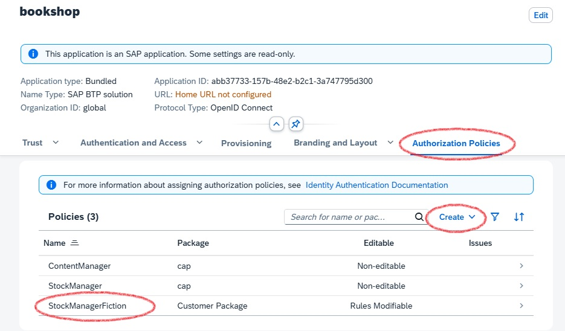

<script setup>
  import { h } from 'vue'
  const Y  =  () => h('span', { class: 'y',   title: 'Available' },      ['✓']   )
  const X  =  () => h('span', { class: 'x',   title: 'Available' },      ['✗']   )
  const Na =  () => h('span', { class: 'na',  title: 'Not available' },  ['n/a']   )
</script>
<style scoped>
  .y   { color: var(--green); font-weight:900; }
  .x   { color: var(--red);   font-weight:900; }
  /* .na  { font-weight:500; } */
</style>


# CAP Users { #cap-users }

<ImplVariantsHint />

This guide introduces to CAP user abstraction and role assignments.

[[toc]]

## CAP User Abstraction { #claims }

A successful authentication results in a CAP user representation reflecting the request user in a uniform way.
Referring to the [key concepts](./overview#key-concept-decoupled-coding), the abstraction serves to completely decouple authorization and business logic from pluggable authentication strategies.
It contains static information about the user such as name, ID and tenant. Additionally, it contains claims such as roles or assigned attributes that are relevant for [authorization](./authorization).

{width="650px" }

After _successful_ authentication, a **CAP user** is mainly represented by the following properties:

- **_Logon name_** identifying the user uniquely
- **_Tenant_** describes the tenant of the user (subscriber or provider) which implies the CDS model and business data container.
- **_Roles_** the user has been assigned by a user administrator (business [user roles](#roles)) or roles which are derived by the authentication level ([pseudo roles](#pseudo-roles)).
- **_Attributes_** the user has been assigned, for example, for instance-based authorization.

<div class="impl java">

The user information is reflected in the `UserInfo` object [attached to the request](#reflection).

</div>

<div class="impl node">

The user information is reflected in `req.user` and `req.tenant` [attached to the request](#reflection).

</div>


### User Types

CAP users can be classified in multiple dimensions:

**Business users vs. technical users:** 
- Business users represent identifiable end users who log in to interact with the system.
- Technical users operate on behalf of an entire tenant at a technical API level.

**Authenticated users vs. anonymous users**
- Authenticated users have successfully completed authentication by presenting valid credentials (e.g., a token).
- Anonymous users are unidentifiable in general, as they usually do not present any credentials.

**Provider vs. subscriber tenant**
- The provider tenant includes all users of the application owner.
- A subscriber tenant includes all users of a dedicated application customer.


Usually, the provider tenant is not subscribed to a [multitenant application](../multitenancy/) and therefore has no business users.
There are technical users for the provider and for all subscribers.

| Multitenant Application | Business users | Technical user
|---------------------------|----------------|----------------
| Provider Tenant           |       -        | <Y/>
| Subscriber Tenants        |      <Y/>      | <Y/> 

In contrast, for a single-tenant application, the provider tenant coincides with the only subscriber tenant and therefore contains all business users.

| Single-Tenant Application | Business users | Technical user
|---------------------------|----------------|----------------
| Provider (=subscriber) Tenant  |      <Y/>      | <Y/>


::: info
Apart from anonymous users, all users have a unique tenant.
:::

The user types are designed to support various flows, such as:
- UI requests executed on behalf of a business user interacting with the CAP backend service.
- Backend processing that utilizes platform services on behalf of the technical user of the subscriber tenant.
- Asynchronously received messages that process data on behalf of the technical user of a subscriber tenant.
- Background tasks that operate on behalf of the technical user of the provider tenant.
- etc.

Find more details about how to [switch the user context](#switching-users) during request processing.


### Roles { #roles}

CAP roles, which are defined on CDS resources such as services and entities, down to the events allowed on them, form the basis of [static access control](authorization#role-based-access-control).
Technically, the request user is restricted to the resources for which an appropriate CAP role is assiged.
**Such roles should reflect basic operations performed by users interacting with the application**.

In the following example, there are two different basic operations defined on domain level: 
- `ReportIssues` describes users which view existing issues, report new issues and confirm provided solutions.
- `ProcessIssues` describes users which process issues. They also write notes for customers.

```cds
annotate Issues with @(restrict: [
    { grant: ['READ','report', 'confirm'], to: 'ReportIssues' },
    { grant: ['READ', 'WRITE'], to: 'ProcessIssues' }
]);

annotate Notes with @(restrict: [
    { grant: ['READ'] }, // any
    { grant: ['READ', 'WRITE'], to: 'ProcessIssues' }
]);
```

CAP roles represent basic building blocks of authorization rules that are defined by application developers _at design time_.
Independently of that, user administrators combine CAP roles in higher-level policies and assign them to business users in the platform's central authorization management solution _at runtime_.

Dynamic assignments of roles to users can be done by 
- [AMS roles](#roles-assignment-ams) in case of [IAS authentication](./authentication#ias-auth).
- [XSUAA roles](#xsuaa-roles) in case of [XSUAA authentication](./authentication#xsuaa-auth).

::: info
CDS-based authorization deliberately avoids technical concepts, such as _scopes_ in _OAuth_, in favor of user roles, which are closer to the business domain of applications.
:::


#### Pseudo Roles { #pseudo-roles}
 
Often it is useful to define access rules that aren't based on an application-specific user role, but rather on the _technical authentication level_ of the request which can be mapped to a pre-defined CAP role.
For instance, a service should be accessible only for technical users, with or without user propagation. 
Such roles are called pseudo roles as they aren't assigned by user administrators, but are added by the runtime automatically on successful authentication, reflecting the technical level:

<div class="impl java">

| Pseudo Role          | User Type   | Technical Indicator                                         | User Name ($user)                                    |
|----------------------|-------------|-------------------------------------------------------------|------------------------------------------------------|
| `authenticated-user` |      -      | _successful authentication_                                 | _derived from the token_                             |
| `any`                |      -      |     -                                                       | _derived from the token if available or `anonymous`_ |
| `system-user`        | _technical_ | _grant type client credential_                              | `system`                                             |
| `internal-user`      | _technical_ | _grant type client credential and shared identity instance_ | `system-internal`                                    |

</div>

<div class="impl node">

| Pseudo Role          | User Type   | Technical Indicator                                         | User Name                                            |
|----------------------|-------------|-------------------------------------------------------------|------------------------------------------------------|
| `authenticated-user` | <Na/>       | _successful authentication_                                 | _derived from the token_                             |
| `any`                | <Na/>       | <Na/>                                                       | _derived from the token if available or `anonymous`_ |
| `system-user`        | _technical_ | _grant type client credential_                              | `system`                                             |
| `internal-user`      | _technical_ | _grant type client credential and shared identity instance_ | `system`                                             |

</div>

The pseudo-role `system-user` allows you to separate access by business users from _technical_ clients. 
Note that this role does not distinguish between any technical clients sending requests to the API.

Pseudo-role `internal-user` allows to define application endpoints that can be accessed exclusively by the own provider tenant on technical level. 
In contrast to `system-user`, the endpoints protected by this pseudo-role do not allow requests from any external technical clients. 
Hence it is suitable for **technical intra-application communication**, see [Security > Application Zone](./overview#application-zone).

::: warning
All technical clients that have access to the application's XSUAA or IAS service instance can call your service endpoints as `internal-user`.
**Refrain from sharing this service instance with untrusted clients**, for instance by passing services keys or [SAP BTP Destination Service](https://help.sap.com/docs/connectivity/sap-btp-connectivity-cf/create-destinations-from-scratch) instances.
:::


### Model References

The object representation of the resolved CAP user is attached to the current request context and has an impact on the request flow, for instance with regard to
- [authorizations](./authorization#restrictions)
- [enriching business data](../domain/#managed-data) with user data
- setting DB session variables

In the CDS model, some of the user properties can be referenced in annotations or static views:

| User Property                 | CDS Model Reference | CDS Artifact       |
|-------------------------------|---------------------|--------------------|
| Name                          | `$user`             | annotations and static views |
| Attribute                     | `$user.<attribute>` | [@restrict](./authorization#user-attrs) |
| Role                          | `<role>`            | [@requires](./authorization#requires) and [@restrict.to](./authorization#restrict-annotation) |

### Tracing { #user-tracing }

To track down issues during development, it can help to trace the properties of the request user to the application log.

<div class="impl java">

You can activate user tracing by setting logger `com.sap.cds.security.authentication` to log level `DEBUG`:

```yaml
logging:
   level:
      com.sap.cds.security.authentication: DEBUG
```

This will result in trace output like

```sh
Resolved MockedUserInfo [id='mock/admin', name='admin', roles='[admin]', attributes='{tenant=[null]}'
```

for mock users or 

```sh
c.s.c.f.i.IdentityUserInfoProvider : Resolved XsuaaUserInfo [id='be72646e-279a-4f96-ae40-05989a46b43b', name='max.muster@sap.com', roles='[openid, admin]', attributes='
{tenant=[b2c463bd-da56-488c-8345-2632905acde3]}'
```

for XSUAA users.

[Learn more about tracing](../../java/operating-applications/observability#logging-configuration){.learn-more}

</div>

<div class="impl node">

You can activate user tracing by setting log level <Config>cds.log.levels.auth: "debug"</Config>:

```json
{
  "cds": {
    "log": {
      "levels": {
        "auth": "debug"
      }
    }
  }
}
```

This will result in trace output like

```sh
[basic] - 401 > login required
[basic] - authenticated: { user: 'alice', tenant: ..., features: [ ... ] }
```

for mock users.

</div>

::: warning
Refrain from activating user tracing in productive systems.
:::

## Role Assignment with AMS { #roles-assignment-ams }

CAP applications that use the [Identity Authentication Service (IAS)](https://help.sap.com/docs/identity-authentication) for authentication can leverage the [Authorization Management Service (AMS)](https://help.sap.com/docs/cloud-identity-services/authorization-management-service) to provide comprehensive authorization. Similar to IAS, AMS is part of the [SAP Cloud Identity Services (SCI)](https://help.sap.com/docs/cloud-identity-services).

Why is AMS required? Unlike tokens issued by XSUAA, IAS tokens only contain static user information and cannot directly provide CAP roles.
AMS acts as a central service to define access policies that include CAP roles and additional filter criteria for instance-based authorizations in CAP applications.
_Business users_, technically identified by the IAS ID token, can have AMS policies assigned by user administrators.

::: info
Authorizations for technical users can't be addressed by AMS policies yet.
:::

The integration with AMS is provided as an easy-to-use plugin for CAP applications.
At the time of the request, the AMS policies assigned to the request user are evaluated by the CAP AMS plugin, and the CAP roles and filters are applied to the request context accordingly. This is illustrated in the following diagram:

{width="500px" }

The interaction between the CAP application and AMS (via plugin) is as follows:

1. IAS-Authentication is performed independently as a pre-step.
2. The plugin injects **user roles and filters** according to AMS policies assigned to the current request user.
3. CAP performs the authorization on the basis of the CDS authorization model and the injected user claims.


### Adding AMS Support { .java }

**AMS is transparent to CAP application code** and can be easily consumed via plugin dependency.

To enhance your project with AMS, you can make use of CDS CLI tooling:

```sh
cds add ams
```

This automatically adds required configuration for AMS, taking into account the concrete application context (tenant mode and runtime environment etc.).
If required, it also runs the new `cds add ias` command to configure the project for IAS authentication.

::: details See dependencies added

::: code-group
```xml [pom.xml]
<properties>
  <sap.cloud.security.ams.version>3.7.0</sap.cloud.security.ams.version> <!-- [!code ++] -->
</properties>
```

```xml [srv/pom.xml - dependencies]
<dependencies>
  <dependency>  <!-- [!code ++:10] -->
    <groupId>com.sap.cloud.security.ams.client</groupId>
    <artifactId>jakarta-ams</artifactId>
    <version>${sap.cloud.security.ams.version}</version>
  </dependency>
  <dependency>
    <groupId>com.sap.cloud.security.ams.client</groupId>
    <artifactId>cap-ams-support</artifactId>
    <version>${sap.cloud.security.ams.version}</version>
  </dependency>
</dependencies>
```

```xml [srv/pom.xml - plugins]
<plugins>
  <plugin>
    <groupId>com.sap.cds</groupId>
    <artifactId>cds-maven-plugin</artifactId>
    <executions>
      <execution>
        <id>cds.build</id>
        <goals>
          <goal>cds</goal>
        </goals>
        <configuration>
          <commands>
          [...]
            <command>build --for ams</command> <!-- [!code ++:1] -->
          </commands>
        </configuration>
    </execution>
    </plugin>
  <plugin>  <!-- [!code ++:19] -->
    <groupId>com.sap.cloud.security.ams.client</groupId>
    <artifactId>dcl-compiler-plugin</artifactId>
    <version>${sap.cloud.security.ams.version}</version>
    <executions>
      <execution>
        <id>compile</id>
        <goals>
          <goal>compile</goal>
        </goals>
        <configuration>
          <sourceDirectory>${project.basedir}/src/main/resources/ams</sourceDirectory>
          <dcn>true</dcn>
          <dcnParameter>pretty</dcnParameter>
          <compileTestToDcn>true</compileTestToDcn>
        </configuration>
      </execution>
    </executions>
  </plugin>
</plugins>
```

:::

These libraries integrate into the CAP framework to handle incoming requests. 
Based on the user's assigned [policies](#policies), the user's roles are determined and written to the [UserInfo](#reflection) object. 
The framework then authorizes the request as usual based on the user's roles.

::: details Node.js plugin `@sap/ams` added to the project

```json [package.json]
{
  "devDependencies": {
    "@sap/ams": "^3"
  }
}
```

:::

The `@sap/ams` plugin provides multiple build-time features:

- Validate `ams.attributes` annotations for type coherence against the AMS schema.
- Generate policies from the CDS model during the build using a [custom build task](../deploy/build#custom-build-tasks).
- Generate a deployer application during the build to upload the Data Control Language (DCL) base policies.


AM provides highly flexible APIs to define and enforce authorization rules at runtime. 
A relevant subset of these APIs is consumed by CAP apps by way of the AMS CAP integration plugin.

::: warning
Make sure not to mix native AMS APIs with those provided by the CAP plugin. 
:::

### Adding AMS Support { .node }

**AMS is transparent to CAP application code** and can be easily consumed via plugin dependency.

To enhance your project with AMS, you can make use of CDS CLI tooling:

```sh
cds add ams
```

This automatically adds required configuration for AMS, taking into account the concrete application context (tenant mode and runtime environment etc.).
If required, it also runs the new `cds add ias` command to configure the project for IAS authentication.

::: details See dependencies added

```json [package.json]
{
  "dependencies": [
    "@sap/ams": "^3",
    "@sap/xssec": "^4"
  ],
  "devDependencies": [
    "@sap/ams-dev": "^2"
}
```
:::

`@sap/ams` integrates into the CAP framework to handle incoming requests. 
Based on the user's assigned [policies](#policies), the user's roles are determined to decorate the [user.is](/node.js/authentication#user-is) function with additional roles. 
The framework then authorizes the request as usual based on the user's roles.

For local development, `@sap/ams-dev` needs to compile the DCL files to Data Control Notation (DCN) files in `gen/dcn` which is the machine-readable version of DCL that is required by AMS at runtime.

Additionally, `@sap/ams` provides multiple build-time features:

- Validate `ams.attributes` annotations for type coherence against the DCL schema.
- Generate policies from the CDS model during the build using a [custom build task](../deploy/build#custom-build-tasks).
- Generate a deployer application during the build to upload the Data Control Language (DCL) base policies.

::: tip
In general, AMS provides highly flexible APIs to define and enforce authorization rules at runtime suitable for native Cloud applications. 
**In the context of CAP projects, only a limited subset of these APIs is relevant and is offered in a streamlined way via the CAP integration plugins**.
:::

### Prepare CDS Model

On the level of application domain, you can declaratively introduce access rules in the CDS model, enabling higher-level interaction flows with the entire application domain:
 - a [CAP role for AMS](#roles-for-ams) can span multiple services and entities, providing a holistic perspective on _how a user interacts with the domain data_.
 - a [CAP attribute for AMS](#attributes-for-ams) is typically cross-sectional and hence is defined on a domain-global level.

The CDS model is fully decoupled from AMS policies which are defined on business level on top by external administrators.
Hence, the **rules in the CAP model act as basic building blocks for higher-level business rules** and therefore should have appropriate granularity.


#### CAP Roles for AMS { #roles-for-ams }

You can define CAP roles in the CDS model as [described before](#roles).

::: tip
A CAP role describes a **capability on technical domain level** defined by application developers.
In contrast, an AMS policy reflects a coarser-grained **business role on application level** defined by user administrators.
:::

Imagine you want to provide two different CAP roles in the bookshop example:
`ManageAuthors` allows users to manage the authors of the books being sold. 
Users with `ManageBooks` work only with the book inventory. 
As each book has an association to an author, they can only manage books from authors that have already been created before:

```cds
service AdminService @(requires: ['ManageAuthors', 'ManageBooks']) {

  entity Books @(restrict: [
    { grant: ['READ'], to: 'ManageAuthors' },
    { grant: ['READ', 'WRITE'], to: 'ManageBooks' } ])
  as projection on my.Books;

  entity Authors @(restrict: [
    { grant: ['READ', 'WRITE'], to: 'ManageAuthors' },
    { grant: ['READ'], to: 'ManageBooks' } ])
  as projection on my.Authors;
}
```

Both CAP roles are ready to be used in higher-level [AMS policies](#policies).

::: tip
You can simply reuse existing CAP roles for AMS. There is no need to modify the CDS model.
:::

[Learn more about role-based authorizations in CAP](./authorization#restrictions){.learn-more}


#### CAP Attributes for AMS { #attributes-for-ams }

Attributes for AMS offer user administrators an additional layer of flexibility to partition domain entities into smaller, more manageable units for access control.
The domain attributes, which are exposed to user administrators for defining custom filter conditions, must be predefined by the application developer in the CDS model using the `@ams` annotation.

For example, the instances of entity `Books` can be classified by the associated genre. 
Hence, `genre.name` appears to be a suitable  AMS attribute value, exposed under the name `Genre`:

```cds
annotate AdminService.Books with @ams.attributes: {
  Genre: (genre.name)
};
```

In general, the `@ams` annotation operates on the entity level.
The value of the AMS attribute needs to point to a single-value property of the target entity (paths are supported).
You need to make use of a compiler expression in order to ensure validity of the value reference.


::: tip
Choose attributes exposed to AMS carefully.
Attributes you choose should have cross-sectional semantics in the domain.
:::

As such attributes are usually shared by multiple entities, it is convenient to add the `@ams`-annotation at the level of a shared aspect as sketched here:

```cds
@ams.attributes: { Genre: (genre.name) }
aspect withGenre {
    genre : Association to Genres;
}

entity Books : withGenre { ... }
```

<!--
The detailed syntax of the `@ams` annotation provides an `attribute` property which might be helpful to decouple the external from the internal name:
>>>>>>> Stashed changes
```cds
annotate AdminService.Books with @ams.attributes.genre: {
  attribute: 'Genre', element: (genre.name)
};
```
-->


### Prepare Base Policies { #policies }

CAP roles and attribute filters cannot be directly assigned to business users.
Instead, the application defines AMS base policies that include CAP roles and attributes at design time. 
This allows user administrators to assign them to users or create custom policies based on the base policies at runtime.

:::tip
AMS policies represent the business-level roles of end users interacting with the application.
Often, they reflect real-world jobs or functions.
:::

<div class="impl java">

After the application is built, check the `srv/src/main/resources/ams` folder to see the generated AMS *schema* and a *basePolicies* DCL file in a package called `cap`

::: code-group

``` [srv/src/main/resources]
└─ ams
   ├─ cap
   │  └─ basePolicies.dcl
   └─ schema.dcl
```

:::

</div>

<div class="impl node">
After the application is built, check the *ams/dcl* folder to see the generated AMS *schema* and a *basePolicies* DCL file in a package called *cap*:

::: code-group

``` [./ams]
└─ dcl
   ├─ cap
   │  └─ basePolicies.dcl
   └─ schema.dcl
```

:::
</div>

[Learn more about policy generation](https://sap.github.io/cloud-identity-developer-guide/CAP/cds-Plugin.html#dcl-generation){.learn-more}


The generated policies are a good starting point to add manual modifications.

The generated DCL schema includes all AMS attributes exposed for filtering:

```yaml [/ams/schema.dcl]
SCHEMA {
  Genre : String
}
```

In the schema you may additionally configure [value help](https://sap.github.io/cloud-identity-developer-guide/Authorization/ValueHelp.html) for the attributes in the [Cockpit UI for AMS](#ams-deployment).

You can modify the generated policies according to your needs.
For example, you can rename the policies to reflect appropriate job functions and adjust the referenced CAP roles:

```dcl [/ams/cap/basePolicies.dcl]
POLICY StockManager {
  ASSIGN ROLE ManageBooks WHERE Genre IS NOT RESTRICTED;
}

POLICY ContentManager {
  ASSIGN ROLE ManageAuthors;
  ASSIGN ROLE ManageBooks;
}
```

In contrast to a `StockManager` who is responsible for the books offering, a `ContentManager` additionally makes the author selection.
In addition, a `StockManager` with CAP role `ManageBooks` may be restricted to specific genres by applying appropriate filters prepared in [custom policies](#local-testing).
As a `ContentManager` there is no genre-based restriction.

::: info
The attribute statement is defined in the scope of a dedicated CAP role and filters are applied on matching entites accordingly.
:::

[Learn more about AMS policies](https://help.sap.com/docs/cloud-identity-services/cloud-identity-services/configuring-authorization-policies){.learn-more}


### Local Testing { #local-testing }

Although the AMS policies are not yet [deployed to the Cloud service](#ams-deployment), you can assign policies to mock users and run locally:

<div class="impl java">

```yaml
cds:
  security:
    mock:
      users:
        content-manager: // [!code ++:3]
          policies:
            - cap.ContentManager
        stock-manager: // [!code ++:3]
          policies:
            - cap.StockManager
```

</div>

<div class="impl node">

```json [package.json]
{
  "cds": {
    "requires": {
      "auth": {
        "[development]": {
          "kind": "mocked",
          "users": {
            "content-manager": { // [!code ++:5]
              "policies": [
                "cap.ContentManager"
              ]
            },
            "stock-manager": { // [!code ++:5]
              "policies": [
                "cap.StockManager"
              ]
          }
        }
      }
    }
  }
}
```

</div>

:::tip
Don't forget to refer to fully qualified policy names including the package name (`cap` in this example).
:::

Now (re)start the application with

<div class="impl java">

```sh
mvn spring-boot:run
```

</div>

<div class="impl node">

```sh
cds watch
```

</div>

<div class="impl java">

and verify in the UI for `AdminService` (`http://localhost:8080/index.html#Books-manage`) that the the assigned policies imply the expected static access rules:

</div>

<div class="impl node">

You can now verify that the assigned policies enforce the expected access rules:

</div>

- mock user `content-manager` has full access to `Books` and `Authors`.
- mock user `stock-manager` can _read_ `Books` and `Authors` and can _edit_ `Books` (but _not_ `Authors`).

For the advanced test scenario, you can define custom policies in pre-defined package `local` which is ignored during [deployment of the policies](#ams-deployment) to the Cloud service and hence will no show up in production.

Let's add a custom policy `StockManagerFiction` which is based on base policy `cap.StockManager` restricting the assigned users to the genres `Mystery` and `Fantasy`:

```yaml [/ams/local/customPolicies.dcl]
POLICY StockManagerFiction {
    USE cap.StockManager RESTRICT Genre IN ('Mystery', 'Fantasy');
}
```

You can define valid attribute values in complex [DCL expressions](https://help.sap.com/docs/cloud-identity-services/cloud-identity-services/condition-operators).


<div class="impl java">

Don't miss to add the policy files in sub folders of `ams` reflecting the namespace properly: Policy `local.StockManagerFiction` is expected to be in a file within directory `/ams/local/*`.

The assignment to mock users is done in the `policies` property:

```yaml
cds:
  security:
    mock:
      users:
        stock-manager-test: // [!code ++:3]
          policies:
            - local.StockManagerFiction
```

You can verify in the UI that mock user `stock-manager-test` is restricted to books of genres `Mystery` and `Fantasy`.

</div>

<div class="impl node">

::: tip
Don't miss to add the policy files in sub folders of `ams/dcl` reflecting the namespace properly: Policy `local.StockManagerFiction` is expected to be in a file within directory `./ams/dcl/local/`.
:::

```json [package.json]
{
  "cds": {
    "requires": {
      "auth": {
        "[development]": {
          "kind": "mocked",
          "users": {
            "stock-manager-test": { // [!code ++:5]
              "policies": [
                "local.StockManagerFiction"
              ]
            }
          }
        }
      }
    }
  }
}
```

</div>

[Learn more about AMS attribute filters with CAP](https://sap.github.io/cloud-identity-developer-guide/CAP/InstanceBasedAuthorization.html#instance-based-authorization){.learn-more}


### Cloud Deployment { #ams-deployment }

If not done yet, prepare your project Cloud deployment as [explained before](./authentication#ias-ready).

Policies can be automatically deployed to the AMS server during deployment of the application by means of AMS deployer provided by module `@sap/ams`.

Enhancing the project by `cds add ams` automatically adds task e.g. in the MTA for AMS policy deployment.

<div class="impl java">

::: details AMS policy deployer task in the MTA

::: code-group
```yaml [mta.yaml- deployer task]
- name: bookshop-ams-policies-deployer
   type: javascript.nodejs
   path: srv/src/gen/policies # Node.js: gen/policies
   parameters:
     buildpack: nodejs_buildpack
     no-route: true
     no-start: true
     tasks:
       - name: deploy-dcl
         command: npm start
         memory: 512M
   requires:
     - name: bookshop-ias
       [...]
```


```json [srv/src/gen/policies/package.json - deployer module]
{
  "name": "ams-dcl-content-deployer",
  "version": "3.0.0",
  "dependencies": {
    "@sap/ams": "^3"
  },
  [...]
  "scripts": {
    "start": "npx --package=@sap/ams deploy-dcl"
  }
}
```

:::


Note that the policy deployer task requires a path to a directory structure containing the `ams` root folder with the policies to be deployed.
By default, the path points to `srv/src/gen/policies` which is prepared automatically during build step with the appropriate policy-content copied from `srv/src/main/resources/ams`.
In addition, `@sap/ams` needs to be referenced to add the deployer logic.

</div>

<div class="impl node">

::: details AMS policy deployer task in the MTA

::: code-group
```yaml [mta.yaml - deployer task]
- name: bookshop-ams-policies-deployer
   type: javascript.nodejs
   path: gen/policies
   parameters:
     buildpack: nodejs_buildpack
     no-route: true
     no-start: true
     tasks:
       - name: deploy-dcl
         command: npm start
         memory: 512M
   requires:
     - name: bookshop-ias
       [...]
```


```json [gen/policies/package.json - deployer module]
{
  "name": "ams-dcl-content-deployer",
  "version": "3.0.0",
  "dependencies": {
    "@sap/ams": "^3"
  },
  [...]
  "scripts": {
    "start": "npx --package=@sap/ams deploy-dcl"
  }
}
```

:::


Note that the policy deployer task requires a path to a directory structure containing the `ams/dcl` root folder with the policies to be deployed.
By default, the path points to `gen/policies` which is prepared automatically during build step with the appropriate policy-content copied from `ams/dcl`.
In addition, `@sap/ams` needs to be referenced to add the deployer logic.

</div>

::: tip
Several microservices sharing the same IAS instance need a common folder structure the deployer task operates on. 
It contains the common view of policies applied to all services.
:::

[Learn more about AMS deployer](https://sap.github.io/cloud-identity-developer-guide/Authorization/DeployDCL.html#ams-policies-deployer-app){.learn-more}

Let's deploy and start the application with

```sh
cds up
```

Afterwards, you can now perform the following tasks in the Administrative Console for the IAS tenant (see prerequisites [here](./authentication#ias-admin)):
- Assign (base or custom) policies to IAS users
- Create custom policies

To create a custom policy with filter restrictions, follow these steps:
1. Select **Applications & Resources** > **Applications**. Pick the IAS application of your project from the list.
2. In **Authorization Policies** select **Create** > **Create Restriction**. Choose an appropriate policy name, e.g. `StockManagerFiction`.
3. Customize the filter conditions for the available AMS attributes.
4. Confirm with **Save**.

::: details Create custom AMS policy with filter condition




:::

[Learn more about how to create custom AMS policies](https://help.sap.com/docs/cloud-identity-services/cloud-identity-services/create-authorization-policy){.learn-more}


To assign a policy to an IAS user, follow these steps:
1. Select **Applications & Resources** > **Applications**. Pick the IAS application of your project from the list.
2. Switch to tab **Authorization Policies** and select the policy you want to assign.
3. In **Assignments**, add the IAS user of the tenant to which the policy should be assigned (you can review the policy definition in **Rules**).

[Learn more about how to edit custom AMS policies](https://help.sap.com/docs/cloud-identity-services/cloud-identity-services/edit-authorization-policy){.learn-more}

::: details Assign AMS policy to an IAS user


:::


You can log on to the bookshop test application with the test user and check that only books of dedicated genres can be modified.

[Learn more about AMS policy assignment](https://help.sap.com/docs/cloud-identity-services/cloud-identity-services/assign-authorization-policies) {.learn-more}


### Tracing

You can verify a valid configuration of the AMS plugin by the following log output:

<div class="impl java">

```sh
c.s.c.s.a.c.AmsRuntimeConfiguration      : Configured AmsUserInfoProvider
```

</div>

<div class="impl node">

```sh
[ams] - AMS Plugin loaded.
[ams] - Added AMS middleware after 'auth' middleware.
```

</div>

In addition, for detailed analysis of issues, you can set AMS logger to `DEBUG` level: 

<div class="impl java">

```yaml
logging:
    level:
        com.sap.cloud.security.ams: DEBUG
```

</div>

<div class="impl node">

```json
{
  "cds": {
    "log": {
      "levels": {
        "ams": "DEBUG"
      }
    }
  }
}
```

</div>

which gives you more information about the policy evaluation at request time:

<div class="impl java">

```sh
c.s.c.s.a.l.PolicyEvaluationSlf4jLogger  : Policy evaluation result: {...,
"unknowns":"[$app.Genre]", "$dcl.policies":"[local.StockManagerFiction]",
 ...
"accessResult":"or( eq($app.Genre, "Mystery") eq($app.Genre, "Fantasy") )"}.
```

</div>

<div class="impl node">

```sh
[ams] - Determined potential actions for resource '$SCOPES': stock-manager {
        potentialActions: Set(1) { 'stock-manager' },
        policies: [ 'local.StockManagerFiction' ],
        ...
      }
[ams] - AMS user roles added to user.is: [ 'stock-manager' ]
[ams] - Privilege check for 'stock-manager' on '$SCOPES' was conditional. {
        result: 'conditional',
        dcn: "$app.genre IN ['Fantasy', 'Mystery']",
        policies: [ 'local.StockManagerFiction' ],
        ...
      }
[ams] - Resulting privileges for  READ  on  AdminService.Books : [
        {
          grant: 'READ',
          to: [ 'stock-manager' ],
          where: "genre.name  IN  ('Fantasy', 'Mystery')"
        }
      ]
```

</div>

You can add general user information by applying [user tracing](#user-tracing).

::: tip
It might be useful to investigate the injected filter conditions by activating the query-trace (logger `com.sap.cds.persistence.sql`).
:::


## Role Assignment with XSUAA { #xsuaa-roles }

Information about roles and attributes can be made available to the XSUAA platform service. 
This information enables the respective JWT tokens to be constructed and sent with the requests for authenticated users. 

In particular, the following happens automatically behind-the-scenes upon build:


### Generate Security Descriptor 

Derive scopes, attributes, and role templates from the CDS model:

<div class="impl java">

```sh
cds add xsuaa
```

</div>

<div class="impl node">

```sh
cds add xsuaa --for production
```

</div>

This generates an _xs-security.json_ file:

::: code-group
```json [xs-security.json]
{
  "scopes": [
    { "name": "$XSAPPNAME.admin", "description": "admin" }
  ],
  "attributes": [
    { "name": "level", "description": "level", "valueType": "s" }
  ],
  "role-templates": [
    { "name": "admin", "scope-references": [ "$XSAPPNAME.admin" ], "description": "generated" }
  ]
}
```
:::

For every role name in the CDS model, one scope and one role template are generated with the exact name of the CDS role.

::: tip Re-generate on model changes
You can have such a file re-generated via
```sh
cds compile srv --to xsuaa > xs-security.json
```
:::

See [Application Security Descriptor Configuration Syntax](https://help.sap.com/docs/HANA_CLOUD_DATABASE/b9902c314aef4afb8f7a29bf8c5b37b3/6d3ed64092f748cbac691abc5fe52985.html) in the SAP HANA Platform documentation for the syntax of the _xs-security.json_ and advanced configuration options.

<!-- REVISIT: Not ideal cds compile --to xsuaa can generate invalid xs-security.json files -->
::: warning Avoid invalid characters in your models
Roles modeled in CDS may contain characters considered invalid by the XSUAA service.
:::

If you modify the _xs-security.json_ manually, make sure that the scope names in the file exactly match the role names in the CDS model, as these scope names will be checked at runtime.

### Publish Security Descriptor

If there's no _mta.yaml_ present, run this command:

```sh
cds add mta
```

::: details See what this does in the background…

1. It creates an _mta.yaml_ file with an `xsuaa` service.
2. The created service added to the `requires` section of your backend, and possibly other services requiring authentication.
::: code-group
```yaml [mta.yaml]
modules:
  - name: bookshop-srv
    requires:
      - bookshop-auth // [!code ++]
resources:
  name: bookshop-auth // [!code ++]
  type: org.cloudfoundry.managed-service // [!code ++]
  parameters: // [!code ++]
    service: xsuaa // [!code ++]
    service-plan: application // [!code ++]
    path: ./xs-security.json # include cds managed scopes and role templates // [!code ++]
    config: // [!code ++]
      xsappname: bookshop-${org}-${space} // [!code ++]
      tenant-mode: dedicated # 'shared' for multitenant deployments // [!code ++]
```
:::


Inline configuration in the _mta.yaml_ `config` block and the _xs-security.json_ file are merged. If there are conflicts, the [MTA security configuration](https://help.sap.com/docs/HANA_CLOUD_DATABASE/b9902c314aef4afb8f7a29bf8c5b37b3/6d3ed64092f748cbac691abc5fe52985.html) has priority.

[Learn more about **building and deploying MTA applications**.](/guides/deploy/){ .learn-more}

### Assign Roles in SAP BTP Cockpit { #xsuaa-assign }

This is a manual step a user administrator would do in SAP BTP Cockpit to setup and assign roles for the application:

By creating a service instance of the `xsuaa` service, all the roles from the _xs-security.json_ file are already added to your subaccount. 
Next, you create a role collection that assigns these roles to your users.

1. Open the SAP BTP Cockpit.

    > For your trial account, this is: [https://cockpit.hanatrial.ondemand.com](https://cockpit.hanatrial.ondemand.com)

2. Navigate to your subaccount and then choose *Security* > *Role Collections*.
3. Choose *Create New Role Collection*:

   

4. Enter a *Name* for the role collection, for example `BookshopAdmin`, and choose *Create*.
5. Choose your new role collection to open it and switch to *Edit* mode.
6. Add the `admin` role for your bookshop application (application id `bookshop!a<XXXX>`) to the *Roles* list.
7. Add the email addresses for your users to the *Users* list.
8. Choose *Save*


If a user attribute isn't set for a user in the IdP of the SAP BTP Cockpit, this means that the user has no restriction for this attribute. 
For example, if a user has no value set for an attribute "Country", they're allowed to see data records for all countries.
In the _xs-security.json_, the `attribute` entity has a property `valueRequired` where the developer can specify whether unrestricted access is possible by not assigning a value to the attribute.


## Developing with CAP Users { #developing-with-users }

CAP is not tied to any specific authentication method, nor to concrete user information such as that provided by IAS or XSUAA. 
Instead, an abstract [user representation](cap-users#claims) is attached to the request which can be used to influence request processing.
For example, both authorization enforcement and domain logic can depend on properties of the the current user.

::: warning
Avoid writing custom code against the raw authentication information such as dedicated XSUAA properties. 
This undermines the decoupling between authentication strategy and your business logic.
:::

::: tip
In most cases, there is no need to write custom code dependent on the CAP user - **leverage CDS modelling whenever possible**.
:::


### Reflection { #reflection }

<div class="impl java">

The CAP user of a request is represented by a [UserInfo](https://www.javadoc.io/doc/com.sap.cds/cds-services-api/latest/com/sap/cds/services/request/UserInfo.html) object that can be retrieved from the [RequestContext](https://www.javadoc.io/doc/com.sap.cds/cds-services-api/latest/com/sap/cds/services/request/RequestContext.html) of a handler in different ways.

Either by directly requesting from the context like in the example:

```java
@Before(entity = Books_.CDS_NAME)
public void beforeReadBooks(CdsReadEventContext context) {
  UserInfo userInfo = context.getUserInfo();
  String name = userInfo.getName();
  // [...]
}
```

or by Spring dependency injection within a handler bean:

```java
@Autowired
UserInfo userInfo;

@After(event = CqnService.EVENT_READ)
public void discountBooks(Stream<Books> books) {
  String name = userInfo.getName();
  // [...]
}
```

There is always an `UserInfo` attached to the current `RequestContext`, reflecting any type of [users](#user-types).
The `UserInfo` object is not modifyable, but during request processing, a new `RequestContext` can be spawned and may be accompanied by a [switch of the current user](#switching-users).


Depending on the configured [authentication](./authentication) strategy, CAP derives a *default set* of user claims containing the user's name, tenant, attributes and assigned roles:

| User Property | UserInfo Getter                         | XSUAA JWT Property          | IAS JWT Property          | `@restrict`-annotation |
|---------------|-----------------------------------------|-----------------------------|---------------------------|------------------------|
| _Logon name_  | `getName()`                             | `user_name`                 | `sub`                     | `$user`                |
| _Tenant_      | `getTenant()`                           | `zid`                       | `app_tid`                 | `$user.tenant`         |
| _Attributes_  | `getAttributeValues(String attr)`       | `xs.user.attributes.<attr>` | _All non-meta attributes_ | `$user.<attr>`         |
| _Roles_       | `getRoles()` and `hasRole(String role)` | `scopes`                    | _n/a - injected via AMS_  | _String in `to`-clause_  |

::: info
CAP does not make any assumptions on the presented claims given in the token. String values are copied as they are.
:::

In addition, there are getters to retrieve information about [pseudo-roles](#pseudo-roles):

| UserInfo method     | Description                                                                                                        | CAP Role             |
|:--------------------|:-------------------------------------------------------------------------------------------------------------------|----------------------|
| `isAuthenticated()` | _True if the current user has been authenticated._                                                                   | `authenticated-user` |
| `isSystemUser()`    | _Indicates whether the current user has pseudo-role `system-user`._                                                  | `system-user`        |
| `isInternalUser()`  | _Indicates whether the current user has pseudo-role `internal-user`._                                                | `internal-user`      |
| `isPrivileged()`    | _Returns `true` if the current user runs in [privileged mode](#switching-to-privileged-user), i.e. is unrestricted._ | -                    |

</div>

<div class="impl node">

In CAP Node.js, the CAP user of a request is represented by a [`cds.User`](../../node.js/authentication#cds-user) object. 
An instance of `cds.User` representing the current principal is available from the current request context in `req.user`. 
Similarly, the identifier of the user's tenant is available from `req.tenant`.

```js
srv.before('READ', srv.entities.Books, req => {
  const { user, tenant } = req
  // [...]
})
```

In addition to the request context, information about the current user can similarly be retrieved from the global [`cds.context`](../../node.js/events#cds-context), which provides access to the current [`cds.EventContext`](../../node.js/events#cds-event-context): 

```js
const cds = require('@sap/cds')
const { user, tenant } = cds.context
```

:::tip
Prefer local req objects in your handlers for accessing event context properties, as each access to `cds.context` happens through [AsyncLocalStorage.getStore()](https://nodejs.org/api/async_context.html#asynclocalstoragegetstore), which induces some minor overhead.
:::

Setting `cds.context` usually happens in inbound authentication middlewares or in inbound protocol adapters.
During processing, you can set it programmatically or spawn a new root transaction providing a context argument to achieve a [switch of the current user](#switching-users).

Depending on the configured [authentication](./authentication) strategy, CAP derives a default set of user claims containing the user's name, tenant, attributes and assigned roles:

| User Property | UserInfo Getter                     | XSUAA JWT Property          | IAS JWT Property        | `@restrict`-annotation |
|---------------|-------------------------------------|-----------------------------|-------------------------|------------------------|
| _Logon name_  | `user.id`                           | `user_name`                 | `sub`                   | `$user`                |
| _Tenant_      | `req.tenant` / `cds.context.tenant` | `zid`                       | `app_tid`               | `$user.tenant`         |
| _Attributes_  | `attr(attr)`                        | `xs.user.attributes.<attr>` | All non-meta attributes | `$user.<attr>`         |
| _Roles_       | `is(role)`                          | `scopes`                    | n/a - injected via AMS  | String in `to`-clause  |

</div>


<!-- TODO: Pseudo Role Checks in Node? cds.User.is('privilged')? -->

### Customizing Users { #customizing-users }

<div class="impl java">

In most cases, CAP's default mapping to the CAP user matches your requirements, but CAP also allows you to customize the mapping according to specific needs. 

For instance, the logon name as injected by standard XSUAA integration might not be unique if several customer IdPs are connected to the underlying identity service.
Here a combination of `user_name` and `origin` mapped to `$user` might be a feasible solution that you can implement in a custom adaptation.

This is done by means of a custom [UserInfoProvider](https://www.javadoc.io/doc/com.sap.cds/cds-services-api/latest/com/sap/cds/services/runtime/UserInfoProvider.html) interface that can be implemented as Spring bean as demonstrated in [Registering Global Parameter Providers](../../java/event-handlers/request-contexts#global-providers):

::: details Sample implementation to override the user name

```java
@Component
@Order(1)
public class UniqeNameUserInfoProvider implements UserInfoProvider {

    private UserInfoProvider defaultProvider;

    @Override
    public UserInfo get() {
        ModifiableUserInfo userInfo = UserInfo.create();
        if (defaultProvider != null) {
            UserInfo prevUserInfo = defaultProvider.get();
            if (prevUserInfo != null) {
                userInfo = prevUserInfo.copy();
            }
        }
        if (userInfo != null) {
           XsuaaUserInfo xsuaaUserInfo = userInfo.as(XsuaaUserInfo.class);
           userInfo.setName(xsuaaUserInfo.getEmail() + "/" +
                            xsuaaUserInfo.getOrigin()); // adapt name
        }

        return userInfo;
    }

    @Override
    public void setPrevious(UserInfoProvider prev) {
        this.defaultProvider = prev;
    }
}
```

:::

In the example, the `UniqeNameUserInfoProvider` defines an overlay on the default XSUAA-based provider (`defaultProvider`) by leveraging chaining technique (`@Order(1)` ensures proper ordering).
`UserInfo.copy()` returns [`ModifiableUserInfo`](https://www.javadoc.io/doc/com.sap.cds/cds-services-api/latest/com/sap/cds/services/request/ModifiableUserInfo.html) interface which allows arbitrary modifications such as 
overriding the user's name by a combination of email and origin.

::: warning Be very careful when redefining `$user`
The user name is frequently stored with business data (for example, `managed` aspect) and might introduce migration efforts. 
Also consider data protection and privacy regulations when storing user data.
:::

There are multiple reasonable use cases in which user modification is a suitable approach:

- Injecting or mixing user roles by calling `modifiableUserInfo.addRole(String role)` (In fact this is the base for [AMS plugin](#roles-assignment-ams) injecting user specifc roles).
- Providing calculated attributes used for [instance-based authorization](./authorization#user-attrs) by invoking `modifiableUserInfo.setAttributeValues(String attribute, List<String> values)`.
- Constructing a request user based on forwarded (and trusted) header information, completely replacing default authentication.
- etc.

[See more examples for custom UserInfoProvider](https://pages.github.tools.sap/cap/docs/java/event-handlers/request-contexts#global-providers){.learn-more}

</div>

<div class="impl node">

In most cases, CAP's default mapping to the CAP user will match your requirements, but CAP also allows you to customize the mapping according to specific needs. 

For instance, the logon name as injected by standard XSUAA integration might not be unique if several customer IdPs are connected to the underlying identity service.
Here a combination of `user_name` and `origin` mapped to `$user` might be a feasible solution that you can implement in a custom adaptation.

This can be done by modifying `cds.middlewares`. 
To modify the `cds.context.user` while still relying on existing generic middlewares, a new middleware must be registered after the `auth` middleware. 
If you intend to manipulate the `cds.context.tenant` as well, the new middleware must run before `cds.context.model` is set for the current request.

::: details Sample implementation to override the user id

```js
cds.middlewares.before = [
  cds.middlewares.context(),
  cds.middlewares.trace(),
  cds.middlewares.auth(),
  function ctx_user (_,__,next) {
    const ctx = cds.context
    ctx.user.id = ctx.user.attr('origin') + ctx.user.id
    next()
  },
  cds.middlewares.ctx_model()
]
```

:::

There are multiple reasonable use cases in which user modification is a suitable approach:

- Overriding user roles by calling `user.roles(roles)`.
- Overriding user attributes and providing calculated attributes used for [instance-based authorization](./authorization#user-attrs) by invoking `user.attr(attributes)`.
- etc.

::: warning Be very careful when redefining `$user` and customizing `cds.middlewares`
The user name is frequently stored with business data (for example, `managed` aspect) and might introduce migration efforts. 
Also consider data protection and privacy regulations when storing user data.
:::

:::tip Custom Authentication Middleware
In case you require even more control, it is possible to replace the authentication middleware with a fully [Custom Authentication](../../node.js/authentication#custom).
:::

</div>

### Switching Users { #switching-users }
	
<div class="impl java">

There are a few typical use cases in a (multitenant) application where switching the current user of the request is required.
For instance, the business request on behalf of a named subscriber user needs to reach out to a platform service on behalf of the underlying technical user of the subscriber.

These scenarios are identified by a combination of the user (*technical* or *named*) and the tenant (*provider* or *subscriber*):


The user context can only be modified by explicitly opening an appropriate Request Context which ensures a well-defined scope for the changed settings.
Services might, for example, trigger HTTP requests to external services by deriving the target tenant from the current Request Context.

The `RequestContextRunner` API offers convenience methods that allow an easy transition from the current Request Context to a derived one according to the concrete scenario.

| Method               | Scenario                                                                                                                          |
|----------------------|--------------------------------------------------------------------------------------------------------------------------------------|
| `systemUser()`         | _[Switches](#switching-to-technical-user) to the **technical user** and preserves the tenant from the current user._         |
| `systemUserProvider()` | _[Switches](#switching-to-provider-tenant) to the **technical user of the provider account**._            |
| `systemUser(tenant)`   | _[Switches](#switching-to-subscriber-tenant) to a **technical user targeting a given subscriber account**._        |
| `privilegedUser()`     | _[Elevates](#switching-to-privileged-user) the current `UserInfo` to by-pass all authorization checks._     |
| `anonymousUser()`      | _[Switches](#switching-to-anonymous-user) to an anonymous user._          |

Named user contexts are only created by the CAP Java framework as initial Request Context based on appropriate authentication information (for example, JWT token) attached to the incoming HTTP request.

:::info
- It is not possible to switch from technical user to a named user.
- Asynchronous requests to CAP services are always on behalf of a technical user.
:::

</div>

<div class="impl node">

There are a few typical use cases in a (multitenant) application, where switching the current user of the request is required.
For instance, the business request on behalf of a named subscriber user needs to reach out to a service on behalf of the subscribers technical user.

These scenarios are identified by a combination of the user (*technical* or *named*) and the tenant (*provider* or *subscriber*):


In CAP Node.js, the `cds.context` allows to access the current `cds.EventContext` and enables updating the principal of the context.
The prefered method for switching users and executing code in a different context and for a different principal, is to spawn a new root transaction using [`cds/srv.tx()`](../../node.js/cds-tx#srv-tx).
Providing a `ctx` argument when creating a new root transaction allows switching the user for nested operations.
The `cds.User` class exposes convenience constructors and accessors for specialized `cds.User` instances that represent typical technical principals you may require.

```js
const newUser = new cds.User({ id: '...', roles: [...], ...})
await srv.tx ({ user: newUser, tenant: '<target-tenant>' }, async tx => {
  // Perform operations with a privileged principal
})
```

:::tip
When creating new root transactions in calls to [`cds/srv.tx()`](../../node.js/cds-tx#srv-tx), all properties not specified in the `ctx` argument are inherited from `cds.context`, if set in the current continuation.
:::

</div>

#### Switching to Technical User {#switching-to-technical-user }

<div class="impl java">

{width="330px"}

The incoming JWT token triggers the creation of an initial Request Context with a named user. 
Accesses to the database in the OData Adapter as well as the custom `On` handler are executed within <i>tenant1</i> and authorization checks are performed for user <i>JohnDoe</i>. 
An additionally defined `After` handler wants to call out to an external service using a technical user without propagating the named user <i>JohnDoe</i>.
To achieve this, it's required to call `requestContext()` on the current `CdsRuntime` and use the `systemUser()` method to remove the named user from the new Request Context:

```java
@After(entity = Books_.CDS_NAME)
public void afterHandler(EventContext context){
    runtime.requestContext().systemUser().run(reqContext -> {
        // call technical service
    });
}
```

</div>

<div class="impl node">

{width="330px"}

The incoming JWT token triggers the creation of an initial `cds.EventContext` with a named user. 
Accesses to the database in the OData Adapter as well as the custom `.on` handler are executed within _tenant1_ and authorization checks are performed for user _JohnDoe_. 

In addition, there is an `.after` handler that wants to call out to an external service using a technical user without propagating the named user _JohnDoe_.
To achieve this, you can create a new root transaction using `srv.tx` and use it to connect to the external service from within a new context:

```js
srv.after('*', srv.entities.Books, async (res, req) => {
  await srv.tx({ user: cds.User.privileged }, async tx => {
    // call technical service
  })
})
```

</div>

#### Switching to Technical Provider Tenant {#switching-to-provider-tenant }

<div class="impl java">

{width="500px"}

The application offers a bound action in a CDS entity. Within the action, the application communicates with a remote CAP service using an internal technical user from the provider account. 
The corresponding `on` handler of the action needs to create a new Request Context by calling `requestContext()`. 
Using the `systemUserProvider()` method, the existing user information is removed and the tenant is automatically set to the provider tenant. 
This allows the application to perform an HTTP call to the remote CAP service, which is secured using the pseudo-role `internal-user`.

```java
@On(entity = Books_.CDS_NAME)
public void onAction(AddToOrderContext context){
    runtime.requestContext().systemUserProvider().run(reqContext -> {
        // call remote CAP service
    });
}
```

</div>

<div class="impl node">

{width="500px"}

In this scenario the application offers a bound action in a CDS entity. 
Within the action, the application communicates with a remote CAP service using a privileged user and the provider tenant. 
The corresponding `.on` handler of the action needs to create a new root transaction by calling `srv.tx`.
The user passed to `srv.tx` in the `ctx` attribute will be used as the prinicpal for requests made within the new root transaction.

```js
srv.on('action', srv.entities.Books, async req => {
  const systemUser = new cds.User({ id: 'system', roles: [ 'internal-user' ] })
  await srv.tx({ user: systemUser , tenant: 'provider-tenant' }, async tx => {
    // call remote CAP service
  })
})
```

</div>

#### Switching to a Specific Technical Tenant {#switching-to-subscriber-tenant }

<div class="impl java">

{width="450px"}

The application is using a job scheduler that needs to regularly perform tasks on behalf of a certain tenant. 
By default, background executions (for example in a dedicated thread pool) aren't associated to any subscriber tenant and user. 
In this case, it's necessary to explicitly define a new Request Context based on the subscribed tenant by calling `systemUser(tenantId)`. 
This ensures that the Persistence Service performs the query for the specified tenant.

```java
runtime.requestContext().systemUser(tenant).run(reqContext -> {
    return persistenceService.run(Select.from(Books_.class))
        .listOf(Books.class);
});
```

::: warning Resource Bottlenecks in Tenant Looping
Avoid iterating through all subscriber tenants to perform tenant-specific tasks.
Instead, prefer a task-based approach which processes specific subscriber tenants selectively.
:::

</div>

<div class="impl node">

{width="450px"}

The application is using [`cds.spawn`](../../node.js/cds-tx#cds-spawn) to regularly perform tasks on behalf of a certain tenant.
By default, operations that are nested within `cds.spawn` will inherit the outer context.
You can explicitly define the context `cds.spawn` should use by passing relevant information in a `ctx` argument. 
This enables to ensure that the Persistence Service performs the query for the specified tenant.

```js
cds.spawn({ user: cds.User.privileged, tenant: 'tenant1', every: '1h' }, async tx => {
    await persistenceService.run(SELECT.from(Books))
})
```

::: warning Resource Bottlenecks in Tenant Looping
Avoid iterating through all subscriber tenants to perform tenant-specific tasks.
Instead, prefer a task-based approach which processes specific subscriber tenants selectively.
:::

</div>

<div class="impl java">

#### Switching to Privileged User { #switching-to-privileged-user }

Application services invoked within custom handlers enforce an authorization on second-layer, which is the preferred behaviour to ensure security by default.
However, in certain situations, you might want to bypass additional authorization checks if the initial request authorization is deemed sufficient.

Such service calls can be executed on behalf of a privileged user, acting as a superuser without restrictions:
```java
cdsRuntime.requestContext().privilegedUser().run(privilegedContext -> {
  assert privilegedContext.getUserInfo().isPrivileged();
  // service calls in this scope pass generic authorization handler
});
```

::: warning
Call application services on behalf of the privileged user only in case the service call is fully independent from the business user's actual restrictions.
:::

</div>

#### Switching to Anonymous User { #switching-to-anonymous-user }

<div class="impl java">

In rare situations you might want to call a public service without sharing information of the current request user. 
In this case, user propagation is explicitly prevented.

Such service calls can be executed on behalf of the anonymous user, acting as a public user without personal user claims:
```java
cdsRuntime.requestContext().anonymousUser().run(privilegedContext -> {
  // ... Service calls in this scope pass generic authorization handler

});
```

</div>

<div class="impl node">

In rare situations you might want to call a public service without sharing information about the current request user. 
In this case, user propagation can explicitly be prevented by running in a context whose principal is the `anonymous` user.

```js
cds.tx({ user: cds.User.anonymous }, async tx => {
  // Perform operations anonymously
})
```

</div>

### User Propagation { #user-propagation }

<div class="impl java">

#### Between Threads

Within the same Request Context, all CAP service calls share the same user information.
By default, the Request Context of the current thread is not shared with spawned threads and hence user information is lost.
If you want to avoid this, you can propagate the Request Context to spawned threads as described [here](https://pages.github.tools.sap/cap/docs/java/event-handlers/request-contexts#threading-requestcontext) and hence the same user context is applied.

</div>

#### Non-CAP Libraries { #user-token }

<div class="impl java">

CAP plugins for IAS and XSUAA store the resolved user information in Spring's [`SecurityContext`](https://docs.spring.io/spring-security/reference/api/java/org/springframework/security/core/context/SecurityContext.html) which contains all relevant authentication information. Hence, library code can rely on standards to fetch the authentication information and restore the user information if needed.

In addition, the [authentication information](https://www.javadoc.io/doc/com.sap.cds/cds-services-api/latest/com/sap/cds/services/authentication/AuthenticationInfo.html) is stored in the Request Context and can be fetched as sketched here:

```java
AuthenticationInfo authInfo = context.getAuthenticationInfo();
JwtTokenAuthenticationInfo jwtTokenInfo = authInfo.as(JwtTokenAuthenticationInfo.class);
String jwtToken = jwtTokenInfo.getToken();
```

</div>

<div class="impl node">

CAPs generic authentication middlewares for IAS and XSUAA maintain resolved authentication information in the `authInfo` attribute of `cds.context.user`.
For `@sap/xssec`-based authentication strategies (`ias`, `jwt`, and `xsuaa`), `cds.context.user.authInfo` is an instance of `@sap/xssec`'s [`SecurityContext`](https://www.npmjs.com/package/@sap/xssec#securitycontext).
You can retrieve available authentication information for use in a non-CAP library from the `SecurityContext`. 

```js
const authInfo = cds.context.user.authInfo  // @sap/xssec SecurityContext
const token = authInfo.token                // @sap/xssec Token
const jwtToken = token.jwt                  // string
```

::: warning
The `cds.User.authInfo` property depends on the authentication library that you use. 
CAP does not guarantee the content of this property. Use it with caution. 
Always pin your dependencies as described in the [best practices](../../node.js/best-practices#deploy).
:::

</div>

#### Remote Services { #remote-services }

<div class="impl java">

Remote APIs can be invoked either on behalf of a named user or a technical user, depending on the callee's specification.  
Thus, a client executing a business request within a specific user context might need to explicitly adjust the user propagation strategy.  
CAP's [Remote Services](../services/consuming-services) offer an easy and declarative way to define client-side representations of remote service APIs.  
Such services integrate seamlessly with CAP, managing connection setup, including [authentication and user propagation](../../java/cqn-services/remote-services#configuring-the-authentication-strategy):

```yaml
cds:
  remote.services:
    SomeReuseService:
      binding:
        name: reuse-service-instance
        onBehalfOf: systemUserProvider
```

The parameter `onBehalfOf` in the binding configuration section allows to define the following *user propagation* strategies:

- `currentUser` (default): Propagate the user of the current Request Context.
- `systemUser`: Propagate the (tenant-specific) technical user, based on the tenant set in the current Request Context.
- `systemUserProvider`: Propagate the technical user of the provider tenant.

::: tip
Remote Services configurations with `destination` section support `onBehalfOf` only in case of [IAS App-2-App flows](../../java/cqn-services/remote-services#consuming-apis-from-other-ias-applications).
:::

[Learn more about Remote Services in CAP Java](../../java/cqn-services/remote-services#remote-services){.learn-more}

</div>

<div class="impl node">

CAP's [Remote Services](../services/consuming-services) offer an easy and declarative way to define client-side representations of remote service APIs.  
Such services integrate seamlessly with CAP, managing connection setup, including authentication and user propagation.
Under the hood CAP utilizes the [BTP Destinations](https://help.sap.com/docs/connectivity/sap-btp-connectivity-cf/create-destinations-from-scratch) and [`@sap-cloud-sdk/connectivity`](https://www.npmjs.com/package/@sap-cloud-sdk/connectivity) to do most of the heavy lifting. 

```json
{
  "cds": {
    "requires": {
      "SomeReuseService": {
        "kind": "odata",
        "model": "srv/external/SomeReuseService",
        "credentials": {
          "destination": "some-reuse-service",
          "path": "/reuse/odata/api",
        }
      }
    }
  }
}
```

<!-- TODO: 'onBehalfOf' or equivalent in Node.js runtime? -->

::: tip
Always prefer using [Remote Services](#remote-services) over natively consuming [Cloud SDK](https://sap.github.io/cloud-sdk/).
:::

</div>

<div class="impl java">

#### Cloud SDK { #cloud-sdk }


On a programmatic level, the CAP runtime integrates with [Cloud SDK](https://sap.github.io/cloud-sdk/) offering an abstraction for connection setup with remote services, including authentication and user propagation.
By default, 
- the *tenant* of the current Request Context is propagated under the hood.
- the *user token* is propagated via Spring's [`SecurityContext`](#user-token).
- *user propagation strategy* can be specified with parameter values [`OnBehalfOf`](https://sap.github.io/cloud-sdk/docs/java/features/connectivity/service-bindings#multitenancy-and-principal-propagation).

::: tip
Prefer using [Remote Services](#remote-services) built on Cloud SDK rather than natively consuming the Cloud SDK.
:::

[Learn more about Cloud SDK integration in CAP Java](../../java/cqn-services/remote-services#cloud-sdk-integration){.learn-more}

</div>

## Pitfalls

- **Don't write custom code against concrete user types of a specific identity service (e.g. XSUAA or IAS)**. 
Instead, if required at all, use CAP's user abstraction layer (`UserInfo` in Java or `req.user` in Node.js) to handle user-related logic.

- **Don't try to propagate named user context in asynchronous requests**, such as when using the Outbox pattern or Messaging. 
Asynchronous tasks are typically executed outside the scope of the original request context, after successful authorization. 
Propagating the named user context can lead to inconsistencies or security issues. Instead, use technical users for such scenarios.

- **Don't mix CAP Roles for business and technical users**. CAP roles should be clearly separated based on their purpose: Business user roles are designed to reflect how end users interact with the application.
Technical user roles are intended for system-level operations, such as background tasks or service-to-service communication. Mixing these roles can lead to confusion and unintended access control issues.

- **Don't mix AMS Policy level with CAP Role level**.
AMS policies operate at the business level, while CAP roles are defined at the technical domain level. 
Avoid mixing these two layers, as this could undermine the clarity and maintainability of your authorization model.

- **Don't choose non-cross-sectional entity attributes as AMS Attributes**.
Such attributes should have a broad, domain-wide relevance and be applicable across multiple entities. 
Typically, only a limited number of attributes (less than 10) meet this criterion. 
Exposing entity-specific attributes as AMS attributes can lead to unnecessary complexity and reduced reusability.

