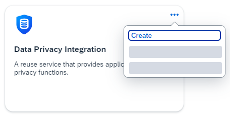
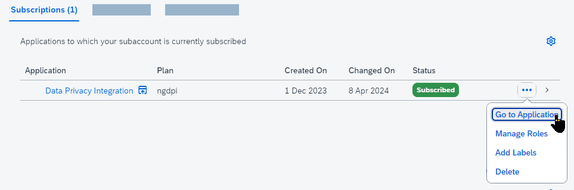

# Retention Management

{{ $frontmatter.synopsis }}

:::warning To follow this cookbook hands-on you need an enterprise account.
The SAP Data Privacy Integration NG service is currently only available for [enterprise accounts](https://discovery-center.cloud.sap/missiondetail/3019/3297/). An entitlement in trial accounts is not possible.
:::

SAP BTP provides the [*SAP Data Privacy Integration Next Gen (DPI)*](https://help.sap.com/docs/data-privacy-integration/end-user-information/what-is-data-privacy-integration-nextgen) service, whose module "Retention Management" allows administrators to configure retention policies which block and destruct personal identifiable information. To do that, the DPI service needs to access the application via a REST API. That endpoint is provided by the @cap-js/data-privacy plugin and configured as follows.

[[toc]]


## Install the DPI plugin

```sh
npm install @cap-js/data-privacy
```

The plugin for the DPI service automatically generates the API necessary for the DPI service to get relevant metadata and trigger blocking and destruction actions, based on your annotated data model. The `sap.ilm.RetentionService` service is provided at the path `/dpp/retention` and requires the `DataRetentionManagerUser` role to access it.

## Annotate Personal Data

Retention Management requires applications to configure three kinds of artefacts: 1. _Data Subjects_, 2. _ILM Objects_, 3. _Organizational attributes_. Only with all three provided, retention and deletion policies can be created in the Retention Management module of SAP DPI.

> We keep using the [Incidents Management reference sample app](https://github.com/cap-js/incidents-app).

### Data Subjects

Data subjects are configured in CDS via the `@PersonalData.EntitySemantics: 'DataSubject'` annotation. For blocking and deletion purposes all compositions of said entity are considered to be part of the logical data subject. 

::: warning
Thus a composed entity of a data subject is not allowed to be marked with `@PersonalData.EntitySemantics: 'Other'`.
:::

```cds
annotate Customers with @(
    // Shown in the Retention Manager UI
    description: 'Customers of the company'
    // Mark the entity as a data subject
    PersonalData: {
      EntitySemantics : 'DataSubject',
      DataSubjectRole: 'Customer'
    },
    Communication.Contact : {
      // fn takes precedence. If not specified, 
      // the properties from the "n" attribute 
      // are used to build up the name.
      fn: fullName,
      n: {
        given: firstName,
        additional: middleName,
        surname: lastName,
      },
      email: [
        {
          // If #preferred is not given, 
          // #home is used, 
          // else the first entry is used.
          type: #preferred,
          address: email
        }
      ]
    }
) {
    ID @PersonalData.FieldSemantics : 'DataSubjectID';
}
```

You must annotate one property as the data subject ID. This is crucial as the data subject ID is used to link ILM Objects to the data subject.

Furthermore `@Communication.Contact` is necessary to specify the name and email of the data subject, to be shown in the Retention Manager UI when deleting personal data.

### ILM Objects

Information Lifecycle Management (ILM) Objects represent the transactional data for retention management. Data that can be owned by data subjects or transactional data, like documents, without an individual owner. 

For these ILM objects the Retention Manager allows you to configure retention policies, which causes personal data to be blocked and deleted, or, non data-privacy specific, data to be archived and destructed.

Within CDS you would indicate an ILM Object, by annotating it with `@PersonalData.EntitySemantics : 'Other'`.

```cds
annotate Incidents with @(
    description: 'A raised incident by a customer' // Shown in the Retention Manager UI
    PersonalData: {
        EntitySemantics : 'Other',
        DataSubjectRole: 'Customer'
    },
) {
    customer @PersonalData.FieldSemantics : 'DataSubjectID';
    resolvedAt @PersonalData.FieldSemantics : 'EndOfBusinessDate';
    company @PersonalData.FieldSemantics : 'DataControllerID';
};
```

Any ILM Object must have two properties: One that contains the end of business date, and one that is the ID for the data controller.

For ILM Objects related to personal data, they also must have a property pointing to the data subject.

::: info
If your current domain model does not have these properties directly on the root, you can refer to [Extending the Retention service](#extending-the-retention-service-optional) to include all required properties in the service interface.
:::

#### Conditions

Retention policies might differ not just based on the data controller, e.g. organizational attribute, but further attributes. These are called conditions and can be used to narrow down retention policies to a subset of data.

```cds
annotate Incidents with {
    type @PersonalData.FieldSemantics : 'PurposeID';
    category @ILM.FieldSemantics : 'ProcessOrganizationID';
};
```

Conditions are generated for properties marked with `@PersonalData.FieldSemantics : 'PurposeID'` or `@ILM.FieldSemantics : 'ProcessOrganizationID'`. The field help logic is the same as for Organizational attributes.

#### Dynamic ILM Object enablement

You can dynamically enable or disable ILM Objects, which is useful for SaaS Providers when specific entities are put behind a feature flag. Enablement can be toggled via `@ILM.BlockingEnabled` and it accepts, static true/false values, CQN expressions or CQN expression strings.

```cds
annotate Incidents with @(
    ILM.BlockingEnabled : '(SELECT isBlockingEnabled FROM sap.capire.incidents.Configuration)'
);
```

#### Customize ILM Object name

By default the ILM Object name is the name of the entity. You can customize that name with the `@ILM.ObjectName` annotation.

```cds
annotate Incidents with @(
    ILM.ObjectName : 'CustomIncidents'
);
```


### Organizational attributes

Organizational attributes are the main differentiator to know which retention policy is relevant for which ILM Object. Each ILM Object must have one and only one property marked as such. `@PersonalData.FieldSemantics : 'DataControllerID'` or `@ILM.FieldSemantics : 'LineOrganizationID'` can be used and both annotations have the same effect.

::: code-group
```cds [DPP specific]
annotate Incidents with {
    company @PersonalData.FieldSemantics : 'DataControllerID';
};
```

```cds [ILM generic]
annotate Incidents with {
    company @ILM.FieldSemantics : 'LineOrganizationID';
};
```
:::

For organizational attributes a field help is generated by the plugin that when creating the retention policy in the Retention Manager, the administrator can choose for which Organizational attribute the policy applies.

The logic for the field help generation is as follows:
    1. Consider the `@Common.ValueList` annotation. If the property marked as the organizational attribute has a ValueList annotated, the entity specified as the `@Common.ValueList.CollectionPath` is considered to be the source for the field help.

```cds
    annotate Incidents with {
        company @PersonalData.FieldSemantics : 'DataControllerID' @Common.ValueList : {
            CollectionPath: 'Companies',
            Parameters : [
                {
                    $Type: 'Common.ValueListParameterInOut',
                    ValueListProperty : 'ID',
                    LocalDataProperty : company_ID,
                },
                {
                    $Type : 'Common.ValueListParameterDisplayOnly',
                    ValueListProperty : 'name',
                },
            ]
        };
    };
```
        If multiple `Common.ValueListParameterDisplayOnly` parameters are specified they are concatenated together.

    2. If no value list is specified, but the property is an association, the associated entity is used for the field help.

        For the name shown in the field help 1. the path from `@Common.Text` is used. If that is not given the path specified via `@UI.HeaderInfo.Title.Value` would be used.

```cds
    annotate Incidents with {
        company @PersonalData.FieldSemantics : 'DataControllerID' @Common.Text : company.name;
    };

    annotate Companies with @(
        UI.HeaderInfo : {
            Title : {
                Value : name
            },
        }
    ) {

    };
```

    3. If the property is not an association, a field help is created by building a SELECT distinct query on that column.


### Dynamic data subject role assignments

In some scenarios an ILM Object or a data subject might have a dynamic data subject role. Imagine a business partner entity, which has a type property specifying the data subject role.

```cds
@PersonalData : {
    EntitySemantics : 'DataSubject',
    DataSubjectRole : type
}
entity BusinessPartners : cuid {
    type : String enum {
        Customer = 'Customer',
        Employee = 'Employee',
        Debtor = 'Debtor'
    }
}
```

For dynamic data subject roles to work, the data subject role property must have an enum detailing all possible values. With that the plugin will correctly generate the configuration and handle requests from the Retention Manager.

## Blocking personal data

Personal data usually needs to be blocked after their end of business date is meet, starting the retention period where it can only be accessed by auditors.

The plugin implements it by automatically injecting two aspects into every ILM Object and Data Subject base entity and its composed entities:

```cds
aspect destruction {
  ilmEarliestDestructionDate : Date  @UI.HiddenFilter  @PersonalData.FieldSemantics: 'EndOfRetentionDate';
  ilmLatestDestructionDate : Date  @UI.HiddenFilter;
}

aspect blocking {
  dppBlockingDate            : Date  @UI.HiddenFilter  @PersonalData.FieldSemantics: 'BlockingDate';
}
```

This means ILM Objects and Data Subjects will have three additional columns on the database. To support brownfield approaches, you can mark existing fields with the following annotations and the plugin will skip adding the respective fields to the entity.

```cds
annotate Incidents with {
    destroyAt @PersonalData.FieldSemantics: 'EndOfRetentionDate';
    blockedAt @PersonalData.FieldSemantics: 'BlockingDate';
}
```

The fields are necessary for the Retention Manager to safely orchestrate personal data blocking and destruction.

The approach of storing blocked data within the same table instead of having it in a different data store was made to ensure auditors can use the same UI to access active and blocked data.

### Restricting access to blocked data

Blocked data no longer should be used for regular purposes. To ensure custom application code cannot by accident select blocked data, the plugin implements access restrictions against blocked data on a database adapter and database level.

#### Restricting access to views
CAP generates two different [Analytic Privileges](https://help.sap.com/docs/SAP_HANA_PLATFORM/b3ee5778bc2e4a089d3299b82ec762a7/db08ea0cbb571014a386f851122958b2.html) for restricting access to views when the database is HANA Cloud.

1. An analytic privilege for business object entities, where the `blockingDate` property is checked. If this property is null or in the future access is granted.
2. A second analytic privilege with a dummy restriction `1 = 1` to grant access independent of the blocked state.

The two analytic privileges are assigned to two different database roles, which are generated by the plugin as well.
1. The analytic privileges of the first kind are assigned to the role `sap.dpp.RestrictBlockedDataAccess`.
2. The analytic privileges, which grant access to all data are assigned to `sap.dpp.DPPNoRestrictions`.

`sap.dpp.RestrictBlockedDataAccess` is assigned to the [`default_access_role`](https://help.sap.com/docs/SAP_HANA_PLATFORM/4505d0bdaf4948449b7f7379d24d0f0d/9235c9dd8dbf410f915ffe305296a032.html), from the HDI container, so the database user used by the application layer can access the views with blocked data, while the restriction is enforced.

`sap.dpp.DPPNoRestrictions` is generated as a quality of life role, so applications can easily assign it to support users if blocked data must be accessed.

#### Restricting access to tables
Because analytic privileges cannot be assigned to tables, another solution is necessary.

You can configure the table restrictions via `cds.env.requires['sap.ilm.RetentionService'].tableRestrictions: "srv" | "db"`. The default is 'srv'.

##### Database based table restrictions

The first option is to strip the HDI user of its schema SELECT privileges and instead only assign SELECT privileges to tables which do not contain any blocked data.
While this is the preferred solution to restrict access by design, it has severe implications for much of an application as direct table access is no longer possible. As such the application layer restrictions are the default.

##### Application layer based table restrictions (default)

Thus the default is application layer table restrictions, meaning for all queries targeting a table, a where clause is added. The where clause is added via a before handler in CAPs Database service. This means all CAP requests send via the CAP database service are covered. However three limitations exists with this approach, of which applications must be aware:

1. Plain SQLs send via CAPs database service are not covered as only CQN queries can be safely enhanced with the where clause.
2. The restrictions are not enforced for other consumers like SAP Analytics Cloud, Business Data Cloud or Enterprise Search.
3. The restrictions are not enforced within database native objects, e.g. when applications leverage HANA Cloud procedures.

Furthermore application layer access restrictions are skipped if the application layer user has the "privileged" flag from CAP. This is done to offer applications still a way to access all data. (The privileged flag cannot be set via HTTP and can only be set CAP internally when CAP services call other CAP services within the same process)

### Access restrictions on other databases

For other databases the application layer table restrictions are applied to views as well. Meaning the three limitations mentioned in [the section above](#application-layer-based-table-restrictions-default) also apply for views for other databases apart from HANA Cloud.

### Auditor access
A key requirement when considering how auditors should have access to blocked data, is that auditors should be able to open a regular app, like 'Manage Sales Orders' and see regular and blocked data. It should not be needed for auditors to open a separate app, to avoid confusion and to show the business data within the designed environment.

::: details Implementation of auditor access 

The implementation is, that the application layer sets a session context variable of type string, where all roles assigned to the user are appended as a single string, separated by a comma.

The Analytic Privileges on HANA have an additional condition, which checks whether the session context variable contains any of the configured roles, which should have access to the blocked data. The roles are configured during design time and cannot dynamically be modified during runtime (or would require a redeployment).

The session context variable is cleared after the request was completed, to avoid session context spillage.

For application layer based restrictions, the role check is implemented as part of the before handler. Only if the required role is not assigned to the user, the where condition, to prohibit access to blocked data, is assigned.

:::

By default the role against which the check runs is the 'Auditor' role, hence when a user has an XSUAA scope or Cloud Identity Service group called 'Auditor' assigned, they can access blocked data.
You can override this by annotating

```cds
annotate bookshop.Customers with @(
  Auditing.AuditorScopes : [
    'CUSTOMER_AUDITOR'
  ]
)
```

or 

```cds
@Auditing.DefaultAuditorScopes : [
  'CATALOG_AUDITOR'
]
service CatalogService {}
```

The first sample sets a custom auditor role for just the 'Customers' entity. The second sample sets a custom auditor role for the whole catalog service and all ILM objects and data subjects within. When an entity within the service annotated with `@Auditing.DefaultAuditorScopes` is annotated with `Auditing.AuditorScopes`, `Auditing.AuditorScopes` takes precedence and the auditing default is ignored.

## Miscellaneous 

### Audit logging

The retention service leverages CAPs inbuilt audit logging capabilities to ensure all queries done by the Retention Manager DPI module against the database are properly logged.

### Troubleshooting

The logger component is `data-privacy` and extensive debug logs are written to allow you to understand what is happening behind the scenes of the plugin.

### Extending the Retention service (optional)

You can extend the `sap.ilm.RetentionService` yourself and manually expose entities if you want to rename files or adjust annotations for the exposed entity.

The plugin checks which entities are already exposed and then won't expose them another time. Extending the retention service can be useful. For example if the data controller ID is not stored directly on the entity itself it can still be added to the service interface without migrating the base tables.

```cds
using {sap.ilm.RetentionService} from '@sap/cds-dpi';
using {sap.capire.bookshop as db} from '../db/schema';

extend service RetentionService with {
    entity Orders as projection on db.Orders {
        ID,
        legalEntity.company @PersonalData.FieldSemantics : 'DataControllerID',
        endOfWarrantyDate as aliasEndOfBusiness,
        Customer,
        Items
    }
}
```

## Archiving

The archiving capabilities of the Retention Management application are currently not supported by the plugin but are planned to be added throughout 2026 by leveraging HANA Cloud Native Storage Extensions and HANA Cloud Data Lake as the archive's persistence.

## Connecting SAP Data Privacy Integration

Next, we will briefly detail the integration to Retention Management application of SAP DPI.
For further details, see the [SAP Data Privacy Integration - Developer Guide](https://help.sap.com/docs/data-privacy-integration/development/getting-started-data-privacy-integration-nextgen).

### Subscribe to SAP Data Privacy Integration

[Subscribe to the service](https://help.sap.com/docs/data-privacy-integration) from the _Service Marketplace_ in the SAP BTP cockpit.

{width="300"}

Follow the wizard to create your subscription.

### Prepare for Deployment

The SAP DPI NG service cannot connect to your application running locally. Therefore, you need to deploy your application. Here is what you need to do in preparation.

1. Add SAP HANA Cloud configuration, authentication configuration, and an _mta.yaml_ to your project:

    ```sh
    cds add hana,xsuaa,mta
    ```

[Learn more about authorization in CAP using Node.js.](/@external/node.js/authentication#jwt){.learn-more}

### Add deployment configuration for SAP DPI

Add the deployment configuration for SAP DPI:

```sh
cds add data-privacy
```

::: details What the command adds

The command add the configuration for the SAP DPI NG instance configuring the Retention Management application, the connection to the CAP application and the XSUAA scope assigned to the SAP DPI NG instance.

::: code-group

```yaml [mta.yaml]
modules:
  - name: incidents-srv
    ...
    requires:
      ...
      - name: incidents-retention # [!code ++]
...
resources:
  ...
  - name: incidents-retention # [!code ++]
    type: org.cloudfoundry.managed-service # [!code ++]
    requires: # [!code ++]
      - name: srv-api # [!code ++]
    parameters: # [!code ++]
      service-name: incidents-retention # [!code ++]
      service: data-privacy-integration-service # [!code ++]
      service-plan: data-privacy-internal # [!code ++]
      config: # [!code ++]
        xs-security: # [!code ++]
          xsappname: incidents-retention-${org}-${space} # [!code ++]
          authorities: # [!code ++]
            - $ACCEPT_GRANTED_AUTHORITIES # [!code ++]
        dataPrivacyConfiguration: # [!code ++]
          configType: retention # [!code ++]
          applicationConfiguration: # [!code ++]
            applicationName: incidents-retention # [!code ++]
            applicationDescription: bookshop-retention # [!code ++]
            applicationDescriptionKey: APPLICATION_NAME # [!code ++]
            applicationBaseURL: ~{srv-api/srv-url} # [!code ++]
            applicationTitle: incidents # [!code ++]
            enableAutoSubscription: true # [!code ++]
          translationConfiguration: # [!code ++]
            textBundleEndPoint: /dpp/retention/i18n-files/i18n.properties # [!code ++]
            defaultLanguage: en # [!code ++]
            supportedLanguages: # [!code ++]
              - de # [!code ++]
              - fr # [!code ++]
              - es # [!code ++]
              - en # [!code ++]
          retentionConfiguration: # [!code ++]
            applicationConfiguration: # [!code ++]
              applicationType: TransactionMaster # [!code ++]
              iLMObjectDiscoveryEndPoint: /dpp/retention/iLMObjects # [!code ++]
  ...
  - name: incidents-auth
    type: org.cloudfoundry.managed-service
    parameters:
      service: xsuaa
      service-plan: application
      config:
        xsappname: incidents-${org}-${space}
        tenant-mode: dedicated
        scopes:
          - name: $XSAPPNAME.DataRetentionManagerUser # [!code ++]
            description: Technical scope to restrict access to retention endpoint # [!code ++]
            grant-as-authority-to-apps: # [!code ++]
              - $XSSERVICENAME(incidents-retention) # [!code ++]

```

:::

:::

::: warning More configuration is being added to the mta.yaml file during `cds build`

Retention Management has three important objects: 1. Data Subjects, 2. ILM Objects, 3. Organization attributes.
While ILM Objects can be dynamically supplied to Retention Management via an endpoint, data subjects and organization attributes must be provided during deploy time. However as data subjects and organizational attributes depend on your CDS annotated data model, they are added late during `cds build`, where the plugin will analyse the model and add the correct data subjects and organization attributes configuration.

:::

### Build and Deploy Your Application

:::details MT-scenario

```sh
cds add multitenancy
npm update --package-lock-only
npm update --package-lock-only --prefix mtx/sidecar
```

For multi-tenancy, the "enableAutoSubscription" parameter in the `mta.yaml` file is false.

:::

The general deployment is described in detail in [Deploy to Cloud Foundry guide](/@external/guides/deploy/to-cf). Here's for short what you need to do.

```sh
cds up
```

### Assign Role Collections

SAP Data Privacy Integration comes with the following role collections for retention management:

- DPI_NextGen_Retention_DataManagement_Administrator
- DPI_NextGen_Retention_DataManagement_Configuration_Administrator
- DPI_NextGen_Retention_DataPrivacy_Administrator
- DPI_NextGen_Retention_DataPrivacy_Configuration_Administrator

[Learn more about Assigning Role Collections to Users or User Groups](https://help.sap.com/docs/btp/sap-business-technology-platform/assigning-role-collections-to-users-or-user-groups){.learn-more}

## Using the SAP DPI NG Retention Management application

Open the SAP DPI NG service from the _Instances and Subscriptions_ page in the SAP BTP cockpit.

{width="500"}


> TODO: Add instructions / screenshots for how to configure data controllers, retention policies and then delete the actual data