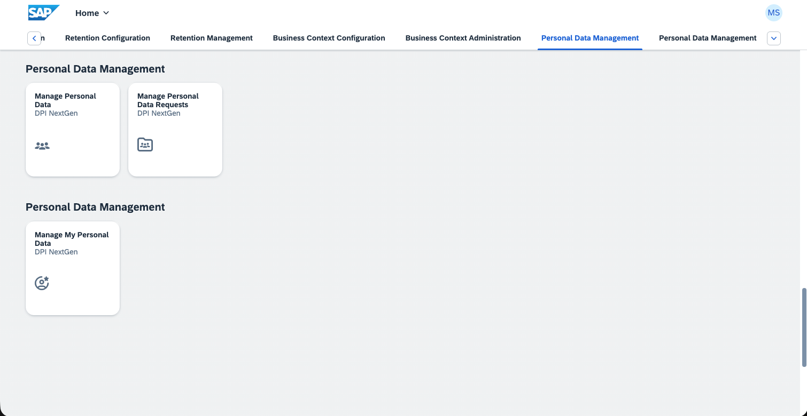
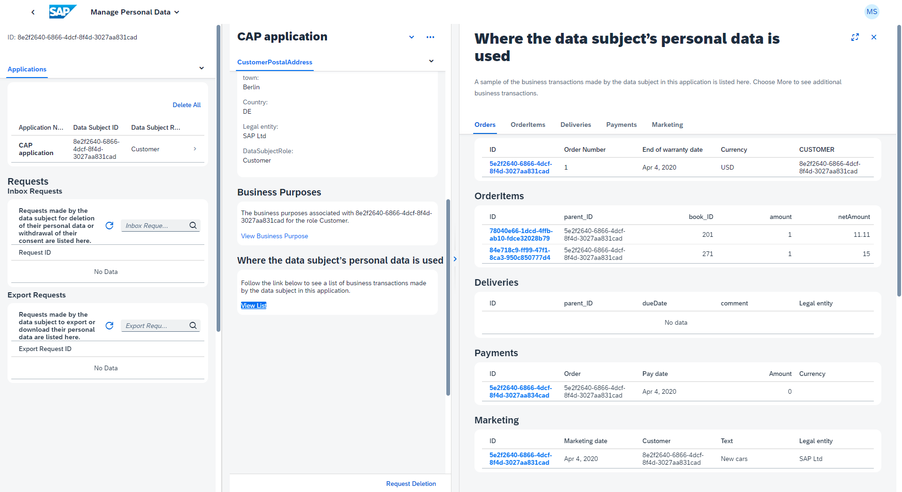

# Information Reporting

{{ $frontmatter.synopsis }}

:::warning To follow this cookbook hands-on you need an enterprise account.
The SAP Data Privacy Integration NG service is currently only available for [enterprise accounts](https://discovery-center.cloud.sap/missiondetail/3019/3297/). An entitlement in trial accounts is not possible.
:::

SAP BTP provides the [*SAP Data Privacy Integration Next Gen (DPI)*](https://help.sap.com/docs/data-privacy-integration/end-user-information/what-is-data-privacy-integration-nextgen) service, whose module "Information Reporting" allows administrators to respond to the question "What data of me do you have?". To answer this question, the DPI service needs to fetch all personal data using an OData endpoint. That endpoint has to be provided by the application as follows.

[[toc]]

## Annotate Personal Data

First identify entities and elements (potentially) holding personal data using `@PersonalData` annotations, as explained in detail in the [*Annotating Personal Data* chapter](dpp-annotations) of these guides.

> We keep using the [Incidents Management reference sample app](https://github.com/cap-js/incidents-app).

## Install the DPI plugin

```sh
npm install @cap-js/data-privacy
```

The plugin for the DPI service automatically generates the OData service interface necessary for the DPI service to read the personal data, based on your annotated data model. The `sap.dpp.InformationService` service is provided at the path `/dpp/information` and requires the `PersonalDataManagerUser` role to access it.

## Which entities are exposed by the plugin

- All entities annotated with `@PersonalData.EntitySemantics` are automatically included in the Information service
- Compositions of said entities are exposed as well and inherit the entity semantics from their parent
- Compositions of data subjects (`@PersonalData.EntitySemantics: DataSubject`) are expected to be annotated with `@PersonalData.EntitySemantics: DataSubjectDetails`

::: tip
Make sure to have [indicated all relevant entities and elements in your domain model](dpp-annotations).
:::

## How to customize the DPI Information retrieval user interface

With `@UI.LineItem` and `@UI.FieldGroup` you can customize how the table representation of an entity set or the form of an entity looks. If you did not provide your own line item or field group, the plugin will automatically generate one including all fields.

```cds
@UI.LineItem : [
    {
        Value : ID,
    },
    {
        Value : OrderNo,
    },
]
@UI.FieldGroup : {
    Data: [
        {
            Value : ID,
        },
        {
            Value : OrderNo,
        },
    ]
}
entity Orders         as projection on db.Orders;
```

Use `@title` to add labels to fields and entities to specify readable names within the Information Reporting UI. 

All possible annotations used by SAP DPI are listed in the [SAP Data Privacy Integration - Developer Guide](https://help.sap.com/docs/data-privacy-integration/development/odata-v4-data-privacy-integration-nextgen-c16fbaf659b6444ebb1a880503688162).

## Annotating the data subject

In addition, the data subject must be annotated with the `@Communication.Contact`.

To perform a valid search in the "Manage Personal Data" application, you will need _Surname_, _Given Name_, and _Email_ or the _Data Subject ID_. Details about this annotation can be found in the [Communication Vocabulary](https://github.com/SAP/odata-vocabularies/blob/main/vocabularies/Communication.md).

Alternatively to the tuple _Surname_, _Given Name_, and _Email_, you can also use _Surname_, _Given Name_, and _Birthday_ (called `bday`), if available in your data model. Details about this can be found in the [SAP Data Privacy Integration - Developer Guide](https://help.sap.com/docs/data-privacy-integration/development/odata-v4-data-privacy-integration-nextgen-c16fbaf659b6444ebb1a880503688162?q=Contact&locale=en-US).

At this point, you are done with your application. Let's set up the SAP Data Privacy Integration service and try it out.

## Extending the Information service (optional)

You can extend the `sap.dpp.InformationService` yourself and manually expose entities if you want to rename entities or properties or adjust annotations for the exposed entity.

The plugin checks which entities are already exposed and then won't expose them another time.

```cds
using {sap.dpp.InformationService} from '@sap/cds-dpi';
using {sap.capire.incidents as db} from '../db/schema';

extend service InformationService with {
    entity Incidents as projection on db.Incidents {
        ID,
        legalEntity,
        incidentResolvedDate as aliasEndOfBusiness,
        customer,
        conversations
    }
}
```

## Connecting SAP Data Privacy Integration

Next, we will briefly detail the integration to Information Reporting module of SAP DPI.
For further details, see the [SAP Data Privacy Integration - Developer Guide](https://help.sap.com/docs/data-privacy-integration/development/getting-started-data-privacy-integration-nextgen).

### Subscribe to SAP Data Privacy Integration

[Subscribe to the service](https://help.sap.com/docs/data-privacy-integration) from the _Service Marketplace_ in the SAP BTP cockpit.

{width="300"}

Follow the wizard to create your subscription.

### Prepare for Deployment

The SAP DPI service cannot connect to your application running locally. Therefore, you need to deploy your application. Here is what you need to do in preparation.

1. Add SAP HANA Cloud configuration, authentication configuration, and an _mta.yaml_ to your project:

    ```sh
    cds add hana,xsuaa,mta
    ```

[Learn more about authorization in CAP using Node.js.](/@external/node.js/authentication#jwt){.learn-more}

### Add deployment configuration for SAP DPI

Add the deployment configuration for SAP DPI:

```sh
cds add data-privacy
```

::: details What the command adds

The command add the configuration for the SAP DPI instance configuring the Information Reporting application, the connection to the CAP application and the XSUAA scope assigned to the SAP DPI instance.

::: code-group

```yaml [mta.yaml]
modules:
  - name: incidents-srv
    ...
    requires:
      ...
      - name: incidents-information # [!code ++]
...
resources:
  ...
  - name: incidents-information # [!code ++]
    type: org.cloudfoundry.managed-service # [!code ++]
    requires: # [!code ++]
      - name: srv-api # [!code ++]
    parameters: # [!code ++]
      service-name: incidents-information # [!code ++]
      service: data-privacy-integration-service # [!code ++]
      service-plan: data-privacy-internal # [!code ++]
      config: # [!code ++]
        xs-security: # [!code ++]
          xsappname: incidents-information-${org}-${space} # [!code ++]
          authorities: # [!code ++]
            - $ACCEPT_GRANTED_AUTHORITIES # [!code ++]
        dataPrivacyConfiguration: # [!code ++]
          configType: information # [!code ++]
          applicationConfiguration: # [!code ++]
            applicationName: incidents-information # [!code ++]
            applicationDescription: DPI NextGen Incidents CAP Reference Application # [!code ++]
            applicationTitle: DPI NextGen Incidents # [!code ++]
            enableAutoSubscription: true # [!code ++]
          informationConfiguration: # [!code ++]
            applicationConfiguration: # [!code ++]
            dataSubjectDeletionAgent: retention-manager # [!code ++]
              retentionApplicationName: incidents-retention # [!code ++]
              disableDataSubjectCorrection: true # [!code ++]
              cacheControl: no-cache # [!code ++]
            components: # [!code ++]
              - componentName: incidents-srv # [!code ++]
                componentBaseURL: ~{srv-api/srv-url} # [!code ++]
                serviceEndPoints: # [!code ++]
                  - serviceName: dpi-service # [!code ++]
                    serviceFormat: odata-v4 # [!code ++]
                    annotationFormat: v4 # [!code ++]
                    serviceEndPoint: /dpp/information # [!code ++]
                    appPaginationEnabled: true # [!code ++]
                    cacheControl: no-cache # [!code ++]
```
```json [xs-security.json]
{
  "scopes": [
    { // [!code ++]
      "name": "$XSAPPNAME.PersonalDataManagerUser", // [!code ++]
      "description": "Technical scope to restrict access to information endpoint", // [!code ++]
      "grant-as-authority-to-apps": ["$XSSERVICENAME(incidents-information)"] // [!code ++]
    } // [!code ++]
  ]
}
```

:::

### Build and Deploy Your Application

:::details MT-scenario

```sh
cds add multitenancy
npm update --package-lock-only
npm update --package-lock-only --prefix mtx/sidecar
```

For multi-tenancy, the "enableAutoSubscription" parameter in the `mta.yaml` file must be false.

:::

The general deployment is described in detail in [Deploy to Cloud Foundry guide](/@external/guides/deploy/to-cf). Here's for short what you need to do.

```sh
cds up
```

### Assign Role Collections

SAP Data Privacy Integration comes with the following role collections for Information reporting:

- DPI_NextGen_Information_CustomerServiceRepresentative
- DPI_NextGen_Information_OperationsClerk
- DPI_NextGen_Information_DataPrivacy_Administrator

[Learn more about Assigning Role Collections to Users or User Groups](https://help.sap.com/docs/btp/sap-business-technology-platform/assigning-role-collections-to-users-or-user-groups){.learn-more}

## Using the Information Reporting application

Open the SAP DPI service from the _Instances and Subscriptions_ page in the SAP BTP cockpit.

{width="500"}

{width="500"}

In this application you can search for data subjects with _First Name_, _Last Name_, and _Date of Birth_, or alternatively with their _ID_.

{width="500"}

[Learn more about the applications SAP DPI Information Reporting offers](https://help.sap.com/docs/data-privacy-integration/end-user-information/information-reporting-data-privacy-integration-nextgen?locale=en-US){.learn-more}
