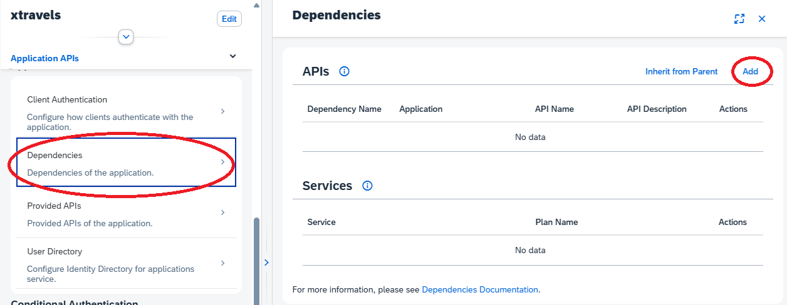
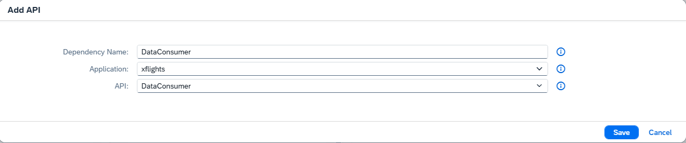

<script setup>
  import { h } from 'vue'
  const Y  =  () => h('span', { class: 'y',   title: 'Available' },      ['✓']   )
  const X  =  () => h('span', { class: 'x',   title: 'Available' },      ['✗']   )
  const Na =  () => h('span', { class: 'na',  title: 'Not available' },  ['n/a']   )
</script>
<style scoped>
  .y   { color: var(--green); font-weight:900; }
  .x   { color: var(--red);   font-weight:900; }
  /* .na  { font-weight:500; } */
</style>


# Remote Authentication { #remote-authentication }

<ImplVariantsHint />

This guide explains how to authenticate remote services.

[[toc]]

## Remote Service Abstraction { #remote-services }

According to the key concept of [pluggable building blocks](./overview#key-concept-pluggable), the architecture of CAP's [Remote Services](../using-services#consuming-services) decouples protocol level (i.e., exchanged content) from connection level (i.e., established connection channel). 
While the business context of the application impacts the protocol, the connectivity of the service endpoints is independent of it and mainly depends on platform-level capabilities.
The latter is frequently subject to change and therefore should not introduce application dependencies. 

{width="400px" }

At the connectivity layer, the following basic tasks can be addressed generically:
- Authentication (_how to set up a trusted channel_)
- Destination (_how to find the target service_)
- User propagation (_how to transport user information_)

CAP's connectivity component handles authentication (IAS, XSUAA, X.509, ZTID, ...), destination (local destination, BTP Destination, BTP Service Binding), and user propagation (technical provider, technical subscriber, named user) transparently through configuration.
All three service scenarios can be addressed through configuration variants of the same remote service concept, as shown in the following sections.

CAP supports out-of-the-box consumption of various types of [remote services]( #remote-services):

* [Co-located services](#co-located-services) as part of the same deployment and bound to the same identity instance (i.e., belong to the same trusted [application zone](./overview#application-zone)).
* [External services](#app-to-app) which can be running on non-BTP platforms.
* [BTP reuse services](#ias-reuse) consumed via service binding.


## Co-located Services {#co-located-services}

Co-located services do not run in the same microservice, but are typically part of the same deployment unit and hence reside within the same trust boundary of the [application zone](./overview#application-zone).
Logically, such co-located services contribute to the application equally and could run as integrated services in the same microservice, but for technical reasons (e.g., different runtime or scaling requirements) they are separated physically, often as a result of a [late-cut microservice approach](../providing-services#late-cut-microservices).

Technically, **they share the same identity instance, which allows direct token forwarding**:

{width="450px" }

[Learn more about how to configure co-located services in CAP Java](/java/cqn-services/remote-services#binding-to-a-service-with-shared-identity) {.learn-more}

You can test CAP's built-in support for co-located services in practice by modifying the [`xflights-java`](https://github.com/capire/xflights-java/tree/main) and [`xtravels-java`](https://github.com/capire/xtravels-java/tree/main) sample applications.
`xflights-java` acts as a master data provider exposing basic flight data in service [`sap.capire.flights.data`](https://github.com/capire/xflights-java/blob/6fc7c665c63bb6d73e28c11b391b1ba965b8772c/srv/data-service.cds#L24) via different protocols.
On the client side, `xtravels-java` imports this service as a CAP remote service and fetches data in a [custom handler for data federation](https://github.com/capire/xtravels-java/blob/53a5fa33caf4c9068f2e66fab25bda26f3f450ca/srv/src/main/java/sap/capire/xtravels/handler/FederationHandler.java#L63).

::: tip
CAP offers a simplified co-located service setup by leveraging remote services that require:
- Shared identity instance 
- URL for the destination
- Principal propagation mode (optional)
:::


To combine both applications in a co-located setup, follow these steps:

#### 1. Prepare the CF environment { #prepare }

Make sure that you've prepared a [local environment for CF deployments](../deployment/to-cf#prerequisites) and in addition:
- A Cloud Foundry (CF) space in a subaccount.
- [HANA Cloud instance](https://help.sap.com/docs/hana-cloud/sap-hana-cloud-administration-guide/create-sap-hana-database-instance-using-sap-hana-cloud-central) mapped to the CF space.
- [IAS tenant](./authentication#ias-ready) mapped to the subaccount.
  

#### 2. Prepare and deploy the consumer application { #co-located-consumer }

As client, `xtravels-srv` first needs a valid configuration for the remote service `sap.capire.flights.data`:

::: code-group

```yaml [/srv/src/main/resources/application.yaml]
---
spring:
  config.activate.on-profile: cloud
cds:
  remote.services:
    xflights:
      type: hcql
      model: sap.capire.flights.data
      binding:
        name: xtravels-ias
        options:
          url: https://<xflights-srv-cert url>/hcql
        onBehalfOf: systemUserProvider
```
:::

The `type` property activates the protocol for exchanging business data and must be offered by the provider [CDS service](https://github.com/capire/xflights-java/blob/6fc7c665c63bb6d73e28c11b391b1ba965b8772c/srv/data-service.cds#L24).
The `model` property needs to match the fully qualified name of the CDS service from the imported model.
You can find CDS service definition of `sap.capire.flights.data` in file `target/cds/capire/xflight-data/service.cds` resolved during CDS build step.
The `binding.name` needs to point to the shared identity instance and `option.url` provides the required location of the remote service endpoint.
Finally, `onBehalfOf: systemUserProvider` specifies that the remote call is invoked on behalf of the technical provider tenant.


Now you are ready to deploy the application with

```sh
cd ./xtravels_java
cds up
```

❗Note that CF application `xtravels-srv` will not start successfully as long as `xflights` is not deployed yet (step 3).

::: tip
For production deployment, it is recommended to combine both services with the shared identity instance in a [single MTA descriptor](../deployment/microservices#all-in-one-deployment).
:::


#### 3. Prepare and deploy the provider application { #co-located-provider }

As server, `xflights-srv` needs to restrict service `sap.capire.flights.data` to the technical client calling from of the same application.
This can be done by adding pseudo-role [`internal-user`](./cap-users#pseudo-roles) to the service:

::: code-group
```cds [/srv/authorization.cds]
using { sap.capire.flights.data as data } from './data-service';

annotate data with @(requires: 'internal-user');
```
:::

::: tip
For different [user propagation](./cap-users#remote-services) modes the remote service can be configured appropriately.
The provider service authorization needs to align with the configured user propagation.
:::

Additionally, to establish the co-located setup, the microservice needs to share the same identity instance:

::: code-group

```yaml [/srv/srv/main/resources/application.yaml]
resources:
  - name: xflights-ias
    type: org.cloudfoundry.managed-service // [!code --]
    type: org.cloudfoundry.existing-service // [!code ++]
    parameters:
      service: identity // [!code --]
      service-name: xflights-ias // [!code --]
      service-name: xtravels-ias // [!code ++]
      service-plan: application // [!code --]
      config: // [!code --]
        display-name: xflights // [!code --]
```

:::

Finally, deploy and start the application with

```sh
cd ./xflights_java
cds up
```

#### 4. Verify the deployment { #verify }

First, you can check the overall deployment status at the CF CLI level. Specifically, the application services must be started successfully and the shared identity instance must be verified.

::: details Verify: `cf apps` should show the following lines:

::: code-group
```sh
name                             requested state   processes  routes
xflights-db-deployer             stopped           web:0/1
xflights-srv                     started           web:1/1    ...
xtravels                         started           web:1/1    ...
xtravels-ams-policies-deployer   stopped           web:0/1
xtravels-db-deployer             stopped           web:0/1  
xtravels-srv                     started           web:1/1    ... 
```
:::

::: details Verify: `cf services` should show the following lines:

::: code-group
```sh
xflights-ias   identity   application
xtravels-ias   identity   application   xtravels, xtravels-srv, xflights-srv, ...
```
:::

You can test the valid setup of the xtravels application by accessing the UI and logging in with an authorized test user of the IAS tenant.
To do so, assign a proper AMS policy (e.g., `admin`) to the test user as described [earlier](./cap-users#ams-deployment).


::: tip
The very same setup could be deployed for XSUAA-based services.
:::


## External Services

In contrast to [co-located services](#co-located-services), external services do not have strong dependencies as they have a fully decoupled lifecycle and are provided by different owners.
As a consequence, external services can run cross-regionally; even non-BTP systems might be involved.
A prerequisite for external service calls is a trust federation between the consumer and the provider system.

A seamless integration experience for external service communication is provided by [IAS App-2-App](#app-to-app) flows, which are offered by CAP via remote services.
Alternatively, remote services can be configured on top of [BTP HTTP Destinations](../using-services#using-destinations) which offer [various authentication strategies](https://help.sap.com/docs/connectivity/sap-btp-connectivity-cf/http-destinations) such as SAML 2.0 as required by many S/4 system endpoints.


### IAS App-2-App { #app-to-app }

As a first-class citizen, [IAS](./authentication#ias-auth) is positioned to simplify cross-regional requests with user propagation. 
Prerequisites are identity instances on both consumer and provider sides, plus a registered IAS dependency in the consumer instance.

{width="500px" }

CAP supports communication between arbitrary IAS endpoints and remains transparent for applications as it builds on the same architectural pattern of [remote services](#remote-services).
Technically, the connectivity component uses [IAS App-2-App flows](https://help.sap.com/docs/cloud-identity-services/cloud-identity-services/consume-apis-from-other-applications) in this scenario which requires a token exchange from a consumer token into a token for the provider.
The latter is issued by IAS only if the consumer is configured with a valid IAS dependency pointing to the provider accordingly.

:::tip
CAP offers a simplified App-2-App setup by leveraging remote services that require:
- Identity instances for provider and consumer
- Configured IAS dependency from consumer to provider
- Destination with URL pointing to the provider
- Principal propagation mode (optional)
:::

[Learn more about how to consume external application APIs with IAS](https://help.sap.com/docs/cloud-identity-services/cloud-identity-services/consume-apis-from-other-applications) {.learn-more}


#### 1. Prepare and deploy the provider application

Assuming the same local CF environment setup as [here](#prepare), clone [`xflights-java`](https://github.com/capire/xflights-java/tree/main) or, if already cloned and modified locally, reset to the remote branch.

Similar to the [co-located](#co-located-provider) variant, `xflights` needs to expose service `sap.capire.flights.data` to technical clients.
The difference is that the consumers are not known a priori and are not part of the same application deployment.

To expose service APIs for consumption, you can enhance the identity instance of the provider by defining API identifiers that are listed in property `provided-apis`:

::: code-group
```yaml [mta.yaml]
resources:
  - name: xflights-ias
    type: org.cloudfoundry.managed-service
    parameters:
      [...]
      config:
        display-name: xflights
        provided-apis: [{  # [!code ++:5]
          name: DataConsumer,
          description: Grants technical access to data service API
        }]
```
:::

The entry with name `DataConsumer` represents the consumption of service `sap.capire.flights.data` and is exposed as IAS API.
The description helps administrators to configure the consumer application with the proper provider API if done on UI level.

[Detailed description about identity instance parameters for `provided-apis`](https://github.wdf.sap.corp/pages/CPSecurity/sci-dev-guide/docs/BTP/identity-broker#service-instance-parameters){.learn-more}

How can proper authorization be configured for _technical clients without user propagation_? 
OAuth tokens presented by valid consumer requests from an App-2-App flow will have API claim `DataConsumer`, which is automatically mapped to a CAP role by the runtime.
Therefore, the corresponding CDS service can be protected by CAP role `DataConsumer` to authorize requests thoroughly:

::: code-group
```cds [/srv/authorization.cds]
using { sap.capire.flights.data as data } from './data-service';

annotate data with @(requires: 'DataConsumer');
```
:::

Finally, deploy and start the application with

```sh
cd ./xflights_java
cds up
```


::: tip API as CAP role
The API identifiers exposed by the IAS instance in list `provided-apis` are granted as CAP roles after successful authentication and can be used in @requires annotations.
:::

::: warning Use different roles for technical and business users
Use different CAP roles for technical clients without user propagation and for named business users.

Instead of using the same role, expose dedicated CDS services to technical clients which aren't accessible to business users and vice versa.
:::

#### 2. Prepare and deploy the consumer application { #consumer }

Like with xflights, clone [`xtravels-java`](https://github.com/capire/xtravels-java/tree/main) or, if already cloned and modified locally, reset to remote branch.

First, a BTP destination needs to be added that points to the provider service endpoint to be called (`URL`) and that contains the information about the IAS dependency to be called (`cloudsdk.ias-dependency-name`).  
The name for the IAS dependency is flexible but **needs to match the chosen name in the next step** when [connecting consumer and provider in IAS](#connect).
The destination is required by the connectivity component to prepare the HTTP call accordingly. Also note that the authentication type of the destination is `NoAuthentication`, as the destination itself does not contribute to the authentication process.


::: code-group

```yaml [mta.yaml (destination instance)]
  - name: xtravels-destination
    type: org.cloudfoundry.managed-service
    parameters:
      service: destination
      service-plan: lite
      config:
        init_data:
          instance:
            existing_destinations_policy: update
            destinations:
              - Name: xtravels-data-consumer
                Type: HTTP
                URL: https://<xflights-srv-cert url>/hcql
                cloudsdk.ias-dependency-name: "DataConsumer"
                Authentication: NoAuthentication
                ProxyType: Internet
                Description: "Data consumer destination for xtravels"
```

```yaml [mta.yaml (destination binding)]
modules:
  - name: xtravels-srv
    type: java
    [...]
    requires:
      - name: xtravels-destination # [!code ++]
```

:::

:::tip
Alternatively, the destination can also be created manually in the [BTP destination editor](https://help.sap.com/docs/connectivity/sap-btp-connectivity-cf/access-destinations-editor).
:::


Given the destination, the remote service can be configured in a very similar way as with [co-located services](#co-located-consumer). 
Currently, an additional Cloud SDK dependency `scp-cf` is required to support communication with the BTP destination service:

::: code-group

```yaml [/srv/srv/main/resources/application.yaml]
spring:
  config.activate.on-profile: cloud
cds:
  remote.services:
    xflights:
      type: hcql
      model: sap.capire.flights.data
      destination:
        name: xtravels-data-consumer
        onBehalfOf: systemUserProvider
```

```xml [/srv/pom.xml]
<dependency>
		<groupId>com.sap.cloud.sdk.cloudplatform</groupId>
 		<artifactId>scp-cf</artifactId>
  	<scope>runtime</scope>
</dependency>
```

:::

[Learn more about simplified Remote Service configuration with destinations](/java/cqn-services/remote-services#destination-based-scenarios) {.learn-more}

Finally, deploy and start the application with

```sh
cd ./xtravels_java
cds up
```

`xtravels-srv` is not expected to start successfully; instead, you should see error log messages like this:	
```yaml
Remote HCQL service responded with HTTP status code '401', ...
```

Technically, the remote service implementation will delegate the HTTP connection setup to the connectivity component, which can recognize by the type of destination that it needs to initiate an App-2-App flow.
It then takes the token from the request and triggers an IAS token exchange for the target [IAS dependency](#connect) according to the user propagation strategy (technical communication here).
As the IAS dependency is not created yet, IAS rejects the token exchange request and the call to the provider fails with `401` (not authenticated).

Note that property `oauth2-configuration.token-policy.access-token-format: jwt` is set in the identity instance to ensure the exchanged token has JWT format.

#### 3. Connect consumer with provider { #connect }

Now let's create the missing IAS dependency to establish trust for the API service call targeting provided API with id `DataConsumer`.

Open the Administrative Console for the IAS tenant (see prerequisites [here](./authentication#ias-admin)):

1. Select **Applications & Resources** > **Applications**. Choose the IAS application of the `xtravels` consumer from the list.
2. In **Application APIs** select **Dependencies** and click on **Add**.
3. Type a dependency name (needs to match property value `cloudsdk.ias-dependency-name`) and pick provided API `DataConsumer` from the provider IAS application `xflights`.
4. Confirm with **Save**

::: details Create IAS dependency in Administrative Console

 {width="500px" }

 {width="500px" }

:::

:::tip
Both the BTP destination and the IAS dependency can be automatically created at runtime using [UCL integration](../../java/integrating-applications/ucl#unified-customer-landscape-ucl).
:::

Now restart the consumer application with

```sh
cf restart xtravels-srv
```

to trigger a successful startup with valid flight data retrieved from the provider.

You can now test the valid setup of the xtravels application by accessing the UI and logging in with an authorized test user of the IAS tenant.
To do so, assign a proper AMS policy (e.g., `admin`) to the test user as described [earlier](./cap-users#ams-deployment).


<div id="btp-reuse-service" />


## Pitfalls

- **Don't write custom integration logic** for consumed services. 
Leverage CAP's remote service architecture instead to ensure a seamless integration experience.

- **Don't implement connectivity layer code** (e.g., to fetch or exchange tokens). 
Instead, rely on the shared connectivity component, which ensures centralized and generic processing of outbound requests.

- **Don't treat co-located services as external services**. 
This introduces unnecessary communication overhead and increases total cost of ownership (TCO).


