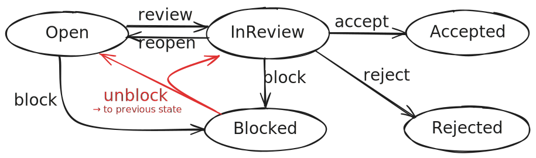

# Status-Transition Flows 


Status-transition flows ensure transitions are explicitly modeled, validated, and executed in a controlled and reliable way, thereby eliminating the need for extensive custom coding. – _Status: <Gamma/>_
{.abstract}


::: details Enabling it for CAP Java

In CAP Node.js support for flows is built-in and available out of the box. For CAP Java, it is provided by the feature [cds-feature-flow](https://central.sonatype.com/artifact/com.sap.cds/cds-feature-flow). Enable it by adding this dependency to your _srv/pom.xml_ file:

```xml
<dependency>
  <groupId>com.sap.cds</groupId>
  <artifactId>cds-feature-flow</artifactId>
  <scope>runtime</scope>
</dependency>
```
:::

[[toc]]


## Modeling Status Flows

The following example is taken from the [@capire/xtravels](https://github.com/capire/xtravels) sample application, in which we want to model a status flow for travel requests as depicted below:


We can easily model this flow in CDS as follows:

::: code-group

```cds [srv/travel-flows.cds]
using { TravelService } from './travel-service';
annotate TravelService.Travels with @flow.status: Status actions {
  acceptTravel    @from: [ #Open ] @to: #Accepted;
  rejectTravel    @from: [ #Open ] @to: #Rejected;
  deductDiscount  @from: [ #Open ]; // restricted to #Open travels
}
```
[See full source code](https://github.com/capire/xtravels/tree/main/srv/travel-flows.cds){.learn-more}

:::

In essence we model status flows using three annotations:

- `@flow.status` designates the **status** element for an entity to be flow-controlled. 
- `@from` and `@to` define valid entry states and target states for **transitions**, 
  which are implemented by **bound** actions.


### @flow.status: element

Annotation `@flow.status` is an entity-level annotation that identifies the status element for which to establish a status-transition flow. 

This designated status element is expected to be an `enum`, with enum symbols representing the various states of the entity. For example:

```cds
entity Travels { // ...
  @readonly Status : TravelStatusCode default 'O';
}
```
```cds
type TravelStatusCode : String enum {
  Open     = 'O';
  Accepted = 'A';
  Rejected = 'X';
};
```

Alternatively, the status element can also be an association to a code list entity with a _single_ enum element named `code`, which in turn is an `enum` as outlined above:

```cds
entity Travels { // ...
  @readonly Status : Association to TravelStatus default 'O';
}
```
```cds
entity TravelStatus {
  key code : TravelStatusCode; // name has to be 'code'
  description : localized String;
}
```

> [!tip] Combine with @readonly and default
>
> Consider making the status element `@readonly` to prevent clients from setting or modifying them in unmanaged ways. In addition, a `default` value can be specified for new entries. 


### @from: entry state

In an entity with a designated `@flow.status` element, add the `@from` annotation to a bound action of that entity to define the valid entry states for that action, either as a single value or an array of values: 

```cds
@from: [#Open] action acceptTravel();
@from: #Open action acceptTravel(); // equivalent
```

Use the enum symbols defined with the designated status elements such as `#Open` in the example above. You can also use the raw values such as `'O'`, but using enum symbols is recommended for better readability.

When the action is invoked, the current state of the entity is validated against the states defined in `@from`. If the current state does not match any of the defined states, the action execution is rejected.


### @to: target state

Add the `@to` annotation to a bound action of a flow-controlled entity to define the target state for that action, either as a single value or the special value `$flow.previous`:

```cds
@from: [#Open] @to: #Accepted action acceptTravel();
```

Use the enum symbols defined with the designated status elements such as `#Open` in the example above. You can also use the raw values such as `'O'`, but using enum symbols is recommended for better readability.

At runtime, after the action execution, the status element of the entity is automatically updated to the target state defined in `@to`.


### @to: $flow.previous

Use the target state `$flow.previous` to return a previous state from a current state that can be reached via different routes. If present in a flow CAP framework will automatically track the sequence of states entered.

The following example introduces a `Blocked` state with two possible previous states, `Open` and `InReview`, and an `unblock` action that restores the previous state.



::: code-group
```cds [srv/flow-previous.cds]
annotate TravelService.Travels with @flow.status: Status actions {
  acceptTravel    @from: #InReview           @to: #Accepted;
  rejectTravel    @from: #InReview           @to: #Rejected;
  deductDiscount  @from: #Open;
  reviewTravel    @from: #Open               @to: #InReview;       // [!code highlight]
  reopenTravel    @from: #InReview           @to: #Open;           // [!code highlight]
  blockTravel     @from: [#Open, #InReview]  @to: #Blocked;        // [!code highlight]
  unblockTravel   @from: #Blocked            @to: $flow.previous;  // [!code highlight]
}
```
::: 

[See sample in _@capire/xtravels_.](https://github.com/capire/xtravels/tree/main/xmpls/flow) {.learn-more}


## Served Out-of-the-Box


### By Generic Handlers

The need for custom code is greatly reduced when using status-transition flows, as CAP automatically provides generic handlers for the common flow operations: validation of entry states before action execution, and updating the status to the target state after action execution.

- Based on the `@from` annotation, a generic handler validates that the entity is in a valid entry state - the current state must match one of the states specified in `@from`.
If validation fails, the request returns a `409 Conflict` HTTP status code with an appropriate error message.

- Based on the `@to` annotation, a generic handler automatically updates the entity's status to the target state.


### To Fiori UIs

When using SAP Fiori elements, status-transition flows are automatically recognized and supported in the generated UIs. 

UI annotations to enable/disable respective buttons and to refresh displayed data are automatically generated for UI5 as shown below:


```xml
<Annotation Term="Common.SideEffects">
  <Record Type="Common.SideEffectsType">
    <PropertyValue Property="TargetProperties">
      <Collection>
        <String>in/Status_code</String>
      </Collection>
    </PropertyValue>
  </Record>
</Annotation>
```
```xml
<Annotation Term="Core.OperationAvailable">
  <Eq>
    <Path>in/Status_code</Path>
    <String>O</String>
  </Eq>
</Annotation>
```


## Adding Custom Handlers

While many use cases are covered by the generic handlers, you can add custom handlers for the actions, as usual. For example:

- Add `before` handlers for additional validations before entering a transition.
- Add `after` handlers for conditional target states.


## Current Limitations

Following are are some current limitations of status-transition flows, which we plan to address in future releases:

1. Status-transition flows also work with draft-enabled entities, however when in draft state all actions are disabled. Thus, status transitions can only be performed on active entities.

2. CRUD and DRAFT operations can't be restricted by status-transition flows today. Only bound actions can be flow-controlled.
