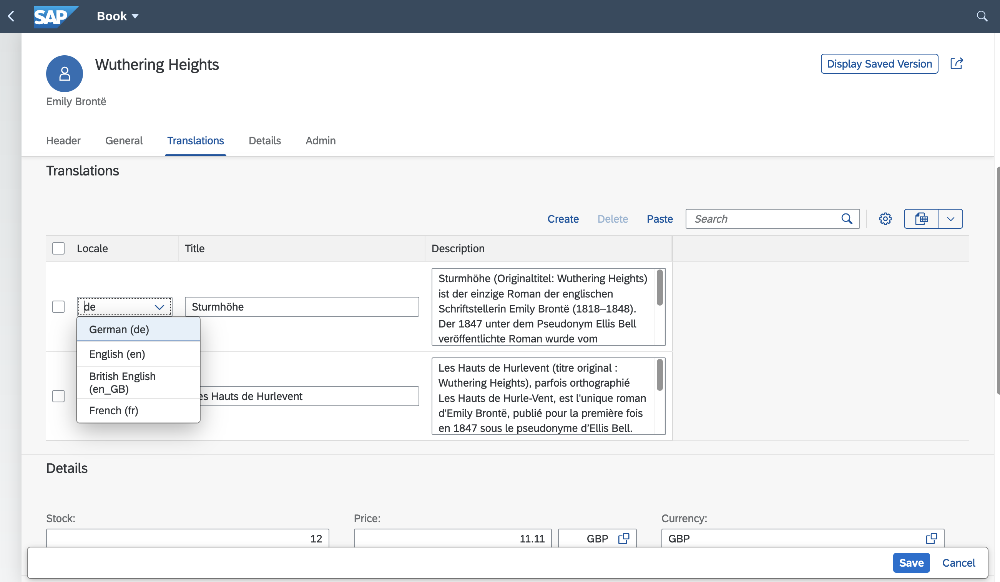
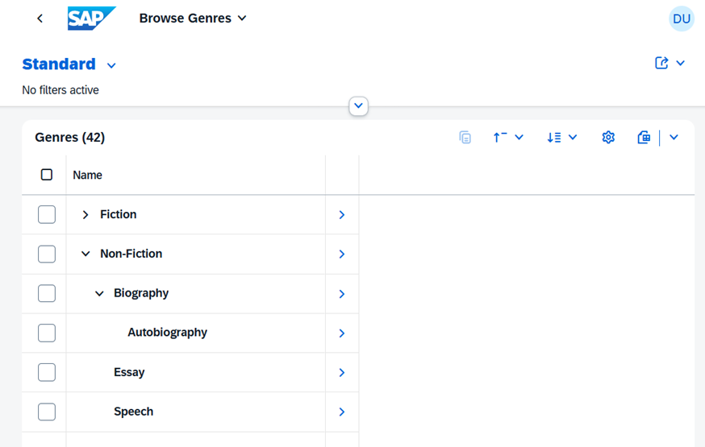

# Serving SAP Fiori UIs

CAP provides out-of-the-box support for SAP Fiori elements. This guide explains how to add SAP Fiori elements apps to a CAP project and how to add SAP Fiori elements annotations to service definitions. Throughout this guide, "Fiori" refers to SAP Fiori elements.

[Learn more about developing SAP Fiori elements and OData V4 (since 1.84.)](https://sapui5.hana.ondemand.com/#/topic/62d3f7c2a9424864921184fd6c7002eb){.learn-more}


[[toc]]


## Getting Started

### Using Fiori Previews
###### Fiori Preview

For entities exposed via OData V4, a _Fiori preview_ link appears on the index page. It dynamically serves an SAP Fiori elements list page that allows you to quickly see the effect of annotation changes without having to create a UI application first.

> [!important] Not for production
> The preview is meant for quick tests and iterations during development, but not for production use, and hence automatically disabled in production. To also enable it in cloud deployments for test or demo purposes, set <Config>cds.fiori.preview:true</Config> for Node.js apps, or <Config java>cds.index-page.enabled:true</Config> for Java


### Adding Fiori Apps

As showcased in [cap/samples](https://github.com/capire/bookstore/tree/main/app), SAP Fiori apps should be added as subfolders of the `app/` directory in a CAP project. Each subfolder constitutes an individual SAP Fiori application, with [local annotations](#fiori-annotations), _manifest.json_, etc. So, a typical folder layout would look like this:


| Folder/Sub Folder          | Description                          |
|----------------------------|--------------------------------------|
| `app/`                     | All SAP Fiori apps should go in here |
| &nbsp; &nbsp; `browse/`    | SAP Fiori app for end users          |
| &nbsp; &nbsp; `orders/`    | SAP Fiori app for order management   |
| &nbsp; &nbsp; `admin/`     | SAP Fiori app for admins             |
| &nbsp; &nbsp; `index.html` | For sandbox tests                    |
| `srv/`                     | All services                         |
| `db/`                      | Domain models and database artifacts |

::: tip
Links to Fiori applications created in the `app/` folder are automatically added to the index page of your CAP application for local development.
:::

### SAP Fiori Tools

The SAP Fiori tools provide advanced support for [adding SAP Fiori apps](https://help.sap.com/docs/SAP_FIORI_tools/17d50220bcd848aa854c9c182d65b699/db44d45051794d778f1dd50def0fa267.html) to existing CAP projects as well as a wealth of productivity tools, for example for adding SAP Fiori annotations, or graphical modeling and editing. They can be used locally in [Visual Studio Code (VS Code)](https://marketplace.visualstudio.com/items?itemName=SAPSE.sap-ux-fiori-tools-extension-pack) or in [SAP Business Application Studio](https://help.sap.com/docs/SAP_FIORI_tools/17d50220bcd848aa854c9c182d65b699/b0110400b44748d7b844bb5977a657fa.html).


### OData Annotations Plugin

The [SAP CDS language support plugin](https://marketplace.visualstudio.com/items?itemName=SAPSE.vscode-cds) includes a plugin that helps you add and edit OData annotations in CDS syntax in VS Code. It provides the following features:

-   Code completion
-   Validation against the OData vocabularies and project metadata
-   Navigation to the referenced annotations
-   Quick view of vocabulary information
-   Internationalization support

These features are available for [OData annotations in CDS syntax](../protocols/odata#annotations) but not yet for [core data services common annotations](../../cds/annotations).

The [@sap/ux-cds-odata-language-server-extension](https://www.npmjs.com/package/@sap/ux-cds-odata-language-server-extension) module requires no manual installation. The latest version is fetched automatically from [npmjs.com](https://npmjs.com), as indicated by the user preference setting **CDS > Contributions: Registry**.

[Learn more about the **CDS extension for VS Code**.](https://www.youtube.com/watch?v=eY7BTzch8w0){.learn-more}


## Fiori Annotations

SAP Fiori elements apps are generic front ends that construct and render pages and controls based on annotated metadata documents. The annotations provide the semantic information needed to render that content, for example:


```cds
annotate CatalogService.Books with @(
  UI: {
    SelectionFields: [ ID, price, currency_code ],
    LineItem: [
      {Value: title},
      {Value: author, Label:'{i18n>Author}'},
      {Value: genre.name},
      {Value: price},
      {Value: currency.symbol, Label:' '},
    ]
  }
);
```


[Find this source and many more in **capire/bookstore**.](https://github.com/capire/bookstore/tree/main/app){.learn-more target="_blank"}
[Learn more about **OData Annotations in CDS**.](../protocols/odata#annotations){.learn-more}


### Where to Put Them?

Although CDS allows you to add annotations anywhere in your models, we recommend placing them in separate _.cds_ files in your _./app/*_ folders, for example, as follows.

```sh
./app  #> all your Fiori annotations should go here, for example:
   ./admin
      fiori-service.cds #> annotating ../srv/admin-service.cds
   ./browse
      fiori-service.cds #> annotating ../srv/cat-service.cds
   services.cds #> imports ./admin/fiori-service and ./browse/fiori-service
./srv  #> all service definitions should stay clean in here:
   admin-service.cds
   cat-service.cds
...
```

[See this also in **capire/bookstore**.](https://github.com/capire/bookstore/blob/main/app/services.cds){.learn-more}

This recommendation follows the principles of [Conceptual Modeling](../domain/index#domain-driven-design) and [Separation of Concerns](../domain/index#separation-of-concerns).


### Prefer `@title` and `@description`

Influenced by the [JSON Schema](https://json-schema.org), CDS supports the [common annotations](../../cds/annotations#common-annotations) `@title` and `@description`, which are mapped to corresponding [OData annotations](../protocols/odata#annotations) as follows:

| CDS            | JSON Schema   | OData               |
|----------------|---------------|---------------------|
| `@title`       | `title`       | `@Common.Label`     |
| `@description` | `description` | `@Core.Description` |

We recommend preferring these annotations over the OData ones in protocol-agnostic data models and service models, for example:

```cds
annotate my.Books with { //...
   title @title: 'Book Title';
   author @title: 'Author ID';
}
```


### Prefer `@readonly`, `@mandatory`, ...

CDS supports `@readonly` as a common annotation, which translates to respective [OData annotations](../protocols/odata#annotations) from the `@Capabilities` vocabulary. We recommend using the former for reasons of conciseness and comprehensibility as shown in this example:

```cds
@readonly entity Foo {   // entity-level
  @readonly foo : String // element-level
}
```

is equivalent to:

```cds
entity Foo @(Capabilities:{
  // entity-level
  InsertRestrictions.Insertable: false,
  UpdateRestrictions.Updatable: false,
  DeleteRestrictions.Deletable: false
}) {
  // element-level
  @Core.Computed foo : String
}
```

Similar recommendations apply to `@mandatory` and others &rarr; see [Common Annotations](../../cds/annotations#common-annotations).


## Simple Value Helps

In addition to supporting the standard `@Common.ValueList` annotations as defined in the [OData Vocabularies](../protocols/odata#annotations), CAP provides convenient support for Value Helps.


### `@cds.odata.valuelist`

Simply add the `@cds.odata.valuelist` annotation to an entity, and all managed associations targeting this entity will automatically receive Value Lists in SAP Fiori clients. For example:

```cds
@cds.odata.valuelist
entity Currencies { key code ... }
```
```cds
service BookshopService {
   entity Books { //...
      currency : Association to Currencies;
   }
}
```

This would be expanded by the compiler to the following OData annotations, in the EDMX documents generated for Fiori clients:

```xml
<Annotations Target="AdminService.Books/currency_code">
  <Annotation Term="Common.ValueList">
    <Record Type="Common.ValueListType">
      <PropertyValue Property="CollectionPath" String="Currencies"/>
      <PropertyValue Property="Label" String="Currency"/>
      <PropertyValue Property="Parameters">
        <Collection>
          <Record Type="Common.ValueListParameterInOut">
            <PropertyValue Property="ValueListProperty" String="code"/>
            <PropertyValue Property="LocalDataProperty" PropertyPath="currency_code"/>
          </Record>
          <Record Type="Common.ValueListParameterDisplayOnly">
            <PropertyValue Property="ValueListProperty" String="name"/>
          </Record>
        </Collection>
      </PropertyValue>
    </Record>
  </Annotation>
</Annotations>
```


### `@sap/cds/common`

[@sap/cds/common]: ../../cds/common

The reuse types in [@sap/cds/common] already have this added to base types and entities, so all uses automatically benefit from this. This is an effective excerpt of respective definitions in `@sap/cds/common`:

```cds
type Currencies : Association to sap.common.Currencies;
```
```cds
context sap.common {
  entity Currencies : CodeList {...};
  entity CodeList { name : localized String; ... }
}
```
```cds
annotate sap.common.CodeList with @(
   UI.Identification: [name],
   cds.odata.valuelist,
);
```

In effect, usages of [@sap/cds/common] stay clean of any pollution, for example:

```cds
using { Currency } from '@sap/cds/common';
entity Books { //...
  currency : Currency;
}
```

[Find this also in **capire/bookstore**.](https://github.com/capire/bookshop/blob/main/db/schema.cds){.learn-more}

With that, all UIs on all services exposing `Books` will automatically receive Value Help for currencies. You can also benefit from that when [deriving your project-specific code list entities from **sap.common.CodeList**](../../cds/common#adding-own-code-lists).


## Fiori Draft Support
<div id="draft-support" />

SAP Fiori uses drafts to let users save their progress while editing data and continue later without losing changes. Drafts are stored on the server and can be accessed from different devices and locations providing flexibility and convenience for users. CAP provides out-of-the-box support for drafts, making it easy to implement this functionality in your applications.

> [!note] This documentation focuses on CAP only
> For general information on the user experience and the technical details of drafts in SAP Fiori, refer to the [SAP Fiori Design Guidelines](https://experience.sap.com/fiori-design-web/draft-handling/) and the [SAP UI5 documentation](https://ui5.sap.com/#/topic/ed9aa41c563a44b18701529c8327db4d).

### Draft-Enabled Entities

All you need to do to serve an entity with draft support enabled is to annotate it with `@odata.draft.enabled`. For example, as we do in the [_capire/xtravels_](https://github.com/capire/xtravels/blob/b147a1daad27d11352e0d39b525b25ed3241c016/app/travels/capabilities.cds#L3) sample:

::: code-group
```cds [app/travels/capabilities.cds]
annotate TravelService.Travels with @odata.draft.enabled;
```
:::

Behind the scenes, CAP handles everything else. Most importantly, it adds a new `.drafts` entity next to the active entity with the same elements, used to store draft data. Think of it as a shadow entity, defined like this:

::: code-group
```cds [=> generated automatically:]
entity TravelService.Travels.drafts : TravelService.Travels { ... }
```
:::

You can access this entity definition from the model at runtime, for example, to add custom handlers to draft events or to access draft data. In a CAP Node.js service implementation, use the [`.drafts`](../../node.js/cds-reflect#drafts) reference as a shortcut to access the draft entity:

```js
const { Travels } = this.entities
SELECT.from (Travels)        //> queries active data
SELECT.from (Travels.drafts) //> queries draft data
```

### Draft Choreography


With [`@odata.draft.enabled`](#draft-enabled-entities) entities in place, CAP automatically serves the Fiori draft choreography as illustrated in the following diagram:


In essence, the draft choreography defines the following flows:

- Creating drafts for **new** active entities, or for **editing** existing ones.
- Filling in draft data through a series of _PATCH_ events.
- **Saving** the draft back to the active entity, or **discarding** it.

Drafts are isolated from any active data until they are saved/activated. When drafts are discarded, they are removed as if they never existed – with draft locks as the only exception to prevent conflicting changes.


### Draft Locks

Whenever a draft is created to _edit_ an active entity, this active entity is locked for any operation that could result in conflicting changes. In particular:

- No other draft can be created for the same active instance.
- No direct updates or deletes to the active instance are allowed.

The lock is released automatically when the draft is saved, activated, or discarded. Other users can manually reclaim it after a period of inactivity, which is 15 minutes by default, but can be configured via <Config>cds.fiori.draft_lock_timeout: 1h</Config> for CAP Node.js and <Config java>cds.drafts.cancellationTimeout: 1h</Config> for CAP Java, respectively. See draft lock configuration for [Node.js](../../node.js/fiori#draft-locks) or [Java](../../java/fiori-drafts#draft-lock).

Draft locks are not applied when creating drafts for new entities, as there is no active entity to be locked in this case.


### Requests to Drafts

Fiori clients send the following HTTP requests for draft operations:

```php:line-numbers [Requests to <i>draft</i> data]
POST   /Foo                                         //> NEW
POST   /Foo(ID,IsActiveEntity=true)/draftEdit       //> EDIT
GET    /Foo(ID,IsActiveEntity=false)                //> READ
PATCH  /Foo(ID,IsActiveEntity=false) {...}          //> PATCH
POST   /Foo(ID,IsActiveEntity=false)/draftActivate  //> SAVE
DELETE /Foo(ID,IsActiveEntity=false)                //> DISCARD
```

The key parameter `IsActiveEntity=false` addresses draft data, with the exception of the empty POST and `draftEdit` for semantic reasons.

::: details Full HTTP requests ...
The requests above are abbreviated for clarity. The actual HTTP requests include the service path, content-type headers, and JSON bodies as shown below.

```http
POST /odata/v4/TravelService/Travels
Content-Type: application/json

{}
```
```http
POST /odata/v4/TravelService/Travels(ID=a11fb6f1-36ab-46ec-b00c-d379031e817a,IsActiveEntity=true)/draftEdit
Content-Type: application/json
```
```http
PATCH /odata/v4/TravelService/Travels(ID=a11fb6f1-36ab-46ec-b00c-d379031e817a,IsActiveEntity=false)
Content-Type: application/json

{ ... }
```
... and so forth.
:::


### Requests to Active Data

Add `IsActiveEntity=true` as a key parameter to your requests to address *active* data directly, bypassing potentially existing drafts (draft locks still apply), for example:

```php:line-numbers [Requests to <i>active</i> data]
POST   /Books { IsActiveEntity:true, ... }       //> CREATE
PATCH  /Books(ID=201,IsActiveEntity=true) {...}  //> UPDATE
DELETE /Books(ID=201,IsActiveEntity=true)        //> DELETE
GET    /Books(ID=201,IsActiveEntity=true)        //> READ
```

::: details Available for CAP Node.js <Since package="@sap/cds" version="v10" />
While this was always possible in CAP Java before, it's available for CAP Node.js in the same way by default since v10. Can be disabled with <Config>cds.fiori.bypass_draft: false</Config>, which prevents bypassing the draft flow for _CREATE_ and _UPDATE_ operations entirely.
:::

> [!tip] Draft locks still apply
> Directly updating an active entity does **not** bypass [draft locks](#draft-locks).
> If an existing draft locks the entity, direct updates are blocked to prevent lost update situations.

> [!warning] Ensure validation for all entry points
> Requests to active data also features partial CREATE/UPDATE requests to the root entity and its composition children. Ensure that the validations and determinations are run in all situations, not only on the root.

#### Draft-agnostic Requests

Taking this further, through <Config>cds.fiori.draft_new_action: true</Config> `IsActiveEntity=true` is assumed by default, so clients that are unaware of drafts or don't need to handle them can ignore all draft-specific requests and parameters:

```php:line-numbers [Draft-agnostic requests to <i>active</i> data]
// creation of active instances
POST   /Foo            //> CREATE
GET    /Foo(ID)        //> READ
PATCH  /Foo(ID) {...}  //> UPDATE
DELETE /Foo(ID)        //> DELETE
// creation of draft instances
POST   /Foo/draftNew   //> CREATE new draft [!code ++]
...
```

The previously used `POST /Foo` requests without an `IsActiveEntity` parameter to create new drafts is now replaced by the collection bound action `draftNew` to resolve the ambiguities with requests to active data.

::: details Available for CAP Node.js <Since package="@sap/cds" version="v10" /> – not yet for CAP Java
Draft-agnostic requests as above assume `IsActiveEntity=true` by default for all requests that don't explicitly specify it.
This was possible in CAP Node.js, but not in CAP Java, which is still bound by the [*Olingo*](https://olingo.apache.org) library. For CAP Java, explicitly add `IsActiveEntity=true` as a key parameter to address active data

[Learn more about Direct CRUD events in **Java**.](../../java/fiori-drafts#bypassing-draft-flow){.learn-more}
:::


### Programmatic Access

You can also access draft data programmatically from custom code in JavaScript or Java.

In CAP Java, add `IsActiveEntity` as a key parameter to your queries ([learn more](../../java/fiori-drafts#draftservices)):

```java {3}
Select.from(FOO).where(o -> o.ID().eq(201);       //> reads active data
Select.from(FOO).where(o -> o.ID().eq(201) .and( //> reads draft data
  o.IsActiveEntity().eq(false))
);
```

In CAP Node.js, use the [`Foo.drafts`](../../node.js/cds-reflect#drafts) references to access draft data:

```js {3}
const { Foo } = this.entities
SELECT.from (Foo, 201)          // reads active data only
SELECT.from (Foo.drafts, 201)  // reads draft data, if exists
```

Even better, use [`req.subject`](../../node.js/events#subject), which automatically resolves to the correct entity instance - active or draft - based on the current request context. For example, in custom action handlers triggered for both active and draft data:

```js
this.on ('approveTravel', req => UPDATE (req.subject) .with ({ status: 'A' }))
this.on ('rejectTravel', req => UPDATE (req.subject) .with ({ status: 'X' }))
```


### Draft Input Validation
###### Validating Drafts

During the draft phase - that is, on `PATCH` requests to draft data - all [`@assert`s](../services/constraints) are validated and error messages are returned to the client. Unlike with active entities, the draft is still created or updated even with invalid data, so users can correct it later without losing their progress.

#### Custom Handlers for Draft Events

You can add custom handlers to draft events by referring to draft-specific events and `.drafts` entities, as shown for CAP Node.js ([learn more](../../node.js/fiori#draft-specific-events)):

```js:line-numbers
const { Foo } = this.entities
this.before ('NEW', Foo.drafts, ...)
this.before ('EDIT', Foo, ...) //> note: refers to active entity
this.before ('PATCH', Foo.drafts, ...)
this.before ('SAVE', Foo.drafts, ...)
this.before ('DISCARD', Foo.drafts, ...)
```

Similar in CAP Java ([learn more](../../java/fiori-drafts#editing-drafts)):

```java:line-numbers
@Before (event = DraftService.EVENT_DRAFT_CREATE)
@Before (event = DraftService.EVENT_DRAFT_EDIT)
@Before (event = DraftService.EVENT_DRAFT_PATCH)
@Before (event = DraftService.EVENT_DRAFT_SAVE)
@Before (event = DraftService.EVENT_DRAFT_CANCEL)
```

#### Validation on Active Entities

When a draft is saved, all validations for active entities run as usual. Invalid data is rejected, so only valid data gets activated. This includes constraints such as `@assert` and `@readonly`, and all custom handlers registered to active entity events, for example:

```js
const { Foo } = this.entities
this.before ([ 'CREATE', 'UPDATE' ], Foo, req => {/* validate all */})
```

> [!caution] Validate on active entities, not only on drafts
> Validations on draft entities alone are not sufficient, because active entities can be updated directly, bypassing drafts. Always perform all necessary validations on active entities, not only on drafts.
> Also note that updates to active entities can be partial, for example, updating only an individual `OrderItem` within an `Order` via `PATCH /Orders(1)/Items(3)`. Make sure your validation logic covers such cases.


### Persistent Messages

While in draft state, error messages are automatically persisted and remain visible even after you edit other fields or navigate away from the page.

CAP automatically generates corresponding side-effect annotations in the EDMX to instruct Fiori clients to fetch state messages after every `PATCH` request.

You can override generated side-effect annotations per entity, for example:

  ```cds
  annotate MyService.Foo with @(
    Common.SideEffects #alwaysFetchMessages: false
  );
  ```

::: details Available <Since package="CAP Java" version="v3.8"/> and <Since package="CAP Node.js" version="v9.1" />
Can be disabled with <Config>cds.fiori.draft_messages: false</Config>.
:::

### Draft for Localized Data

Annotate the underlying base entity in the base model with `@fiori.draft.enabled` to also support drafts for [localized data](./localized-data):

```cds
annotate sap.capire.bookshop.Books with @fiori.draft.enabled;
```

:::info Background
SAP Fiori drafts require single keys of type `UUID`, which is not the case for [`.texts`](./localized-data#behind-the-scenes) entities, that are generated for localized data. The `@fiori.draft.enabled` annotation tells the compiler to add an additional technical primary key element named `ID_texts`.
[Learn how to add initial data for such draft-enabled localized entities.](localized-data#adding-initial-data){.learn-more}
:::

{style="margin:0"}

[See it live in **capire/bookstore**.](https://github.com/capire/bookstore/blob/main/app/admin-books/fiori-service.cds#L78){.learn-more}


## Fiori Tree Views

Following the same principle of convenience as for Value Helps, CAP provides a shortcut annotation to define hierarchies on entities with recursive associations, which are then rendered as Tree Views in SAP Fiori clients.


### Recursive Associations

Hierarchies are most commonly parent-child structures created via recursive associations. For example, in the [capire/bookshop](https://github.com/capire/bookshop) sample, we have the `Genres` entity with a recursive association `parent` to itself:

::: code-group
```cds [db/schema.cds]
entity Genres : cuid { //...
  parent : Association to Genres;
}
```
:::


### The `@hierarchy` Annotation

To get a Tree View in SAP Fiori clients, annotate the entity with `@hierarchy`, for example as we did in the Fiori Annotations of the [capire/bookstore](https://github.com/capire/bookstore) sample:

::: code-group
```cds [app/genres/fiori-service.cds]
annotate AdminService.Genres with @hierarchy;
```
:::

If multiple associations can serve as the parent association, specify the one to use as the value of the `@hierarchy` annotation, for example:

```cds
annotate AdminService.Genres with @hierarchy: parent;
```

::: details Under the hood...

The `@hierarchy` annotation is a shortcut for the following Fiori-level `annotate` and `extend` statements, which you would otherwise have to write manually.

```cds
// declare a hierarchy with the qualifier "GenresHierarchy"
annotate AdminService.Genres with @Aggregation.RecursiveHierarchy #GenresHierarchy: {
  NodeProperty             : ID,    // identifies a node, usually the key
  ParentNavigationProperty : parent // navigates to a node's parent
};

extend AdminService.Genres with @(
  // The computed properties expected by Fiori to be present in hierarchy entities
  Hierarchy.RecursiveHierarchy #GenresHierarchy: {
    LimitedDescendantCount : LimitedDescendantCount,
    DistanceFromRoot       : DistanceFromRoot,
    DrillState             : DrillState,
    LimitedRank            : LimitedRank
  },
  // Disallow filtering on these properties from Fiori UIs
  Capabilities.FilterRestrictions.NonFilterableProperties: [
    'LimitedDescendantCount', 'DistanceFromRoot', 'DrillState', 'LimitedRank'
  ],
  // Disallow sorting on these properties from Fiori UIs
  Capabilities.SortRestrictions.NonSortableProperties: [
    'LimitedDescendantCount', 'DistanceFromRoot', 'DrillState', 'LimitedRank'
  ],
) columns { // Ensure we can query these columns from the database
  null as LimitedDescendantCount : Int16,
  null as DistanceFromRoot       : Int16,
  null as DrillState             : String,
  null as LimitedRank            : Int16
};
```

> Note: When naming the hierarchy qualifier, use the following pattern: <br>
> `<entity name in service>Hierarchy`

:::

::: details Hierarchies with Aggregations

CAP Java supports calculation of aggregates for hierarchy views by annotating a `virtual` element with `@cds.java.descendants.aggregate` and specifying the aggregation expression.

:::

### UI5 manifest Configuration

In addition, you need to configure the TreeTable in UI5's _manifest.json_ file:

```jsonc
  "sap.ui5": { ...
    "routing": { ...
      "targets": { ...
        "GenresList": { ...
          "options": {
            "settings": { ...
              "controlConfiguration": {
                "@com.sap.vocabularies.UI.v1.LineItem": {
                  "tableSettings": {
                    "hierarchyQualifier": "GenresHierarchy",
                    "type": "TreeTable"
                  }
                }
              }
            }
          }
        },
      },
    },
```

> Note: construct the `hierarchyQualifier` with the following pattern: <br>
> `<entity name in service>Hierarchy`

You can now start the server with `cds watch` and see the hierarchical tree view in action in the [_Browse Genres_](http://localhost:4004/fiori-apps.html#Genres-display) app.

 {style="filter: drop-shadow(0 2px 5px rgba(0,0,0,.40));"}

The compiler automatically expands the shortcut annotation `@hierarchy` to the
following `annotate` and `extend` statements.


## Cache Control in Java

CAP lets you set a [Cache-Control](https://developer.mozilla.org/en-US/docs/Web/HTTP/Headers/Cache-Control) header with a [max-age](https://developer.mozilla.org/en-US/docs/Web/HTTP/Headers/Cache-Control#max-age) directive to indicate that a response remains fresh for _n_ seconds after it was generated.
In the CDS model, use the `@http.CacheControl: {maxAge: <seconds>}` annotation on stream properties. The header tells caches to store the response and reuse it for subsequent requests while it is fresh.
`max-age` (in seconds) specifies how long the content remains fresh before becoming stale.

:::info Elapsed time since the response was generated
`max-age` is the elapsed time since the response was generated on the origin server, not the time since the response was received.
:::

::: warning Only Java
The Cache Control feature is currently supported only on the Java runtime.
:::

<!-- Do we have an example for that in our samples? -->

## Role-based Visibility

In addition to adding [restrictions on services, entities, and actions/functions](../security/authorization#restrictions), there are cases where you want to hide certain UI elements for specific users. You can do this using annotations such as `@UI.Hidden` or `@UI.CreateHidden` together with `$edmJson` pointing to a singleton.

First, define the [singleton](../protocols/odata#singletons) in your service and annotate it with [`@cds.persistence.skip`](../databases/cdl-to-ddl#cds-persistence-skip) so that no database artifact is created:

```cds
@odata.singleton @cds.persistence.skip
entity Configuration {
    key ID: String;
    isAdmin : Boolean;
}
```
> A key is technically not required, but omitting it may cause issues for some consumers.

Then, define an `on` handler to serve the request:

```js
srv.on('READ', 'Configuration', async req => {
    req.reply({
        isAdmin: req.user.is('admin') //admin is the role, which for example is also used in @requires annotation
    });
});
```

Finally, refer to the singleton in the annotation by using a [dynamic expression](../protocols/odata#dynamic-expressions):

```cds
annotate service.Books with @(
    UI.CreateHidden : { $edmJson: {$Not: { $Path: '/CatalogService.EntityContainer/Configuration/isAdmin'} } },
    UI.UpdateHidden : { $edmJson: {$Not: { $Path: '/CatalogService.EntityContainer/Configuration/isAdmin'} } },
);
```

The Entity Container is OData-specific. It refers to the `$metadata` of the OData service, where all accessible entities are registered.

:::details SAP Fiori elements also allows to not include it in the path
```cds
annotate service.Books with @(
    UI.CreateHidden : { $edmJson: {$Not: { $Path: '/Configuration/isAdmin'} } },
    UI.UpdateHidden : { $edmJson: {$Not: { $Path: '/Configuration/isAdmin'} } },
);
```
:::
