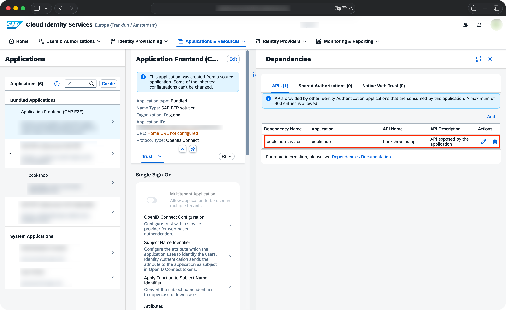

---

---

# Serving Vue.js or React
<Since version="9.9.0" package="@sap/cds-dk" />

CAP is easily integrated with [Vue.js](https://vuejs.org/) or [React](https://react.dev/).
This guide explains how to set up a minimal project with a UI.

> [!note] What about other UI frameworks?
> Other popular UI libraries like [Svelte](https://svelte.dev/) could follow the same pattern but don't have `cds add` support for now.

## Example project

The example here is built on a minimal CAP project:

```sh
cds init bookshop --add nodejs,tiny-sample && code bookshop
```

Now simply create a Vue.js or React app in `app/catalog`:

::: code-group

```sh [Vue.js]
cds add vue --into catalog
```

```sh [React]
cds add react --into catalog
```

:::

Now simply start the dev server:

```sh
cds watch
```

Open http://localhost:4004 to see your running applications.

## Next Up

You can deploy this project to Cloud Foundry or Kyma using the _SAP BTP Application Frontend_ service or a _custom App Router_ setup.

Simply add _Application Frontend_ like so:

```sh
cds add app-frontend
```

> When deploying your first Application Frontend service in that subaccount also make sure to subscribe to "Application Frontend Service" with plan "build-default".

Also make sure to choose an authentication mode:

```sh
cds add ias
```
or...
```sh
cds add xsuaa
```
For the deployment, we add HANA as the production database:
```sh
cds add hana
```

Afterwards, deploy your project:

```sh
cds up
```

[Learn more about Cloud Foundry deployment](../deploy/to-cf#add-ui){.learn-more}
[Learn more about Kyma deployment](../deploy/to-kyma.md){.learn-more}

> [!tip] When using IAS, set up the Application Frontend dependency.
>
> Add the API exposed by your bookshop application to the Application Frontend Service in your IAS admin console:
>
> 

You can use the [`@sap/appfront-cli`](https://www.npmjs.com/package/@sap/appfront-cli) package to see the links of your deployed application:

```sh
acftl list
```
