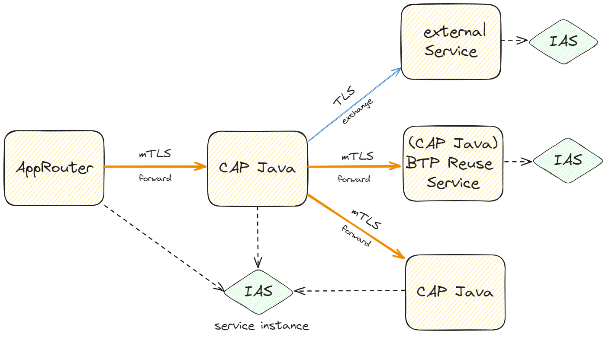

<script setup>
  import { h } from 'vue'
  const X  =  () => h('span', { class: 'x',   title: 'Available' }, ['✓'] )
  const Na =  () => h('span', { class: 'na',  title: 'Not available' }, ['✗'] )
</script>
<style scoped>
  .x   { color: var(--vp-c-green-1); }
  .na  { color: var(--vp-c-red-1); }
</style>

# Security
<style scoped>
  h1:before {
    content: "Java"; display: block; font-size: 60%; margin: 0 0 .2em;
  }
</style>

{{ $frontmatter.synopsis }}

{ #security}

## Overview

For Web services, authentication is about controlling _who_ is using the service. It typically involves verifying the user's identity, tenant, and validating claims like granted roles. In contrast, authorization makes sure that the user has the required privileges to access the requested resources. Hence, authorization is about controlling _what_ the user is allowed to handle.

Hence both, authentication and authorization, are essential for application security:
* [Authentication](#authentication) describes how to configure authentication.
* [Authorization](#auth) is about resource access control.

[Connecting to IAS Services](#outbound-auth) describes how to authenticate outbound calls.

::: warning
Without security configured, CDS services are exposed to public. Proper configuration of authentication __and__ authorization is required to secure your CAP application.
:::

## Authentication { #authentication}

Authentication rejects user requests with invalid authentication and limits the possible resource impact. 

Rejecting them as soon as possible is one of the reasons why it's not an integral part of the CAP runtime and needs to be configured on the application framework level. In addition, CAP Java is based on a [modular architecture](./developing-applications/building#modular_architecture) and allows flexible configuration of any authentication method.
By default, it supports the standard BTP platform identity services [out of the box](#xsuaa-ias):

- [SAP Cloud Identity Services Identity Authentication (IAS)](https://help.sap.com/docs/cloud-identity-services) - preferred solution integrating endpoints cross SAP-systems
- [SAP Authorization and Trust Management Service (XSUAA)](https://help.sap.com/docs/authorization-and-trust-management-service) - previous offering scoped to a BTP landscape

Which are highly recommended for production usage. For specific use cases, [custom authentication](#custom-authentication) can be configured as well. 
Local development and testing can be done easily with built-in [mock user](#mock-users) support.

### Configure XSUAA and IAS Authentication { #xsuaa-ias}
To enable your application for XSUAA or IAS-authentication, we recommend using the `cds-starter-cloudfoundry` or the `cds-starter-k8s` starter bundle, which covers all required dependencies.

:::details Individual Dependencies
These are the individual dependencies that can be explicitly added in the `pom.xml` file of your service:
   * `com.sap.cloud.security:resourceserver-security-spring-boot-starter` that brings [spring-security library](https://github.com/SAP/cloud-security-services-integration-library/tree/main/spring-security)
   * `org.springframework.boot:spring-boot-starter-security`
   * `cds-feature-identity`

:::

In addition, your application needs to be bound to corresponding service instances depending on your scenario.  The following list describes which service needs to be bound depending on the tokens your applications should accept:
   * only accept tokens issued by XSUAA --> bind your application to an [XSUAA service instance](../guides/security/authorization#xsuaa-configuration)
   * only accept tokens issued by IAS --> bind your application to an [IAS service instance](https://help.sap.com/docs/IDENTITY_AUTHENTICATION)
   * accept tokens issued by XSUAA and IAS --> bind your application to service instances of both types.

::: tip Specify Binding
CAP Java picks only a single binding of each type. If you have multiple XSUAA or IAS bindings, choose a specific binding with property `cds.security.xsuaa.binding` respectively `cds.security.identity.binding`.
Choose an appropriate XSUAA service plan to fit the requirements. For instance, if your service should be exposed as technical reuse service, make use of plan `broker`.
:::

#### Proof-Of-Possession for IAS { #proof-of-possession}

Proof-Of-Possession is a technique for additional security where a JWT token is **bound** to a particular OAuth client for which the token was issued. On BTP, Proof-Of-Possession is supported by IAS and can be used by a CAP Java application.

Typically, a caller of a CAP application provides a JWT token issued by IAS to authenticate a request. With Proof-Of-Possession in place, a mutual TLS (mTLS) tunnel is established between the caller and your CAP application in addition to the JWT token. Clients calling your CAP application need to send the certificate provided by their `identity` service instance in addition to the IAS token.

On Cloud Foundry, the CAP application needs to be exposed under an additional route which accepts client certificates and forwards them to the application as `X-Forwarded-Client-Cert` header (for example, the `.cert.cfapps.<landscape>` domain).

<div id="meshdomain" />

On Kyma, it is required to configure an additional component (i.e. a gateway in Istio) which accepts client certificates and forwards them to the application as `X-Forwarded-Client-Cert` header. An example can be found in the Bookshop sample application [here](https://github.com/SAP-samples/cloud-cap-samples-java/tree/ias-ams-kyma/k8s). Besides defining the actual `Gateway` resource, it is required to expose the application under the new domain (see the `values.yaml` [here](https://github.com/SAP-samples/cloud-cap-samples-java/blob/e9c779cb64c0937815910988387b0775d8842765/helm/values.yaml#L47).

The Proof-Of-Possession also affects approuter calls to a CAP Java application. The approuter needs to be configured to forward the certificate to the CAP application. First, set `forwardAuthCertificates: true` on the destination pointing to your CAP backend (for more details see [the `environment destinations` section on npmjs.org](https://www.npmjs.com/package/@sap/approuter#environment-destinations)). Second, configure the destination to use the route of the CAP backend that has been configured to accept client certificates as described previously.

When authenticating incoming requests with IAS, the Proof-Of-Possession is activated by default. This requires using at least version `3.5.1` of the [SAP BTP Spring Security Client](https://github.com/SAP/cloud-security-services-integration-library/tree/main/spring-security) library.

You can disable the Proof-Of-Possession enforcement in your CAP Java application by setting the property `sap.spring.security.identity.prooftoken` to `false` in the `application.yaml` file.

:::tip
CAP Java requires an AppRouter to be configured with mTLS in case of IAS authentication (`forwardAuthCertificates: true`).
:::


### Automatic Spring Boot Security Configuration { #spring-boot}

Only if **both, the library dependencies and an XSUAA/IAS service binding are in place**, the CAP Java SDK activates a Spring security configuration, which enforces authentication for all endpoints **automatically**:
* Protocol adapter endpoints (managed by CAP such as OData V4/V2 or custom protocol adapters)
* Remaining custom endpoints (not managed by CAP such as custom REST controllers or Spring Actuators)

The security auto configuration authenticates all endpoints by default, unless corresponding CDS model is not explicitly opened to public with [pseudo-role](../guides/security/authorization#pseudo-roles) `any` (configurable behaviour).
Here's an example of a CDS model and the corresponding authentication configuration:

```cds
service BooksService @(requires: 'any') {
  @readonly
  entity Books @(requires: 'any') {...}

  entity Reviews {...}

  entity Orders @(requires: 'Customer') {...}
}
```

| Path                      | Authenticated ?  |
|:--------------------------|:----------------:|
| `/BooksService`           |      <Na/>       |
| `/BooksService/$metadata` |      <Na/>       |
| `/BooksService/Books`     |      <Na/>       |
| `/BooksService/Reviews`   |       <X/>       |
| `/BooksService/Orders`    |       <X/>       |


::: tip
For multitenant applications, it's required to authenticate all endpoints as the tenant information is essential for processing the request.
:::

There are several application parameters in section `cds.security.authentication` that influence the behaviour of the auto-configuration:

| Configuration Property                               | Description                                             | Default
| :---------------------------------------------------- | :----------------------------------------------------- | ------------
| `mode`  | Determines the [authentication mode](#auth-mode): `never`, `model-relaxed`, `model-strict` or `always` | `model-strict`
| `authenticateUnknownEndpoints`  | Determines, if security configurations enforce authentication for endpoints not managed by protocol-adapters. | `true`
| `authenticateMetadataEndpoints`  | Determines, if OData $metadata endpoints enforce authentication. | `true`

The following properties can be used to switch off automatic security configuration at all:

| Configuration Property                               | Description                                             | Default
| :---------------------------------------------------- | :----------------------------------------------------- | ------------
| `cds.security.xsuaa.enabled`  | Whether automatic XSUAA security configuration is enabled. | `true`
| `cds.security.identity.enabled`  | Whether automatic IAS security configuration is enabled. | `true`

#### Setting the Authentication Mode { #auth-mode}

The property `cds.security.authentication.mode` controls the strategy used for authentication of protocol-adapter endpoints. There are four possible values:

- `never`: No endpoint requires authentication. All protocol-adapter endpoints are considered public.
- `model-relaxed`: Authentication is derived from the authorization annotations `@requires` and `@restrict`. If no such annotation is available, the endpoint is considered public.
- `model-strict`: Authentication is derived from the authorization annotations `@requires` and `@restrict`. If no such annotation is available, the endpoint is authenticated. An explicit `@requires: 'any'` makes the endpoint public.
- `always`: All endpoints require authentication.

By default the authentication mode is set to `model-strict` to comply with secure-by-default.
In that case you can use the annotation `@requires: 'any'` on service-level to make the service and its entities public again.
Please note that it's only possible to make an endpoint public, if the full endpoint path is considered public as well.
For example you can only make an entity public, if the service that contains it is also considered public.
::: tip
Please note that the authentication mode has no impact on the *authorization* behaviour.
:::

#### Customizing Spring Boot Security Configuration { #custom-spring-security-config}

If you want to explicitly change the automatic security configuration, you can add an _additional_ Spring security configuration on top that overrides the default configuration by CAP. This can be useful, for instance, if an alternative authentication method is required for *specific endpoints* of your application.

```java
@Configuration
@EnableWebSecurity
@Order(1) // needs to have higher priority than CAP security config
public class AppSecurityConfig {

  @Bean
  public SecurityFilterChain appFilterChain(HttpSecurity http) throws Exception {
    return http
      .securityMatcher(AntPathRequestMatcher.antMatcher("/public/**"))
      .csrf(c -> c.disable()) // don't insist on csrf tokens in put, post etc.
      .authorizeHttpRequests(r -> r.anyRequest().permitAll())
      .build();
  }

}
```
Due to the custom configuration, all URLs matching `/public/**` are opened for public access.
::: tip
The Spring `SecurityFilterChain` requires CAP Java SDK [1.27.x](../releases/archive/2022/aug22#minimum-spring-boot-version-2-7-x) or later. Older versions need to use the deprecated `WebSecurityConfigurerAdapter`.
:::

::: warning _❗ Warning_ <!--  -->
Be cautious with the configuration of the `HttpSecurity` instance in your custom configuration. Make sure that only the intended endpoints are affected.
:::

Another typical example is the configuration of [Spring Actuators](https://docs.spring.io/spring-boot/docs/current/reference/html/actuator.html#actuator.enabling). For example a custom configuration can apply basic authentication to actuator endpoints `/actuator/**`:

```java
@Configuration
@EnableWebSecurity
@Order(1)
public class ActuatorSecurityConfig {

  @Bean
  public SecurityFilterChain actuatorFilterChain(HttpSecurity http) 
      throws Exception {
    return http
      .securityMatcher(AntPathRequestMatcher.antMatcher("/actuator/**"))
      .httpBasic(Customizer.withDefaults())
      .authenticationProvider(/* basic auth users with PasswordEncoder */)
      .authorizeHttpRequests(r -> r.anyRequest().authenticated())
      .build();
  }

}
```

### Custom Authentication { #custom-authentication}

You're free to configure any authentication method according to your needs. CAP isn't bound to any specific authentication method or user representation such as introduced with XSUAA, it rather runs the requests based on a [user abstraction](../guides/security/authorization#user-claims). The CAP user of a request is represented by a [UserInfo](https://www.javadoc.io/doc/com.sap.cds/cds-services-api/latest/com/sap/cds/services/request/UserInfo.html) object that can be retrieved from the [RequestContext](https://www.javadoc.io/doc/com.sap.cds/cds-services-api/latest/com/sap/cds/services/request/RequestContext.html) as explained in [Enforcement API & Custom Handlers](#enforcement-api).

Hence, if you bring your own authentication, you have to transform the authenticated user and inject as `UserInfo` to the current request. This is done by means of [UserInfoProvider](https://www.javadoc.io/doc/com.sap.cds/cds-services-api/latest/com/sap/cds/services/runtime/UserInfoProvider.html) interface that can be implemented as Spring bean as demonstrated in [Registering Global Parameter Providers](../java/event-handlers/request-contexts#global-providers).
More frequently you might have the requirement to just adapt the request's `UserInfo` which is possible with the same interface:


```java
@Component
public class CustomUserInfoProvider implements UserInfoProvider {

    private UserInfoProvider defaultProvider;

    @Override
    public UserInfo get() {
        ModifiableUserInfo userInfo = UserInfo.create();
        if (defaultProvider != null) {
            UserInfo prevUserInfo = defaultProvider.get();
            if (prevUserInfo != null) {
                userInfo = prevUserInfo.copy();
            }
        }
        if (userInfo != null) {
           /* any modification of the resolved user goes here: */ 
           XsuaaUserInfo xsuaaUserInfo = userInfo.as(XsuaaUserInfo.class);
           userInfo.setName(xsuaaUserInfo.getEmail() + "/" +
                            xsuaaUserInfo.getOrigin()); // normalizes name
        }

        return userInfo;
    }

    @Override
    public void setPrevious(UserInfoProvider prev) {
        this.defaultProvider = prev;
    }
}
```

In the example, the `CustomUserInfoProvider` defines an overlay on the default XSUAA-based provider (`defaultProvider`). The overlay redefines the user's name by a combination of email and origin.

### Mock User Authentication with Spring Boot { #mock-users}

By default, CAP Java creates a security configuration, which accepts _mock users_ for test purposes.

::: details Requirement

Mock users are only initialized if the `org.springframework.boot:spring-boot-starter-security` dependency is present in the `pom.xml` file of your service.

:::

#### Preconfigured Mock Users

For convenience, the runtime creates default mock users reflecting the [pseudo roles](../guides/security/authorization#pseudo-roles). They are named `authenticated`, `system` and `privileged` and can be used with an empty password. For instance, requests sent during a Spring MVC unit test with annotation `@WithMockUser("authenticated")` will pass authorization checks that require `authenticated-user`. The privileged user will pass any authorization checks. `cds.security.mock.defaultUsers = false` prevents the creation of default mock users at startup.

#### Explicitly Defined Mock Users

You can also define mock users explicitly. This mock user configuration only applies if:
* The service runs without an XSUAA service binding (non-productive mode)
* Mock users are defined in the active application configuration

Define the mock users in a Spring profile, which may be only active during testing, as in the following example:
::: code-group
```yaml [srv/src/main/resources/application.yaml]
---
spring:
  config.activate.on-profile: test
cds:
  security:
    mock:
      users:
        - name: Viewer-User
          tenant: CrazyCars
          roles:
            - Viewer
          attributes:
            Country: [GER, FR]
          additional:
            email: myviewer@crazycars.com
          features:
            - cruise
            - park

        - name: Admin-User
          password: admin-pass
          privileged: true
          features:
            - "*"
```
:::
- Mock user with name `Viewer-User` is a typical business user with SaaS-tenant `CrazyCars` who has assigned role `Viewer` and user attribute `Country` (`$user.Country` evaluates to value list `[GER, FR]`). This user also has the additional attribute `email`, which can be retrieved with `UserInfo.getAdditionalAttribute("email")`. The [features](../java/reflection-api#feature-toggles) `cruise` and `park` are enabled for this mock user.
- `Admin-User` is a user running in privileged mode. Such a user is helpful in tests that bypasses all authorization handlers.

Property `cds.security.mock.enabled = false` disables any mock user configuration (default in production profile).

A setup for Spring MVC-based tests based on the given mock users and the CDS model from [above](#spring-boot) could look like this:

```java
@RunWith(SpringRunner.class)
@SpringBootTest
@AutoConfigureMockMvc
public class BookServiceOrdersTest {
	String ORDERS_URL = "/odata/v4/BooksService/Orders";

	@Autowired
	private MockMvc mockMvc;

	@Test
	@WithMockUser(username = "Viewer-User")
	public void testViewer() throws Exception {
		mockMvc.perform(get(ORDERS_URL)).andExpect(status().isOk());
	}
	@Test
	public void testUnauthorized() throws Exception {
		mockMvc.perform(get(ORDERS_URL)).andExpect(status().isUnauthorized());
	}
}
```

#### Mock Tenants

A `tenants` section allows to specify additional configuration for the _mock tenants_. In particular it is possible to assign features to tenants:
::: code-group
```yaml [srv/src/main/resources/application.yaml]
---
spring:
  config.activate.on-profile: test
cds:
  security:
    mock:
      users:
        - name: Alice
          tenant: CrazyCars
      tenants:
        - name: CrazyCars
          features:
            - cruise
            - park
```
:::
The mock user `Alice` is assigned to the mock tenant `CrazyCars` for which the features `cruise` and `park` are enabled.


## Connecting to IAS Services { #outbound-auth }

CAP Java supports the consumption of IAS-based services of various kinds:

<!-- * [Internal Services](#internal-app) bound to the same IAS instance of the provider application. -->

* [External IAS](#app-to-app) applications consumed by providing a destination.
* [BTP reuse services](#ias-reuse) consumed via service binding.

{width="800px" }

Regardless of the kind of service, CAP provides a [unified integration as Remote Service](/java/cqn-services/remote-services#remote-odata-services).
Basic communication setup and user propagation is addressed under the hood, for example, an mTLS handshake is performed in case of service-2-service communication.

### Internal Services {#internal-app}

For communication between adjacent CAP applications, i.e. CAP applications which are bound to the same identity instance, simplified configuration as explained [here](/java/cqn-services/remote-services#binding-to-a-service-with-shared-identity).

### External Services (IAS App-to-App)  {#app-to-app}

CAP Java supports technical communication with any IAS-based service deployed to an SAP Cloud landscape. User propagation is supported.
For connection setup, it uses [IAS App-2-App flows](https://help.sap.com/docs/cloud-identity-services/cloud-identity-services/consume-apis-from-other-applications).

#### Provider Application

The CAP Java application as a _provider app_ needs to:

1. Configure [IAS authentication](/java/security#xsuaa-ias).
2. Expose an API in the IAS service instance.

    ::: details Sample IAS instance of server

    ```yaml
    - name: server-identity
        type: org.cloudfoundry.managed-service
        parameters:
          service: identity
          service-plan: application
          config:
            multi-tenant: true
            provided-apis:
              - name: "review-api"
    ```

    :::

3. Prepare a CDS service endpoint for the exposed API.

    ::: details Sample CDS Service for the API

    ```cds
    service ReviewService @(requires: 'review-api') {
      [...]
    }
    ```

    :::


::: tip API as CAP role
The API identifiers exposed by the IAS instance in list `provided-apis` are granted as CAP roles after successful authentication.
:::

::: warning Use different roles for technical and business users
Use different CAP roles for technical clients without user propagation and for named business users.

Instead of using the same role, expose dedicated CDS services to technical clients which aren't accessible to business users and vice verse.
:::

#### Consumer Application

To set up a connection to such an IAS service, the _consumer app_ requires to do:

1. Create an IAS instance that consumes the required API.

    ::: details Sample IAS instance for client

    ```yaml
    - name: client-identity
        type: org.cloudfoundry.managed-service
        parameters:
          service: identity
          service-plan: application
          config:
            multi-tenant: true
            oauth2-configuration:
              token-policy:
                grant_types:
                  - "urn:ietf:params:oauth:grant-type:jwt-bearer"
    ```

    :::

2. Create a Remote Service based on the destination (optional).
    ::: details Sample Remote Service configuration

    ```yaml
    cds:
      remote.services:
        Reviews:
          destination:
            name: review-service-destination
    ```

    :::

To activate the App-2-App connection as a *consumer*, you need to:

1. Create an IAS application dependency in the IAS tenant pointing to the server's exposed API (Cloud Identity Service UI: [Application APIs / Dependencies](https://help.sap.com/docs/cloud-identity-services/cloud-identity-services/communicate-between-applications)).

2. Create a dedicated [destination](https://help.sap.com/docs/connectivity/sap-btp-connectivity-cf/access-destinations-editor) provided by the subscriber that points to the application.
   The prepared destination needs:
    * The URL pointing to the IAS-endpoint of the application.
    * Authentication type `NoAuthentication`.
    * Attribute `cloudsdk.ias-dependency-name` with the name of the created IAS application dependency.

<div id="orchint" />


[Learn more about how to consume external application APIs with IAS](https://help.sap.com/docs/cloud-identity-services/cloud-identity-services/consume-apis-from-other-applications) {.learn-more}

[Learn more about simplified Remote Service configuration with destinations](/java/cqn-services/remote-services#destination-based-scenarios) {.learn-more}


### BTP Reuse Services {#ias-reuse}

IAS-based BTP reuse services can be created/consumed with CAP Java even more easily.

The CAP reuse service (provider) needs to:

1. Configure [IAS authentication](/java/security#xsuaa-ias).
2. Bind an IAS instance that exposes services and service plans.

    ::: details Sample IAS instance for provider

    ```yaml
    - name: server-identity
        type: org.cloudfoundry.managed-service
        parameters:
          service: identity
          service-plan: application
          config:
            multi-tenant: true
            catalog:
              services:
                - id: "1d5c23ee-1ce6-6130-4af4-26461bc6ef79"
                  name: "review-service"
                  plans:
                    - id: "2d5c23ee-1ce6-6130-4af4-26461bc6ef78"
                      name: "review-api"
    ```

    :::

3. Prepare a CDS service endpoint for the exposed API.

    ::: details Sample CDS Service for the API

    ```cds
    service ReviewService @(requires: 'review-api') {
      [...]
    }
    ```

    :::

The CAP consumer application (client) needs to:

1. Create and bind the provided service from the marketplace.

    ::: details Create and bind service instance.
    ```sh
    cf create-service review-service review-api review-service-instance
    cf bind-service review-service-instance --binding-name review-service-binding
    ```
    :::

2. Create an IAS instance that consumes the required service.

    ::: details Sample IAS instance for client

    ```yaml
      - name: client-identity
        type: org.cloudfoundry.managed-service
        parameters:
          service: identity
          service-plan: application
          config:
            multi-tenant: true
            "consumed-services": [ {
              "service-instance-name": "review-service-instance"
            } ]
    ```

    :::

3. Create a Remote Service based on the binding (optional).

    ::: details Sample Remote Service configuration

    ```yaml
    cds:
      remote.services:
        Reviews:
          binding:
            name: review-service-binding
            onBehalfOf: currentUser
    ```

    :::

4. Use CQN queries to consume the reuse service (optional)

[Learn more about simplified Remote Service configuration with bindings](/cqn-services/remote-services#service-binding-based-scenarios) {.learn-more}

::: tip Service plan name as CAP role
The service plan names as specified in `consumed-services` in the IAS instance are granted as CAP roles after successful authentication.
:::

::: warning  Use different roles for technical and business users
Use different CAP roles for technical clients without user propagation and for named business users.

Instead of using the same role, expose dedicated CDS services to technical clients which aren't accessible to business users and vice versa.
:::


#### How to Authorize Callbacks

For bidirectional communication, callbacks from the reuse service to the CAP service need to be authorized as well.
Currently, there is no standadized way to achieve this in CAP so that custom codeing is required.
As a prerequisite*, the CAP service needs to know the clientId of the reuse service's IAS application which should be part of the binding exposed to the CAP service.

::: details Sample Code for Authorization of Callbacks

```java
private void authorizeCallback() {
		UserInfo userInfo = runtime.getProvidedUserInfo();
		String azp = (String) userInfo.getAdditionalAttributes().get("azp");
		if(!userInfo.isSystemUser() || azp == null || !azp.equals(clientId)) {
			throw new ErrorStatusException(ErrorStatuses.FORBIDDEN);
		}
	}
```
:::


## Authorization { #auth}

CAP Java SDK provides a comprehensive authorization service. By defining authorization rules declaratively via annotations in your CDS model, the runtime enforces authorization of the requests in a generic manner. Two different levels of authorization can be distinguished:

- [Role-based authorization](../guides/security/authorization#requires) allows to restrict resource access depending on user roles.
- [Instance-based authorization](../guides/security/authorization#instance-based-auth) allows to define user privileges even on entity instance level, that is, a user can be restricted to instances that fulfill a certain condition.

It's recommended to configure authorization declaratively in the CDS model. If necessary, custom implementations can be built on the [Authorization API](#enforcement-api).

A precise description of the general authorization capabilities in CAP can be found in the [Authorization](../guides/security/authorization) guide.

In addition to standard authorization, CAP Java provides additional out of the box capabilities to reduce custom code:

### Deep Authorization { #deep-auth}

Queries to Application Services are not only authorized by the target entity which has a `@restrict` or `@requires` annotation, but also for all __associated entities__ that are used in the statement. 
__Compositions__ are neither checked nor extended with additional filters.
For instance, consider the following model:

```cds
@(restrict: [{ grant: 'READ', to: 'Manager' }])
entity Books {...}

@(restrict: [{ grant: 'READ', to: 'Manager' }])
entity Orders {
  key ID: String;
  items: Composition of many {
    key book: Association to Books;
    quantity: Integer;
  }
}
```

For the following OData request `GET Orders(ID='1')/items?$expand=book`, authorizations for `Orders` and for `Books` are checked. 
If the entity `Books` has a `where` clause for [instance-based authorization](/java/security#instance-based-auth), 
it will be added as a filter to the sub-request with the expand.

Custom CQL statements submitted to the [Application Service](/java/cqn-services/application-services) instances 
are also authorized by the same rules including the path expressions and subqueries used in them.

For example, the following statement checks role-based authorizations for both `Orders` and `Books`, 
because the association to `Books` is used in the select list. 

```java
Select.from(Orders_.class,
    f -> f.filter(o -> o.ID().eq("1")).items())
  .columns(c -> c.book().title());
```

For modification statements with associated entities used in infix filters or where clauses,
role-based authorizations are checked as well. Associated entities require `READ` authorization, in contrast to the target of the statement itself.

The following statement requires `UPDATE` authorization on `Orders` and `READ` authorization on `Books`
because an association from `Orders.items` to the book is used in the where condition.

```java
Update.entity(Orders_.class, f -> f.filter(o -> o.ID().eq("1")).items())
  .data("quantity", 2)
  .where(t -> t.book().ID().eq(1));
```
:::tip Modification of Statements
Be careful when you modify or extend the statements in custom handlers.
Make sure you keep the filters for authorization.
:::

Starting with CAP Java `4.0`, deep authorization is on by default. 
It can be disabled by setting <Config java>cds.security.authorization.deep.enabled: false</Config>.

[Learn more about `@restrict.where` in the instance-based authorization guide.](/guides/security/authorization#instance-based-auth){.learn-more}

### Forbidden on Rejected Entity Selection { #reject-403 }

Entities that have an instance-based authorization condition, that is [`@restrict.where`](/guides/security/authorization#restrict-annotation), 
are guarded by the CAP Java runtime by adding a filter condition to the DB query **excluding not matching instances from the result**. 
Hence, if the user isn't authorized to query an entity, requests targeting a *single* entity return *404 - Not Found* response and not *403 - Forbidden*.

To allow the UI to distinguish between *not found* and *forbidden*, CAP Java can detect this situation and rejects`PATCH` and `DELETE` requests to single entities with forbidden accordingly.
The additional authorization check may affect performance.

::: warning
To avoid to disclosure the existence of such entities to unauthorized users, make sure that the key is not efficiently enumerable or add custom code to overrule the default behaviour otherwise.
:::

Starting with CAP Java `4.0`, the reject behaviour is on by default.
It can be disabled by setting <Config java>cds.security.authorization.instance-based.reject-selected-unauthorized-entity.enabled: false</Config>.

[Learn more about `@restrict.where` in the instance-based authorization guide.](/guides/security/authorization#instance-based-auth){.learn-more}

### Authorization Checks On Input Data { #input-data-auth }

Input data of `CREATE` and `UPDATE` events is also validated with regards to instance-based authorization conditions.
Invalid input that does not meet the condition is rejected with response code `400`.

Let's assume an entity `Orders` which restricts access to users classified by assigned accounting areas:

```cds
annotate Orders with @(restrict: [
  { grant: '*', where: 'accountingArea = $user.accountingAreas' } ]);
```

A user with accounting areas `[Development, Research]` is not able to send an `UPDATE` request, that changes `accountingArea` from `Research` or `Development` to `CarFleet`, for example.
Note that the `UPDATE` on instances _not matching the request user's accounting areas_ (for example, `CarFleet`) are rejected by standard instance-based authorization checks.

Starting with CAP Java `4.0`, deep authorization is on by default.
It can be disabled by setting <Config java>cds.security.authorization.instanceBased.checkInputData: false</Config>.

[Learn more about `@restrict.where` in the instance-based authorization guide.](/guides/security/authorization#instance-based-auth){.learn-more}


### Enforcement API & Custom Handlers { #enforcement-api}

The generic authorization handler performs authorization checks driven by the annotations in an early Before handler registered to all application services by default. You may override or add to the generic authorization logic by providing custom handlers. The most important piece of information is the [UserInfo](https://www.javadoc.io/doc/com.sap.cds/cds-services-api/latest/com/sap/cds/services/request/UserInfo.html) that reflects the authenticated user of the current request. You can retrieve it:

a) from the [EventContext](https://www.javadoc.io/doc/com.sap.cds/cds-services-api/latest/com/sap/cds/services/EventContext.html):
  ```java
  EventContext context;
  UserInfo user = context.getUserInfo();
  ```

b) through dependency injection within a handler bean:

  ```java
  @Autowired
  UserInfo user;
  ```

The most helpful getters in `UserInfo` are listed in the following table:

| UserInfo method                               | Description
| :---------------------------------------------------- | :----------------------------------------------------- |
| `getName()`  | Returns the unique (logon) name of the user as configured in the IdP. Referred by `$user` and `$user.name`. |
| `getTenant()` | Returns the tenant of the user. |
| `isSystemUser()` | Indicates whether the request has been initiated by a technical service. Refers to [pseudo-role](../guides/security/authorization#pseudo-roles) `system-user`. |
| `isAuthenticated()` | True if the current user has been authenticated. Refers to [pseudo-role](../guides/security/authorization#pseudo-roles) `authenticated-user`. |
| `isPrivileged()` |  Returns `true` if the current user runs in privileged (that is, unrestricted) mode |
| `hasRole(String role)` | Checks if the current user has the given role. |
| `getRoles()` | Returns the roles of the current user |
| `getAttributeValues(String attribute)` | Returns the value list of the given user attribute. Referred by `$user.<attribute>`. |

It's also possible to modify the `UserInfo` object for internal calls. See section [Request Contexts](./event-handlers/request-contexts) for more details.
For instance, you might want to run internal service calls in privileged mode that bypasses authorization checks:

```java
cdsRuntime.requestContext().privilegedUser().run(privilegedContext -> {
	assert privilegedContext.getUserInfo().isPrivileged();
	// ... Service calls in this scope pass generic authorization handler
});
```
