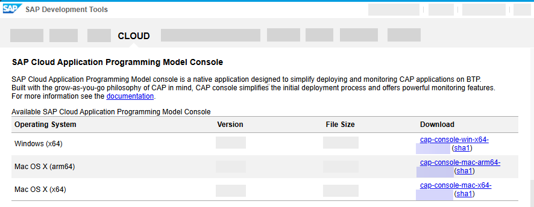
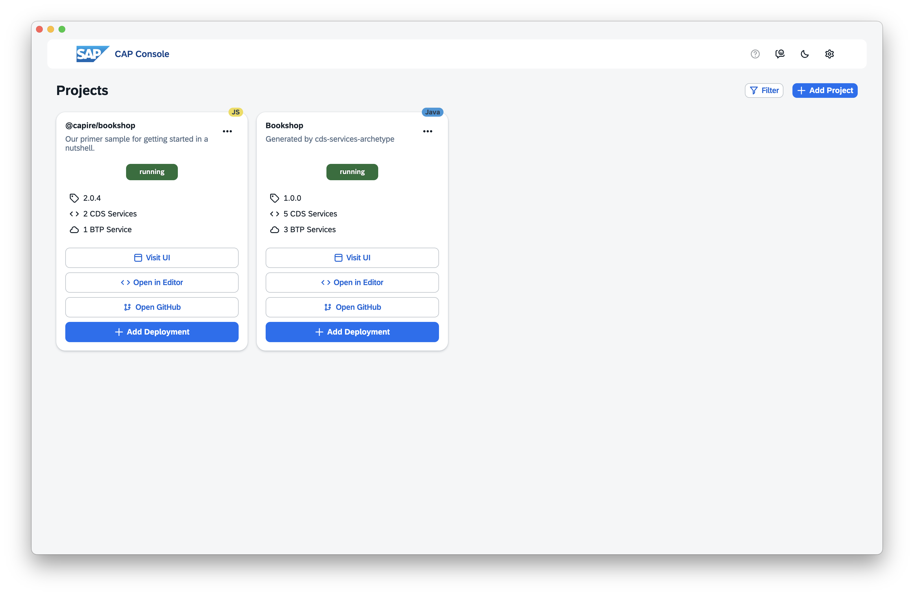
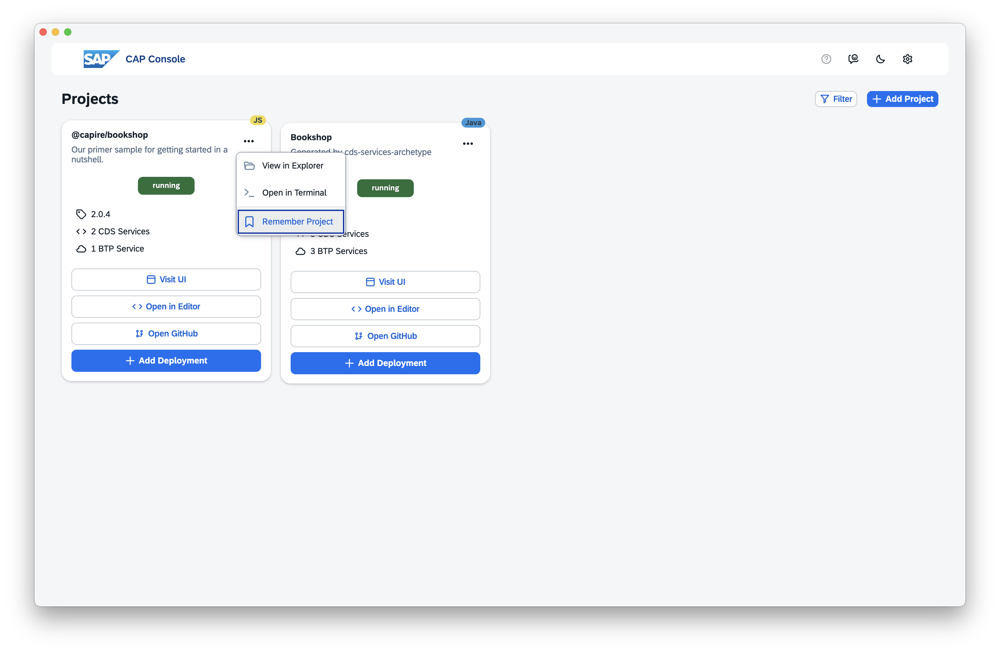
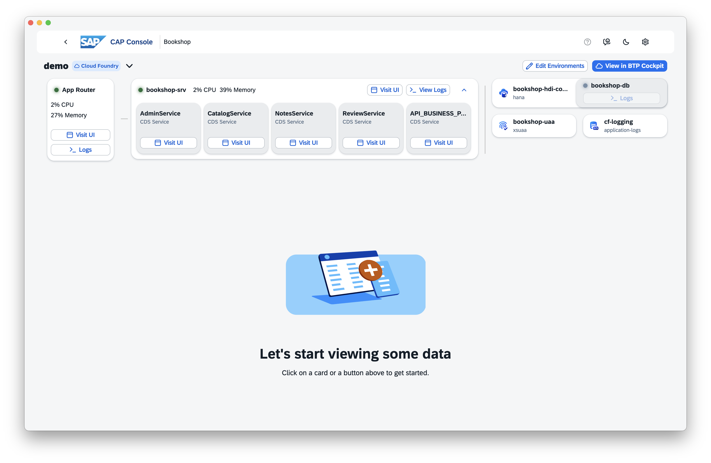
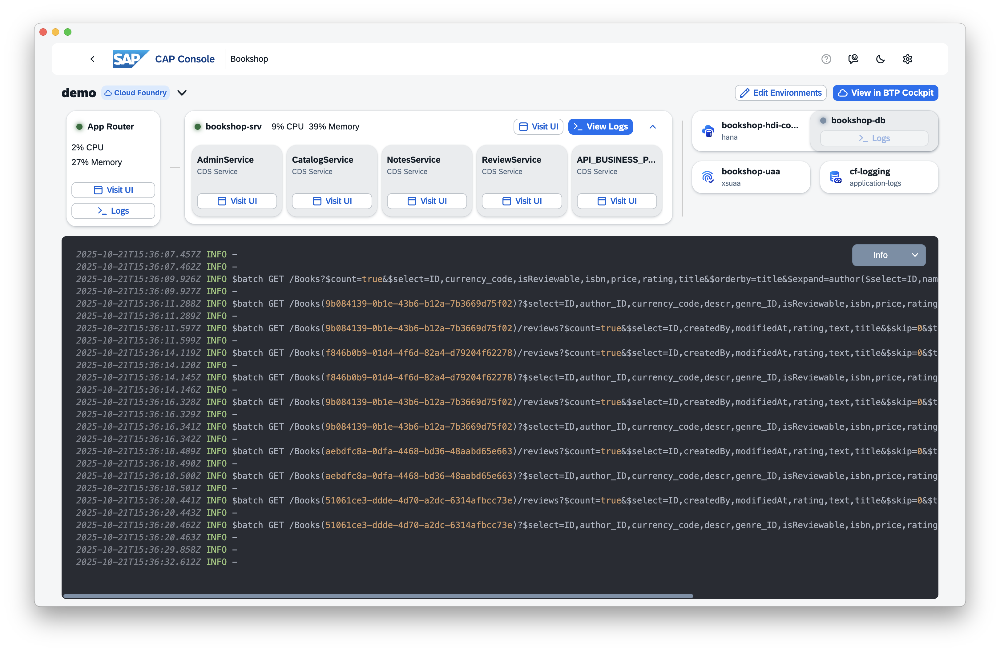
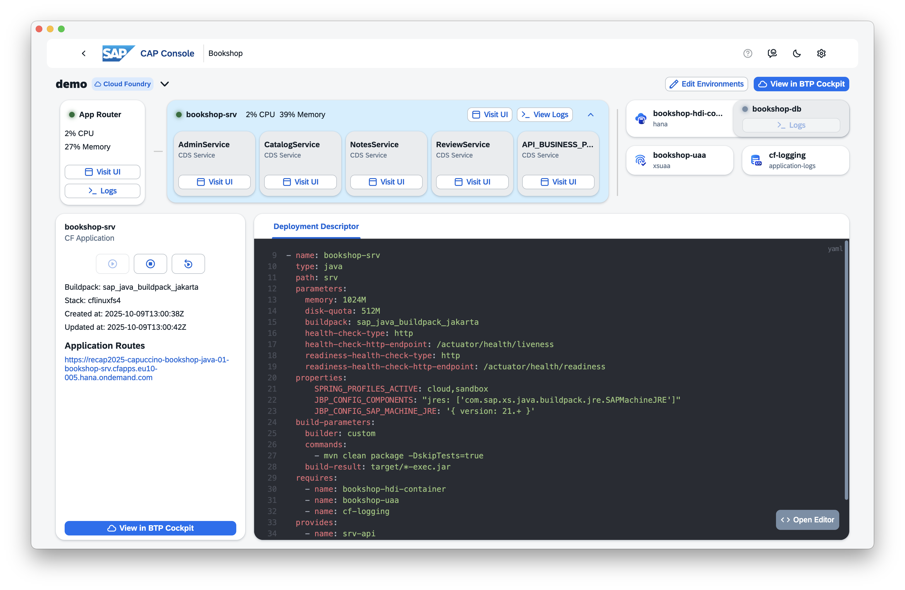
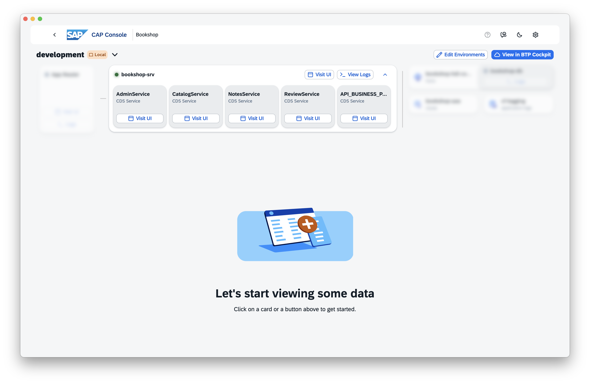
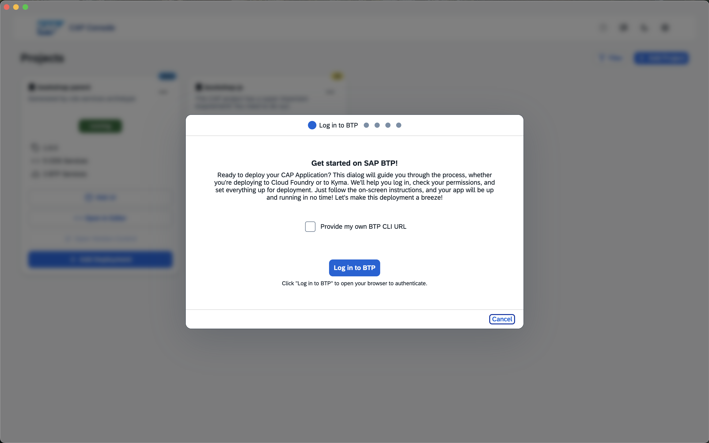
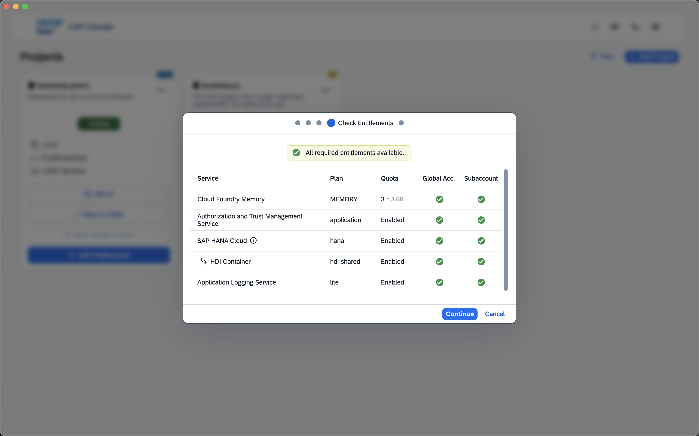
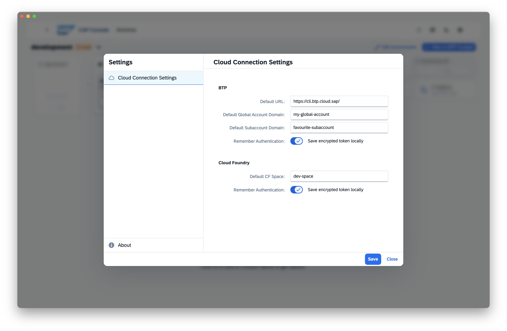

# The CAP Console


The CAP console is a native desktop app, available for Windows & macOS, designed to enhance your CAP development experience by enabling local development, BTP deployment, and monitoring from a unified interface. It simplifies the development workflow by offering different development tools and handling infrastructure complexity, so you can focus on building your application. Inspired by the CAP Developer Dashboard as well as OpenLens, it's designed to be a tool developers actually want to use.

> [!NOTE]
> This documentation and the tool is still a work in progress.

[[toc]]

## Setup CAP Console

Download the CAP console from [SAP Tools](https://tools.hana.ondemand.com/#cloud-capconsole) and install it.

{style="width:450px; box-shadow: 1px 1px 5px #888888"}

Start the CAP console and access your running CAP projects:



Once you start the CAP console, it will automatically scan your local processes to identify running CAP projects. This works for JavaScript as well as Java projects. Identified projects are listed on the start page, allowing you to quickly access them. As soon as you stop a project, it is automatically removed from the list.

If you always want to have a project listed in the CAP console, even when it is not running, you can use the "Remember Project" feature. Open the ellipsis menu and select "Remember Project". To forget a project, simply click on "Forget Project" in the same menu.



If your project is not detected automatically or it's currently not running, you can manually add it by clicking on the "Add Project" button and selecting the project root folder.

There's also a filter option available, allowing you to customize which projects you want to have displayed. You can filter projects by their process status (running or stopped) as well as by their save status (detected or saved).

## Prepare Your Projects

To utilize the full functionality of CAP console, you need to install the CAP console plugin in your CAP project. The plugin enables additional monitoring features and allows you to change log levels on the fly. The plugin is available for JavaScript and Java. Both versions of the plugin are OpenSource and can be found on GitHub ([JS Plugin](https://github.com/cap-js/console), [Java Plugin](https://github.com/cap-java/cds-feature-console)). If you want to use the plugin in a deployed environment, make sure to read and understand the [Security](#security) section first.

### JavaScript Plugin

Simply install the plugin as a dependency in your project - no further configuration required:

```bash
npm install @cap-js/console
```

### Java Plugin

Add the following dependency to your `srv/pom.xml` - no further configuration required:

```xml
<dependency>
    <groupId>com.sap.cds</groupId>
    <artifactId>cds-feature-console</artifactId>
</dependency>
```


## Monitoring

> [!IMPORTANT]
> To utilize the full functionality of the monitoring features, please ensure that you have the [CAP console Plugin](#prepare-your-projects) installed in your CAP project.

If you click on any project card, you are taken to the monitoring view for that project. In the monitoring view, you can access various information about your project.

### Project Structure



Based on your MTA, the console visualizes the structure of your project. You can click on any component of your project structure to access detailed information about it in the bottom section of the monitoring view.

### Status and Metrics

You can check the health of each component of your project at a quick glance. Each component displays its current state (running, stopped, or crashed) via a colored status indicator in the top-left corner, along with real-time performance metrics including CPU and memory usage.

### Logs



View real-time logs for each application of your project! And if your application has the [CAP console plugin](#plugins) installed, you can switch log levels without restarting the application. For Non-CAP applications and CAP applications without the plugin, the Cloud Foundry logs are displayed. Simply click on the "Logs" button and start viewing your application logs.

### Meta Information and Deployment Descriptor



By clicking on any of the components in your project structure, you can view detailed meta information about it as well as an excerpt of the MTA that only includes the selected component. Additionally, you have access to basic application controls for starting, stopping, and restarting CF applications, as well as viewing all registered application routes.

### Environment Switching

By clicking on the environment name in the top bar, you can quickly switch between different environments you have configured for your project. Every environment configuration is stored inside your project in a `.cds` folder as a YAML file. The environment configurations are git friendly and can be shared with your team. Since the CAP console does not ship with any built-in credentials, only people who have access to the CF space will be able to access the environment.

If you want to remove an environment configuration from your project, simply remove the respective YAML file from your `.cds` folder.

### Local Environment



CAP console also supports your local development environment. This allows you to use the same monitoring tools locally that you use for deployed applications. Simply select the "local" environment to connect to your locally running CAP project. Some functionality, like viewing BTP Services, is not available in the local environment.

## Deployment

CAP console streamlines the deployment of your CAP applications to the SAP Business Technology Platform, making it as effortless as possible — no manual setup, no complex configurations.

### Step-by-Step Deployment





Deploying your application is as simple as clicking through a guided dialog. CAP console handles everything behind the scenes:

- **Authentication**: Authenticates you against BTP and Cloud Foundry.
- **Entitlements**: Compares your required resources from your deployment descriptor with your available entitlements in your BTP subaccount.
- **Environment Setup**: Enables Cloud Foundry, creates CF spaces, and creates BTP service instances as needed.

You can choose between two deployment modes:

- **In-App Deployment**: Uses pre-packaged CLI tools with the correct versions — no need to install anything locally. (Currently you still have to install [cds-dk](https://www.npmjs.com/package/@sap/cds-dk?activeTab=dependencies) manually, but we are working on it!)
- **CLI-Based Deployment**: Copy all necessary commands and run them in your own terminal.

### Designed for Simplicity

CAP console is optimized for the **initial deployment** of your application. It's ideal for developers who want to get their app running on BTP quickly after local development.


### Configuring Default Deployment Target



You can configure a default Global Account, Subaccount, and Cloud Foundry space in the settings. These default values apply globally to all projects and can be overridden in the deployment dialog. If you have configured default accounts, they are automatically selected when available. Please note that you have to provide the subdomains for the Global Account and Subaccount, which can be found in the BTP Cockpit.


## Security

This section contains some important information regarding the security of using the CAP console and the associated plugins. If you want to use CAP console in a production environment, please make sure to read and understand the following information first.

### Access Control

CAP console itself does not come with any built-in credentials. It utilizes the user's login information to access cloud resources. This means that users can only access what they already have permissions for.

During deployment, the CAP console needs access to BTP and Cloud Foundry. For BTP we utilize the SSO functionality from the BTP CLI API. This access is used to retrieve information about your Global Accounts, Subaccounts, BTP service instances and entitlements. If your user has the required roles, you can also assign entitlements from within CAP console, as well as create the CF Org.

The CF login is used to create CF spaces, deploy your CAP project, retrieve information about applications and BTP service instances, start and stop applications and create an SSH Tunnel to communicate with the plugin. Again, if your user does not have the required roles, you are not able to perform these actions.

On macOS you can store your encrypted credentials, which will allow you easy access without having to log in every time. Your tokens are encrypted using the OS keychain and are only stored locally on your machine. This functionality can be disabled in the settings. On Windows, this functionality is not available due to missing secure encryption APIs.

### Plugins

The CAP console Java and JavaScript plugins create an unsecured WebSocket on a separate port from your main application. Locally, any process can access this WebSocket. In deployed environments, the WebSocket remains inaccessible by default since Cloud Foundry only exposes explicitly configured ports. To access the WebSocket in a deployed environment, you need to establish an SSH tunnel, which the CAP console tries to do by default. For more information about the SSH tunnel, read the [SSH Security Implications](#ssh-security-implications) section.

The following information is transmitted via the WebSocket:
- Log Messages from your CAP Project (only sent when a client is connected)

The following actions can be triggered via the WebSocket:
- Changing the Log Level of your CAP Project

### SSH Security Implications

To access the WebSocket in a deployed environment, an SSH tunnel is required to ensure secure and encrypted communication between the CAP console and the plugin. CAP console tries to automatically create this tunnel for you. The SSH tunnel is established between the port on which the WebSocket is running inside your application container and a local port on your machine and is only used to communicate with the plugin.

If you don't want CAP console to open an SSH tunnel, you can disable SSH for your application `cf disable-ssh <app-name>`. In that case, CAP console shows you a warning while establishing the connection. You can then decide to enable SSH through the CAP console or continue without an SSH tunnel. Without the SSH tunnel, you are not able to use any of the plugin features.

Even though the SSH tunnel is only opened to one specific port of your application container, you are still opening up a potential attack vector. CAP console tries to minimize this risk by only opening the tunnel for the duration of the connection. Once you close the CAP console, switch environments, or your user loses access to the CF Space, the SSH tunnel is closed automatically. You must ensure that you and your team understand the security implications of opening SSH tunnels in your environment and read the [Cloud Foundry SSH Documentation](https://docs.cloudfoundry.org/devguide/deploy-apps/ssh-apps.html). If attackers exploit the SSH tunnel, they will also be able to access the WebSocket and read all data transmitted via it.

## Limitations

CAP console is still a young project and has some limitations that are important to know. We will try to mitigate these limitations in future releases.

- µ-services are not supported
- mtx is not supported
- Kyma is not supported
- Only BTP services that can be added via `cds add` are currently supported for Deployment

## Common Issues & Pitfalls

### CDS Services Unavailable

If you see CDS services as unavailable in the Projects Page, this usually indicates that your CAP project contains invalid definitions or hasn't been set up yet. You can use `cds compile .` in your project root to check for any issues with your CDS definitions. Once these issues are resolved, it should be detected correctly.

### The Effect of Debug Log Level

Debug log level produces a high volume of log messages, which can lead to performance degradation in your application. It's advisable to use the debug log level only for short periods when troubleshooting specific issues. Once you've gathered the necessary information, switch back to a less verbose log level to maintain optimal performance. CAP console cannot guarantee that the log level is automatically reset, so please make sure to change it back manually.

## License

CAP console is licensed under the [SAP Developer License 3.1](https://tools.hana.ondemand.com/developer-license-3_1.txt).

[Free & Open Source Notices](https://support.sap.com/content/dam/launchpad/en_us/osln/osln/73555000100900008421_20250930063733.pdf){.learn-more}
